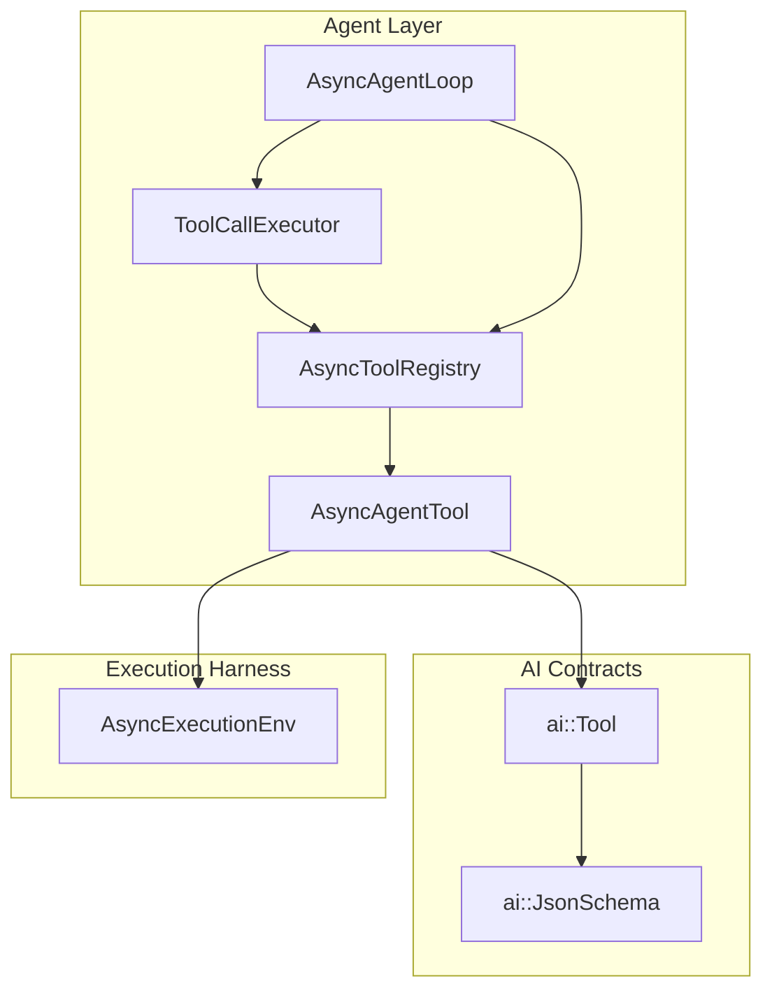
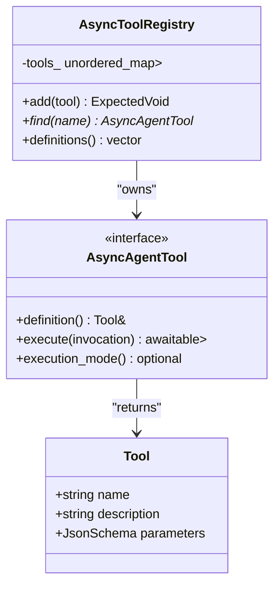
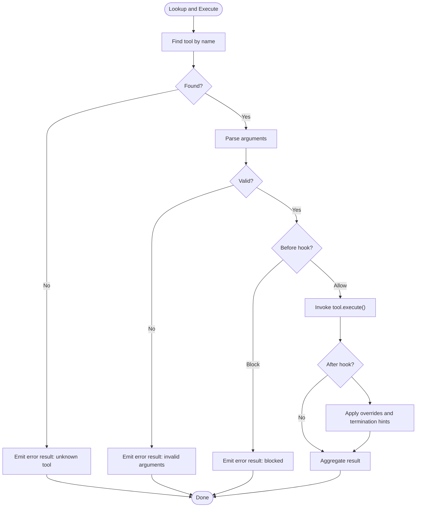
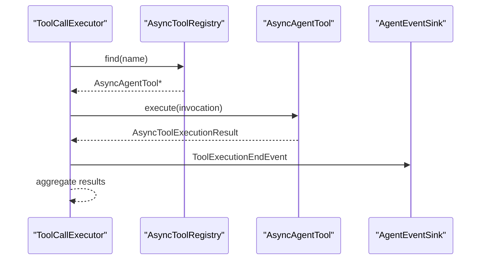
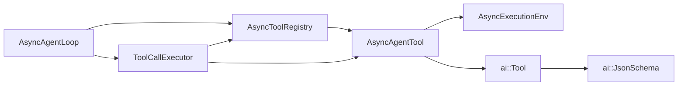

# Tool Registry

<cite>
**Referenced Files in This Document**
- [ToolRegistry.hpp](file://include/cch/agent/ToolRegistry.hpp)
- [AgentTool.hpp](file://include/cch/agent/AgentTool.hpp)
- [Tool.hpp](file://include/cch/ai/Tool.hpp)
- [ToolFactories.hpp](file://include/cch/tools/ToolFactories.hpp)
- [AsyncToolFactories.cpp](file://src/tools/AsyncToolFactories.cpp)
- [ToolCallExecutor.hpp](file://src/agent/ToolCallExecutor.hpp)
- [ToolCallExecutor.cpp](file://src/agent/ToolCallExecutor.cpp)
- [AgentLoop.hpp](file://include/cch/agent/AgentLoop.hpp)
- [AgentLoop.cpp](file://src/agent/AgentLoop.cpp)
- [ExecutionEnv.hpp](file://include/cch/harness/ExecutionEnv.hpp)
- [AsyncToolsTest.cpp](file://tests/tools/AsyncToolsTest.cpp)
- [ToolCallExecutorTest.cpp](file://tests/agent/ToolCallExecutorTest.cpp)
</cite>

## Table of Contents
1. [Introduction](#introduction)
2. [Project Structure](#project-structure)
3. [Core Components](#core-components)
4. [Architecture Overview](#architecture-overview)
5. [Detailed Component Analysis](#detailed-component-analysis)
6. [Dependency Analysis](#dependency-analysis)
7. [Performance Considerations](#performance-considerations)
8. [Troubleshooting Guide](#troubleshooting-guide)
9. [Conclusion](#conclusion)
10. [Appendices](#appendices)

## Introduction
This document describes the tool registry system used by the agent framework. It explains how tools are defined, registered, discovered, and executed, and how the registry integrates with the agent loop and AI model consumption. It also covers tool lifecycle management, validation and error handling during registration and execution, thread-safety and concurrency patterns, and performance implications of lookups and registry maintenance.

## Project Structure
The tool registry lives in the agent layer and interacts with AI model contracts and execution environments. Key files include:
- Registry and tool abstractions
- Tool definitions and factories
- Executor that resolves and invokes tools
- Agent loop that exposes tool definitions to the LLM and orchestrates tool execution
- Execution environment that tools use for workspace operations



**Diagram sources**
- [ToolRegistry.hpp:13-48](file://include/cch/agent/ToolRegistry.hpp#L13-L48)
- [AgentTool.hpp:64-76](file://include/cch/agent/AgentTool.hpp#L64-L76)
- [ToolCallExecutor.hpp:31-62](file://src/agent/ToolCallExecutor.hpp#L31-L62)
- [AgentLoop.cpp:240-241](file://src/agent/AgentLoop.cpp#L240-L241)
- [Tool.hpp:97-101](file://include/cch/ai/Tool.hpp#L97-L101)
- [AsyncToolFactories.cpp:60-73](file://src/tools/AsyncToolFactories.cpp#L60-L73)
- [ExecutionEnv.hpp:198-221](file://include/cch/harness/ExecutionEnv.hpp#L198-L221)

**Section sources**
- [ToolRegistry.hpp:13-48](file://include/cch/agent/ToolRegistry.hpp#L13-L48)
- [AgentTool.hpp:64-76](file://include/cch/agent/AgentTool.hpp#L64-L76)
- [Tool.hpp:97-101](file://include/cch/ai/Tool.hpp#L97-L101)
- [AsyncToolFactories.cpp:60-73](file://src/tools/AsyncToolFactories.cpp#L60-L73)
- [ToolCallExecutor.hpp:31-62](file://src/agent/ToolCallExecutor.hpp#L31-L62)
- [AgentLoop.cpp:240-241](file://src/agent/AgentLoop.cpp#L240-L241)
- [ExecutionEnv.hpp:198-221](file://include/cch/harness/ExecutionEnv.hpp#L198-L221)

## Core Components
- AsyncToolRegistry: Owns tools, provides O(1) average-time lookup by name, and exposes sorted definitions for model consumption.
- AsyncAgentTool: Abstract interface for async tools with a definition() and execute() method.
- ai::Tool and ai::JsonSchema: Contract for tool metadata and argument schema presented to the LLM.
- Tool factories: Factory functions produce tool instances bound to an execution environment.
- ToolCallExecutor: Resolves tools by name, validates arguments, invokes hooks, executes tools, and aggregates results.
- AsyncAgentLoop: Supplies tool definitions to the LLM and coordinates tool execution per turn.

**Section sources**
- [ToolRegistry.hpp:13-48](file://include/cch/agent/ToolRegistry.hpp#L13-L48)
- [AgentTool.hpp:64-76](file://include/cch/agent/AgentTool.hpp#L64-L76)
- [Tool.hpp:97-101](file://include/cch/ai/Tool.hpp#L97-L101)
- [ToolFactories.hpp:10-13](file://include/cch/tools/ToolFactories.hpp#L10-L13)
- [ToolCallExecutor.hpp:31-62](file://src/agent/ToolCallExecutor.hpp#L31-L62)
- [AgentLoop.cpp:240-241](file://src/agent/AgentLoop.cpp#L240-L241)

## Architecture Overview
The registry is a central component enabling dynamic tool loading and invocation. Tools are created via factories and added to the registry. The agent loop injects the registry’s definitions into the AI context so the model can choose tools. During a turn, the executor resolves tool names, validates arguments, optionally invokes pre/post hooks, and executes tools concurrently or sequentially depending on configuration and tool hints.

```mermaid
sequenceDiagram
participant User as "User"
participant Loop as "AsyncAgentLoop"
participant Client as "StreamingChatClient"
participant Reg as "AsyncToolRegistry"
participant Exec as "ToolCallExecutor"
participant Tool as "AsyncAgentTool"
User->>Loop : run()/continue_with()
Loop->>Reg : definitions()
Reg-->>Loop : vector<ai : : Tool>
Loop->>Client : stream(request with tools)
Client-->>Loop : AssistantMessage with tool calls
Loop->>Exec : execute(turn, assistant, calls, context, state, sink)
Exec->>Reg : find(name)
Reg-->>Exec : AsyncAgentTool*
Exec->>Tool : execute(ToolInvocation)
Tool-->>Exec : AsyncToolExecutionResult
Exec-->>Loop : ToolCallBatchResult
Loop-->>User : results and updates
```

**Diagram sources**
- [AgentLoop.cpp:255](file://src/agent/AgentLoop.cpp#L255)
- [AgentLoop.cpp:427](file://src/agent/AgentLoop.cpp#L427)
- [ToolCallExecutor.cpp:123-143](file://src/agent/ToolCallExecutor.cpp#L123-L143)
- [ToolCallExecutor.cpp:252-514](file://src/agent/ToolCallExecutor.cpp#L252-L514)
- [ToolRegistry.hpp:29-32](file://include/cch/agent/ToolRegistry.hpp#L29-L32)

## Detailed Component Analysis

### AsyncToolRegistry
Responsibilities:
- Own tools via unique_ptr for strict ownership.
- Provide constant-time average lookup by tool name.
- Expose definitions() as a sorted vector for deterministic LLM presentation.

Key behaviors:
- add(): Validates non-null tool and stores under tool->definition().name.
- find(): Returns raw pointer to owned tool or null if absent.
- definitions(): Iterates stored tools, collects definitions, and sorts by name.

Thread-safety:
- No internal synchronization; concurrent access must be externally coordinated (e.g., single-threaded initialization plus read-only usage).



**Diagram sources**
- [ToolRegistry.hpp:13-48](file://include/cch/agent/ToolRegistry.hpp#L13-L48)
- [AgentTool.hpp:64-76](file://include/cch/agent/AgentTool.hpp#L64-L76)
- [Tool.hpp:97-101](file://include/cch/ai/Tool.hpp#L97-L101)

**Section sources**
- [ToolRegistry.hpp:21-44](file://include/cch/agent/ToolRegistry.hpp#L21-L44)

### Tool Definition and Schema Presentation
- ai::Tool encapsulates tool metadata and parameters as ai::JsonSchema.
- Tools define a static schema in their definition() method, enabling precise argument validation and LLM guidance.
- The registry’s definitions() returns a sorted vector of ai::Tool for deterministic presentation to the model.

Practical impact:
- Schema generation is explicit and immutable per tool definition.
- Sorted definitions ensure consistent tool lists across runs.

**Section sources**
- [Tool.hpp:97-101](file://include/cch/ai/Tool.hpp#L97-L101)
- [ToolRegistry.hpp:34-44](file://include/cch/agent/ToolRegistry.hpp#L34-L44)

### Tool Registration and Discovery
- Factories create tool instances bound to an AsyncExecutionEnv.
- Tools are added to the registry via add(), keyed by their definition().name.
- Discovery is performed by name via find().

Dynamic loading pattern:
- The registry supports adding tools at runtime (e.g., during extension initialization).
- Tests demonstrate deterministic ordering and presence checks.

**Section sources**
- [ToolFactories.hpp:10-13](file://include/cch/tools/ToolFactories.hpp#L10-L13)
- [AsyncToolFactories.cpp:404-418](file://src/tools/AsyncToolFactories.cpp#L404-L418)
- [ToolRegistry.hpp:21-32](file://include/cch/agent/ToolRegistry.hpp#L21-L32)
- [ToolCallExecutorTest.cpp:236-261](file://tests/agent/ToolCallExecutorTest.cpp#L236-L261)

### Tool Lifecycle Management
- Creation: Factory constructs tool with an execution environment.
- Registration: add() transfers ownership into the registry.
- Lookup: find() retrieves the tool for execution.
- Execution: ToolCallExecutor resolves, validates, and invokes the tool.
- Cleanup: Tools are owned by the registry; destruction occurs when the registry is destroyed.

Concurrency:
- Registry itself is not thread-safe; typical usage is single-threaded registration followed by concurrent reads.

**Section sources**
- [AsyncToolFactories.cpp:60-73](file://src/tools/AsyncToolFactories.cpp#L60-L73)
- [ToolRegistry.hpp:13-48](file://include/cch/agent/ToolRegistry.hpp#L13-L48)
- [ToolCallExecutor.cpp:123-143](file://src/agent/ToolCallExecutor.cpp#L123-L143)

### Tool Lookup Mechanism and Validation
- Lookup: O(1) average via unordered_map keyed by tool name.
- Validation: ToolCallExecutor validates arguments and handles malformed JSON, unknown tools, and blocked calls via hooks.



**Diagram sources**
- [ToolCallExecutor.cpp:162-227](file://src/agent/ToolCallExecutor.cpp#L162-L227)
- [ToolCallExecutor.cpp:274-303](file://src/agent/ToolCallExecutor.cpp#L274-L303)
- [ToolCallExecutor.cpp:384-438](file://src/agent/ToolCallExecutor.cpp#L384-L438)

**Section sources**
- [ToolCallExecutor.cpp:162-227](file://src/agent/ToolCallExecutor.cpp#L162-L227)
- [ToolCallExecutor.cpp:274-303](file://src/agent/ToolCallExecutor.cpp#L274-L303)
- [ToolCallExecutor.cpp:384-438](file://src/agent/ToolCallExecutor.cpp#L384-L438)

### Tool Execution Modes and Concurrency
- Sequential vs Parallel: The executor chooses sequential if any tool requests sequential mode or if the number of calls exceeds a threshold.
- Parallel execution uses coroutines and a concurrent channel to coordinate completion and event emission safely.
- Thread-safety: The executor serializes event emissions and protects hook invocations with mutexes in parallel mode.



**Diagram sources**
- [ToolCallExecutor.cpp:139-142](file://src/agent/ToolCallExecutor.cpp#L139-L142)
- [ToolCallExecutor.cpp:252-514](file://src/agent/ToolCallExecutor.cpp#L252-L514)

**Section sources**
- [ToolCallExecutor.cpp:139-142](file://src/agent/ToolCallExecutor.cpp#L139-L142)
- [ToolCallExecutor.cpp:305-351](file://src/agent/ToolCallExecutor.cpp#L305-L351)
- [ToolCallExecutor.cpp:370-472](file://src/agent/ToolCallExecutor.cpp#L370-L472)

### Relationship Between Tool Definitions and AI Model Consumption
- The agent loop populates ai::AiContext with tools = registry.definitions().
- The LLM receives a deterministic, sorted list of tools and their schemas, enabling precise tool selection and argument generation.

**Section sources**
- [AgentLoop.cpp:255](file://src/agent/AgentLoop.cpp#L255)
- [ToolRegistry.hpp:34-44](file://include/cch/agent/ToolRegistry.hpp#L34-L44)

### Practical Examples of Registry Usage and Agent Loop Integration
- Creating tools via factories and registering them:
  - See [AsyncToolFactories.cpp:404-418](file://src/tools/AsyncToolFactories.cpp#L404-L418) for factory functions.
  - Add tools to the registry using [ToolRegistry.hpp:21-27](file://include/cch/agent/ToolRegistry.hpp#L21-L27).
- Running a loop with tools:
  - The loop passes the registry to the executor and supplies definitions to the LLM as shown in [AgentLoop.cpp:255](file://src/agent/AgentLoop.cpp#L255) and [AgentLoop.cpp:427](file://src/agent/AgentLoop.cpp#L427).
- Tests demonstrate:
  - Deterministic definitions and lookup: [ToolCallExecutorTest.cpp:141-162](file://tests/agent/ToolCallExecutorTest.cpp#L141-L162)
  - Sequential vs parallel execution and blocking/overrides: [ToolCallExecutorTest.cpp:291-323](file://tests/agent/ToolCallExecutorTest.cpp#L291-L323), [ToolCallExecutorTest.cpp:389-412](file://tests/agent/ToolCallExecutorTest.cpp#L389-L412), [ToolCallExecutorTest.cpp:414-435](file://tests/agent/ToolCallExecutorTest.cpp#L414-L435)

**Section sources**
- [AsyncToolFactories.cpp:404-418](file://src/tools/AsyncToolFactories.cpp#L404-L418)
- [ToolRegistry.hpp:21-27](file://include/cch/agent/ToolRegistry.hpp#L21-L27)
- [AgentLoop.cpp:255](file://src/agent/AgentLoop.cpp#L255)
- [AgentLoop.cpp:427](file://src/agent/AgentLoop.cpp#L427)
- [ToolCallExecutorTest.cpp:141-162](file://tests/agent/ToolCallExecutorTest.cpp#L141-L162)
- [ToolCallExecutorTest.cpp:291-323](file://tests/agent/ToolCallExecutorTest.cpp#L291-L323)
- [ToolCallExecutorTest.cpp:389-412](file://tests/agent/ToolCallExecutorTest.cpp#L389-L412)
- [ToolCallExecutorTest.cpp:414-435](file://tests/agent/ToolCallExecutorTest.cpp#L414-L435)

## Dependency Analysis
- AsyncToolRegistry depends on AsyncAgentTool and ai::Tool.
- ToolCallExecutor depends on AsyncToolRegistry and AsyncAgentTool.
- AsyncAgentLoop depends on AsyncToolRegistry and ToolCallExecutor.
- Tools depend on AsyncExecutionEnv for workspace operations.



**Diagram sources**
- [ToolRegistry.hpp:13-48](file://include/cch/agent/ToolRegistry.hpp#L13-L48)
- [AgentTool.hpp:64-76](file://include/cch/agent/AgentTool.hpp#L64-L76)
- [ToolCallExecutor.hpp:31-62](file://src/agent/ToolCallExecutor.hpp#L31-L62)
- [AgentLoop.cpp:240-241](file://src/agent/AgentLoop.cpp#L240-L241)
- [ExecutionEnv.hpp:198-221](file://include/cch/harness/ExecutionEnv.hpp#L198-L221)
- [Tool.hpp:97-101](file://include/cch/ai/Tool.hpp#L97-L101)

**Section sources**
- [ToolRegistry.hpp:13-48](file://include/cch/agent/ToolRegistry.hpp#L13-L48)
- [AgentTool.hpp:64-76](file://include/cch/agent/AgentTool.hpp#L64-L76)
- [ToolCallExecutor.hpp:31-62](file://src/agent/ToolCallExecutor.hpp#L31-L62)
- [AgentLoop.cpp:240-241](file://src/agent/AgentLoop.cpp#L240-L241)
- [ExecutionEnv.hpp:198-221](file://include/cch/harness/ExecutionEnv.hpp#L198-L221)
- [Tool.hpp:97-101](file://include/cch/ai/Tool.hpp#L97-L101)

## Performance Considerations
- Lookup cost: O(1) average via unordered_map; memory overhead proportional to number of tools.
- Definitions cost: O(n log n) due to sorting; acceptable given infrequent updates and deterministic presentation.
- Execution concurrency: Parallel mode scales with available threads; executor limits parallelism via max_parallel_tools and tool hints.
- Event emission: In parallel mode, event emission is serialized with mutexes to avoid contention.
- Truncation and output limits: Tools may truncate output to manage memory and throughput (e.g., bash tool truncation).

Recommendations:
- Keep the registry small to medium size; frequent re-sorting is unnecessary.
- Prefer sequential execution for tools that modify shared state or require ordered effects.
- Tune max_parallel_tools based on workload and environment capabilities.

[No sources needed since this section provides general guidance]

## Troubleshooting Guide
Common issues and resolutions:
- Unknown tool: The executor returns an error result when find(name) returns null.
- Malformed arguments: Arguments parsing failures produce error results with details.
- Blocking via before hook: If the before hook returns block=true, execution is skipped.
- After hook overrides: The after hook can override content, details, is_error, and terminate hints.
- Termination hints: If a tool sets terminate or after hook sets terminate, the batch may terminate early.
- Environment errors: Tools report environment errors via structured results; tests demonstrate expected behaviors.

**Section sources**
- [ToolCallExecutor.cpp:162-227](file://src/agent/ToolCallExecutor.cpp#L162-L227)
- [ToolCallExecutor.cpp:274-303](file://src/agent/ToolCallExecutor.cpp#L274-L303)
- [ToolCallExecutor.cpp:384-438](file://src/agent/ToolCallExecutor.cpp#L384-L438)
- [AsyncToolsTest.cpp:104-120](file://tests/tools/AsyncToolsTest.cpp#L104-L120)
- [AsyncToolsTest.cpp:140-154](file://tests/tools/AsyncToolsTest.cpp#L140-L154)
- [AsyncToolsTest.cpp:156-170](file://tests/tools/AsyncToolsTest.cpp#L156-L170)
- [AsyncToolsTest.cpp:192-205](file://tests/tools/AsyncToolsTest.cpp#L192-L205)
- [AsyncToolsTest.cpp:221-232](file://tests/tools/AsyncToolsTest.cpp#L221-L232)

## Conclusion
The tool registry provides a clean, extensible foundation for tool lifecycle management in the agent framework. It offers deterministic schema exposure to the LLM, efficient lookup, and flexible execution modes. With careful use of hooks and environment-bound tools, the system supports robust, maintainable integrations with diverse execution backends.

[No sources needed since this section summarizes without analyzing specific files]

## Appendices

### Tool Invocation and Execution Flow
```mermaid
sequenceDiagram
participant Model as "LLM"
participant Loop as "AsyncAgentLoop"
participant Exec as "ToolCallExecutor"
participant Tool as "AsyncAgentTool"
participant Env as "AsyncExecutionEnv"
Model-->>Loop : AssistantMessage with tool calls
Loop->>Exec : execute(...)
Exec->>Tool : execute(ToolInvocation)
Tool->>Env : workspace operations
Env-->>Tool : results/errors
Tool-->>Exec : AsyncToolExecutionResult
Exec-->>Loop : results
```

**Diagram sources**
- [AgentLoop.cpp:399-438](file://src/agent/AgentLoop.cpp#L399-L438)
- [ToolCallExecutor.cpp:123-143](file://src/agent/ToolCallExecutor.cpp#L123-L143)
- [ToolCallExecutor.cpp:384-438](file://src/agent/ToolCallExecutor.cpp#L384-L438)
- [ExecutionEnv.hpp:207-221](file://include/cch/harness/ExecutionEnv.hpp#L207-L221)