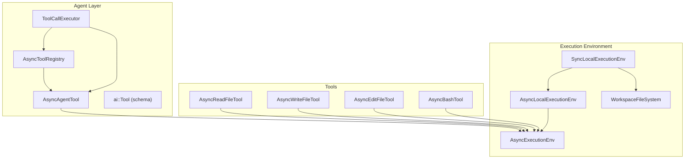
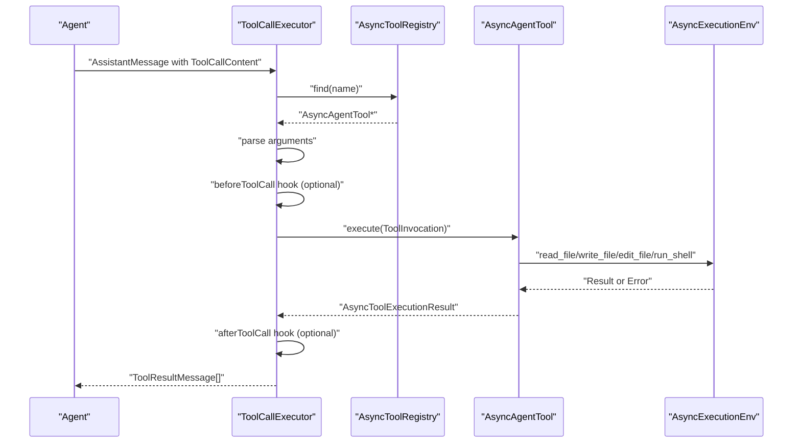
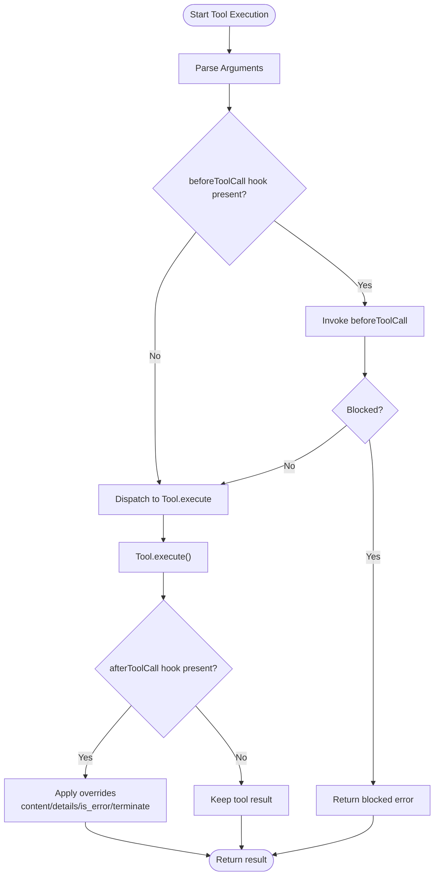
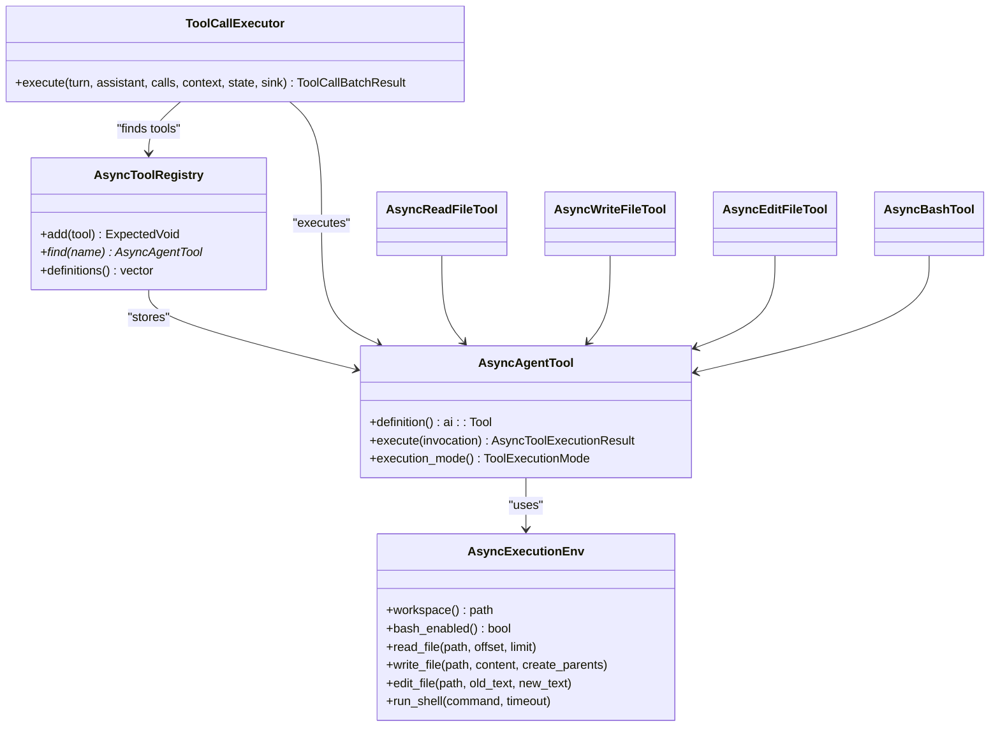

# Tool System

<cite>
**Referenced Files in This Document**
- [ToolRegistry.hpp](file://include/cch/agent/ToolRegistry.hpp)
- [AgentTool.hpp](file://include/cch/agent/AgentTool.hpp)
- [Tool.hpp](file://include/cch/ai/Tool.hpp)
- [ToolFactories.hpp](file://include/cch/tools/ToolFactories.hpp)
- [AsyncToolFactories.cpp](file://src/tools/AsyncToolFactories.cpp)
- [ToolCallExecutor.hpp](file://src/agent/ToolCallExecutor.hpp)
- [ToolCallExecutor.cpp](file://src/agent/ToolCallExecutor.cpp)
- [ExecutionEnv.hpp](file://include/cch/harness/ExecutionEnv.hpp)
- [LocalExecutionEnv.hpp](file://include/cch/harness/LocalExecutionEnv.hpp)
- [SyncLocalExecutionEnv.hpp](file://src/harness/SyncLocalExecutionEnv.hpp)
- [SyncLocalExecutionEnv.cpp](file://src/harness/SyncLocalExecutionEnv.cpp)
- [WorkspaceFileSystem.hpp](file://src/harness/WorkspaceFileSystem.hpp)
- [AsyncToolsTest.cpp](file://tests/tools/AsyncToolsTest.cpp)
- [ToolCallExecutorTest.cpp](file://tests/agent/ToolCallExecutorTest.cpp)
</cite>

## Table of Contents
1. [Introduction](#introduction)
2. [Project Structure](#project-structure)
3. [Core Components](#core-components)
4. [Architecture Overview](#architecture-overview)
5. [Detailed Component Analysis](#detailed-component-analysis)
6. [Dependency Analysis](#dependency-analysis)
7. [Performance Considerations](#performance-considerations)
8. [Troubleshooting Guide](#troubleshooting-guide)
9. [Conclusion](#conclusion)
10. [Appendices](#appendices)

## Introduction
This document describes the tool system used by the agent harness. It covers the built-in tools (read_file, write_file, edit_file, bash), their capabilities and security restrictions, the tool registry and discovery mechanism, tool execution lifecycle and hooks, the tool factory pattern for integrating custom tools, validation and error handling, the execution environment and workspace containment, and how tools are presented to the agent via JSON schema. Practical examples and integration patterns are included, along with security and performance considerations.

## Project Structure
The tool system spans several modules:
- Agent abstractions define tool contracts, invocation, execution results, and execution lifecycle hooks.
- Built-in tools are implemented as async tools backed by an execution environment.
- The execution environment enforces workspace containment and security policies.
- Tests demonstrate usage, validation, and security behavior.

**Diagram sources**
- [ToolRegistry.hpp:13-48](file://include/cch/agent/ToolRegistry.hpp#L13-L48)
- [AgentTool.hpp:64-76](file://include/cch/agent/AgentTool.hpp#L64-L76)
- [ToolCallExecutor.hpp:31-62](file://src/agent/ToolCallExecutor.hpp#L31-L62)
- [AsyncToolFactories.cpp:75-420](file://src/tools/AsyncToolFactories.cpp#L75-L420)
- [ExecutionEnv.hpp:198-334](file://include/cch/harness/ExecutionEnv.hpp#L198-L334)
- [LocalExecutionEnv.hpp:10-83](file://include/cch/harness/LocalExecutionEnv.hpp#L10-L83)
- [SyncLocalExecutionEnv.hpp:13-78](file://src/harness/SyncLocalExecutionEnv.hpp#L13-L78)
- [WorkspaceFileSystem.hpp:31-819](file://src/harness/WorkspaceFileSystem.hpp#L31-L819)

**Section sources**
- [ToolRegistry.hpp:13-48](file://include/cch/agent/ToolRegistry.hpp#L13-L48)
- [AgentTool.hpp:64-76](file://include/cch/agent/AgentTool.hpp#L64-L76)
- [ToolCallExecutor.hpp:31-62](file://src/agent/ToolCallExecutor.hpp#L31-L62)
- [AsyncToolFactories.cpp:75-420](file://src/tools/AsyncToolFactories.cpp#L75-L420)
- [ExecutionEnv.hpp:198-334](file://include/cch/harness/ExecutionEnv.hpp#L198-L334)
- [LocalExecutionEnv.hpp:10-83](file://include/cch/harness/LocalExecutionEnv.hpp#L10-L83)
- [SyncLocalExecutionEnv.hpp:13-78](file://src/harness/SyncLocalExecutionEnv.hpp#L13-L78)
- [WorkspaceFileSystem.hpp:31-819](file://src/harness/WorkspaceFileSystem.hpp#L31-L819)

## Core Components
- Tool contract and invocation:
  - ToolInvocation carries call_id, tool name, structured arguments, and raw arguments.
  - AsyncAgentTool defines the tool interface with definition() and execute().
  - AsyncToolExecutionResult carries content, optional details, and flags for error and termination.
- Tool registry:
  - AsyncToolRegistry stores tools keyed by name, exposes find() and definitions() for schema exposure.
- Tool call executor:
  - ToolCallExecutorOptions configure before/after hooks, execution mode, and parallelism limits.
  - ToolCallExecutor orchestrates sequential or parallel execution, argument parsing, and lifecycle events.
- Built-in tools:
  - read_file, write_file, edit_file, bash are implemented as async tools with JSON schema definitions and parameter parsing.
- Execution environment:
  - AsyncExecutionEnv abstracts filesystem and shell operations with security and policy enforcement.
  - AsyncLocalExecutionEnv and SyncLocalExecutionEnv implement local execution with workspace containment and optional bash enablement.

**Section sources**
- [AgentTool.hpp:19-76](file://include/cch/agent/AgentTool.hpp#L19-L76)
- [ToolRegistry.hpp:21-44](file://include/cch/agent/ToolRegistry.hpp#L21-L44)
- [ToolCallExecutor.hpp:19-62](file://src/agent/ToolCallExecutor.hpp#L19-L62)
- [AsyncToolFactories.cpp:75-420](file://src/tools/AsyncToolFactories.cpp#L75-L420)
- [ExecutionEnv.hpp:198-334](file://include/cch/harness/ExecutionEnv.hpp#L198-L334)
- [LocalExecutionEnv.hpp:10-83](file://include/cch/harness/LocalExecutionEnv.hpp#L10-L83)
- [SyncLocalExecutionEnv.hpp:13-78](file://src/harness/SyncLocalExecutionEnv.hpp#L13-L78)

## Architecture Overview
The tool system follows a layered design:
- Tools declare a JSON schema describing parameters.
- The registry exposes tool definitions to the agent.
- The executor parses arguments, invokes hooks, dispatches to tools, and applies post-execution hooks.
- Tools delegate to the execution environment for filesystem and shell operations.
- The execution environment enforces workspace containment and security policies.

**Diagram sources**
- [ToolCallExecutor.cpp:123-250](file://src/agent/ToolCallExecutor.cpp#L123-L250)
- [ToolRegistry.hpp:29-32](file://include/cch/agent/ToolRegistry.hpp#L29-L32)
- [AgentTool.hpp:69-70](file://include/cch/agent/AgentTool.hpp#L69-L70)
- [ExecutionEnv.hpp:207-221](file://include/cch/harness/ExecutionEnv.hpp#L207-L221)

## Detailed Component Analysis

### Built-in Tools: read_file, write_file, edit_file, bash
- read_file
  - Reads a text file from the workspace with offset/limit line selection.
  - Returns content and a continuation hint when truncated.
  - Uses the execution environment’s read_file with workspace containment.
- write_file
  - Creates or overwrites a text file; parent directories are created automatically.
  - Returns a summary of bytes written.
- edit_file
  - Performs exact-text replacements across one or more edits.
  - Validates uniqueness of each oldText match and rejects ambiguous edits.
  - Supports legacy single-edit form and modern edits[] array.
  - Generates a simple line-diff preview on success.
- bash
  - Executes shell commands in the workspace when explicitly enabled.
  - Applies timeouts, strips ANSI escape sequences, truncates output, and reports exit code/timed-out/truncated flags.

Security restrictions and capabilities:
- Workspace containment enforced by WorkspaceFileSystem and AsyncExecutionEnv.
- Bash disabled by default; must be explicitly enabled via execution environment configuration.
- Environment variables sanitized; secret-like names are filtered unless explicitly allowed.
- Output is limited and truncated to protect memory and network bandwidth.

**Section sources**
- [AsyncToolFactories.cpp:75-420](file://src/tools/AsyncToolFactories.cpp#L75-L420)
- [ExecutionEnv.hpp:207-221](file://include/cch/harness/ExecutionEnv.hpp#L207-L221)
- [SyncLocalExecutionEnv.cpp:173-221](file://src/harness/SyncLocalExecutionEnv.cpp#L173-L221)
- [WorkspaceFileSystem.hpp:47-132](file://src/harness/WorkspaceFileSystem.hpp#L47-L132)

### Tool Registry Architecture
- AsyncToolRegistry manages tools by name, supports adding, finding, and enumerating definitions.
- Definitions are exposed as ai::Tool with JSON schema for agent consumption.
- The registry is thread-safe for concurrent lookups; mutation requires exclusive access.

**Section sources**
- [ToolRegistry.hpp:21-44](file://include/cch/agent/ToolRegistry.hpp#L21-L44)

### Tool Factory Pattern and Custom Tool Integration
- Tool factories produce AsyncAgentTool instances bound to an execution environment.
- To integrate a custom tool:
  - Implement AsyncAgentTool with a definition() returning ai::Tool and a JSON schema.
  - Implement execute() using the provided environment pointer to access filesystem/shell operations.
  - Register the tool via AsyncToolRegistry::add().
- The factory pattern ensures tools receive the proper execution environment and avoids global state.

**Section sources**
- [ToolFactories.hpp:10-13](file://include/cch/tools/ToolFactories.hpp#L10-L13)
- [AsyncToolFactories.cpp:404-420](file://src/tools/AsyncToolFactories.cpp#L404-L420)
- [AgentTool.hpp:64-76](file://include/cch/agent/AgentTool.hpp#L64-L76)

### Tool Execution Hooks: beforeToolCall and afterToolCall
- beforeToolCall hook:
  - Receives context including assistant message, tool call, parsed arguments, and AI context.
  - Can block execution by returning block=true with a reason.
  - Exceptions are captured and converted to tool errors.
- afterToolCall hook:
  - Receives the tool execution result and can override content, details, is_error, or set terminate.
  - Also subject to exception handling and error propagation.
- Both hooks run per-call and are invoked around tool execution.

**Diagram sources**
- [ToolCallExecutor.cpp:64-90](file://src/agent/ToolCallExecutor.cpp#L64-L90)
- [ToolCallExecutor.cpp:173-224](file://src/agent/ToolCallExecutor.cpp#L173-L224)
- [AgentTool.hpp:61-62](file://include/cch/agent/AgentTool.hpp#L61-L62)

**Section sources**
- [AgentTool.hpp:33-62](file://include/cch/agent/AgentTool.hpp#L33-L62)
- [ToolCallExecutor.cpp:64-90](file://src/agent/ToolCallExecutor.cpp#L64-L90)
- [ToolCallExecutor.cpp:173-224](file://src/agent/ToolCallExecutor.cpp#L173-L224)

### Tool Validation, Parameter Parsing, and Error Handling
- Argument parsing:
  - ToolInvocation carries both structured arguments and raw arguments; structured arguments take precedence.
  - parse_invocation_args serializes and deserializes arguments into strongly-typed structs.
- Validation:
  - Unknown tools yield error results.
  - Malformed arguments yield error results with detailed messages.
  - Tool-specific validations (e.g., edit_file requires at least one edit, oldText must be unique) produce error results.
- Error propagation:
  - Tool execution errors propagate as tool results with is_error=true.
  - Hook failures convert to tool errors.
  - Environment errors are mapped to standardized error codes.

**Section sources**
- [ToolCallExecutor.cpp:41-55](file://src/agent/ToolCallExecutor.cpp#L41-L55)
- [AsyncToolFactories.cpp:96-115](file://src/tools/AsyncToolFactories.cpp#L96-L115)
- [AsyncToolFactories.cpp:189-202](file://src/tools/AsyncToolFactories.cpp#L189-L202)
- [AsyncToolFactories.cpp:310-327](file://src/tools/AsyncToolFactories.cpp#L310-L327)

### Relationship Between Tools and Execution Environment
- Tools depend on AsyncExecutionEnv for filesystem and shell operations.
- AsyncLocalExecutionEnv and SyncLocalExecutionEnv implement the environment:
  - Workspace containment via WorkspaceFileSystem.
  - Optional bash enablement and sanitized environment variables.
  - Output limiting and truncation for shell results.
- Security policies:
  - Absolute paths and escaping (“..”) are rejected.
  - Symlink safety: reads/writes avoid traversing final symlinks; canonicalization is restricted.
  - Bash disabled by default; enabling requires explicit configuration.

**Section sources**
- [ExecutionEnv.hpp:207-221](file://include/cch/harness/ExecutionEnv.hpp#L207-L221)
- [LocalExecutionEnv.hpp:10-83](file://include/cch/harness/LocalExecutionEnv.hpp#L10-L83)
- [SyncLocalExecutionEnv.hpp:13-78](file://src/harness/SyncLocalExecutionEnv.hpp#L13-L78)
- [SyncLocalExecutionEnv.cpp:295-346](file://src/harness/SyncLocalExecutionEnv.cpp#L295-L346)
- [WorkspaceFileSystem.hpp:47-132](file://src/harness/WorkspaceFileSystem.hpp#L47-L132)

### Tool Schema Generation for AI Model Consumption
- Each tool defines ai::Tool with name, description, and a JsonSchema describing parameters.
- The registry exposes definitions() sorted by name for deterministic presentation.
- The executor uses definitions() to inform the agent about available tools and their schemas.

**Section sources**
- [AsyncToolFactories.cpp:79-92](file://src/tools/AsyncToolFactories.cpp#L79-L92)
- [AsyncToolFactories.cpp:122-134](file://src/tools/AsyncToolFactories.cpp#L122-L134)
- [AsyncToolFactories.cpp:158-185](file://src/tools/AsyncToolFactories.cpp#L158-L185)
- [AsyncToolFactories.cpp:294-306](file://src/tools/AsyncToolFactories.cpp#L294-L306)
- [ToolRegistry.hpp:34-44](file://include/cch/agent/ToolRegistry.hpp#L34-L44)
- [Tool.hpp:97-104](file://include/cch/ai/Tool.hpp#L97-L104)

### Practical Examples and Integration Patterns
- Using built-in tools:
  - read_file: specify path, offset, limit; receives content with continuation hint when truncated.
  - edit_file: provide edits[] with oldText/newText pairs; legacy single-edit form also supported.
  - bash: provide command and optional timeout; output is sanitized and truncated.
- Enabling bash:
  - Configure execution environment with bash enabled; otherwise, bash tool returns an error.
- Custom tool implementation:
  - Implement AsyncAgentTool with a JSON schema definition and execute() using the environment pointer.
  - Register the tool via AsyncToolRegistry::add().
- Integration patterns:
  - Use beforeToolCall hook to gate tool execution based on context or policies.
  - Use afterToolCall hook to enrich results, mask sensitive content, or signal termination.

**Section sources**
- [AsyncToolsTest.cpp:89-102](file://tests/tools/AsyncToolsTest.cpp#L89-L102)
- [AsyncToolsTest.cpp:104-119](file://tests/tools/AsyncToolsTest.cpp#L104-L119)
- [AsyncToolsTest.cpp:121-138](file://tests/tools/AsyncToolsTest.cpp#L121-L138)
- [AsyncToolsTest.cpp:140-154](file://tests/tools/AsyncToolsTest.cpp#L140-L154)
- [AsyncToolsTest.cpp:156-170](file://tests/tools/AsyncToolsTest.cpp#L156-L170)
- [AsyncToolsTest.cpp:172-190](file://tests/tools/AsyncToolsTest.cpp#L172-L190)
- [AsyncToolsTest.cpp:192-205](file://tests/tools/AsyncToolsTest.cpp#L192-L205)
- [AsyncToolsTest.cpp:207-219](file://tests/tools/AsyncToolsTest.cpp#L207-L219)
- [AsyncToolsTest.cpp:221-232](file://tests/tools/AsyncToolsTest.cpp#L221-L232)
- [ToolCallExecutorTest.cpp:389-412](file://tests/agent/ToolCallExecutorTest.cpp#L389-L412)
- [ToolCallExecutorTest.cpp:414-435](file://tests/agent/ToolCallExecutorTest.cpp#L414-L435)

## Dependency Analysis

**Diagram sources**
- [AgentTool.hpp:64-76](file://include/cch/agent/AgentTool.hpp#L64-L76)
- [ToolRegistry.hpp:21-44](file://include/cch/agent/ToolRegistry.hpp#L21-L44)
- [ToolCallExecutor.hpp:31-62](file://src/agent/ToolCallExecutor.hpp#L31-L62)
- [ExecutionEnv.hpp:207-221](file://include/cch/harness/ExecutionEnv.hpp#L207-L221)
- [AsyncToolFactories.cpp:75-420](file://src/tools/AsyncToolFactories.cpp#L75-L420)

**Section sources**
- [AgentTool.hpp:64-76](file://include/cch/agent/AgentTool.hpp#L64-L76)
- [ToolRegistry.hpp:21-44](file://include/cch/agent/ToolRegistry.hpp#L21-L44)
- [ToolCallExecutor.hpp:31-62](file://src/agent/ToolCallExecutor.hpp#L31-L62)
- [ExecutionEnv.hpp:207-221](file://include/cch/harness/ExecutionEnv.hpp#L207-L221)
- [AsyncToolFactories.cpp:75-420](file://src/tools/AsyncToolFactories.cpp#L75-L420)

## Performance Considerations
- Output limiting and truncation:
  - Shell output is truncated by line count and byte size; a full output file may be written for very large outputs.
  - File reads are limited to prevent excessive memory usage.
- Parallel execution:
  - ToolCallExecutor can run independent tools concurrently; use max_parallel_tools to cap concurrency.
  - Sequential mode is chosen when any tool requests it or when the number of calls exceeds the parallel threshold.
- I/O and environment:
  - WorkspaceFileSystem uses safe, containment-aware operations; avoid unnecessary repeated reads/writes.
  - Bash enablement adds overhead; enable only when required.

[No sources needed since this section provides general guidance]

## Troubleshooting Guide
Common issues and resolutions:
- Unknown tool:
  - Symptom: error result for a tool name not in the registry.
  - Resolution: register the tool via AsyncToolRegistry::add().
- Invalid arguments:
  - Symptom: error result with malformed arguments.
  - Resolution: ensure arguments conform to the tool’s JSON schema; structured arguments take precedence over raw text.
- edit_file failures:
  - Ambiguous replacements: oldText appears multiple times; adjust to be unique.
  - Not found: oldText does not appear in the file; verify content.
  - Empty edits array: provide at least one edit.
- Bash disabled:
  - Symptom: bash tool returns an error indicating bash is disabled.
  - Resolution: initialize the execution environment with bash enabled.
- Hook exceptions:
  - Symptom: beforeToolCall/afterToolCall failures cause tool errors.
  - Resolution: wrap hook logic in try/catch and return appropriate results.

**Section sources**
- [ToolCallExecutor.cpp:163-169](file://src/agent/ToolCallExecutor.cpp#L163-L169)
- [AsyncToolFactories.cpp:189-202](file://src/tools/AsyncToolFactories.cpp#L189-L202)
- [AsyncToolFactories.cpp:310-327](file://src/tools/AsyncToolFactories.cpp#L310-L327)
- [ToolCallExecutorTest.cpp:353-368](file://tests/agent/ToolCallExecutorTest.cpp#L353-L368)
- [ToolCallExecutorTest.cpp:370-387](file://tests/agent/ToolCallExecutorTest.cpp#L370-L387)
- [ToolCallExecutorTest.cpp:389-412](file://tests/agent/ToolCallExecutorTest.cpp#L389-L412)
- [ToolCallExecutorTest.cpp:414-435](file://tests/agent/ToolCallExecutorTest.cpp#L414-L435)

## Conclusion
The tool system provides a secure, extensible framework for agent-driven actions within a controlled workspace. Built-in tools encapsulate common operations with strict validation and output controls. The registry and executor orchestrate safe, auditable execution with hooks for policy enforcement. The execution environment enforces containment and security, while the factory pattern simplifies integration of custom tools.

[No sources needed since this section summarizes without analyzing specific files]

## Appendices

### Tool Capabilities and Security Summary
- read_file: workspace-contained text read with offset/limit; continuation hints on truncation.
- write_file: workspace-contained write with automatic parent creation; returns bytes written.
- edit_file: exact-text replacement with uniqueness checks; supports legacy and modern forms; previews diffs.
- bash: optional shell execution with timeouts, ANSI stripping, truncation, and sanitized environment.

**Section sources**
- [AsyncToolFactories.cpp:79-115](file://src/tools/AsyncToolFactories.cpp#L79-L115)
- [AsyncToolFactories.cpp:122-151](file://src/tools/AsyncToolFactories.cpp#L122-L151)
- [AsyncToolFactories.cpp:158-273](file://src/tools/AsyncToolFactories.cpp#L158-L273)
- [AsyncToolFactories.cpp:294-381](file://src/tools/AsyncToolFactories.cpp#L294-L381)
- [SyncLocalExecutionEnv.cpp:173-221](file://src/harness/SyncLocalExecutionEnv.cpp#L173-L221)
- [WorkspaceFileSystem.hpp:47-132](file://src/harness/WorkspaceFileSystem.hpp#L47-L132)