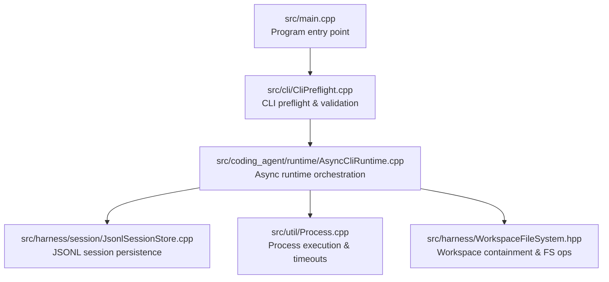
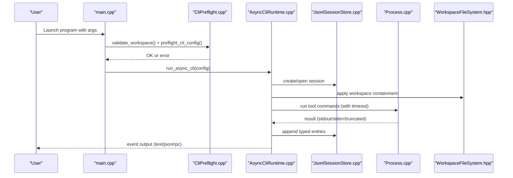
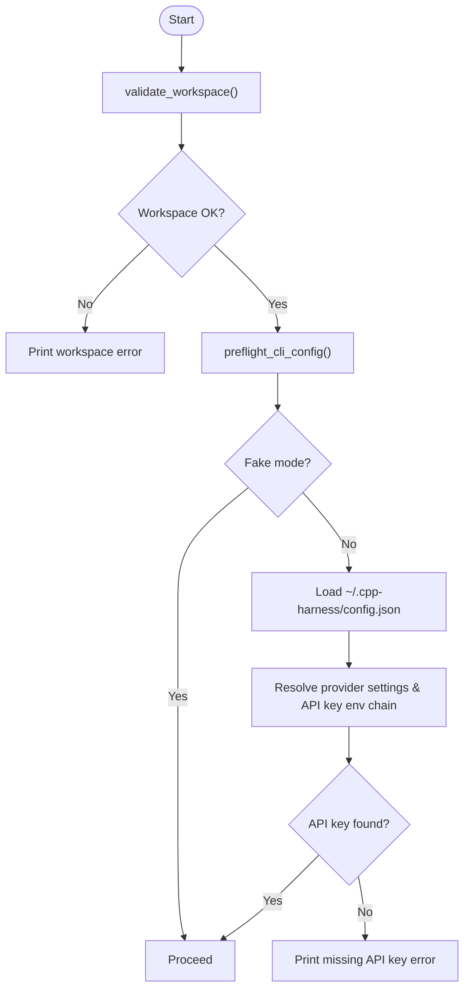
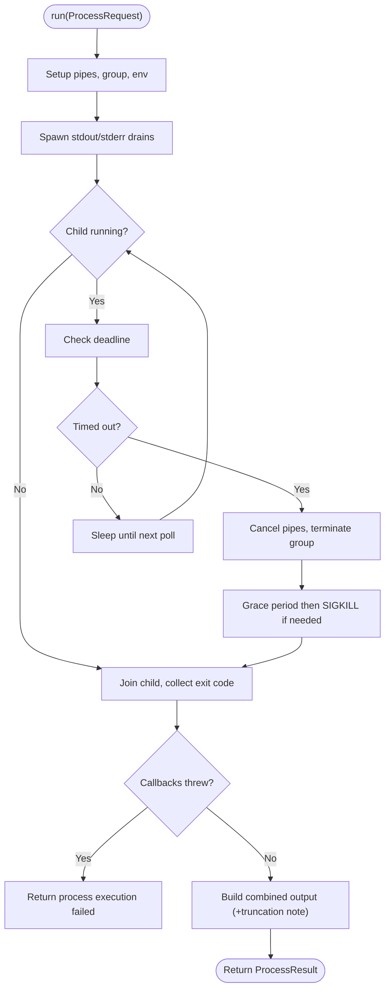
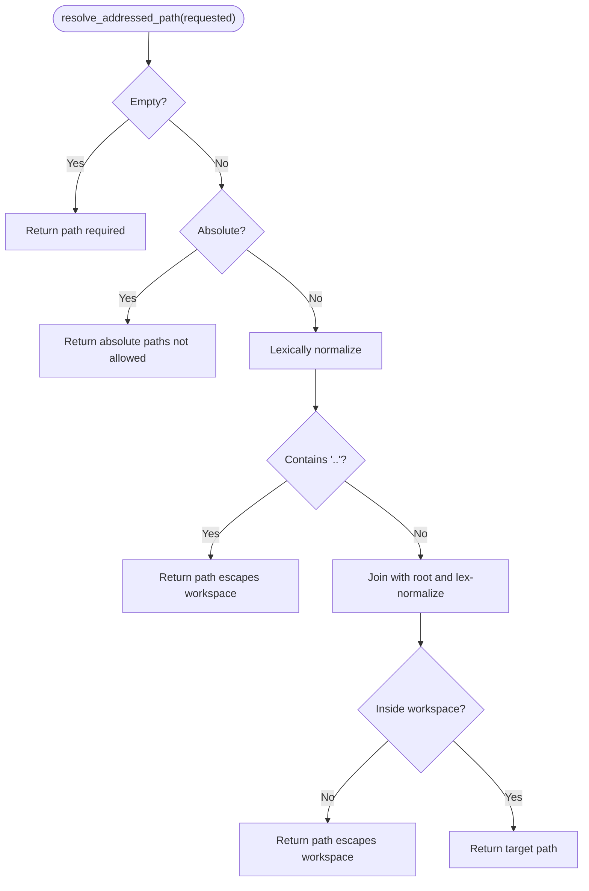
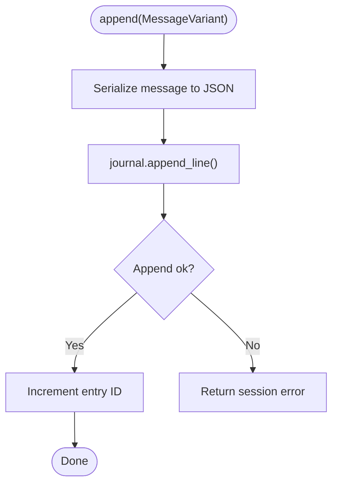
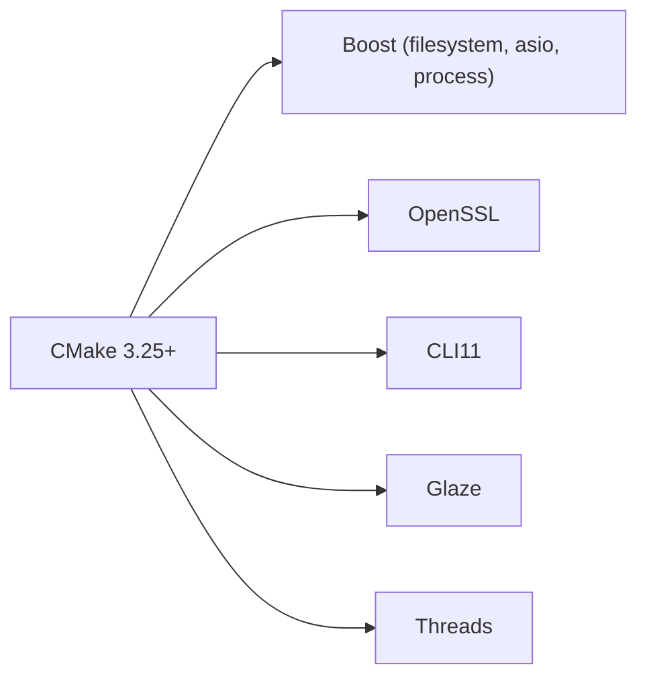

# Troubleshooting and FAQ

<cite>
**Referenced Files in This Document**
- [README.md](file://README.md)
- [CMakeLists.txt](file://CMakeLists.txt)
- [src/main.cpp](file://src/main.cpp)
- [src/cli/CliPreflight.cpp](file://src/cli/CliPreflight.cpp)
- [src/util/Process.cpp](file://src/util/Process.cpp)
- [src/harness/WorkspaceFileSystem.hpp](file://src/harness/WorkspaceFileSystem.hpp)
- [src/harness/session/JsonlSessionStore.cpp](file://src/harness/session/JsonlSessionStore.cpp)
- [src/coding_agent/runtime/AsyncCliRuntime.cpp](file://src/coding_agent/runtime/AsyncCliRuntime.cpp)
- [include/cch/util/Error.hpp](file://include/cch/util/Error.hpp)
- [include/cch/coding_agent/Config.hpp](file://include/cch/coding_agent/Config.hpp)
- [tests/cli/CliParseTest.cpp](file://tests/cli/CliParseTest.cpp)
- [tests/coding_agent/ConfigLoaderTest.cpp](file://tests/coding_agent/ConfigLoaderTest.cpp)
</cite>

## Table of Contents
1. [Introduction](#introduction)
2. [Project Structure](#project-structure)
3. [Core Components](#core-components)
4. [Architecture Overview](#architecture-overview)
5. [Detailed Component Analysis](#detailed-component-analysis)
6. [Dependency Analysis](#dependency-analysis)
7. [Performance Considerations](#performance-considerations)
8. [Troubleshooting Guide](#troubleshooting-guide)
9. [Conclusion](#conclusion)
10. [Appendices](#appendices)

## Introduction
This document provides comprehensive troubleshooting and FAQ guidance for the C++ Coding Harness. It focuses on diagnosing and resolving build issues, dependency problems, runtime errors, configuration pitfalls, authentication and connectivity failures, performance bottlenecks, and security-related concerns such as workspace containment and credential management. It also includes frequently asked questions about architecture decisions, feature limitations, and integration scenarios, along with practical diagnostic procedures and community resources.

## Project Structure
The project is a CMake-based C++23 application with modular packages and a clear separation between public contracts and implementation internals. The CLI entry point validates configuration and workspace, then delegates to the asynchronous runtime to orchestrate agent sessions, provider communication, tool execution, and session persistence.

**Diagram sources**
- [src/main.cpp:1-33](file://src/main.cpp#L1-L33)
- [src/cli/CliPreflight.cpp:65-92](file://src/cli/CliPreflight.cpp#L65-L92)
- [src/coding_agent/runtime/AsyncCliRuntime.cpp:41-81](file://src/coding_agent/runtime/AsyncCliRuntime.cpp#L41-L81)
- [src/harness/session/JsonlSessionStore.cpp:50-89](file://src/harness/session/JsonlSessionStore.cpp#L50-L89)
- [src/util/Process.cpp:132-261](file://src/util/Process.cpp#L132-L261)
- [src/harness/WorkspaceFileSystem.hpp:31-45](file://src/harness/WorkspaceFileSystem.hpp#L31-L45)

**Section sources**
- [README.md:135-151](file://README.md#L135-L151)
- [CMakeLists.txt:140-151](file://CMakeLists.txt#L140-L151)

## Core Components
- CLI preflight and configuration resolution: Validates workspace, checks for missing API keys in real-provider mode, and constructs runtime configuration.
- Asynchronous runtime: Creates sessions, subscribes to lifecycle events, runs prompts, and manages output modes (text, JSON, RPC).
- Process execution: Runs shell commands with timeouts, output limits, and environment sanitization.
- Workspace filesystem: Enforces containment, symlink safety, and atomic writes for file operations.
- Session storage: Writes JSONL entries with typed messages and tree metadata for branching and compaction.

Key error reporting and classification are centralized in the error utility, which maps internal failures to standardized error codes and messages.

**Section sources**
- [src/cli/CliPreflight.cpp:51-92](file://src/cli/CliPreflight.cpp#L51-L92)
- [src/coding_agent/runtime/AsyncCliRuntime.cpp:41-225](file://src/coding_agent/runtime/AsyncCliRuntime.cpp#L41-L225)
- [src/util/Process.cpp:132-261](file://src/util/Process.cpp#L132-L261)
- [src/harness/WorkspaceFileSystem.hpp:31-82](file://src/harness/WorkspaceFileSystem.hpp#L31-L82)
- [src/harness/session/JsonlSessionStore.cpp:114-126](file://src/harness/session/JsonlSessionStore.cpp#L114-L126)
- [include/cch/util/Error.hpp:10-75](file://include/cch/util/Error.hpp#L10-L75)

## Architecture Overview
The harness follows a pi-style loop: accept prompt, send messages and tool schemas to a provider, execute local tools, append tool results, and persist redacted transcripts. The runtime integrates provider clients, tool registries, and execution environments behind capability seams.

**Diagram sources**
- [src/main.cpp:7-31](file://src/main.cpp#L7-L31)
- [src/cli/CliPreflight.cpp:51-92](file://src/cli/CliPreflight.cpp#L51-L92)
- [src/coding_agent/runtime/AsyncCliRuntime.cpp:41-225](file://src/coding_agent/runtime/AsyncCliRuntime.cpp#L41-L225)
- [src/harness/session/JsonlSessionStore.cpp:50-89](file://src/harness/session/JsonlSessionStore.cpp#L50-L89)
- [src/util/Process.cpp:132-261](file://src/util/Process.cpp#L132-L261)
- [src/harness/WorkspaceFileSystem.hpp:31-82](file://src/harness/WorkspaceFileSystem.hpp#L31-L82)

## Detailed Component Analysis

### CLI and Configuration Resolution
Common issues revolve around missing API keys, invalid workspace paths, conflicting flags, and misconfigured user or project settings.

**Diagram sources**
- [src/cli/CliPreflight.cpp:51-92](file://src/cli/CliPreflight.cpp#L51-L92)
- [include/cch/coding_agent/Config.hpp:28-42](file://include/cch/coding_agent/Config.hpp#L28-L42)

**Section sources**
- [src/cli/CliPreflight.cpp:51-92](file://src/cli/CliPreflight.cpp#L51-L92)
- [tests/cli/CliParseTest.cpp:21-103](file://tests/cli/CliParseTest.cpp#L21-L103)
- [tests/coding_agent/ConfigLoaderTest.cpp:11-125](file://tests/coding_agent/ConfigLoaderTest.cpp#L11-L125)

### Process Execution and Timeouts
Process execution is coroutine-based, with configurable timeouts, output limits, and environment sanitization. Failures can arise from callback exceptions, timeouts, or environment issues.

**Diagram sources**
- [src/util/Process.cpp:132-261](file://src/util/Process.cpp#L132-L261)

**Section sources**
- [src/util/Process.cpp:132-261](file://src/util/Process.cpp#L132-L261)

### Workspace Containment and File Operations
Workspace operations enforce containment, reject escapes, and prevent writing through final symlinks. Errors are surfaced with precise messages indicating invalid paths, permission denials, or symlink violations.

**Diagram sources**
- [src/harness/WorkspaceFileSystem.hpp:49-68](file://src/harness/WorkspaceFileSystem.hpp#L49-L68)

**Section sources**
- [src/harness/WorkspaceFileSystem.hpp:31-82](file://src/harness/WorkspaceFileSystem.hpp#L31-L82)

### Session Persistence and Redaction
Session persistence uses JSONL with typed entries and redacted transcripts. Serialization failures or journal append issues lead to session persistence errors.

**Diagram sources**
- [src/harness/session/JsonlSessionStore.cpp:114-126](file://src/harness/session/JsonlSessionStore.cpp#L114-L126)

**Section sources**
- [src/harness/session/JsonlSessionStore.cpp:50-89](file://src/harness/session/JsonlSessionStore.cpp#L50-L89)

## Dependency Analysis
The build relies on CMake 3.25+, C++23, and several libraries. Misconfiguration often stems from missing or incompatible dependencies.

**Diagram sources**
- [CMakeLists.txt:15-19](file://CMakeLists.txt#L15-L19)

**Section sources**
- [CMakeLists.txt:15-19](file://CMakeLists.txt#L15-L19)
- [README.md:21-28](file://README.md#L21-L28)

## Performance Considerations
- Output and line limits: Excessive tool output can trigger truncation and performance degradation. Adjust limits and timeouts thoughtfully.
- Process timeouts: Long-running commands can exhaust timeouts; increase timeout cautiously and monitor resource usage.
- JSONL writes: Frequent small writes can impact I/O throughput; batching and minimizing unnecessary entries helps.
- Workspace operations: Canonicalization and symlink checks add overhead; keep workspace paths stable and avoid deep nesting.

[No sources needed since this section provides general guidance]

## Troubleshooting Guide

### Build Problems
Symptoms
- CMake fails to find libraries or compilers.
- Linker errors for Boost, OpenSSL, CLI11, or Glaze.
- Compiler errors related to C++23 features.

Diagnosis steps
- Verify CMake minimum version and C++ standard settings.
- Ensure vcpkg bootstrap or system presets are correctly configured.
- Confirm all dependencies are installed and discoverable by CMake.

Remediation
- Use the provided bootstrap scripts to provision vcpkg-managed dependencies.
- If using system packages, install Boost, OpenSSL, Glaze, and CLI11 as documented.
- Clean and regenerate build artifacts if switching presets.

**Section sources**
- [README.md:30-68](file://README.md#L30-L68)
- [CMakeLists.txt:1-212](file://CMakeLists.txt#L1-L212)

### Dependency Issues
Symptoms
- Missing or incompatible Boost, OpenSSL, CLI11, or Glaze.
- Link-time errors referencing undefined symbols.

Diagnosis steps
- Review CMake’s find_package results and target link libraries.
- Confirm vcpkg manifest mode or system preset usage.

Remediation
- Re-run bootstrap scripts to install dependencies.
- Align dependency versions with the project’s expectations.

**Section sources**
- [CMakeLists.txt:15-19](file://CMakeLists.txt#L15-L19)

### Runtime Errors
Symptoms
- Session creation or resume failures.
- Prompt execution errors or event printing failures.
- JSON/RPC mode errors.

Diagnosis steps
- Inspect stderr for error messages emitted by the runtime.
- Check session header and subsequent entries for serialization or persistence errors.
- Validate output mode compatibility (e.g., JSON vs RPC vs REPL).

Remediation
- Fix configuration precedence and provider settings.
- Ensure session paths are correct and not already existing when creating new sessions.
- For JSON/RPC, verify mode flags and input constraints.

**Section sources**
- [src/coding_agent/runtime/AsyncCliRuntime.cpp:71-81](file://src/coding_agent/runtime/AsyncCliRuntime.cpp#L71-L81)
- [src/coding_agent/runtime/AsyncCliRuntime.cpp:181-204](file://src/coding_agent/runtime/AsyncCliRuntime.cpp#L181-L204)
- [tests/cli/CliParseTest.cpp:54-68](file://tests/cli/CliParseTest.cpp#L54-L68)

### Configuration Problems
Symptoms
- Missing API key in real-provider mode.
- Invalid or malformed user configuration.
- Conflicting provider overrides.

Diagnosis steps
- Confirm ~/.cpp-harness/config.json exists and is valid JSON.
- Verify API key environment variable chain and that at least one is set.
- Check CLI provider overrides and their precedence against stored session values.

Remediation
- Populate config.json with provider, model, base_url, and api_key_env.
- Set the appropriate environment variable before launching.
- Use explicit CLI flags to override provider settings when needed.

**Section sources**
- [src/cli/CliPreflight.cpp:74-91](file://src/cli/CliPreflight.cpp#L74-L91)
- [include/cch/coding_agent/Config.hpp:28-76](file://include/cch/coding_agent/Config.hpp#L28-L76)
- [tests/coding_agent/ConfigLoaderTest.cpp:30-85](file://tests/coding_agent/ConfigLoaderTest.cpp#L30-L85)

### Authentication and Connectivity Failures
Symptoms
- Authentication or authorization failures.
- Provider or transport errors.
- Unexpected provider routing.

Diagnosis steps
- Verify base URL and model for the intended provider.
- Confirm API key validity and entitlements.
- Check for rate limits or quota exhaustion.

Remediation
- Use the correct base URL and model for the target provider.
- Re-export the API key environment variable and retry.
- Retry later if rate-limited or quota-exceeded.

**Section sources**
- [README.md:115-126](file://README.md#L115-L126)

### Workspace Containment and File Operation Errors
Symptoms
- Path escape or symlink violation errors.
- Permission denied or not a regular file errors.
- Parent directory creation failures.

Diagnosis steps
- Review error messages indicating invalid paths or symlink usage.
- Confirm workspace root exists and is a directory.
- Check for symlinks pointing outside the workspace.

Remediation
- Use only workspace-relative paths without "..".
- Avoid writing through final symlinks; create files directly.
- Ensure parent directories exist or allow automatic creation.

**Section sources**
- [src/harness/WorkspaceFileSystem.hpp:49-68](file://src/harness/WorkspaceFileSystem.hpp#L49-L68)
- [src/harness/WorkspaceFileSystem.hpp:134-182](file://src/harness/WorkspaceFileSystem.hpp#L134-L182)

### Tool Execution Problems
Symptoms
- Process timeouts or abrupt terminations.
- Output truncation or callback exceptions.
- Environment variable leakage.

Diagnosis steps
- Check timeout settings and command duration.
- Inspect stdout/stderr truncation indicators.
- Verify environment sanitization and explicit environment overrides.

Remediation
- Increase timeout for long-running commands.
- Reduce output volume or adjust limits.
- Limit environment variables passed to child processes.

**Section sources**
- [src/util/Process.cpp:132-261](file://src/util/Process.cpp#L132-L261)

### Session Persistence and Redaction Issues
Symptoms
- Session persist failures.
- JSON serialization errors for typed entries.
- Resume path mismatches.

Diagnosis steps
- Look for session_persist_failed or serialization error codes.
- Verify resume workspace matches session metadata.
- Confirm JSONL file integrity and header presence.

Remediation
- Fix serialization errors in typed entries.
- Use --resume with matching workspace or recreate session with --session.
- Ensure redacted transcripts are handled securely.

**Section sources**
- [src/harness/session/JsonlSessionStore.cpp:114-126](file://src/harness/session/JsonlSessionStore.cpp#L114-L126)
- [src/coding_agent/runtime/AsyncCliRuntime.cpp:73-80](file://src/coding_agent/runtime/AsyncCliRuntime.cpp#L73-L80)

### Security-Related Troubleshooting
Symptoms
- Workspace root removal attempts.
- Symlink traversal or escape attempts.
- Sensitive data exposure in transcripts.

Diagnosis steps
- Monitor for errors indicating workspace root removal or symlink escapes.
- Review session redaction policies and output modes.
- Audit environment variable propagation to child processes.

Remediation
- Enforce workspace containment and reject invalid paths.
- Avoid enabling bash unless explicitly required.
- Treat session files as sensitive; redaction is a persistence boundary, not a guarantee.

**Section sources**
- [src/harness/WorkspaceFileSystem.hpp:502-562](file://src/harness/WorkspaceFileSystem.hpp#L502-L562)
- [README.md:267-279](file://README.md#L267-L279)

### Error Message Interpretation
Common error categories
- Validation: Invalid CLI flags, workspace, or configuration.
- Provider: Provider-specific errors or transport failures.
- Tool: Tool execution failures or callback exceptions.
- Session: JSONL serialization or persistence errors.
- Process: Process spawn, join, or callback failures.
- Workspace: Containment or symlink violations.

Diagnostic tips
- Use stderr for startup/validation errors and runtime diagnostics.
- In JSON mode, rely on structured machine-readable events for debugging.
- Extract context from error.detail and error.context when available.

**Section sources**
- [include/cch/util/Error.hpp:10-75](file://include/cch/util/Error.hpp#L10-L75)
- [src/coding_agent/runtime/AsyncCliRuntime.cpp:116-121](file://src/coding_agent/runtime/AsyncCliRuntime.cpp#L116-L121)

### Frequently Asked Questions

Q: Why does the program complain about a missing API key?
A: Real-provider mode requires a valid API key. Ensure the environment variable chain is set and recognized by the resolver.

Q: Can I combine --mode json with --repl?
A: No. The parser rejects this combination. Choose either JSON output or REPL mode.

Q: How do I fix “session file already exists”?
A: Use --resume to append to an existing session or specify a new path with --session.

Q: What is the difference between fake and real provider modes?
A: Fake mode runs locally without external providers. Real provider mode connects to OpenAI-compatible endpoints using configured credentials.

Q: Are project skills loaded by default?
A: Project skills are gated by trust and resource controls. Use --approve or configure default_project_trust accordingly.

Q: Is the workspace a sandbox?
A: No. The workspace guard prevents escapes but does not isolate the process. Run in a VM/container if isolation is required.

Q: How do I enable bash tools?
A: Pass --enable-bash to allow shell execution within the workspace.

Q: What is the purpose of JSONL redaction?
A: Redaction protects sensitive content in persisted transcripts. Treat session files as sensitive regardless of redaction.

**Section sources**
- [tests/cli/CliParseTest.cpp:54-68](file://tests/cli/CliParseTest.cpp#L54-L68)
- [src/cli/CliPreflight.cpp:67-69](file://src/cli/CliPreflight.cpp#L67-L69)
- [README.md:248-279](file://README.md#L248-L279)

## Conclusion
This guide consolidates actionable steps to diagnose and resolve common issues across build, configuration, runtime, and security domains. By leveraging the provided diagnostic procedures, understanding error semantics, and following best practices for workspace containment and credential management, most problems can be quickly identified and remediated.

[No sources needed since this section summarizes without analyzing specific files]

## Appendices

### Community Resources and Support Channels
- Live smoke validation script for optional manual testing is available under scripts.
- The project README documents troubleshooting tips and example commands for common scenarios.

**Section sources**
- [README.md:127-133](file://README.md#L127-L133)