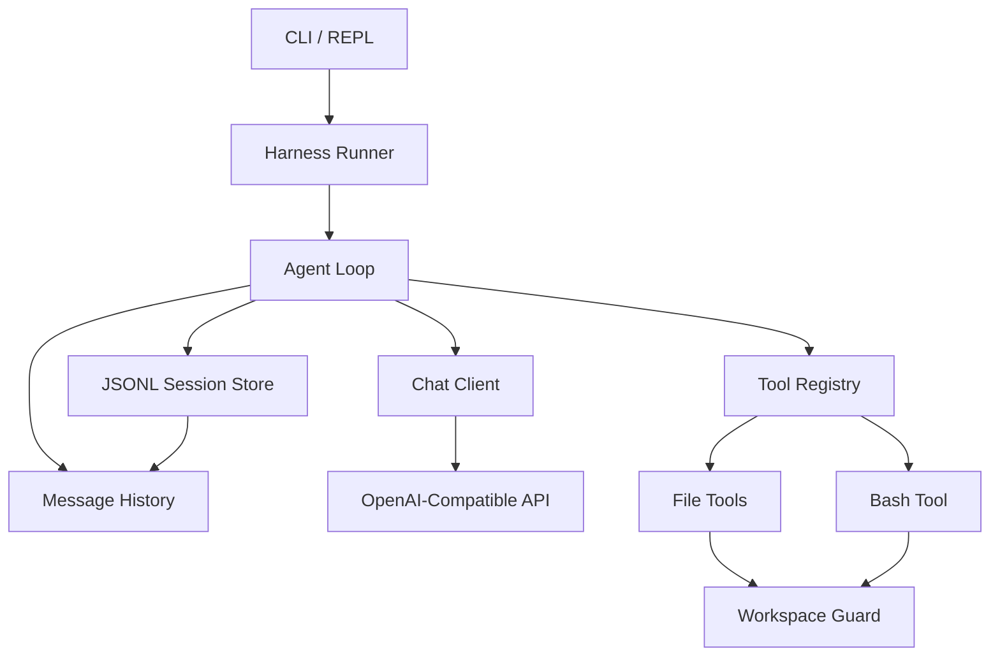
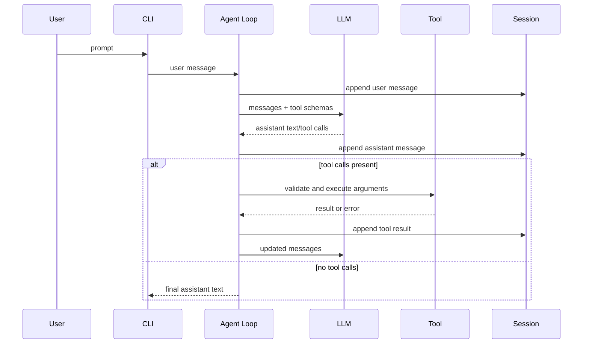
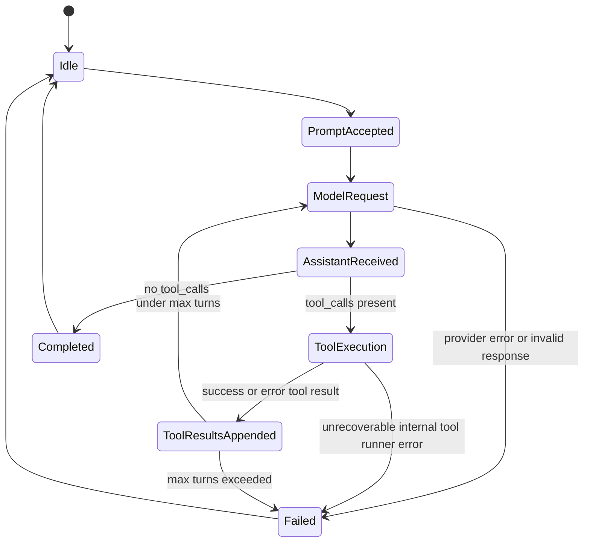

# feat: Build Modern C++ Coding Harness MVP

**Target repo:** `/home/hoso/cpp-coding-harness` greenfield project. Target implementation file paths in this plan are relative to `/home/hoso/cpp-coding-harness`. Pi reference paths are absolute paths into `/home/hoso/pi-mono` so implementation work in this repository does not confuse source files with reference material.

## Summary

Build a small Modern C++ coding harness MVP that reproduces the essential pi-style loop: accept a user prompt, call an LLM with tool definitions, execute local tools, append tool results, and repeat until the model stops. The MVP favors a stable CLI/REPL, one OpenAI-compatible provider, safe local tools, and JSONL sessions over full TUI, extensions, OAuth, subagents, or strong sandboxing.

---

## Problem Frame

The goal is to help a C++-fluent developer understand and implement the core of a coding agent without copying pi's TypeScript runtime wholesale. Pi's value comes from a small local harness around a model: typed messages, tool schemas, turn lifecycle, local file/process tools, session persistence, and clear safety posture. A C++ MVP should preserve those boundaries while staying small enough to compile, test, and reason about early.

The first version should be useful as a learning and experimentation harness, not a production replacement for pi. It should make the agent loop observable and testable before adding high-friction surfaces such as a terminal UI, plugin system, OAuth login, session tree branching, or OS-level sandbox integrations.

---

## Requirements

**Agent loop and model interaction**

- R1. The harness accepts a user prompt from CLI or REPL and turns it into an ordered message history containing system, user, assistant, and tool-result messages.
- R2. The harness sends an OpenAI-compatible chat request with JSON Schema tool definitions and supports assistant responses containing text plus one or more `tool_calls`.
- R3. The harness executes requested tools locally, appends a tool-result message with the corresponding tool call ID, and continues the loop until the assistant stops calling tools or a configured turn limit is reached.
- R4. The harness exposes enough lifecycle events or logs to understand each turn, tool call, tool result, model stop reason, and failure path.

**Local tools**

- R5. The MVP includes `read_file`, `write_file`, `edit_file`, and `bash` tools with typed JSON inputs and deterministic text outputs.
- R6. `edit_file` supports one exact `old_text` / `new_text` replacement per call and rejects missing or ambiguous matches rather than guessing. Multi-replacement batches are deferred until a concrete acceptance example needs them.
- R7. File tools operate inside the configured workspace boundary by default and report clear errors for paths that escape the workspace.
- R8. `bash` runs inside the workspace, captures exit code and combined output, enforces timeout, and truncates oversized output while preserving enough context for the model.

**Session and recovery**

- R9. The harness persists each conversation as JSONL so a session can be inspected, resumed, or replayed in tests.
- R10. The session format records enough metadata to reconstruct the active message history and preserve tool call/result relationships.

**Developer experience and testability**

- R11. The project builds as a conventional CMake-based C++20 project with a Boost-first dependency baseline: Boost.JSON for JSON DOM/parsing/serialization, Boost.Process for subprocess execution, Boost.Beast/Asio for HTTPS transport, OpenSSL/TLS support, CLI11, and Catch2.
- R12. Core behavior is driven by tests that use fake chat clients, fake HTTP transports, fake process runners, and temporary workspaces, so default tests do not call paid model APIs, depend on wall-clock process timing, or mutate the developer's real repository.
- R13. Provider API keys, local tool outputs that look like secrets, and other secrets are resolved or redacted before provider request construction and before durable artifacts such as JSONL sessions, request fixtures, logs, and error messages. The redacted transcript is the canonical resumed/replayed context; exact unredacted replay is out of MVP scope. Sessions are still documented as sensitive because they can contain source text and command output.
- R14. Implementation follows a Kent Beck-style TDD cadence: write the smallest deterministic failing test, make the minimum code change that turns it green, then refactor before widening the slice.
- R15. The README and default fake-provider test suite act as living documentation: a C++-fluent developer can follow named scenario tests from prompt to tool result, understand the core message/tool/session boundaries, and map AE1-AE5 to executable specifications.

---

## Key Technical Decisions

- KTD1. **C++20 baseline with C++23-compatible style:** Use C++20 as the minimum language level for broad compiler support while keeping interfaces RAII-friendly, value-oriented, and ready for later coroutine or `std::expected` adoption when the dependency policy allows it.
- KTD2. **OpenAI-compatible provider first:** Target OpenAI Chat Completions `/v1/chat/completions` as the MVP contract, including `tools` / `tool_calls` / tool-result message behavior. Compatible gateways are supported only when they match that contract; Anthropic, Gemini, gateway-specific deviations, and provider-specific streaming belong behind the same `ChatClient` boundary later.
- KTD3. **Synchronous sequential loop for MVP:** Execute one model turn at a time and run tools sequentially. This avoids concurrency races in file mutation and makes the loop easy to test; parallel tools and streaming deltas are deferred until correctness is proven.
- KTD4. **Tool contracts use Boost.JSON-backed JSON Schema plus runtime validation:** Each tool owns a name, description, JSON Schema parameters, and an execution function. Represent dynamic provider/tool payloads with Boost.JSON at the boundary, while keeping domain-level message and tool types provider-neutral. The model-facing schema and local input validation must stay paired so malformed or hallucinated arguments fail safely.
- KTD5. **Central workspace and Boost.Process-backed output guard:** All file and process tools use shared path normalization, workspace containment, timeout, process termination, and truncation utilities. `bash` should be backed by Boost.Process through a local process abstraction so platform-specific launch, pipe, exit-code, and termination behavior stays contained.
- KTD6. **Linear JSONL sessions before tree sessions:** Persist a simple append-only session first. Pi's tree sessions and branch summaries are valuable, but a linear session is enough for MVP resume, debugging, and deterministic tests.
- KTD7. **Fake model TDD before live provider work:** The agent loop is the product core. The first implementation slice should be a compileable fake-client red/green/refactor loop before production provider transport or the full tool set is implemented. Live API smoke tests stay opt-in until fake chat-client, fake HTTP transport, fake process runner, and temporary-workspace tests are green.
- KTD8. **Secrets stay out of durable artifacts:** Provider credentials should be read from environment or local config at runtime, then redacted from logs, test fixtures, session entries, and provider error surfaces. A local coding harness is easiest to debug when transcripts are shareable without credential review.
- KTD9. **Boost-first dependency spine:** Use Boost.JSON, Boost.Process, Boost.Beast/Asio, and OpenSSL-backed TLS as the default MVP dependency spine rather than treating them as interchangeable candidates. This keeps JSON representation, process execution, networking, timeout/cancellation, and TLS integration inside one mature C++ ecosystem. Keep an `HttpTransport` interface for fake transports in tests and future experimentation, and implement OpenAI request/response mapping against sanitized contract fixtures before adding the production Boost.Beast/Asio transport. Before production transport work begins, run a short dependency spike for Boost.Beast/Asio TLS and Boost.Process timeout/termination behavior; if either blocks the learning-core slices, defer or narrow that production implementation rather than delaying the fake-provider loop.

---

## High-Level Technical Design

### Component topology



### Agent turn sequence



### Loop lifecycle



---

## Output Structure

```text
CMakeLists.txt
vcpkg.json
README.md
src/
  main.cpp
  agent/
    AgentLoop.hpp
    AgentLoop.cpp
    Message.hpp
    Tool.hpp
    ToolRegistry.hpp
  llm/
    ChatClient.hpp
    HttpTransport.hpp
    OpenAIChatClient.hpp
    OpenAIChatClient.cpp
    BoostBeastHttpTransport.hpp
    BoostBeastHttpTransport.cpp
  session/
    SessionStore.hpp
    JsonlSessionStore.hpp
    JsonlSessionStore.cpp
  tools/
    ReadFileTool.cpp
    WriteFileTool.cpp
    EditFileTool.cpp
    BashTool.cpp
    PathGuard.hpp
    OutputLimiter.hpp
  util/
    JsonSchema.hpp
    Process.hpp
    Result.hpp
tests/
  agent/
    AgentLoopTest.cpp
  llm/
    OpenAIChatClientTest.cpp
    BoostBeastHttpTransportTest.cpp
  session/
    JsonlSessionStoreTest.cpp
  tools/
    FileToolsTest.cpp
    BashToolTest.cpp
  cli/
    CliSmokeTest.cpp
  support/
    FakeChatClient.hpp
    TempWorkspace.hpp
```

---

## Implementation Units

### TDD execution order

Implement the plan as compileable vertical slices, not as horizontal layers. Each slice starts with the smallest failing deterministic test, makes the minimum green change, then refactors names, interfaces, and utilities before widening scope.

1. **Walking skeleton:** CMake, Catch2, a fake chat client, and a one-shot text-only loop test.
2. **First tool loop:** AE1 with a fake model requesting `read_file`, a minimal registry/path guard, a tool result appended with the call ID, and a second fake model response.
3. **Session slice:** JSONL append/resume for the same fake loop, including preserved tool call/result relationships.
4. **Tool slices:** add `write_file`, `edit_file`, and `bash` one at a time; introduce shared utilities only after multiple green callers need them.
5. **Provider mapping slice:** OpenAI Chat Completions request/response mapping driven by sanitized contract fixtures and a fake `HttpTransport`.
6. **CLI fake-provider smoke, production transport, and hardening:** prove CLI/REPL behavior with a fake provider first, then add Boost.Beast/Asio HTTPS transport, TLS trust behavior, opt-in live smoke, and final CLI/REPL polish.

### U1. Project scaffold and core contracts

- **Goal:** Establish a buildable C++20 project and the smallest walking skeleton needed for the first fake-client red/green/refactor loop.
- **Requirements:** R1, R4, R11, R12
- **Dependencies:** None
- **Files:** `CMakeLists.txt`, `vcpkg.json`, `src/agent/AgentLoop.hpp`, `src/agent/AgentLoop.cpp`, `src/agent/Message.hpp`, `src/llm/ChatClient.hpp`, `src/util/Result.hpp`, `tests/support/FakeChatClient.hpp`, `tests/agent/AgentLoopTest.cpp`
- **Approach:** Start with Catch2 wired into CMake and a failing fake-client loop test. Add only the message, result, fake chat client, and minimal `AgentLoop` seams needed to pass that test, then refactor names and interfaces after green. Keep provider-neutral concepts in `src/agent/` and provider-specific mapping in `src/llm/`, but defer `Tool`, `ToolRegistry`, `SessionStore`, and broader value types until a failing behavior test requires them. Use Boost.JSON at serialization/provider boundaries, not as the core domain model for every internal type.
- **Execution note:** First red test: a one-shot prompt reaches a fake chat client, records a user message, records a text-only assistant response, and prints the assistant text. The next red test introduces one assistant tool call before the real provider exists.
- **Patterns to follow:** Pi keeps provider-neutral loop types in `/home/hoso/pi-mono/packages/agent/src/types.ts` and maps to provider messages inside `/home/hoso/pi-mono/packages/agent/src/agent-loop.ts`; mirror that separation rather than coupling tools directly to the HTTP client.
- **Test scenarios:**
  - Happy path: a one-shot prompt reaches a fake chat client, records a user message, records a text-only assistant response, and returns the assistant text.
  - Edge case: an empty assistant text block remains serializable and does not crash formatting or loop completion.
  - Error path: a fake chat client error becomes a structured loop failure rather than an uncaught exception.
  - Integration: the first fake-client loop test reads as an executable specification for the prompt → request → assistant-response path without tool or session abstractions.
- **Verification:** The project configures, compiles, and the first fake-client loop test passes. Any broader contracts introduced in U1 have a failing behavior test that forced them, followed by a refactor checkpoint before U2/U3 scope begins.

### U2. OpenAI-compatible chat client

- **Goal:** Implement OpenAI Chat Completions request/response mapping against a fake `HttpTransport`; defer production HTTPS transport until U6 after fake loop and fake CLI smoke paths are green.
- **Requirements:** R2, R3, R4, R11, R12, R13
- **Dependencies:** U1
- **Files:** `src/llm/OpenAIChatClient.hpp`, `src/llm/OpenAIChatClient.cpp`, `src/llm/HttpTransport.hpp`, `src/util/JsonSchema.hpp`, `tests/llm/OpenAIChatClientTest.cpp`, `tests/support/FakeChatClient.hpp`, `README.md`
- **Approach:** Use Boost.JSON for request construction, response parsing, JSON Schema emission, and tool-call argument parsing. Target OpenAI Chat Completions `/v1/chat/completions` first, using sanitized request/response fixtures from that contract before writing the mapper. Write failing mapping tests against a fake `HttpTransport`; compatibility gateways stay in scope only when they match the same request/response shape. Treat tool-call arguments as JSON strings that must be parsed and validated locally. Run the central redactor before request construction so captured fake HTTP bodies never contain provider API keys or secret-looking tool output. Keep API key, base URL, model, timeout, and optional organization/project headers in configuration rather than hardcoding them. Defer production Boost.Beast/Asio transport, TLS trust behavior, and live smoke to U6.
- **Patterns to follow:** OpenAI-compatible tool calling defines function tools through JSON Schema and returns `tool_calls`; the API does not execute functions for the client. Pi similarly treats tool execution as harness-owned rather than provider-owned.
- **Test scenarios:**
  - Happy path: a neutral tool definition maps to an OpenAI Chat Completions request `tools` entry with name, description, and parameter schema.
  - Happy path: sanitized OpenAI Chat Completions contract fixtures round-trip through the mapper before production transport code exists.
  - Happy path: an assistant response with text and one tool call maps to a neutral assistant message containing both content and call metadata.
  - Edge case: a provider response with invalid JSON in tool arguments becomes a structured error that the loop can surface, not an uncaught exception.
  - Error path: missing API key and fake non-2xx provider responses return provider errors with enough context for the CLI to display.
  - Error path: fake HTTP capture proves provider API keys and secret-looking tool output are redacted before request bodies, logs, sessions, or error surfaces.
  - Integration: a fake HTTP transport captures the full request body so tests can verify message ordering after prior redacted tool results.
- **Verification:** Provider mapping is covered by sanitized fixtures and fake HTTP transport tests without live network access; production Boost.Beast transport tests and optional live smoke are deferred to U6.

### U3. Safe local tool implementations

- **Goal:** Add `read_file`, `write_file`, `edit_file`, and `bash` tools with shared workspace containment, validation, timeout, and output truncation behavior.
- **Requirements:** R5, R6, R7, R8, R12
- **Dependencies:** U1
- **Files:** `src/agent/Tool.hpp`, `src/tools/ReadFileTool.cpp`, `src/tools/WriteFileTool.cpp`, `src/tools/EditFileTool.cpp`, `src/tools/BashTool.cpp`, `src/tools/PathGuard.hpp`, `src/tools/OutputLimiter.hpp`, `src/util/Process.hpp`, `tests/tools/FileToolsTest.cpp`, `tests/tools/BashToolTest.cpp`, `tests/support/TempWorkspace.hpp`
- **Approach:** Build tools one behavior at a time behind the common `Tool` interface: `read_file` first for AE1, then `write_file`, single-replacement `edit_file`, and `bash`. Introduce `PathGuard` with separate paths for existing files and new writes: canonicalize the workspace root and existing parent, reject escapes through `..` or symlinked parents, resolve and verify existing target containment for reads/edits, reject final-component symlink escapes for writes or use safe no-follow/atomic semantics where supported, create missing parents only when explicitly allowed, and recheck containment after creation. `OutputLimiter` enforces byte and line ceilings with a clear truncation marker. `edit_file` supports one exact replacement per call and rejects zero or ambiguous matches. `bash` is disabled by default unless the CLI enables it explicitly, runs with a sanitized environment that omits provider credentials, and uses an injectable process runner plus clock for default tests before the Boost.Process implementation is exercised.
- **Patterns to follow:** Pi's built-in tools live under `/home/hoso/pi-mono/packages/coding-agent/src/core/tools/`; `edit.ts` requires unique exact `oldText` matches, `read.ts` uses offset/limit and truncation, and `bash.ts` centralizes timeout/output handling.
- **Test scenarios:**
  - Happy path: `read_file` returns the content of a workspace file and includes a deterministic path label.
  - Happy path: `write_file` creates a new file inside a temporary workspace by validating the existing parent and reports success without leaking absolute host paths.
  - Happy path: `edit_file` replaces one unique exact text region and returns a concise diff summary.
  - Edge case: `edit_file` rejects zero matches and multiple matches for the same `old_text`.
  - Error path: file tools reject `..` traversal, symlink escape through parents, final-component symlink target escapes, directories where files are expected, unreadable files, and missing parents unless creation is explicitly allowed.
  - Happy path: enabled `bash` captures stdout/stderr and non-zero exit status without treating non-zero as a harness crash.
  - Error path: disabled-by-default `bash` returns a blocked-tool result without executing.
  - Error path: `bash` timeout behavior is covered by a fake process runner and injectable clock in the default suite; real Boost.Process timeout coverage is tagged as an integration test.
  - Integration: a tool result generated by each tool can be appended to message history and consumed by the fake chat client in the next turn.
- **Verification:** Tool tests mutate only temporary workspaces; path escape cases are deterministic, and default timeout tests use fake process/clock control rather than wall-clock sleeps.

### U4. Agent loop orchestration

- **Goal:** Implement the core loop that appends messages, sends model requests, executes tool calls, records tool results, handles failures, and stops cleanly.
- **Requirements:** R1, R2, R3, R4, R5, R8, R12, R13
- **Dependencies:** U1 plus the minimal `read_file` slice from U3; U2 is not required for fake-loop orchestration tests.
- **Files:** `src/agent/AgentLoop.hpp`, `src/agent/AgentLoop.cpp`, `src/agent/ToolRegistry.hpp`, `tests/agent/AgentLoopTest.cpp`, `tests/support/FakeChatClient.hpp`, `tests/support/TempWorkspace.hpp`
- **Approach:** Keep the loop state machine explicit: idle, model request, assistant received, tool execution, tool results appended, completed, failed. Tool validation failures, unknown tools, blocked tools, malformed arguments, and tool timeouts become `is_error=true` tool-result messages appended with the original tool call ID and fed back into the next model request. Tool outputs that look like secrets pass through the central redactor before they enter provider-visible or persisted message history; the redacted result is what later model turns and resumed sessions see. Reserve the `Failed` state for provider errors, invalid provider responses, session persistence failures, unrecoverable internal invariants, and max-turn exhaustion. For MVP, execute tool calls sequentially in the order returned by the model.
- **Patterns to follow:** Pi emits turn lifecycle events around model requests and tool execution in `/home/hoso/pi-mono/packages/agent/src/agent-loop.ts`; preserve the same conceptual boundary even if the MVP logs events rather than rendering them in a TUI.
- **Test scenarios:**
  - Happy path: fake model returns text only; loop appends user and assistant messages and stops.
  - Happy path: fake model returns one tool call then final text; loop executes the tool, appends the tool result with matching call ID, and makes a second model request.
  - Edge case: fake model returns multiple tool calls; MVP executes them sequentially and appends results in model-provided order.
  - Error path: unknown tool name appends an error tool result rather than crashing the process.
  - Error path: malformed tool arguments produce an error result visible to the next model turn.
  - Error path: max turn limit stops an infinite tool-call loop and records the stop reason.
  - Error path: secret-looking tool output is redacted before it appears in the next provider request or persisted session entry.
  - Integration: a read-file tool result can influence the fake model's next assistant response, proving feedback into context.
- **Verification:** Agent loop tests cover stop, AE1-style tool-use, error tool-result continuation, and max-turn paths without invoking live APIs. The first loop slice stays compileable and green before U2 production provider work starts.

### U5. JSONL session persistence and resume

- **Goal:** Persist conversations in an append-only JSONL session file and reconstruct active message history for a resumed run.
- **Requirements:** R1, R9, R10, R12, R13
- **Dependencies:** U1, U4
- **Files:** `src/session/JsonlSessionStore.hpp`, `src/session/JsonlSessionStore.cpp`, `tests/session/JsonlSessionStoreTest.cpp`, `README.md`
- **Approach:** Start with a v1 linear session header followed by message entries serialized through Boost.JSON. Include session ID, creation timestamp, cwd/workspace, provider/model metadata when known, and stable entry IDs. Unknown future entry types are preserved on load/save but ignored when reconstructing active message history. Persist only the redacted canonical message history; resumed and replayed sessions reconstruct that redacted history, and exact unredacted replay is out of MVP scope. Create session parents and files with owner-only permissions where supported, avoid following symlinks for the session path, fail or warn on world-readable existing session files, and document retention/deletion expectations. Keep branch/tree fields out of the MVP format; the versioned header is the future evolution path.
- **Patterns to follow:** Pi sessions are JSONL and later evolved into a tree with `id` / `parentId`; the MVP should borrow append-only readability but avoid tree semantics until branch navigation is explicitly in scope.
- **Test scenarios:**
  - Happy path: a new session writes a header and appends redacted user, assistant, and tool-result messages in order.
  - Happy path: reopening a session reconstructs the same redacted canonical message history used before process exit.
  - Edge case: an empty or header-only session resumes as an empty history without error.
  - Error path: malformed JSONL line reports a session-load error with line number and leaves the original file untouched.
  - Error path: unknown future entry type is preserved for forward compatibility but ignored when reconstructing active message history, without corrupting known messages.
  - Error path: session serialization excludes provider API keys, redacts API-key-like values in tool results, and stores only non-secret provider/model metadata.
  - Error path: session paths avoid symlink following, owner-only permissions are requested where supported, and world-readable existing session files fail or warn as documented.
  - Integration: an agent loop run can persist, exit, resume, and continue with a fake model that sees prior redacted tool results.
- **Verification:** Session tests prove round-trip stability, redaction semantics, storage controls, and error handling without relying on wall-clock ordering beyond injected timestamps.

### U6. CLI, REPL, configuration, and documentation

- **Goal:** Provide a usable terminal entrypoint for one-shot prompts and interactive REPL sessions, plus enough docs for a developer to configure and run the MVP safely.
- **Requirements:** R1, R2, R4, R7, R8, R9, R11, R12, R13
- **Dependencies:** U2, U3, U4, U5
- **Files:** `src/main.cpp`, `src/llm/BoostBeastHttpTransport.hpp`, `src/llm/BoostBeastHttpTransport.cpp`, `README.md`, `tests/cli/CliSmokeTest.cpp`, `tests/llm/BoostBeastHttpTransportTest.cpp`, `CMakeLists.txt`
- **Approach:** Use CLI11 for flags and subcommands. Support a one-shot prompt mode and an interactive REPL mode. Create a new session by default; use `--resume <session.jsonl>` to load and append to an existing session; fail fast when a user asks to create a session at an existing path without `--resume`; and define malformed-session behavior before any model request. Configuration should cover provider base URL, API key environment variable name, model, workspace root, session file, resume path, max turns, tool enablement, bash disabled-by-default behavior, explicit bash enablement, sanitized bash environment, bash timeout, and the default Catch2 test command. Add a CLI transcript/state table covering model request, assistant text, tool call, tool success, blocked tool, tool error, provider/session failure, max-turn stop, and final completion; CLI smoke tests assert the stable lines. Prove the CLI/REPL with a fake provider before adding production Boost.Beast/Asio transport, TLS trust behavior, and opt-in live smoke. CLI help and README must disclose that prompts, file contents, and command outputs may be sent to the configured provider and may appear in sensitive local sessions. The MVP supports POSIX-like shell environments first; native Windows command-shell semantics are deferred behind `Process.hpp`. Display tool calls/results in a compact textual form before considering richer TUI rendering.
- **Patterns to follow:** Pi separates core session capability from interactive presentation; keep the C++ CLI thin over the agent loop so a future TUI or RPC mode can reuse the same core.
- **Test scenarios:**
  - Happy path: one-shot mode accepts a prompt, runs a fake text-only model, prints the final assistant text, and writes a session.
  - Happy path: REPL accepts two prompts in the same process and preserves message history between them.
  - Happy path: `--resume <session.jsonl>` loads a previous redacted session and appends the next prompt in one-shot and REPL modes.
  - Edge case: stable transcript lines appear for model request, assistant text, tool call, success, blocked tool, error result, provider/session failure, max-turn stop, and final completion.
  - Edge case: missing API key in real-provider mode prints an actionable configuration error before starting the loop.
  - Edge case: default `bash` disabled mode causes a model-requested bash call to produce a blocked-tool result rather than executing.
  - Edge case: explicit bash enablement runs with a sanitized environment that omits provider credentials.
  - Error path: invalid workspace path, existing session path without `--resume`, malformed resume file, unwritable session path, or invalid max-turn value fails before the model request.
  - Error path: Boost.Beast DNS/connect/TLS/write/read failures, hostname verification failure, CA loading failure, HTTP timeout, and non-2xx responses return provider errors with redacted context.
  - Integration: CLI smoke test uses a fake provider mode so it can run in CI without network credentials; production transport tests remain deterministic and live smoke is opt-in.
- **Verification:** A developer can build the binary, run a fake-provider smoke scenario, inspect the transcript states, resume a session deliberately, and understand from README which features are MVP versus deferred.

---

## Acceptance Examples

- AE1. Given a prompt that asks the harness to inspect a file, when the fake model requests `read_file`, then the harness reads only inside the workspace, appends a tool-result message with the call ID, and sends a second model request containing that result.
- AE2. Given a file where the target text appears twice, when the model requests `edit_file`, then the harness rejects the edit as ambiguous and returns an error tool result instead of modifying the file.
- AE3. Given a command that exceeds the configured timeout, when the model requests `bash`, then the harness terminates or marks the process timed out, captures available output within limits, and continues the loop with an error result.
- AE4. Given a completed session file, when the user resumes it, then the reconstructed message history preserves user, assistant, and tool-result ordering well enough for the next model request to continue coherently.
- AE5. Given the first implementation slice, when the developer runs the default test command, then the fake-client red/green/refactor loop compiles and passes before any production provider transport or full tool set is implemented.
- AE6. Given a C++-fluent developer follows the README walkthrough, when they run the named fake-provider Catch2 specifications for AE1-AE5, then the tests and README explain how messages, tool calls, tool results, sessions, and workspace boundaries compose into the agent loop.

---

## Scope Boundaries

### In scope for MVP

- A greenfield C++20 CLI/REPL harness.
- One OpenAI Chat Completions-compatible provider adapter for `/v1/chat/completions`.
- Four local tools: file read, file write, single exact edit, and explicitly enabled bash.
- Linear JSONL sessions with resume support.
- POSIX-like shell environments for the MVP `bash` tool and CLI smoke path.
- Kent Beck-style TDD slices using Catch2, fake providers, fake transports, fake process runners, injectable clocks, and temporary workspaces.
- Basic local safety controls: workspace containment, bash disabled by default, sanitized bash environment, bash timeout, output truncation, max turns, and disabled-tool handling.

### Deferred to Follow-Up Work

- Rich terminal UI with editor, footer, hotkeys, queued steering/follow-up messages, and visual diff rendering.
- Multiple providers, gateway-specific OpenAI-compatible deviations, provider-specific streaming, OAuth/subscription login, and model registry UX.
- Extension system, skills, prompt templates, package manager, custom commands, and theme support.
- Session tree branching, fork/clone, compaction summaries, and HTML export.
- Multi-replacement edit batches beyond one exact replacement per call.
- Native Windows command-shell semantics beyond the portable process abstraction.
- Parallel tool execution, background processes, subagents, MCP compatibility, or RPC/SDK embedding surfaces.
- OS-level sandbox, container orchestration, egress policy, and permission prompts beyond the MVP's workspace guard and explicit tool enablement.

---

## System-Wide Impact

The MVP creates a local process that can read, write, edit, and, when explicitly enabled, execute commands in a workspace. Even as a learning harness, this changes the developer's risk profile: untrusted repository content and model output can influence tool calls, and prompts/tool outputs may be sent to the configured provider. The implementation should present this honestly in CLI help and README, default to a specific workspace root, keep bash disabled by default, and make bash enablement visible.

The architecture also creates a future extension seam. Keeping provider, tool, session, and presentation layers separate in the MVP prevents the first CLI from becoming a dead end when richer interfaces are added.

---

## Risks & Dependencies

- **Tool-call API drift:** OpenAI-compatible providers may differ in exact request/response shape. Mitigation: target OpenAI Chat Completions `/v1/chat/completions` first, keep provider mapping isolated in `src/llm/`, drive it from sanitized contract fixtures before coding the adapter, and keep live smoke opt-in.
- **Process portability:** Bash/process timeout behavior differs across Unix and Windows. Mitigation: declare POSIX-like shell behavior as the MVP target, abstract process launch and termination behind `src/util/Process.hpp`, use fake process/clock tests for default red/green cycles, and defer native Windows command-shell semantics until explicitly validated.
- **False sense of sandboxing:** A workspace path guard is not a security sandbox. Mitigation: document the boundary explicitly, reject parent and final-component symlink escapes, keep bash disabled by default with explicit enablement and sanitized environment, and defer real containment to OS/container work.
- **Provider trust boundary:** Prompt text, file contents, and command outputs can cross the configured provider boundary. Mitigation: disclose this in CLI help and README, require explicit provider configuration, redact secret-looking content before provider request construction, and keep fake-provider tests as the default.
- **Session format lock-in:** A too-clever session v1 can become hard to evolve. Mitigation: use simple JSONL entries with a versioned header, preserve unknown future entries while ignoring them for active history reconstruction, and keep tree semantics out of MVP without nullable branch placeholders.
- **Session at-rest exposure:** Redacted sessions can still contain source text, command output, cwd/workspace, and provider/model metadata. Mitigation: create session files with owner-only permissions where supported, avoid following symlink session paths, warn or fail on world-readable existing files, and document retention/deletion expectations.
- **Secret leakage through debugging artifacts:** Provider errors, HTTP fixtures, tool outputs, or JSONL sessions can accidentally capture credentials. Mitigation: centralize credential loading, make the redacted transcript canonical before provider/session/log boundaries, treat sessions as sensitive transcripts, and include regression tests for redaction.
- **Dependency sprawl:** C++ package choices can dominate the MVP. Mitigation: pin a small Boost-first set: CMake, Boost.JSON, Boost.Process, Boost.Beast/Asio with OpenSSL/TLS support, CLI11, and Catch2; run a short Boost transport/process spike before production transport work; and do not add a second JSON library or a non-Boost production HTTP client unless a concrete Boost blocker appears.

---

## Deferred Implementation Notes

- Exact class, method, and namespace names should be finalized during implementation after the first compileable slice exists.
- The live-provider smoke path should remain opt-in until fake-provider coverage is stable.
- The first session format should not reserve pi-style branch/tree fields unless a concrete resume/branch UX is added.
- Native Windows process and command-shell behavior is deferred until Windows support is explicitly validated behind `src/util/Process.hpp`.

---

## Sources & Research

- `/home/hoso/pi-mono/README.md` documents the product boundary: minimal terminal coding harness, default `read` / `write` / `edit` / `bash` tools, sessions, customization, and explicit deferral of subagents, plan mode, and permission popups.
- `/home/hoso/pi-mono/packages/agent/src/agent-loop.ts` shows pi's core loop shape: turn lifecycle, message history transformation, assistant tool-call extraction, tool execution, tool-result appending, and follow-up/steering message handling.
- `/home/hoso/pi-mono/packages/coding-agent/src/core/tools/read.ts`, `/home/hoso/pi-mono/packages/coding-agent/src/core/tools/edit.ts`, and `/home/hoso/pi-mono/packages/coding-agent/src/core/tools/bash.ts` provide concrete patterns for truncation, exact edits, file mutation safety, bash timeout, and tool result formatting.
- `/home/hoso/pi-mono/packages/coding-agent/src/core/session-manager.ts` and `/home/hoso/pi-mono/packages/coding-agent/docs/session-format.md` show pi's JSONL session model and why the MVP should start linear before adopting tree branching.
- `/home/hoso/pi-mono/packages/coding-agent/docs/security.md` clarifies pi's safety posture: project trust is input-loading control, not a sandbox; real containment belongs to OS, VM, or container boundaries.
- OpenAI developer documentation for function/tool calling confirms that tools are declared with JSON Schema and executed by the client harness, not by the API provider.
- Boost.JSON documentation covers `boost::json::value`, `object`, `array`, `parse`, `serialize`, and memory-resource-aware construction; this makes it the selected JSON DOM/parser/serializer for the MVP.
- Boost.Process documentation covers subprocess lifecycle, exit-code handling, detaching risks, and process termination; this makes it the selected process abstraction foundation for the `bash` tool.
- Boost.Beast/Asio documentation covers HTTP message handling, TCP/TLS streams, asynchronous operations, and timeout/cancellation building blocks; this makes it the selected HTTPS transport foundation for the OpenAI-compatible provider.
- OpenSSL and Boost.Asio SSL documentation cover TLS context setup, certificate verification, and CA store/bundle handling for the production HTTPS transport.
- CLI11 documentation positions it as a small C++ command-line parser suitable for the MVP CLI/REPL entrypoint.
- Catch2 documentation covers CMake integration and modern C++ test assertions for the default TDD test command.
