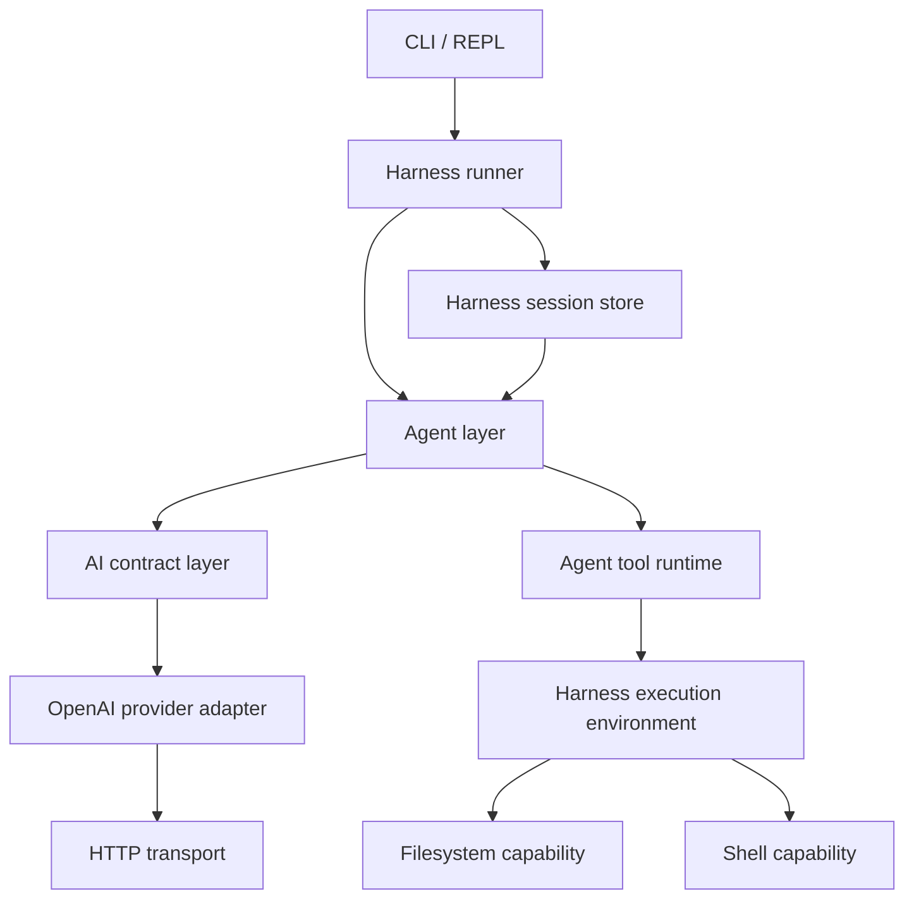
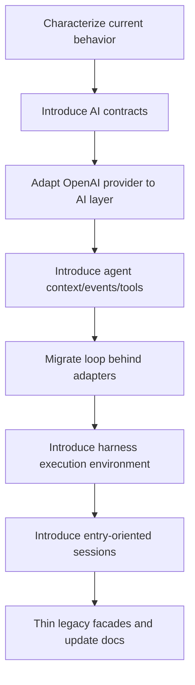
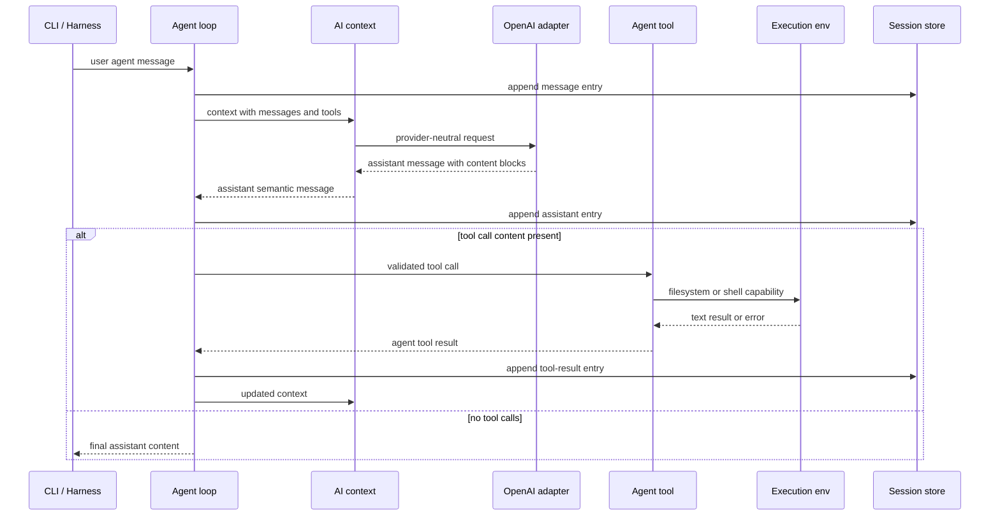

# refactor: Align C++ harness with pi AI and agent contracts

**Target repo:** `cpp-coding-harness`. All implementation paths below are relative to this repo. Reference paths are explicitly labeled as `pi-mono` paths and are relative to the external reference repo.

## Summary

Refactor the C++ harness so its internal module boundaries and semantic contracts more closely mirror pi's separation between AI/provider contracts, agent orchestration, and harness execution/session infrastructure. The work preserves existing CLI, tool, provider, and JSONL behavior while introducing compatibility seams that let future features grow in the same direction as the reference project.

---

## Problem Frame

The current MVP successfully demonstrates the core coding-agent loop, but it compresses several reference-project responsibilities into one small set of C++ modules. `src/llm` combines provider-neutral contracts with OpenAI-specific transport mapping; `src/agent` owns both model-visible message/tool contracts and loop orchestration; tools receive a workspace-centric context instead of an execution environment abstraction; and sessions are linear message logs rather than entry-based harness state.

That compression was appropriate for the first MVP, but it now makes the project drift from the reference architecture in `pi-mono`: `packages/ai` owns model/provider/message/tool stream contracts, while `packages/agent` owns agent state, loop lifecycle, tool execution lifecycle, session abstractions, and harness integration. This plan realigns the C++ design without attempting a full TypeScript API clone or a production pi port.

---

## Refactoring Discipline

This is a refactoring plan, not a feature expansion plan. The implementation should follow the Fowler/Beck discipline throughout:

- Preserve observable behavior unless a unit explicitly introduces a new compatibility surface behind the same behavior.
- Add characterization coverage before moving code that already works.
- Separate structure changes from behavior changes; each unit should leave the harness buildable and testable.
- Prefer small preparatory refactorings, adapters, and dual-running seams over a big-bang rewrite.
- Keep the public CLI and existing MVP acceptance examples as the regression oracle while contracts are renamed, moved, or generalized.

---

## Requirements

**Behavior preservation**

- R1. Current CLI one-shot, REPL, fake-provider, real-provider, workspace, bash opt-in, max-turn, session, and resume behavior remains compatible during and after the refactor.
- R2. Existing MVP acceptance examples continue to pass: fake `read_file` tool loop, ambiguous edit rejection, bash timeout representation, JSONL resume ordering, fake walking skeleton, and CLI smoke behavior.
- R3. Existing JSONL sessions remain readable; new session data must not make old transcripts unusable for resume tests.

**Reference-aligned module boundaries**

- R4. Provider-neutral AI contracts move into a distinct C++ AI layer that owns message content blocks, tool definitions, context, stop reasons, usage placeholders, and provider/client contracts.
- R5. Provider-specific OpenAI Chat Completions mapping stays behind an AI provider adapter, not inside the agent loop or harness-level tool/session code.
- R6. Agent orchestration owns agent context, agent messages, lifecycle events, tool execution flow, and turn state without depending on OpenAI-specific wire shapes.
- R7. Harness infrastructure owns execution environment and session concerns, including filesystem/process capabilities and durable session entries.

**Contract compatibility and extension points**

- R8. The C++ contracts semantically match the reference project where it matters for future parity: `user`, `assistant`, and `toolResult` concepts; text and tool-call content blocks; tool name/schema/arguments/result fields; stop reasons; agent lifecycle events; and execution environment boundaries.
- R9. The C++ contracts remain idiomatic C++: value types, RAII-friendly ownership, explicit result/error types, and no attempt to mechanically clone TypeScript generics or async signatures.
- R10. Streaming, image content, thinking blocks, parallel tool execution, skills, OAuth, session tree navigation, compaction, and multi-provider registries are represented only as safe extension points unless required to preserve current behavior.

**Testability and migration safety**

- R11. Every feature-bearing contract extraction has characterization or contract tests before caller migration.
- R12. The migration proceeds through adapters so old call sites can be retired incrementally rather than rewritten all at once.
- R13. Tests verify both model-facing wire compatibility and agent-facing semantic compatibility, so a refactor cannot silently change OpenAI payload shape, tool-result matching, session replay ordering, or CLI transcript lines.

---

## Key Technical Decisions

- KTD1. **Semantic parity over exact API cloning:** Match the reference project's responsibility split and behavioral contracts, but express them as C++ value types and `util::Result`-style outcomes rather than TypeScript unions, promises, and declaration merging.
- KTD2. **Three-layer target boundary:** Introduce `ai`, `agent`, and `harness` as the stable architectural seams: AI for provider-neutral model contracts and provider adapters, agent for loop orchestration and tool execution lifecycle, harness for execution environment, sessions, and app integration.
- KTD3. **Adapters before replacement:** Keep existing `llm` and session callers working through compatibility adapters while new contracts are introduced. Remove or thin legacy facades only after characterization tests prove no behavior drift.
- KTD4. **Content-block model with MVP-active subset:** Introduce text and tool-call content blocks now, plus explicit placeholders for thinking/image capability only where they clarify the contract. The implementation should not add image or thinking behavior until a future feature needs it.
- KTD5. **Agent events become semantic lifecycle events:** Move from CLI-oriented loop events toward reference-style lifecycle events internally, then keep current CLI transcript lines through a printer/adapter. This protects user-visible output while enabling richer future harness subscribers.
- KTD6. **Execution environment replaces ad hoc tool context:** Tools should depend on a filesystem/shell capability boundary rather than raw workspace paths and process helpers. Current path guard, output limiter, process runner, and bash gating become the default local execution environment implementation.
- KTD7. **Session entries over raw message append, with compatibility:** Add an entry-oriented session abstraction aligned with the reference harness while preserving the current linear JSONL reader. New writes may include richer entry metadata only after legacy load/resume tests are locked down.
- KTD8. **Fowler/Beck guardrail for each unit:** Each unit starts by pinning observable behavior, then performs one structural move, then updates names/callers only after the adapter seam is in place. No unit should mix a new user-visible behavior with a structural refactor.

---

## High-Level Technical Design

### Target component topology



### Refactoring migration sequence



### Message and tool-result flow after alignment



---

## Output Structure

The implementation may adjust filenames as execution reveals better names, but the expected target shape is:

```text
src/
  ai/
    Content.hpp
    Message.hpp
    Tool.hpp
    Context.hpp
    ChatClient.hpp
    StopReason.hpp
    providers/
      OpenAIChatClient.hpp
      OpenAIChatClient.cpp
      BoostBeastHttpTransport.hpp
      BoostBeastHttpTransport.cpp
  agent/
    AgentContext.hpp
    AgentEvent.hpp
    AgentLoop.hpp
    AgentLoop.cpp
    AgentTool.hpp
    ToolRegistry.hpp
  harness/
    ExecutionEnv.hpp
    LocalExecutionEnv.hpp
    LocalExecutionEnv.cpp
    session/
      SessionEntry.hpp
      JsonlSessionStore.hpp
      JsonlSessionStore.cpp
  tools/
    ReadFileTool.cpp
    WriteFileTool.cpp
    EditFileTool.cpp
    BashTool.cpp
    PathGuard.hpp
    OutputLimiter.hpp
  util/
    Result.hpp
    Redactor.hpp
```

---

## Implementation Units

### U1. Characterize the current public behavior

- **Goal:** Lock down existing MVP behavior before moving contracts or files, so later units can prove they are structure-only refactorings.
- **Requirements:** R1, R2, R3, R11, R13
- **Dependencies:** None
- **Files:**
  - `tests/agent/AgentLoopTest.cpp`
  - `tests/cli/CliSmokeTest.cpp`
  - `tests/llm/OpenAIChatClientTest.cpp`
  - `tests/session/JsonlSessionStoreTest.cpp`
  - `tests/tools/BashToolTest.cpp`
  - `tests/tools/FileToolsTest.cpp`
  - `tests/support/FakeChatClient.hpp`
  - `README.md`
- **Approach:** Add or tighten characterization tests around current CLI transcript lines, fake-provider tool-loop behavior, OpenAI request/response shape, redaction expectations, workspace containment, bash opt-in, edit ambiguity rejection, and session resume ordering. Treat these tests as the regression oracle for all later structural moves.
- **Execution note:** Characterization-first. Record what the system does now, including awkward but intentional MVP behavior, before improving names or boundaries.
- **Patterns to follow:** Existing acceptance-example naming in README and current Catch-style test organization under `tests/agent`, `tests/llm`, `tests/session`, `tests/tools`, and `tests/cli`.
- **Test scenarios:**
  - Current fake `read_file` prompt produces the same ordered model request, assistant tool call, tool-result append, second model request, and final text behavior.
  - OpenAI request construction preserves model, messages, tool definitions, assistant tool calls, tool-result linkage, and redacted content for existing text-only inputs.
  - Legacy JSONL session with header plus message entries loads in the same order and resumes by appending the next user message after the loaded history.
  - CLI fake-provider smoke output still prints stable model-request, assistant, tool-call, tool-success/tool-error, completed, provider-error, and max-turn markers.
  - File tools still reject workspace escape, symlink escape, missing parents, ambiguous edit matches, and directory/file mismatches with clear error content.
  - Bash remains unavailable unless explicitly enabled, and timeout/truncation behavior remains represented through deterministic tests.
- **Verification:** Existing MVP behavior is covered by named characterization tests before any structural refactor begins; later refactor units can rely on this suite as a behavior-preservation gate.

### U2. Extract provider-neutral AI contracts

- **Goal:** Create a C++ AI contract layer that owns model-visible messages, content blocks, tool definitions, context, stop reasons, usage placeholders, and chat-client abstraction.
- **Requirements:** R4, R5, R8, R9, R10, R11, R12
- **Dependencies:** U1
- **Files:**
  - `src/ai/Content.hpp`
  - `src/ai/Message.hpp`
  - `src/ai/Tool.hpp`
  - `src/ai/Context.hpp`
  - `src/ai/ChatClient.hpp`
  - `src/ai/StopReason.hpp`
  - `src/llm/ChatClient.hpp`
  - `src/agent/Message.hpp`
  - `tests/ai/MessageContractTest.cpp`
  - `tests/ai/ToolContractTest.cpp`
  - `tests/support/FakeChatClient.hpp`
  - `CMakeLists.txt`
- **Approach:** Introduce new provider-neutral types alongside current `agent::Message` and `llm::ChatClient`, then provide narrow conversion adapters so old callers keep compiling. The new AI layer should model reference concepts from `pi-mono` `packages/ai/src/types.ts`: user messages, assistant messages, tool-result messages, text content, tool-call content, tool definitions, context, and stop reasons.
- **Execution note:** Test-first for the new contract shape, then adapter-first migration. Do not move OpenAI serialization in the same step unless the contract tests are already green.
- **Patterns to follow:** Current `src/agent/Message.hpp` JSON conversion helpers and current `src/llm/ChatClient.hpp` fake-client seam; reference concepts in `pi-mono` `packages/ai/src/types.ts`.
- **Test scenarios:**
  - A user text message converts to the new AI message model without losing text or timestamp/default metadata needed by downstream code.
  - An assistant message with text plus one tool call preserves tool call ID, name, arguments, and stop reason through old-to-new and new-to-old adapters.
  - A tool-result message preserves tool call ID, tool name where available, text content, and error flag.
  - Stop reasons map current values into the reference-like set without conflating normal stop, tool use, length, error, and aborted outcomes.
  - Tool definitions preserve name, description, and JSON Schema parameters through the new AI layer.
- **Verification:** Agent and provider tests can use the new AI contract types through adapters while existing behavior remains unchanged.

### U3. Move OpenAI provider mapping behind the AI layer

- **Goal:** Rehome OpenAI Chat Completions request/response mapping as an AI provider adapter instead of a generic `llm` module contract.
- **Requirements:** R1, R4, R5, R8, R11, R12, R13
- **Dependencies:** U2
- **Files:**
  - `src/ai/providers/OpenAIChatClient.hpp`
  - `src/ai/providers/OpenAIChatClient.cpp`
  - `src/ai/providers/BoostBeastHttpTransport.hpp`
  - `src/ai/providers/BoostBeastHttpTransport.cpp`
  - `src/llm/OpenAIChatClient.hpp`
  - `src/llm/OpenAIChatClient.cpp`
  - `src/llm/BoostBeastHttpTransport.hpp`
  - `src/llm/BoostBeastHttpTransport.cpp`
  - `src/llm/HttpTransport.hpp`
  - `tests/ai/providers/OpenAIChatClientTest.cpp`
  - `tests/llm/OpenAIChatClientTest.cpp`
  - `tests/llm/BoostBeastHttpTransportTest.cpp`
  - `CMakeLists.txt`
- **Approach:** Move provider-specific serialization/parsing to the new AI provider namespace and leave compatibility headers or forwarding adapters for current include paths during migration. The provider adapter should consume AI-layer context/tools and emit AI-layer assistant messages, with OpenAI wire details isolated to provider tests.
- **Execution note:** Preserve current OpenAI request/response fixture expectations before deleting or renaming legacy `llm` tests.
- **Patterns to follow:** Existing `OpenAIChatClient` HTTP transport seam and redaction handling; reference package split between `packages/ai/src/stream.ts`, `packages/ai/src/api-registry.ts`, and provider files under `packages/ai/src/providers`.
- **Test scenarios:**
  - Existing text-only request produces the same OpenAI Chat Completions payload after moving through the AI context adapter.
  - Existing assistant tool call response parses into AI content blocks and then into the current loop behavior without losing raw arguments or malformed-argument error state.
  - Provider HTTP errors still redact secret-looking content before surfacing an error.
  - Base URL normalization still produces the same Chat Completions endpoint for compatible base URLs.
  - Compatibility include paths or adapters keep existing tests buildable until their callers are migrated.
- **Verification:** OpenAI-specific behavior is tested under the AI provider layer; `agent` code no longer needs OpenAI wire knowledge.

### U4. Introduce agent context, tool, and lifecycle event contracts

- **Goal:** Align the agent layer with reference concepts: agent context, agent messages, agent tools, tool execution lifecycle, and semantic lifecycle events.
- **Requirements:** R6, R8, R9, R10, R11, R12, R13
- **Dependencies:** U2, U3
- **Files:**
  - `src/agent/AgentContext.hpp`
  - `src/agent/AgentEvent.hpp`
  - `src/agent/AgentTool.hpp`
  - `src/agent/AgentLoop.hpp`
  - `src/agent/AgentLoop.cpp`
  - `src/agent/Tool.hpp`
  - `src/agent/ToolRegistry.hpp`
  - `tests/agent/AgentLoopTest.cpp`
  - `tests/agent/AgentEventTest.cpp`
  - `tests/agent/AgentToolContractTest.cpp`
  - `tests/support/FakeChatClient.hpp`
  - `CMakeLists.txt`
- **Approach:** Introduce semantic agent events and tool contracts while keeping the CLI-facing event printer stable. The agent loop should operate on AI-layer messages through an `AgentContext`, execute tools via agent-level tool definitions/results, and emit lifecycle events that can later support richer harness subscribers.
- **Execution note:** Refactor behind the current loop tests first; only after tests prove behavior should internals switch from stringly CLI event names to semantic agent events.
- **Patterns to follow:** Current `AgentLoop` turn/tool-call tests; reference concepts in `pi-mono` `packages/agent/src/types.ts` and `packages/agent/src/agent-loop.ts`.
- **Test scenarios:**
  - A user prompt emits semantic agent start, turn start, user message lifecycle, assistant message lifecycle, turn end, and agent end events in a deterministic order.
  - A tool-call turn emits tool execution start and end events while still producing the same CLI transcript lines through the compatibility printer.
  - Unknown tool and malformed arguments become error tool-result messages rather than provider or loop failures.
  - A tool result preserves source assistant tool call order even if future execution modes add concurrency metadata.
  - Existing `run` and resume-style continuation behavior still return final text, stop reason, message history, and event summaries compatible with current callers.
- **Verification:** Internal agent events are reference-aligned, but external CLI and test-visible MVP behavior remains stable.

### U5. Introduce harness execution environment and migrate tools

- **Goal:** Replace ad hoc workspace/process fields in tool context with a harness execution environment boundary that owns filesystem and shell capabilities.
- **Requirements:** R1, R6, R7, R8, R9, R11, R12, R13
- **Dependencies:** U4
- **Files:**
  - `src/harness/ExecutionEnv.hpp`
  - `src/harness/LocalExecutionEnv.hpp`
  - `src/harness/LocalExecutionEnv.cpp`
  - `src/tools/PathGuard.hpp`
  - `src/tools/OutputLimiter.hpp`
  - `src/tools/ReadFileTool.cpp`
  - `src/tools/WriteFileTool.cpp`
  - `src/tools/EditFileTool.cpp`
  - `src/tools/BashTool.cpp`
  - `src/tools/ToolFactories.cpp`
  - `src/util/Process.hpp`
  - `tests/harness/LocalExecutionEnvTest.cpp`
  - `tests/tools/FileToolsTest.cpp`
  - `tests/tools/BashToolTest.cpp`
  - `tests/support/TempWorkspace.hpp`
  - `CMakeLists.txt`
- **Approach:** Introduce filesystem and shell capability interfaces that return explicit result/error values and are implemented by the current path guard, atomic write, output limiter, and process runner. Migrate built-in tools to depend on this environment through agent tool context rather than directly assembling workspace/process behavior.
- **Execution note:** Characterize each tool before migrating it; move one tool at a time so failures isolate to a single capability boundary.
- **Patterns to follow:** Existing `PathGuard`, `AtomicWrite`, `OutputLimiter`, `ProcessRunner`, and file-tool tests; reference execution environment concepts in `pi-mono` `packages/agent/src/harness/types.ts`.
- **Test scenarios:**
  - `read_file` through the execution environment still honors line offset/limit and rejects workspace escapes.
  - `write_file` and `edit_file` still validate parent paths, symlink escapes, directories, and ambiguous replacements exactly as before.
  - `bash` through the shell capability still requires explicit enablement, uses the configured working directory, sanitizes secret-looking environment values, enforces timeout, and truncates output consistently.
  - Filesystem errors map to stable environment error categories while preserving clear user-facing text for tool results.
  - A fake execution environment can drive tool tests without touching the real workspace or launching real processes.
- **Verification:** Tools no longer depend on raw workspace/process plumbing, and their observable text/error behavior remains covered by the existing tool test suite.

### U6. Add entry-oriented harness session abstraction

- **Goal:** Align session persistence with reference harness concepts while preserving current linear JSONL session behavior and resume compatibility.
- **Requirements:** R1, R3, R7, R8, R9, R11, R12, R13
- **Dependencies:** U4
- **Files:**
  - `src/harness/session/SessionEntry.hpp`
  - `src/harness/session/JsonlSessionStore.hpp`
  - `src/harness/session/JsonlSessionStore.cpp`
  - `src/session/JsonlSessionStore.hpp`
  - `src/session/JsonlSessionStore.cpp`
  - `src/main.cpp`
  - `tests/harness/session/JsonlSessionStoreTest.cpp`
  - `tests/session/JsonlSessionStoreTest.cpp`
  - `tests/cli/CliSmokeTest.cpp`
  - `CMakeLists.txt`
- **Approach:** Introduce a harness-level session store that writes typed entries for messages and metadata while the legacy session facade continues to load existing transcripts. Keep tree navigation, forking, compaction, labels, and model/tool-change entries as future extension points rather than active behavior.
- **Execution note:** Start with golden legacy-session load tests before changing any write path.
- **Patterns to follow:** Current header-plus-message JSONL format; reference session entry concepts in `pi-mono` `packages/agent/src/harness/types.ts` and session files under `packages/agent/src/harness/session`.
- **Test scenarios:**
  - A legacy session file with v1 header and message entries loads into the new harness session abstraction without losing order or tool-call relationships.
  - A new session created through the harness abstraction can be resumed by current CLI flows.
  - Unknown future entries are preserved or ignored safely according to the compatibility policy, without crashing resume.
  - Session metadata still records workspace, provider, model, and creation information needed by README-documented behavior.
  - Redaction still applies before durable session writes.
- **Verification:** Session persistence has a reference-aligned entry seam while existing session files and CLI resume remain compatible.

### U7. Rehome callers, thin legacy facades, and update documentation

- **Goal:** Complete the structural migration by moving callers to the new `ai`, `agent`, and `harness` boundaries, then documenting the aligned architecture and remaining intentional gaps.
- **Requirements:** R1, R2, R4, R5, R6, R7, R8, R10, R12, R13
- **Dependencies:** U3, U4, U5, U6
- **Files:**
  - `src/main.cpp`
  - `src/llm/ChatClient.hpp`
  - `src/llm/HttpTransport.hpp`
  - `src/session/JsonlSessionStore.hpp`
  - `src/session/JsonlSessionStore.cpp`
  - `README.md`
  - `CMakeLists.txt`
  - `tests/cli/CliSmokeTest.cpp`
  - `tests/agent/AgentLoopTest.cpp`
  - `tests/ai/MessageContractTest.cpp`
  - `tests/harness/session/JsonlSessionStoreTest.cpp`
- **Approach:** Move production call sites to the new boundaries and either remove, deprecate, or reduce old `llm`/`session` facades to compatibility shims. Update README architecture notes so future contributors understand which gaps are intentional MVP deferrals and which contracts are now aligned with the reference project.
- **Execution note:** Do this last. Deleting old facades before all callers migrate turns a safe refactor into a big-bang rewrite.
- **Patterns to follow:** README's existing MVP/deferred sections and named acceptance examples; current CMake target organization.
- **Test scenarios:**
  - The application binary still supports the same documented CLI options and fake-provider examples after callers move to the new boundaries.
  - No production caller depends directly on OpenAI-specific wire mapping outside the AI provider adapter.
  - No built-in tool depends directly on raw process or workspace plumbing outside the harness execution environment.
  - README accurately distinguishes aligned contracts from deferred parity features.
  - Compatibility headers, if retained, are covered by compile-time usage in tests or intentionally documented as transitional.
- **Verification:** The codebase presents the new architecture as the primary surface, current behavior remains green, and documentation explains the remaining reference-project gaps.

---

## Acceptance Examples

- AE1. Given a fake-provider prompt that asks to read a file, when the agent loop runs after the refactor, then the same tool-call/result/second-request/final-text sequence occurs through the new AI and agent contracts.
- AE2. Given an OpenAI-compatible assistant response with a tool call, when the provider adapter parses it, then the agent receives a provider-neutral assistant message with a text/tool-call content model and the existing CLI behavior remains unchanged.
- AE3. Given a legacy JSONL session produced before the refactor, when the CLI resumes it, then message order, tool call IDs, and redacted content are reconstructed for the next request.
- AE4. Given malformed tool arguments or an unknown tool name, when the agent handles the assistant message, then it emits an error tool-result message and continues according to the existing loop semantics rather than failing as a provider error.
- AE5. Given built-in file and bash tools, when they execute through the harness execution environment, then workspace containment, bash opt-in, timeout, truncation, and redaction behavior match the pre-refactor characterization tests.

---

## Scope Boundaries

### In scope

- Refactor module boundaries and internal contracts toward the reference project's AI / agent / harness split.
- Preserve current C++ MVP behavior while adding contract and adapter seams.
- Add tests that prove behavior preservation and contract alignment.
- Update README architecture/deferred-feature documentation.

### Deferred to Follow-Up Work

- Streaming assistant deltas and partial message update handling beyond contract placeholders.
- Parallel tool execution runtime behavior.
- Skills, prompt templates, agent harness resource management, and model-visible skill loading.
- OAuth and multi-provider registry support.
- Session tree navigation, branching, compaction, labels, and model/tool-change history.
- Image content and thinking block behavior beyond safe type placeholders.
- Production-grade sandboxing or permission prompts.

### Outside this refactor's identity

- Replacing the C++ harness with TypeScript or embedding pi directly.
- Changing the user-facing CLI product shape for its own sake.
- Adding new agent capabilities that are not required to preserve current behavior or create alignment seams.

---

## System-Wide Impact

This refactor affects every core subsystem: provider calls, message representation, tool execution, session persistence, CLI orchestration, tests, and documentation. The highest-risk impact is accidental behavior drift hidden behind type moves. The plan therefore treats the current CLI, tool, and session tests as first-class compatibility contracts rather than incidental regression coverage.

The refactor also changes contributor orientation. After this work, new functionality should land in the layer that owns its responsibility: provider details in AI adapters, turn/tool lifecycle in agent code, filesystem/process/session concerns in harness code, and user-visible command wiring in the CLI runner.

---

## Risks & Dependencies

- **Risk: contract overreach.** Trying to model all TypeScript reference features in one pass would turn a refactor into a rewrite. Mitigation: introduce only the contracts needed for current behavior plus clear placeholders for deferred features.
- **Risk: behavior drift from message shape changes.** Moving from flat string content to content blocks can silently alter OpenAI serialization or CLI output. Mitigation: U1 and U3 pin request fixtures and CLI transcript expectations before migration.
- **Risk: compatibility shims linger indefinitely.** Adapters are useful for migration but can become permanent confusion. Mitigation: U7 explicitly decides which facades are removed, retained, or documented as transitional.
- **Risk: session compatibility break.** Session files are durable user artifacts. Mitigation: legacy golden-session tests precede new entry writes, and unknown entries are handled safely.
- **Risk: CMake/test churn masks real refactor failures.** Moving files and targets can create noisy failures. Mitigation: introduce new modules beside old ones first, then migrate callers after targeted contract tests are green.
- **Dependency: reference repo interpretation.** The plan relies on semantic reading of `pi-mono` contracts, especially `packages/ai/src/types.ts`, `packages/agent/src/types.ts`, `packages/agent/src/agent-loop.ts`, and `packages/agent/src/harness/types.ts`.

---

## Sources & Research

- Current C++ architecture: `README.md`, `CMakeLists.txt`, `src/agent/AgentLoop.hpp`, `src/agent/Message.hpp`, `src/agent/Tool.hpp`, `src/llm/ChatClient.hpp`, `src/llm/OpenAIChatClient.cpp`, `src/session/JsonlSessionStore.hpp`, and tests under `tests/`.
- Existing MVP plan context: `docs/plans/2026-06-09-001-feat-cpp-coding-harness-plan.md`.
- Reference AI contracts in `pi-mono`: `packages/ai/src/types.ts`, `packages/ai/src/stream.ts`, `packages/ai/src/api-registry.ts`, and provider files under `packages/ai/src/providers`.
- Reference agent/harness contracts in `pi-mono`: `packages/agent/src/types.ts`, `packages/agent/src/agent-loop.ts`, `packages/agent/src/agent.ts`, `packages/agent/src/harness/types.ts`, and session files under `packages/agent/src/harness/session`.
- Refactoring guidance: Martin Fowler's definition of refactoring as behavior-preserving restructuring, the small-step catalog orientation from `refactoring.com`, Kent Beck's distinction between reversible structure changes and behavior changes in Tidy First, and characterization-test guidance from Michael Feathers for safely changing legacy or under-specified code.
