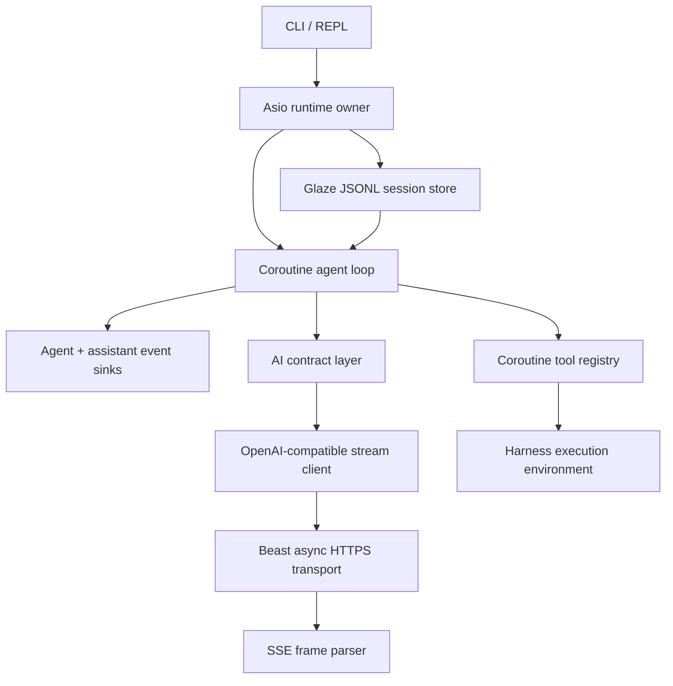
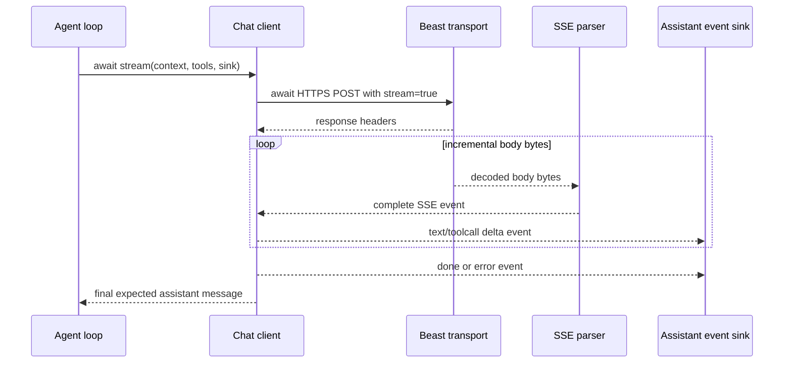
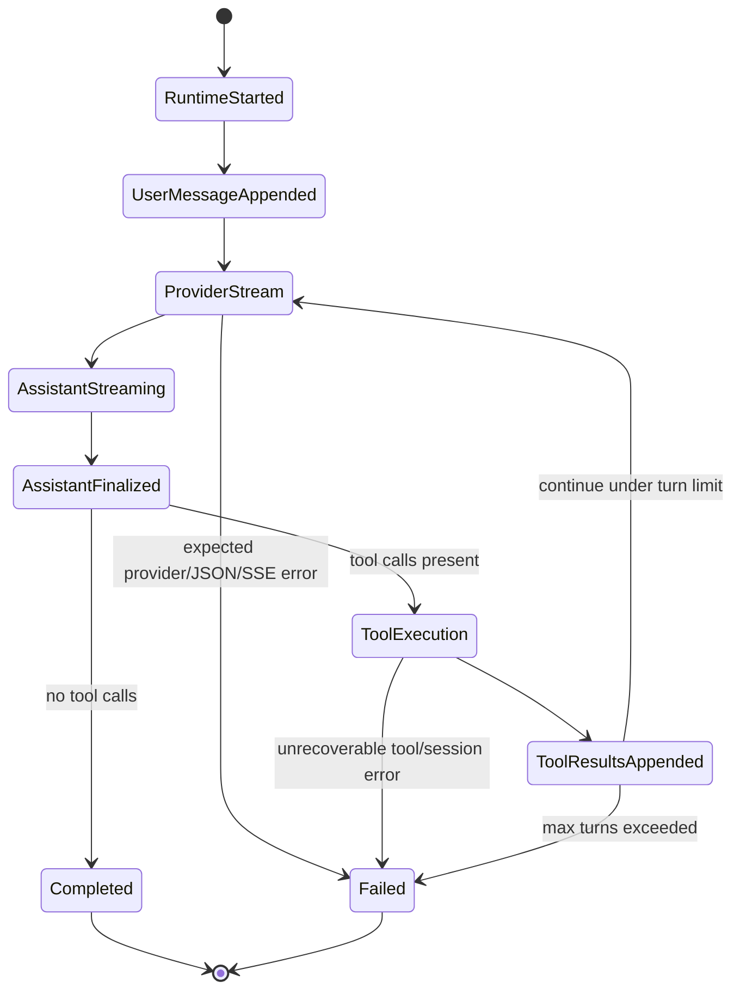
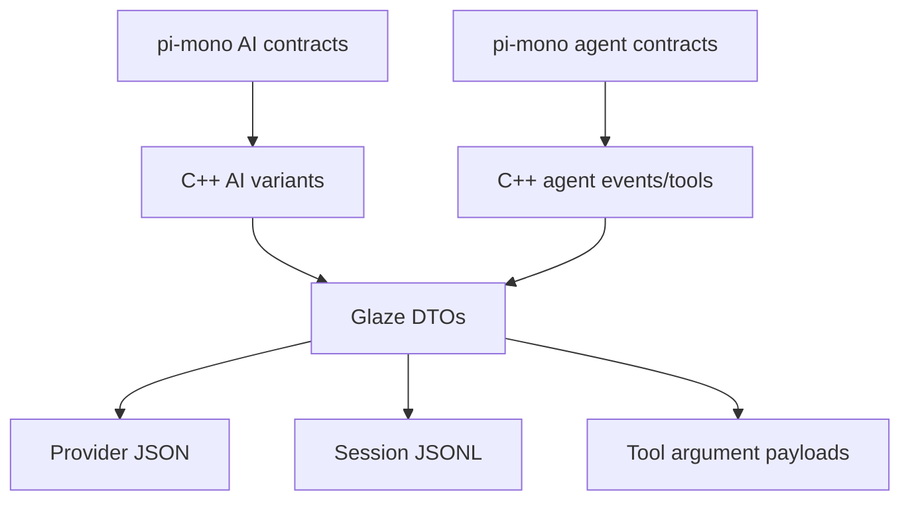

# refactor: Adopt coroutine Glaze agent stack

**Target repo:** `cpp-coding-harness`. Implementation paths below are relative to this repository. Reference paths labeled `pi-mono` are relative to the reference repository.

## Summary

Rebuild the harness around the new experimental stack: C++23 contracts, Boost.Asio coroutine orchestration, Boost.Beast asynchronous HTTPS/SSE transport, Glaze-based JSON serialization, `std::expected` error propagation, `std::variant` message/content unions, and a clean header/source split. This plan intentionally supersedes the previous compatibility-preserving direction: legacy facades and Boost.JSON-shaped APIs may be deleted instead of shimmed.

---

## Problem Frame

The current harness already has a useful pi-inspired split between `ai`, `agent`, and `harness`, but it is still architected like a synchronous MVP: `AgentLoop` returns `util::Result`, provider calls block through `HttpTransport::send`, provider/session/tool JSON is built with `boost::json`, message content uses enum-plus-fields rather than true tagged unions, and `src/llm` / `src/session` remain as compatibility facades.

The new direction is deliberately more ambitious and experimental. The harness should model the core pi contract shape from `pi-mono` while using C++23 strengths: typed value objects serialized by Glaze, coroutine-based async I/O, explicit expected-style failures, and variant-based message bodies. Because backward compatibility is explicitly out of scope, the implementation can replace existing public/internal interfaces instead of preserving transitional adapters.

---

## Requirements

**Stack and dependency contract**

- R1. The project remains a C++23 CMake/vcpkg project and adds Glaze as the JSON serialization/deserialization dependency.
- R2. Boost.JSON is removed from harness-owned JSON contracts; JSON request/response/session/tool payloads are represented as typed structs serialized by Glaze.
- R3. Boost.Asio and Boost.Beast remain the network foundation, but provider transport uses asynchronous operations and coroutine entry points instead of blocking calls.
- R4. `std::expected` replaces the custom `util::Result` pattern for expected failures at network, JSON, session, and tool boundaries.

**AI and agent contract shape**

- R5. AI messages, content blocks, tool calls, tool results, usage, stop reasons, and assistant stream events semantically track the reference contracts in `pi-mono` `packages/ai/src/types.ts`.
- R6. Agent context, lifecycle events, tool execution events, tool result semantics, execution environment errors, and session entries semantically track the reference contracts in `pi-mono` `packages/agent/src/types.ts` and `packages/agent/src/harness/types.ts`.
- R7. TypeScript unions are expressed as C++23 `std::variant` / `std::optional` value types with explicit discriminators where JSON needs stable tags.
- R8. The plan targets semantic parity, not mechanical TypeScript API cloning; names, ownership, and error types should stay idiomatic C++.

**Async provider and streaming behavior**

- R9. The primary model client exposes coroutine-based request APIs that return `boost::asio::awaitable<std::expected<...>>`-style outcomes.
- R10. OpenAI-compatible Chat Completions remains the first provider target, including non-streaming compatibility through the same internal streaming/event path.
- R11. Server-Sent Events are first-class: the transport reads response headers and body incrementally, parses SSE frames as they arrive, emits assistant deltas, and accumulates a final assistant message.
- R12. Timeout, cancellation, TLS verification, malformed HTTP, malformed SSE, malformed provider JSON, and provider error responses are represented as typed expected failures or error assistant events, not uncaught exceptions.

**Tool, session, and CLI behavior**

- R13. Built-in tools become coroutine-compatible and return expected tool results while preserving workspace safety, bash opt-in, timeout, truncation, and redaction intent.
- R14. Tool execution can remain source-order deterministic for file mutation safety, but the contracts should support asynchronous I/O and future controlled concurrency on one `io_context`.
- R15. JSONL sessions are rewritten as typed Glaze session entries; legacy session compatibility can be dropped.
- R16. CLI/REPL wiring runs the `io_context`, subscribes to assistant/agent events, and renders streaming text deltas without coupling presentation to provider wire details.

**Validation and documentation**

- R17. Existing behavior tests are either migrated to the new contracts or replaced by equivalent tests that prove the new stack's intended behavior.
- R18. Tests cover Glaze round-trips, SSE fragmentation, tool-call argument accumulation, async cancellation/timeout paths, tool errors, session entries, and fake-provider end-to-end loops without live network access by default.
- R19. README and architecture notes describe the new stack and explicitly name removed compatibility surfaces and deferred features.
- R20. Public and contract headers live under `include/cch/...`, implementation files live under `src/...`, and any private headers kept under `src/.../detail` are explicitly non-contract internals.

---

## Key Technical Decisions

- KTD1. **Breaking replacement over adapters:** The new plan deletes or rewrites legacy `src/llm`, `src/session`, Boost.JSON DTOs, and `util::Result` surfaces instead of preserving compatibility shims. This matches the experimental/no-backward-compatibility direction and prevents the new architecture from being constrained by MVP interfaces.
- KTD2. **One Asio runtime owns orchestration:** Provider transport, agent loop, and asynchronous tools should run under an explicit `boost::asio::io_context` / executor boundary. Top-level CLI code starts the runtime; lower layers expose `awaitable` APIs rather than creating private event loops.
- KTD3. **Streaming is the canonical provider path:** Implement a stream/event pipeline first and derive `complete` behavior from the final accumulated assistant message. This aligns with pi's `AssistantMessageEventStream` protocol and avoids bolting SSE onto a blocking `send` API later.
- KTD4. **Glaze DTOs are the JSON source of truth:** Define request, response, SSE event, tool schema, and session-entry DTOs as aggregate-friendly C++ structs. Use `glz::meta` or explicit tagged-variant configuration only where JSON field names, union tags, or provider compatibility require it.
- KTD5. **Explicit variant tags beat structural guessing:** Although Glaze can infer some variants, model-visible contracts should use stable `type` / `role` / entry discriminators for content blocks and session entries. This avoids ambiguity when provider payloads evolve or when multiple alternatives share fields.
- KTD6. **Expected failures at subsystem boundaries:** Boost and OpenSSL exceptions/system errors should be caught or converted at the transport boundary; Glaze `error_ctx` should be formatted into JSON parse errors; tools and sessions should return typed errors. Implementation code can still use RAII and local exceptions internally when contained.
- KTD7. **OpenAI-compatible Chat Completions first:** The existing product already targets Chat Completions and the user's tool-call/SSE sketch matches that shape. Responses API, multi-provider registries, OAuth, and provider-specific compatibility matrices are deferred until the core C++ stack is solid.
- KTD8. **Deterministic event ordering with async internals:** Streaming deltas and tool lifecycle events can arrive incrementally, but persisted messages and tool-result appends should remain deterministic. Tool execution may later become concurrent, but file-mutation safety and source-order result insertion are the initial contract.
- KTD9. **Tests drive replacement, not legacy preservation:** Characterization tests should protect user-intent behaviors such as read/edit/bash/session/CLI flows, but they should not require old JSON shapes, old class names, old include paths, or old transcript wording when the new design intentionally changes them.
- KTD10. **Headers and implementations are separated:** Contract headers move to `include/cch/...` so downstream include paths are intentional, while `.cpp` implementations stay under `src/...`. Private implementation-only helpers may use `src/.../detail`, but mixed header/source directories should not remain the default shape.

---

## High-Level Technical Design

### Target component topology



### Provider streaming pipeline



### Agent turn lifecycle



### Typed contract flow



---

## Output Structure

The implementer may refine names while working, but the target shape should make the new stack visible and remove legacy compatibility directories:

```text
include/
  cch/
    ai/
      ChatClient.hpp
      Context.hpp
      Content.hpp
      Error.hpp
      Message.hpp
      StreamEvent.hpp
      Tool.hpp
      Usage.hpp
      glaze/
        AiJson.hpp
        ProviderDtos.hpp
        ToolSchemaDtos.hpp
      providers/
        OpenAIChatClient.hpp
        BoostBeastStreamTransport.hpp
        SseParser.hpp
    agent/
      AgentContext.hpp
      AgentEvent.hpp
      AgentLoop.hpp
      AgentTool.hpp
      ToolRegistry.hpp
    harness/
      ExecutionEnv.hpp
      LocalExecutionEnv.hpp
      session/
        JsonlSessionStore.hpp
        SessionEntry.hpp
    tools/
      OutputLimiter.hpp
      PathGuard.hpp
    util/
      Error.hpp
      Process.hpp
      Redactor.hpp
src/
  ai/providers/
    OpenAIChatClient.cpp
    BoostBeastStreamTransport.cpp
    SseParser.cpp
  agent/
    AgentLoop.cpp
  harness/
    LocalExecutionEnv.cpp
    session/JsonlSessionStore.cpp
  tools/
    BashTool.cpp
    EditFileTool.cpp
    ReadFileTool.cpp
    ToolFactories.cpp
    WriteFileTool.cpp
  main.cpp
tests/
  ai/
  agent/
  harness/
  tools/
  cli/
```

`src/llm/`, `src/session/`, Boost.JSON-specific helpers, and compatibility tests should disappear unless implementation discovers a temporary local migration file is cheaper and deletes it before completion.

---

## Implementation Units

### U1. Replace dependency and error foundations

- **Goal:** Establish the build, dependency, and error-handling base for the new stack before touching higher-level contracts.
- **Requirements:** R1, R2, R4, R17, R19, R20
- **Dependencies:** None
- **Files:**
  - `CMakeLists.txt`
  - `vcpkg.json`
  - `README.md`
  - `src/util/Result.hpp`
  - `include/cch/util/Error.hpp`
  - `tests/util/ExpectedErrorTest.cpp`
  - `tests/TestMain.cpp`
- **Approach:** Add the Glaze vcpkg dependency, remove Boost.JSON as a direct harness JSON dependency, and introduce a small project error taxonomy that works naturally with `std::expected`. Keep Boost.System/OpenSSL dependencies needed by Asio/Beast. Replace the custom `util::Result` pattern from the outside in: new code uses `std::expected`, old code is migrated or deleted by later units.
- **Execution note:** Start with build and compile tests that prove C++23 `std::expected` is available in the selected toolchain before rewriting subsystem APIs.
- **Patterns to follow:** Current strict C++23 CMake settings; pi-mono harness `Result<TValue, TError>` contract in `packages/agent/src/harness/types.ts`; Glaze docs for `read_json` / `write_json` expected-style results and formatted error contexts.
- **Test scenarios:**
  - Configure a clean build with the updated vcpkg manifest; Glaze headers/target are available and Boost.JSON is no longer required by project-owned code.
  - A representative expected failure carries a stable error code plus human-readable detail without throwing.
  - Glaze parse errors convert to the project JSON error type with formatted byte-position context.
  - Existing test binary still builds after the first dependency step, even if many behavior tests are still pending migration.
- **Verification:** The project has a compileable foundation for Glaze and `std::expected`, and no new subsystem code needs `util::Result` or Boost.JSON.

### U2. Model AI contracts as Glaze-backed C++ variants

- **Goal:** Replace enum-plus-field and Boost.JSON message shapes with typed C++23 AI contracts that serialize through Glaze.
- **Requirements:** R2, R5, R7, R8, R10, R17, R18, R20
- **Dependencies:** U1
- **Files:**
  - `include/cch/ai/Content.hpp`
  - `include/cch/ai/Message.hpp`
  - `include/cch/ai/Context.hpp`
  - `include/cch/ai/Tool.hpp`
  - `include/cch/ai/StreamEvent.hpp`
  - `include/cch/ai/Usage.hpp`
  - `include/cch/ai/glaze/AiJson.hpp`
  - `include/cch/ai/glaze/ToolSchemaDtos.hpp`
  - `tests/ai/MessageContractTest.cpp`
  - `tests/ai/ToolContractTest.cpp`
  - `tests/ai/GlazeRoundTripTest.cpp`
- **Approach:** Define `TextContent`, `ThinkingContent`, `ImageContent`, `ToolCallContent`, assistant/user/tool-result messages, usage, stop reasons, and assistant stream events as typed values. Use `std::variant` for content and message unions, `std::optional` for provider metadata, and explicit JSON discriminators for stable Glaze reads/writes. Tool definitions should move away from ad hoc JSON objects toward typed schema DTOs that Glaze serializes.
- **Execution note:** Add contract tests before migrating provider or agent code; these tests become the new source of truth rather than compatibility with old Boost.JSON objects.
- **Patterns to follow:** `pi-mono` `packages/ai/src/types.ts` for `TextContent`, `ThinkingContent`, `ImageContent`, `ToolCall`, `UserMessage`, `AssistantMessage`, `ToolResultMessage`, `AssistantMessageEvent`, `Usage`, and `Context`; Glaze variant and optional documentation.
- **Test scenarios:**
  - A user text message serializes and deserializes with role, content, and timestamp fields intact.
  - An assistant message containing text and a tool call round-trips with content ordering, tool call ID, name, raw/typed arguments, model metadata, usage, and stop reason preserved.
  - A tool-result message round-trips with tool call ID, tool name, content array, details placeholder, and error flag preserved.
  - A malformed or unknown content discriminator produces a typed JSON error rather than selecting the wrong variant alternative.
  - Tool schema DTOs serialize to provider-compatible JSON without requiring Boost.JSON values in public contracts.
- **Verification:** AI contract tests prove Glaze is the JSON engine for model-visible data and that C++ variants preserve pi's semantic contract shape.

### U3. Build coroutine Beast transport and SSE parser

- **Goal:** Replace the blocking HTTP transport with an async HTTPS streaming transport that can feed provider SSE events incrementally.
- **Requirements:** R3, R9, R10, R11, R12, R17, R18, R20
- **Dependencies:** U1, U2
- **Files:**
  - `include/cch/ai/providers/BoostBeastStreamTransport.hpp`
  - `src/ai/providers/BoostBeastStreamTransport.cpp`
  - `include/cch/ai/providers/SseParser.hpp`
  - `src/ai/providers/SseParser.cpp`
  - `include/cch/ai/providers/HttpTransport.hpp`
  - `tests/ai/providers/SseParserTest.cpp`
  - `tests/ai/providers/BoostBeastHttpTransportTest.cpp`
- **Approach:** Introduce an awaitable stream transport that resolves, connects, verifies TLS/SNI, writes the request, reads response headers, and then reads response body chunks incrementally. Beast handles HTTP framing and chunk decoding; the harness-owned SSE parser handles `event:`, `data:`, comments, blank-line dispatch, fragmented frames, `[DONE]`, and malformed provider payloads. Keep the parser separately testable with synthetic byte fragments so default tests do not need network sockets.
- **Execution note:** Build the SSE parser with pure unit tests first, then integrate it with a fake stream transport, then wire the real Beast transport.
- **Patterns to follow:** Boost.Asio coroutine docs for `awaitable`, `co_spawn`, and executor ownership; Boost.Beast docs for async parser stream operations and `async_read_some`; Beast docs note that chunk framing bytes are not application body bytes, so tests should validate parsed body content rather than raw transfer counts.
- **Test scenarios:**
  - SSE parser emits one event when a complete frame arrives in one buffer.
  - SSE parser emits the same event when `data:` lines, CRLF boundaries, and blank dispatch lines are split across many fragments.
  - Multiple `data:` lines in one event are joined according to SSE rules and comments are ignored.
  - `[DONE]` final sentinel ends an OpenAI-compatible stream without requiring an extra JSON object.
  - Malformed JSON inside an SSE data frame becomes a typed provider JSON error with the offending event context.
  - Beast transport maps DNS, connect, TLS verification, write, header read, body read, timeout, cancellation, and non-2xx failures into typed expected errors.
  - Response headers are available before streaming begins so content type and status can gate the SSE parser.
- **Verification:** Transport and parser tests prove streaming can be consumed incrementally and fail predictably without blocking the calling thread.

### U4. Rewrite OpenAI-compatible client around stream events

- **Goal:** Make the provider adapter consume typed AI contracts, serialize requests with Glaze, parse streaming deltas, and produce pi-like assistant events.
- **Requirements:** R5, R8, R9, R10, R11, R12, R17, R18, R20
- **Dependencies:** U2, U3
- **Files:**
  - `include/cch/ai/ChatClient.hpp`
  - `include/cch/ai/providers/OpenAIChatClient.hpp`
  - `src/ai/providers/OpenAIChatClient.cpp`
  - `include/cch/ai/glaze/ProviderDtos.hpp`
  - `tests/ai/providers/OpenAIChatClientTest.cpp`
  - `tests/support/FakeChatClient.hpp`
- **Approach:** Replace `complete(request)` as the primary interface with an awaitable streaming API that accepts context/tools and an assistant-event sink. The client serializes Chat Completions requests with `stream=true`, maps OpenAI `delta.content` and `delta.tool_calls` fragments into `text_delta` and `toolcall_delta` events, accumulates final content/tool calls, and returns the final assistant message. A convenience complete path can subscribe internally and return the final message for tests or non-streaming CLI modes.
- **Execution note:** Use fixture-driven provider tests for fragmented tool-call argument strings before connecting to real network transport.
- **Patterns to follow:** `pi-mono` `packages/ai/src/stream.ts` and `packages/ai/src/utils/event-stream.ts` for stream/result separation; `packages/ai/src/types.ts` for assistant event variants; current provider tests for request/response behavior to re-express as new contract tests.
- **Test scenarios:**
  - A typed context and tool list serialize to an OpenAI-compatible streaming request body with model, messages, tools, and redacted content.
  - Text deltas emit start, text start, text delta, text end, and done events while accumulating a final assistant message.
  - Tool call deltas split across several SSE frames accumulate the correct ID, name, raw argument string, typed arguments, and `toolUse` stop reason.
  - Provider usage metadata, response ID, response model, and stop reason are captured when present and omitted safely when absent.
  - A provider error frame or malformed final tool arguments emits an error event/failure that the agent loop can surface without throwing.
  - The convenience complete API returns the same final assistant message as the streaming event path.
- **Verification:** Provider behavior is expressed entirely in terms of typed AI contracts and assistant events; no agent code needs OpenAI wire-shape knowledge.

### U5. Rebuild the agent loop as an awaitable event pipeline

- **Goal:** Convert the synchronous agent loop into a coroutine-driven loop that consumes streaming assistant events, executes awaitable tools, and emits semantic agent lifecycle events.
- **Requirements:** R6, R9, R12, R13, R14, R16, R17, R18, R20
- **Dependencies:** U2, U4
- **Files:**
  - `include/cch/agent/AgentLoop.hpp`
  - `src/agent/AgentLoop.cpp`
  - `include/cch/agent/AgentContext.hpp`
  - `include/cch/agent/AgentEvent.hpp`
  - `include/cch/agent/AgentTool.hpp`
  - `include/cch/agent/ToolRegistry.hpp`
  - `tests/agent/AgentLoopTest.cpp`
  - `tests/agent/AgentEventTest.cpp`
  - `tests/agent/AsyncAgentLoopTest.cpp`
- **Approach:** Make `AgentLoop` an awaitable operation that appends user messages, streams assistant responses, mirrors assistant stream updates into `message_update` events, finalizes assistant messages, executes tool calls, appends tool results in deterministic order, and continues until stop/max-turn/failure. Replace stringly loop events with typed agent events modeled after pi. Keep presentation sinks and session sinks as subscribers rather than embedded behavior.
- **Execution note:** Drive the loop with a fake streaming chat client before real provider transport is involved.
- **Patterns to follow:** `pi-mono` `packages/agent/src/agent-loop.ts` for `agent_start`, `turn_start`, `message_start`, `message_update`, `message_end`, `tool_execution_start`, `tool_execution_end`, `turn_end`, and `agent_end`; current agent loop tests for fake tool-call feedback behavior.
- **Test scenarios:**
  - A fake streaming text response emits agent start, turn start, message start/update/end, turn end, and agent end in deterministic order.
  - A fake streaming tool call triggers tool execution, appends a tool-result message with the matching call ID, and starts the next provider stream.
  - Unknown tool, malformed arguments, blocked tool, and tool expected failure become error tool-result messages instead of loop crashes.
  - Max-turn exhaustion returns a typed failure and emits a terminal event.
  - Cancellation during provider streaming emits an aborted/error path and leaves no half-written session entry.
  - Streaming text deltas can be rendered by a CLI sink before the final assistant message is complete.
- **Verification:** The agent loop can be run under one `io_context` with fake async clients/tools and exposes the semantic event stream needed by CLI and future TUI surfaces.

### U6. Convert tools and execution environment to awaitable contracts

- **Goal:** Make built-in tools and harness execution capabilities coroutine-compatible while preserving the safety posture of file and shell operations.
- **Requirements:** R6, R13, R14, R17, R18, R20
- **Dependencies:** U1, U5
- **Files:**
  - `include/cch/harness/ExecutionEnv.hpp`
  - `include/cch/harness/LocalExecutionEnv.hpp`
  - `src/harness/LocalExecutionEnv.cpp`
  - `src/tools/ReadFileTool.cpp`
  - `src/tools/WriteFileTool.cpp`
  - `src/tools/EditFileTool.cpp`
  - `src/tools/BashTool.cpp`
  - `src/tools/ToolFactories.cpp`
  - `include/cch/tools/PathGuard.hpp`
  - `include/cch/tools/OutputLimiter.hpp`
  - `include/cch/util/Process.hpp`
  - `tests/harness/LocalExecutionEnvTest.cpp`
  - `tests/tools/FileToolsTest.cpp`
  - `tests/tools/BashToolTest.cpp`
- **Approach:** Change `ExecutionEnv` and `AgentTool` operations to return awaitable expected results. File tools may use immediate completion or executor-posted work where appropriate; shell execution should honor timeout/cancellation and stream or capture output through a safe process boundary. Tool argument structs should be read by Glaze, not Boost.JSON, and validation failures should produce error tool results.
- **Execution note:** Migrate one tool at a time with its existing safety tests rewritten to the new async/Glaze contract.
- **Patterns to follow:** Current `PathGuard`, `OutputLimiter`, and tool tests for workspace containment and deterministic errors; `pi-mono` `packages/agent/src/harness/types.ts` for `FileSystem`, `Shell`, `ExecutionEnv`, and stable error-code concepts.
- **Test scenarios:**
  - `read_file` argument JSON deserializes into a typed argument struct and reads only within the workspace.
  - `write_file` and `edit_file` preserve parent validation, final symlink escape rejection, exact replacement behavior, and stable errors under the awaitable interface.
  - `bash` remains disabled unless explicitly enabled and returns a typed shell-unavailable error result when blocked.
  - Enabled `bash` handles stdout/stderr, non-zero exit, timeout, cancellation, truncation, and sanitized environment without leaking provider credentials.
  - A fake execution environment can drive all tool tests without real filesystem mutation or process launch except in targeted integration tests.
  - Tool result content is redacted before provider-visible context or session persistence receives it.
- **Verification:** Built-in tools are coroutine-compatible and retain the safety behavior that matters, without carrying Boost.JSON argument objects through the agent layer.

### U7. Rewrite sessions, CLI runtime, and remove legacy surfaces

- **Goal:** Wire the new async contracts into durable sessions and CLI/REPL execution, then delete obsolete compatibility directories and documentation claims.
- **Requirements:** R15, R16, R17, R18, R19, R20
- **Dependencies:** U4, U5, U6
- **Files:**
  - `src/main.cpp`
  - `include/cch/harness/session/SessionEntry.hpp`
  - `include/cch/harness/session/JsonlSessionStore.hpp`
  - `src/harness/session/JsonlSessionStore.cpp`
  - `src/session/JsonlSessionStore.hpp`
  - `src/session/JsonlSessionStore.cpp`
  - `src/llm/ChatClient.hpp`
  - `src/llm/OpenAIChatClient.hpp`
  - `src/llm/OpenAIChatClient.cpp`
  - `src/llm/BoostBeastHttpTransport.hpp`
  - `src/llm/BoostBeastHttpTransport.cpp`
  - `tests/harness/session/JsonlSessionStoreTest.cpp`
  - `tests/session/JsonlSessionStoreTest.cpp`
  - `tests/cli/CliSmokeTest.cpp`
  - `README.md`
  - `CMakeLists.txt`
- **Approach:** Replace linear legacy session records with Glaze-serialized session entries aligned to message, model-change, tool-change, and future custom-entry concepts. Update CLI startup to create the `io_context`, co-spawn the run, subscribe to streaming/agent events, and render text deltas/tool events. Delete legacy include paths and tests that only existed for backward compatibility. Update README to make the breaking stack, streaming behavior, and removed Boost.JSON/facade surfaces explicit.
- **Execution note:** Treat old sessions as disposable for this experimental project; do not spend implementation time on legacy readers unless a test identifies a non-negotiable development workflow.
- **Patterns to follow:** `pi-mono` `packages/agent/src/harness/types.ts` for session entry concepts; current CLI smoke tests for fake-provider usability, rewritten around event streaming rather than stable old transcript lines.
- **Test scenarios:**
  - A fake streaming CLI run prints incremental assistant text and terminal completion from one `io_context`-owned execution.
  - A tool-call CLI run prints tool lifecycle events and final assistant text while session entries are appended in deterministic order.
  - A new Glaze JSONL session round-trips message entries, model metadata, active tool names, and future unknown/custom entries according to the new policy.
  - Malformed new-format session JSON reports a typed session error with line/entry context.
  - Legacy `src/llm` and `src/session` include paths no longer compile in project tests, confirming compatibility facades were removed.
  - README setup, architecture, tools, sessions, safety, and deferred-feature sections match the new stack.
- **Verification:** The executable runs through the new async architecture, persists new typed sessions, and exposes no old Boost.JSON/facade contracts as supported surfaces.

---

## Scope Boundaries

### In scope

- Replacing Boost.JSON-owned contracts with Glaze-owned typed DTOs.
- Replacing synchronous provider and agent interfaces with Asio coroutine interfaces.
- Implementing OpenAI-compatible streaming over Boost.Beast HTTPS and a harness-owned SSE parser.
- Rewriting tests around new async/typed contracts instead of preserving old public APIs.
- Deleting compatibility facades and legacy session compatibility.
- Updating README and build/dependency documentation for the new stack.
- Separating contract headers under `include/cch/...` from implementation files under `src/...`.

### Deferred to Follow-Up Work

- Multi-provider registry, OAuth/subscription login, model catalog UX, and provider-specific compatibility matrices.
- OpenAI Responses API, Anthropic/Gemini-native stream mapping, or gateway-specific thinking/cache semantics beyond safe placeholders.
- Rich TUI rendering, editor integration, visual diffs, and background process supervision.
- Parallel tool execution beyond contract support and deterministic source-order result insertion.
- Session tree navigation, compaction, branch summaries, labels, and cross-session search.
- OS-level sandboxing, permission prompts, container isolation, and network egress policy.
- C++ modules or source-wide C++23 modernization unrelated to the new stack.

### Outside this refactor's identity

- Preserving old include paths, JSON shapes, CLI transcript wording, or session readers for downstream users.
- Replacing Boost.Asio/Beast with another HTTP runtime.
- Adding a second JSON library for convenience while Glaze is meant to own JSON parsing/serialization.

---

## System-Wide Impact

This is a cross-cutting rewrite of the harness core. It affects build dependencies, AI/provider DTOs, network transport, the agent loop, tool execution, session storage, CLI runtime, and tests. The implementation should expect broad compile breakage early and restore behavior through new typed seams rather than patching old adapters.

The most important architectural shift is runtime ownership. Code that currently creates a private `io_context` or blocks on HTTP must become executor-aware so the harness can eventually multiplex provider streaming, tool execution, CLI rendering, and cancellation on one event loop.

The security posture remains local-harness safety rather than sandboxing. Workspace containment, bash opt-in, redaction, and session sensitivity still matter, but this plan does not create OS-level isolation.

---

## Risks & Dependencies

- **Risk: Glaze variant ambiguity.** Structural variant deduction can pick surprising alternatives when payloads share fields. Mitigation: use explicit discriminators for model-visible content and session entries.
- **Risk: Asio exception leakage.** `co_await` on Boost async operations can throw `system_error` depending on completion token usage. Mitigation: standardize error-code/as-tuple or boundary conversion patterns and test failure paths.
- **Risk: SSE/chunk confusion.** HTTP chunk boundaries are not SSE event boundaries, and Beast transfer counts include protocol framing. Mitigation: separate HTTP body decoding from SSE parsing and test fragmented inputs aggressively.
- **Risk: tool-call delta reconstruction.** OpenAI-compatible streams may split tool names and JSON argument strings across many frames. Mitigation: accumulator tests should cover split arguments, multiple calls, malformed final JSON, and stop reason mapping.
- **Risk: broad rewrite hides behavior regressions.** Removing compatibility is allowed, but core harness behaviors can still regress. Mitigation: rewrite tests around user-intent acceptance examples rather than old APIs.
- **Risk: compiler/library support variance.** `std::expected`, Glaze reflection, and Boost coroutine examples depend on modern compiler and Boost versions. Mitigation: validate the actual vcpkg toolchain early and document practical compiler requirements.
- **Dependency: Glaze vcpkg package.** External research shows a `glaze` vcpkg port is available; implementation should verify the package target and version in the local vcpkg baseline before finalizing CMake names.

---

## Acceptance Examples

- AE1. Given a fake streaming provider emits text deltas, when the CLI runs one prompt, then the user sees incremental assistant text and the final session contains one finalized assistant message.
- AE2. Given a fake provider emits a tool call whose JSON arguments are split across multiple SSE frames, when the agent loop completes the turn, then it reconstructs typed arguments, executes the tool, appends the matching tool result, and continues with the next provider request.
- AE3. Given malformed provider JSON in an SSE `data:` frame, when the stream client processes it, then the assistant event stream terminates with a typed error and no uncaught exception leaves the coroutine.
- AE4. Given a file edit request with ambiguous `old_text`, when the typed async `edit_file` tool runs, then it returns an error tool result and leaves the file unchanged.
- AE5. Given a command exceeds the configured timeout, when the async shell capability runs it, then cancellation/timeout is represented as a typed shell error and the agent loop can append an error tool result.
- AE6. Given a new Glaze JSONL session file, when the CLI resumes it, then message order, tool-call linkage, model metadata, and redacted content are reconstructed according to the new session contract.
- AE7. Given a source file includes an old `src/llm` or `src/session` compatibility header, when project tests compile, then the include fails or the test is updated to the new `ai` / `harness` path, proving old facades are gone.

---

## Documentation / Operational Notes

- README should describe the stack as `C++23 + Boost.Asio/Beast + Glaze`, not `Boost.JSON` or synchronous transport.
- README or architecture notes should explain that contract headers live under `include/cch/...` and implementations live under `src/...`.
- README should show fake streaming runs as the default developer smoke path and keep live provider calls opt-in.
- The session section should state that new JSONL files are not backward-compatible with earlier experimental sessions.
- The safety section should keep the existing warning that workspace guards are not a sandbox and provider-visible prompts/tool outputs remain sensitive.
- Build docs should name Glaze and any practical compiler floor discovered during implementation validation.

---

## Deferred Implementation Notes

- Exact CMake target names for Glaze should be verified from the local vcpkg installation during implementation.
- If Boost.Process async integration is thinner than expected, wrap process execution behind the awaitable shell capability and keep the implementation detail contained; do not leak a blocking process API into tool contracts.
- If the compiler's `std::expected` support is insufficient, stop and report the toolchain issue rather than reintroducing a project-specific `Result` as a silent substitute.
- If OpenAI-compatible streaming fixtures reveal a provider-specific field not covered here, add it as a provider DTO detail, not a change to agent-level contracts unless pi semantic parity requires it.

---

## Sources & Research

- Current build and dependency surface: `CMakeLists.txt`, `vcpkg.json`, `README.md`.
- Current synchronous/provider surfaces: `src/agent/AgentLoop.hpp`, `src/agent/AgentLoop.cpp`, `src/ai/providers/OpenAIChatClient.cpp`, `src/ai/providers/BoostBeastHttpTransport.cpp`, `src/ai/Content.hpp`, `src/ai/Message.hpp`, `src/agent/Message.hpp`, `src/util/Result.hpp`.
- Current tests to migrate by intent: `tests/agent/AgentLoopTest.cpp`, `tests/ai/MessageContractTest.cpp`, `tests/ai/providers/OpenAIChatClientTest.cpp`, `tests/harness/session/JsonlSessionStoreTest.cpp`, `tests/tools/FileToolsTest.cpp`, `tests/tools/BashToolTest.cpp`, `tests/cli/CliSmokeTest.cpp`.
- Prior local plans superseded by this one: `docs/plans/2026-06-10-001-refactor-align-pi-contracts-plan.md`, `docs/plans/2026-06-10-002-chore-cpp23-dev-environment-plan.md`.
- Reference AI contracts: `pi-mono` `packages/ai/src/types.ts`, `packages/ai/src/stream.ts`, `packages/ai/src/utils/event-stream.ts`, `packages/ai/src/providers/openai-completions.ts`.
- Reference agent/harness contracts: `pi-mono` `packages/agent/src/types.ts`, `packages/agent/src/agent-loop.ts`, `packages/agent/src/harness/types.ts`, `packages/agent/src/harness/session/jsonl-storage.ts`.
- Glaze documentation: `https://stephenberry.github.io/glaze/`, `https://stephenberry.github.io/glaze/json/`, `https://github.com/stephenberry/glaze/blob/main/docs/variant-handling.md`.
- Glaze vcpkg package reference: `https://vcpkg.io/en/package/glaze.html`.
- Boost.Asio coroutine documentation: `https://www.boost.org/doc/libs/latest/doc/html/boost_asio/overview/composition/cpp20_coroutines.html`.
- Boost.Beast parser and streaming documentation: `https://www.boost.org/doc/libs/latest/libs/beast/doc/html/beast/using_http/parser_stream_operations.html`, `https://www.boost.org/doc/libs/latest/libs/beast/doc/html/beast/ref/boost__beast__http__async_read_some.html`, `https://www.boost.org/doc/libs/latest/libs/beast/doc/html/beast/using_http/chunked_encoding.html`.
- Beast SSE scope note: `https://github.com/boostorg/beast/issues/1097` confirms SSE framing is application-level work above Beast HTTP parsing.
