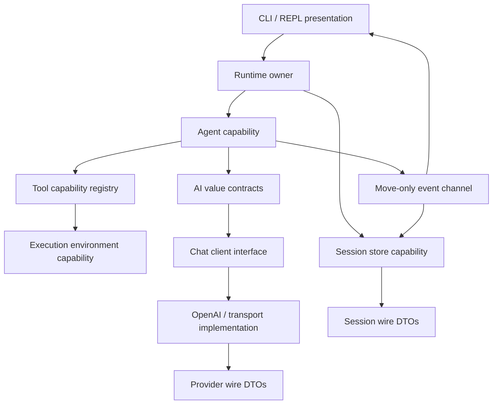
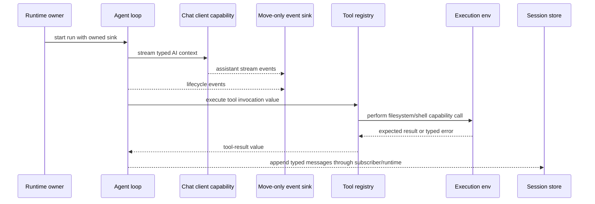
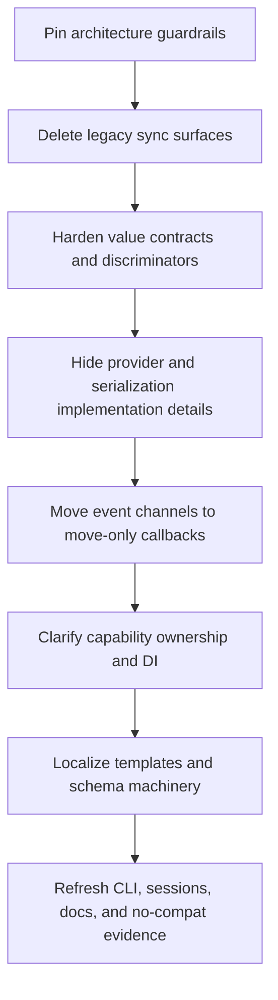

# refactor: Apply anti-fragile Modern C++ architecture

**Target repo:** `cpp-coding-harness`. All implementation paths below are relative to this repository.

## Summary

Refactor the experimental C++ coding harness around four anti-fragile architecture rules: passive value contracts, explicit capability firewalls, move-only weak event connections, and localized generic machinery. The plan intentionally allows breaking changes: legacy sync facades, compatibility flags, old session/API shapes, and copyable callback assumptions may be removed when they conflict with the new architecture.

---

## Problem Frame

The harness has already moved toward a C++23 coroutine/Glaze stack with `include/cch/...` contracts, typed messages, `std::expected` error propagation, and Boost.Asio/Beast provider transport. That work gives the project a strong base, but several brittle seams remain: public headers still expose copyable `std::function` callbacks, Boost/Glaze/provider details leak across contract boundaries, `include/cch` and `src` contain duplicate old/new contract surfaces, synchronous `util::Result` and Boost.JSON tool code remain reachable, and ownership is often expressed through `std::shared_ptr` even where one component should own the capability.

The user's direction is explicitly experimental and non-compatible. The goal is not to preserve previous public or internal interfaces; it is to make the codebase resilient to change by controlling information entropy. After this refactor, data should be easy to inspect and serialize, capabilities should be replaceable behind physical seams, events should not impose receiver ownership, and templates/Concepts should stay inside local implementation machinery rather than spreading through public APIs.

---

## Requirements

**Value contracts and deterministic data**

- R1. Public model, agent, tool, session, and error contracts are passive value types: aggregate-friendly structs, `std::variant` for explicit alternatives, `std::expected` for expected failures, and no hidden behavior in data objects.
- R2. Active JSON contracts are typed Glaze DTO conversions at serialization boundaries; Boost.JSON and the old `util::Result` pattern are removed from active harness-owned contracts.
- R3. Every public variant-bearing contract has discriminator tests that prove valid round-trips, unknown-discriminator failures, malformed payload failures, and source-order preservation where order is meaningful.

**Capability firewalls and dependency isolation**

- R4. Behavioral capabilities cross module boundaries through pure virtual interfaces or pImpl-style concrete classes, not public templates, public Concepts, or provider-specific concrete types.
- R5. Public headers under `include/cch/...` do not expose legacy `src/...` headers, Boost.JSON DTOs, provider implementation details, process runner internals, or local parsing helpers.
- R6. The build no longer treats `src` as a public include surface; implementation-only helpers live in `.cpp` files or clearly private `detail` headers.
- R7. Legacy synchronous tools, old message/tool/session headers, compatibility adapters, and no-op compatibility flags are deleted or replaced rather than shimmed.

**Weak event connections and ownership**

- R8. Agent, assistant-stream, and transport-body event sinks use move-only callback semantics so subscribers can capture unique resources without forcing shared ownership or copyability.
- R9. Event producers emit semantic lifecycle/data events and do not depend on subscriber classes; CLI printing, session persistence, and tests subscribe without leaking presentation concerns back into the agent/provider layers.
- R10. Capability ownership is explicit: registries and factories prefer single ownership for tools and clients; shared ownership remains only where a capability is deliberately shared across independent objects.

**Localized generic machinery**

- R11. Templates, Concepts, overload helpers, Glaze meta customization, and schema-generation machinery stay inside `.cpp` files or private detail layers unless they are simple standard vocabulary aliases.
- R12. Public APIs remain readable non-template contracts even when private implementations use generic parsing, variant visitors, or future reflection-assisted schema generation.

**Validation and documentation**

- R13. Tests protect the new architecture's intended behavior and safety properties, not old class names, old JSONL layouts, old transcript wording, or old include paths.
- R14. README and architecture notes document the breaking experimental posture, the four anti-fragile rules, removed compatibility surfaces, and C++26 ideas that remain deferred extension points.

---

## Key Technical Decisions

- KTD1. **Breaking replacement over compatibility scaffolding:** Remove stale surfaces instead of adapting them. The current project is an experiment, and keeping old `src` headers, Boost.JSON tools, `util::Result`, and compatibility CLI flags would preserve the entropy this refactor is meant to delete.
- KTD2. **Data owns facts; boundaries own behavior:** AI messages, tool invocations, session entries, usage, errors, and lifecycle events stay as passive value contracts. Provider mapping, parsing, filesystem/process behavior, and printing live behind dedicated conversion or capability boundaries.
- KTD3. **Pure virtual for capabilities, pImpl for concrete implementation hiding:** Interfaces such as chat client, stream transport, execution environment, session store, and tool execution remain behavioral seams. Concrete OpenAI/Boost/Glaze/local implementations should hide implementation dependencies from consumers through pImpl or private implementation headers.
- KTD4. **Move-only callback alias as the event contract:** Replace public `std::function` sinks with a project-level move-only callback vocabulary based on `std::move_only_function` when the toolchain supports `__cpp_lib_move_only_function`. If support is missing, isolate the fallback behind one project callback wrapper rather than reverting public APIs to `std::function`.
- KTD5. **No public Concepts/templates across architecture seams:** Concepts remain useful for local algorithms and compile-time diagnostics inside implementation code. They should not become the public shape of agent, provider, execution environment, or tool contracts because that couples callers to implementation types and increases rebuild/type-complexity pressure.
- KTD6. **Serialization is an adapter layer, not the domain model:** Glaze DTOs may be typed and explicit, but provider/session wire shapes should not define the in-memory domain contract. Conversion functions and tests mediate between stable value contracts and wire-specific DTOs.
- KTD7. **C++26 is design pressure, not an implementation dependency:** Static reflection and `std::execution` senders/receivers should influence where seams are placed, but this plan should not require an unreleased standard library feature to ship.
- KTD8. **Architecture tests are first-class:** Add compile/contract tests that fail when public headers leak private dependencies, copy-only callback assumptions return, or legacy Boost.JSON/`util::Result` surfaces remain in active code.

---

## High-Level Technical Design

### Target boundary topology

The public contract surface is the middle band: `AI`, `Agent`, `Tools`, `Env`, `Sessions`, and event value types. Provider wire DTOs, Glaze metadata, Boost.Beast operations, and local filesystem/process details sit below capability firewalls.

### Event and ownership flow

No event sender knows the concrete receiver. Subscribers may own unique resources because the event callback is move-only. Session persistence can be wired as a subscriber/runtime concern instead of being embedded into the agent loop.

### Refactor sequence

This sequence removes duplicate surfaces early, then tightens contracts, then changes event and ownership semantics after the active contract set is clear.

---

## Scope Boundaries

**In scope**

- Rewriting public/internal contract shapes, include boundaries, tool factories, event sinks, provider/session adapters, and tests when needed to enforce the four anti-fragile rules.
- Deleting old compatibility surfaces, including legacy synchronous `src` headers, `util::Result`, Boost.JSON-backed tool contracts, no-op compatibility flags, and tests that only protect old API names.
- Updating README/architecture notes so future work understands the experimental non-compatible posture.

### Deferred to Follow-Up Work

- C++26 static-reflection-driven schema generation after compiler/library support is practical in this project.
- `std::execution` senders/receivers adoption for the whole async graph; current work should leave seams ready without replacing Boost.Asio coroutines yet.
- A full plugin/extension system, multi-provider registry, OAuth, subagent orchestration, or production sandbox.
- ABI-stable binary distribution. This plan uses ABI-firewall thinking to control dependencies, not to promise a stable third-party SDK.

---

## System-Wide Impact

This refactor changes almost every architectural seam: public includes, provider transport, agent events, tool execution, session persistence, tests, and README contracts. The largest reviewer impact is that old behavior-preservation checks should be interpreted through safety and learning intent rather than compatibility. The largest implementer impact is sequencing: delete/replace stale surfaces only after the new contract tests exist, but do not spend time building adapters whose only purpose is old compatibility.

| Surface                         | Impact                                                                                           | Plan response                                                                |
| ------------------------------- | ------------------------------------------------------------------------------------------------ | ---------------------------------------------------------------------------- |
| Public headers                  | Consumers should see value contracts and capability interfaces, not implementation dependencies. | U1 and U4 add boundary tests and hide provider/serialization details.        |
| Agent/provider events           | Callback ownership changes from copyable to move-only.                                           | U5 adds move-only sink tests before migrating signatures.                    |
| Tools and execution environment | Tool registry ownership and execution environment sharing become explicit.                       | U6 separates owned tools from deliberately shared capabilities.              |
| Sessions and CLI                | Old JSONL/transcript compatibility can change.                                                   | U8 rewrites tests/docs around new semantic behavior rather than old strings. |
| Build system                    | `src` stops being a public include surface.                                                      | U1/U2 update CMake and remove tests that depend on private headers.          |

---

## Dependencies / Prerequisites

- A C++23-capable compiler and standard library with `std::expected` support. The project already uses `std::expected` through `include/cch/util/Error.hpp`.
- Prefer standard-library `std::move_only_function` support (`__cpp_lib_move_only_function`), with a single project-local fallback only if the current compiler/stdlib blocks compilation.
- CMake updates must keep default tests buildable without live provider access.
- Glaze remains the typed JSON dependency; Boost.Asio/Beast/OpenSSL remain implementation dependencies for transport unless a later plan replaces the network spine.

---

## Alternative Approaches Considered

- **Small cleanup on top of the current stack:** Lower risk in the short term, but it would leave duplicate contracts, copyable callback assumptions, public implementation leaks, and compatibility flags in place. Rejected because the user explicitly wants bold experimental change.
- **Full new framework rewrite:** Could produce a cleaner tree, but it would discard useful tested behavior around tool safety, SSE parsing, sessions, and CLI smoke flows. Rejected in favor of a breaking in-repo refactor that keeps the executable learning harness alive.
- **Public Concepts/template-first API:** Attractive for local generic algorithms, but poor as a module boundary because it exposes implementation types, increases rebuild pressure, and creates a type maze for consumers. Rejected for public seams; allowed privately.
- **Compatibility adapter migration:** Useful for production code, but counterproductive here. Rejected because compatibility is out of scope and adapters would obscure whether the new architecture is actually simpler.

---

## Risks & Mitigations

- **Risk: Callback migration breaks coroutine lifetimes.** Mitigation: add move-only sink tests before changing agent/provider signatures, including callbacks that capture unique state and callbacks that intentionally return errors.
- **Risk: Removing `src` from public includes exposes hidden dependencies.** Mitigation: add public-header compile tests and update CMake in a dedicated unit before deleting large legacy clusters.
- **Risk: Glaze/provider DTOs leak into domain contracts under time pressure.** Mitigation: keep DTO conversion tests close to provider/session tests and require domain contract tests to compile without provider DTO headers.
- **Risk: Tool ownership changes accidentally shorten environment lifetimes.** Mitigation: test multiple tools sharing one execution environment and one tool registry owning tools without shared ownership cycles.
- **Risk: Breaking session/CLI compatibility confuses future readers.** Mitigation: README names the removed surfaces and documents the new experimental contract clearly.
- **Risk: pImpl overuse hides simple value data behind unnecessary indirection.** Mitigation: apply pImpl only to concrete behavior implementations with dependency-heavy private state; keep data contracts as visible structs and variants.
- **Risk: Architecture scan tests become noisy source linters.** Mitigation: keep scans focused on boundary invariants that matter to this plan, and put nuanced design review in code review rather than brittle token bans.
- **Risk: Removing compatibility flags changes user-facing examples abruptly.** Mitigation: update CLI smoke tests and README examples in the same unit that removes the flags so documentation and executable behavior move together.

---

## Acceptance Examples

- AE1. A test-only event sink captures a `std::unique_ptr`-owned counter, receives assistant and agent lifecycle events during a fake run, and proves the sink did not need copyability or shared ownership.
- AE2. A minimal consumer test includes public `include/cch/...` headers without adding `src` to the include path and without including Boost.JSON-backed legacy headers.
- AE3. A malformed or unknown content/session discriminator returns a typed `std::expected` error with context, while valid content alternatives round-trip in source order.
- AE4. A fake model requests a file tool, the agent routes the tool invocation through the capability interface, the execution environment returns a typed result, and the next model request receives a typed tool-result message.
- AE5. CLI smoke coverage demonstrates the new event/subscriber path and updated session behavior without relying on old transcript wording or compatibility-only flags.

---

## Implementation Units

### U1. Establish architecture guardrails

- **Goal:** Make the target boundary rules executable before broad rewrites begin.
- **Requirements:** R4, R5, R6, R11, R12, R13.
- **Dependencies:** None.
- **Files:**
  - `CMakeLists.txt`
  - `include/cch/...`
  - `src/...`
  - `tests/architecture/PublicHeaderBoundaryTest.cpp` (create)
  - `tests/architecture/ArchitectureSurfaceScanTest.cpp` (create)
- **Approach:** Add focused architecture tests that describe the desired surface: public headers compile from `include` without `src`, implementation-only helpers are not required by public consumers, and known legacy tokens are absent from active public contracts. Keep these tests narrow enough to guide the refactor without becoming a brittle full-source linter.
- **Execution note:** Start test-first; the first failing tests should express the new architecture rules, not old behavior preservation.
- **Patterns to follow:** Existing contract tests in `tests/ai/MessageContractTest.cpp` and `tests/ai/ToolContractTest.cpp` are good examples of executable contract documentation.
- **Test scenarios:**
  - Build a minimal public consumer that includes representative AI, agent, harness, tool, and provider interfaces with only `include` on the public include path; expect compilation to succeed.
  - Scan public headers for legacy dependency markers such as Boost.JSON-backed tool contracts and old result wrappers; expect no active public contract to require them.
  - Verify CMake still builds the normal test binary after public/private include boundaries are tightened.
- **Verification:** Public/private boundary tests fail before the refactor and pass after the active surface is isolated.

### U2. Collapse legacy synchronous surfaces

- **Goal:** Delete duplicate old contract paths so the new architecture has one source of truth.
- **Requirements:** R2, R5, R6, R7, R13.
- **Dependencies:** U1.
- **Files:**
  - `src/agent/AgentContext.hpp` (remove or merge)
  - `src/agent/AgentEvent.hpp` (remove or merge)
  - `src/agent/AgentTool.hpp` (remove or merge)
  - `src/agent/Message.hpp` (remove or merge)
  - `src/agent/Tool.hpp` (remove)
  - `src/agent/ToolRegistry.hpp` (remove or merge)
  - `src/ai/ChatClient.hpp` (remove or merge)
  - `src/ai/Content.hpp` (remove or merge)
  - `src/ai/Context.hpp` (remove or merge)
  - `src/ai/Message.hpp` (remove or merge)
  - `src/ai/StopReason.hpp` (remove or merge)
  - `src/ai/Tool.hpp` (remove or merge)
  - `src/harness/ExecutionEnv.hpp` (remove)
  - `src/harness/LocalExecutionEnv.hpp` (remove or make private implementation detail)
  - `src/harness/session/JsonlSessionStore.hpp` (remove or merge)
  - `src/harness/session/SessionEntry.hpp` (remove or merge)
  - `src/tools/ToolFactories.cpp`
  - `src/tools/Tools.hpp` (remove)
  - `src/tools/ReadFileTool.cpp` (remove)
  - `src/tools/WriteFileTool.cpp` (remove)
  - `src/tools/EditFileTool.cpp` (remove)
  - `src/tools/BashTool.cpp` (remove)
  - `src/util/JsonSchema.hpp` (remove)
  - `src/util/Result.hpp` (remove)
  - `tests/tools/FileToolsTest.cpp` (replace or remove)
  - `tests/tools/BashToolTest.cpp` (replace or remove)
  - `tests/harness/LocalExecutionEnvTest.cpp` (replace or remove)
- **Approach:** Remove the synchronous Boost.JSON/`util::Result` path from active code and migrate any still-valuable behavioral checks onto the async `include/cch` contracts. The point is not to keep old APIs alive; it is to preserve useful safety intent such as workspace containment, exact edit semantics, redaction, and bash opt-in.
- **Execution note:** Characterize safety intent before deletion, but do not preserve old include paths, object names, or JSON shapes.
- **Patterns to follow:** `tests/tools/AsyncToolsTest.cpp` and `tests/harness/AsyncLocalExecutionEnvTest.cpp` already exercise the newer coroutine-compatible path.
- **Test scenarios:**
  - Include and link tests no longer reference `src/tools/Tools.hpp`, `src/harness/ExecutionEnv.hpp`, or `src/util/Result.hpp`; expect removed headers to be absent from active compilation.
  - Safety behaviors from removed synchronous tests still exist on the async path: workspace escape rejection, ambiguous edit rejection, bash-disabled rejection, and redacted command output.
  - CMake source lists no longer compile deleted synchronous tool files; the test suite still builds against async factories.
- **Verification:** Active source and test targets compile without old result wrappers, old synchronous tool classes, or Boost.JSON tool schemas.

### U3. Harden value contracts as passive variants

- **Goal:** Make data contracts deterministic, inspectable, aggregate-friendly, and explicit about every state branch.
- **Requirements:** R1, R2, R3, R11, R12.
- **Dependencies:** U1, U2.
- **Files:**
  - `include/cch/ai/Content.hpp`
  - `include/cch/ai/Message.hpp`
  - `include/cch/ai/Context.hpp`
  - `include/cch/ai/StreamEvent.hpp`
  - `include/cch/ai/Tool.hpp`
  - `include/cch/ai/Usage.hpp`
  - `include/cch/agent/AgentContext.hpp`
  - `include/cch/agent/AgentEvent.hpp`
  - `include/cch/agent/AgentTool.hpp`
  - `include/cch/harness/ExecutionEnv.hpp`
  - `include/cch/harness/session/SessionEntry.hpp`
  - `include/cch/util/Error.hpp`
  - `include/cch/ai/glaze/AiJson.hpp`
  - `tests/ai/MessageContractTest.cpp`
  - `tests/ai/ToolContractTest.cpp`
  - `tests/ai/GlazeRoundTripTest.cpp`
  - `tests/harness/session/JsonlSessionStoreTest.cpp`
  - `tests/util/ExpectedErrorTest.cpp`
- **Approach:** Keep public contracts as simple structs and variants. Move convenience factories and conversion helpers out of the core data headers when they add behavior or dependency weight. Ensure every variant alternative has a stable discriminator at wire boundaries, while the in-memory domain remains normal C++ value data.
- **Patterns to follow:** `include/cch/ai/Content.hpp` and `include/cch/ai/Message.hpp` already use `std::variant`; `include/cch/util/Error.hpp` already centralizes `std::expected` error shape.
- **Test scenarios:**
  - User, assistant, tool-result, and session-entry values can be constructed with aggregate/designated-style initialization in tests without calling behavior-heavy constructors.
  - Every content alternative round-trips through the Glaze adapter with stable discriminators and source-order preservation.
  - Unknown role/content/session discriminators return typed `ErrorCode::JsonParse` failures instead of defaulting or silently dropping data.
  - Error contracts carry code, message, detail, and optional context without throwing for expected parse/provider/tool/session failures.
- **Verification:** Contract tests demonstrate that data types are plain facts and all behavior sits in conversion or capability code.

### U4. Hide provider and serialization details behind firewalls

- **Goal:** Stop provider, transport, and wire DTO details from defining the public domain model.
- **Requirements:** R2, R4, R5, R6, R11, R12.
- **Dependencies:** U3.
- **Files:**
  - `include/cch/ai/ChatClient.hpp`
  - `include/cch/ai/providers/OpenAIChatClient.hpp`
  - `include/cch/ai/providers/BoostBeastStreamTransport.hpp`
  - `include/cch/ai/providers/SseParser.hpp`
  - `include/cch/ai/glaze/AiJson.hpp`
  - `include/cch/ai/glaze/ProviderDtos.hpp`
  - `include/cch/ai/glaze/ToolSchemaDtos.hpp`
  - `src/ai/providers/OpenAIChatClient.cpp`
  - `src/ai/providers/BoostBeastStreamTransport.cpp`
  - `src/ai/providers/SseParser.cpp`
  - `src/harness/session/JsonlSessionStore.cpp`
  - `tests/ai/providers/OpenAIChatClientTest.cpp`
  - `tests/ai/providers/BoostBeastStreamTransportTest.cpp`
  - `tests/ai/providers/SseParserTest.cpp`
  - `tests/harness/session/JsonlSessionStoreTest.cpp`
- **Approach:** Keep `StreamingChatClient` and `StreamTransport` as small behavioral seams, but hide concrete OpenAI config storage, Boost.Beast/TLS details, and provider DTO machinery behind implementation files or pImpl-backed concrete classes. Treat `glaze` headers as serialization adapters, not as a dependency every consumer must understand.
- **Patterns to follow:** `src/ai/providers/OpenAIChatClient.cpp` already centralizes provider request mapping and `std::visit` conversion; this unit should deepen that separation rather than spread DTOs outward.
- **Test scenarios:**
  - A consumer can depend on `StreamingChatClient` without including OpenAI DTO headers or Boost.Beast transport internals.
  - OpenAI request serialization still emits current Chat Completions-compatible tool-call payloads through provider tests.
  - SSE fragmentation, malformed provider JSON, non-success HTTP status, TLS/URL validation, and provider error paths return typed expected failures.
  - Session store tests verify typed session entries without exposing the session wire DTO layout as the domain contract.
- **Verification:** Provider/session tests still prove wire compatibility, while public contract tests prove wire DTOs are not required by normal consumers.

### U5. Replace copyable callbacks with move-only event channels

- **Goal:** Make event wiring weakly coupled and safe for unique async resources.
- **Requirements:** R8, R9, R13.
- **Dependencies:** U3, U4.
- **Files:**
  - `include/cch/util/Callback.hpp` (create)
  - `include/cch/ai/ChatClient.hpp`
  - `include/cch/ai/providers/BoostBeastStreamTransport.hpp`
  - `include/cch/agent/AgentEvent.hpp`
  - `src/agent/AgentLoop.cpp`
  - `src/ai/providers/OpenAIChatClient.cpp`
  - `src/ai/providers/BoostBeastStreamTransport.cpp`
  - `src/AsyncCliRuntime.cpp`
  - `tests/architecture/MoveOnlyCallbackTest.cpp` (create)
  - `tests/agent/AsyncAgentLoopTest.cpp`
  - `tests/ai/providers/OpenAIChatClientTest.cpp`
  - `tests/ai/providers/BoostBeastStreamTransportTest.cpp`
  - `tests/cli/CliSmokeTest.cpp`
- **Approach:** Introduce one project callback vocabulary and migrate assistant, agent, and body-chunk sinks to move-only semantics. Producers should guard empty callbacks before invocation because invoking an empty `std::move_only_function` is undefined behavior. Prefer passing sinks as owned/moved event channels rather than copyable references that imply receiver reuse.
- **Patterns to follow:** Existing event variants in `include/cch/agent/AgentEvent.hpp` and `include/cch/ai/StreamEvent.hpp` are the right event data shape; only the callback ownership semantics need to change.
- **Test scenarios:**
  - A fake agent run uses a sink that captures a `std::unique_ptr` and records lifecycle events; expect compilation and correct event counts.
  - A provider stream test uses a move-only assistant sink that captures an owned accumulator; expect text/tool-call deltas to accumulate correctly.
  - Empty/default sinks are accepted and do not invoke undefined behavior.
  - A sink returning an error stops the producer and propagates the typed error without losing context.
- **Verification:** Public callback aliases no longer use `std::function`, and move-only callback tests prove unique ownership works through agent/provider/transport paths.

### U6. Rework capability ownership and dependency injection

- **Goal:** Make ownership at capability seams explicit and replaceable without accidental cycles.
- **Requirements:** R4, R8, R9, R10, R13.
- **Dependencies:** U5.
- **Files:**
  - `include/cch/agent/AgentLoop.hpp`
  - `include/cch/agent/AgentTool.hpp`
  - `include/cch/agent/ToolRegistry.hpp`
  - `include/cch/harness/ExecutionEnv.hpp`
  - `include/cch/harness/LocalExecutionEnv.hpp`
  - `include/cch/tools/ToolFactories.hpp`
  - `src/agent/AgentLoop.cpp`
  - `src/tools/AsyncToolFactories.cpp`
  - `src/harness/AsyncLocalExecutionEnv.cpp`
  - `src/AsyncCliRuntime.cpp`
  - `tests/agent/AsyncAgentLoopTest.cpp`
  - `tests/tools/AsyncToolsTest.cpp`
  - `tests/harness/AsyncLocalExecutionEnvTest.cpp`
- **Approach:** Let registries own tools directly where possible and expose lookup by non-owning pointer/reference. Factories should communicate whether they transfer ownership or share a long-lived capability. The local execution environment remains a replaceable capability seam; tests keep fake implementations at the interface boundary.
- **Patterns to follow:** `tests/agent/AsyncAgentLoopTest.cpp` already creates fake `StreamingChatClient` and fake tools through interfaces; keep that replacement story while making ownership stricter.
- **Test scenarios:**
  - Tool registry owns multiple tools, returns definitions in deterministic form, and executes a requested tool without requiring shared ownership of the tool object.
  - Multiple file tools share one execution environment deliberately, and the environment outlives tool execution for a full fake model/tool loop.
  - A missing tool produces a typed tool-result error without dereferencing null or leaking provider-specific state.
  - Agent loop tests verify provider, registry, and options lifetimes across coroutine execution.
- **Verification:** Ownership semantics are visible in type signatures and tests; shared ownership is deliberate rather than the default escape hatch.

### U7. Localize templates, Concepts, and schema machinery

- **Goal:** Keep generic power as an internal implementation technique rather than a public architecture language.
- **Requirements:** R5, R6, R11, R12, R14.
- **Dependencies:** U3, U4, U6.
- **Files:**
  - `src/tools/AsyncToolFactories.cpp`
  - `src/ai/providers/OpenAIChatClient.cpp`
  - `src/ai/providers/SseParser.cpp`
  - `include/cch/ai/glaze/AiJson.hpp`
  - `include/cch/ai/glaze/ProviderDtos.hpp`
  - `include/cch/ai/glaze/ToolSchemaDtos.hpp`
  - `tests/architecture/PublicHeaderBoundaryTest.cpp`
  - `tests/architecture/ArchitectureSurfaceScanTest.cpp`
  - `tests/ai/ToolContractTest.cpp`
  - `tests/ai/GlazeRoundTripTest.cpp`
- **Approach:** Keep helpers like overloaded visitors, typed argument parsing, schema DTO conversion, and future reflection-friendly structure in private implementation code. Where a template must remain in a header because Glaze requires it, contain it under an explicitly serialization-focused detail namespace and keep it out of the domain-facing API.
- **Patterns to follow:** Local templates in `src/tools/AsyncToolFactories.cpp` are acceptable because they are implementation-local; the plan should preserve that locality while moving any header-only generic machinery that does not need to be public.
- **Test scenarios:**
  - Public-header boundary tests fail if implementation helper templates or provider DTO-only helpers become required by normal agent/tool consumers.
  - Tool schema contract tests still prove provider-compatible schema output after helper relocation.
  - Glaze round-trip tests still prove all message/content/session alternatives serialize correctly after helper movement.
- **Verification:** Public APIs remain readable value/interface contracts; generic machinery is discoverable but private.

### U8. Refresh CLI, sessions, and documentation around the new posture

- **Goal:** Make observable behavior and documentation match the breaking anti-fragile architecture.
- **Requirements:** R7, R9, R13, R14.
- **Dependencies:** U2, U5, U6, U7.
- **Files:**
  - `src/AsyncCliRuntime.cpp`
  - `src/main.cpp`
  - `include/cch/harness/session/SessionEntry.hpp`
  - `include/cch/harness/session/JsonlSessionStore.hpp`
  - `src/harness/session/JsonlSessionStore.cpp`
  - `tests/cli/CliSmokeTest.cpp`
  - `tests/harness/session/JsonlSessionStoreTest.cpp`
  - `README.md`
  - `CMakeLists.txt`
- **Approach:** Remove compatibility-only CLI behavior and session assumptions, then document the new shape. Session persistence should reflect typed entries and safety intent, not legacy JSONL compatibility. CLI smoke tests should verify semantic lifecycle output and successful fake-provider flows without pinning old transcript strings that no longer represent the architecture.
- **Patterns to follow:** README already documents the C++23 coroutine/Glaze direction; this unit updates it to the anti-fragile rules and removed surfaces.
- **Test scenarios:**
  - CLI fake-provider smoke flow completes using the new event/subscriber path and current session store.
  - Removed compatibility flags are rejected or absent from help output, depending on the chosen CLI behavior.
  - Session tests verify new typed entries, unknown future entries if still supported, private permission behavior, and resume semantics for the new format only.
  - README examples match the new CLI/session behavior and no longer promise removed compatibility surfaces.
- **Verification:** A reader can run the documented fake-provider examples and see behavior consistent with the new architecture, not the transitional compatibility stack.

---

## Documentation / Operational Notes

- Update `README.md` as part of U8, not as a trailing cleanup. The README should name the four anti-fragile rules, state that this is experimental and non-compatible, and list removed surfaces.
- Keep live provider usage opt-in. Architecture tests, fake-provider tests, provider mapping tests, SSE tests, and session/tool tests should remain sufficient for default validation without paid network calls.
- If the implementation introduces a local move-only callback fallback, document it as a temporary toolchain bridge and keep the public contract name stable so it can collapse to `std::move_only_function` later.

---

## Sources & Research

- Current project stack and experimental posture: `README.md`, `docs/plans/2026-06-10-003-refactor-coroutine-glaze-agent-stack-plan.md`.
- Existing value-contract direction: `include/cch/ai/Content.hpp`, `include/cch/ai/Message.hpp`, `include/cch/util/Error.hpp`, `tests/ai/MessageContractTest.cpp`.
- Existing copyable callback seams: `include/cch/ai/ChatClient.hpp`, `include/cch/agent/AgentEvent.hpp`, `include/cch/ai/providers/BoostBeastStreamTransport.hpp`.
- Existing legacy/duplicate surfaces: `src/util/Result.hpp`, `src/agent/Tool.hpp`, `src/harness/ExecutionEnv.hpp`, `src/tools/ReadFileTool.cpp`, `src/tools/WriteFileTool.cpp`, `src/tools/EditFileTool.cpp`, `src/tools/BashTool.cpp`.
- Existing provider/session/tool tests to preserve safety intent: `tests/agent/AsyncAgentLoopTest.cpp`, `tests/tools/AsyncToolsTest.cpp`, `tests/ai/providers/OpenAIChatClientTest.cpp`, `tests/harness/session/JsonlSessionStoreTest.cpp`, `tests/cli/CliSmokeTest.cpp`.
- C++23 `std::move_only_function`: cppreference documents move-only callable wrapper semantics, `__cpp_lib_move_only_function == 202110L`, and the empty-call precondition. Source: https://en.cppreference.com/cpp/utility/functional/move_only_function
- C++23 `std::expected`: cppreference documents expected/unexpected value semantics and `__cpp_lib_expected` feature-test values. Source: https://cppreference.com/cpp/utility/expected
- pImpl / compilation firewall rationale: cppreference and Herb Sutter's GotW #100 describe pImpl as a compile-time dependency and ABI firewall technique. Sources: https://en.cppreference.com/cpp/language/pimpl and https://herbsutter.com/gotw/_100/
- C++26 reflection/execution status: cppreference C++26 and WG21 P2996R13 show reflection and execution are forward-looking standard features, not safe dependencies for this C++23 project plan. Sources: https://cppreference.com/cpp/26 and https://www.open-std.org/jtc1/SC22/wg21/docs/papers/2025/p2996r13.html
