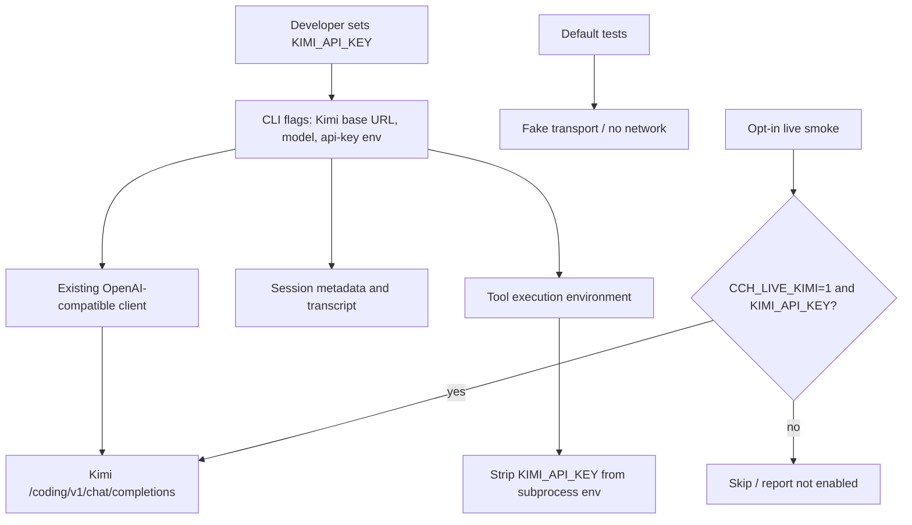

# feat: Add Kimi Code provider testing path

## Summary

Add a documented, testable path for using a Kimi Code API key with the existing OpenAI Chat Completions-compatible provider. The plan keeps Kimi as a compatible gateway configured by `--base-url`, `--model`, and `--api-key-env`, adds offline compatibility/security regressions, and introduces an explicit opt-in live smoke path that never runs during default tests.

---

## Problem Frame

Kimi's official third-party-agent docs provide both Anthropic-shaped Claude Code settings and an OpenAI-compatible configuration. This harness only implements an OpenAI Chat Completions-compatible provider today, so Kimi support should adapt through that seam instead of adding an Anthropic provider or a provider registry prematurely.

---

## Requirements

- R1. A developer can run the harness against Kimi Code using the official OpenAI-compatible Kimi endpoint, model id, and a Kimi API-key environment variable.
- R2. Default builds and tests remain deterministic, offline, and safe for CI without Kimi credentials or network access.
- R3. Kimi API keys are not exposed through the intended Kimi configuration path: the key is read from an environment variable, stripped from model-requested shell commands, excluded from docs/examples, and covered by JSONL redaction tests for labeled secret fields.
- R4. The project documents the distinction between Kimi's OpenAI-compatible settings and the Anthropic/Claude Code settings from the official docs, including that the API key is sent to whichever `--base-url` is configured.
- R5. Live Kimi validation is available only through an explicit opt-in gate and uses harmless prompts/fixtures.
- R6. Any discovered Kimi protocol quirks remain isolated behind provider/transport tests or implementation adapters, not public domain contracts.

---

## Scope Boundaries

- Do not add a new Anthropic-compatible provider or support `ANTHROPIC_BASE_URL` / `ANTHROPIC_API_KEY` in this project.
- Do not add a broad multi-provider registry, OAuth flow, or persistent provider account configuration.
- Do not make default `ctest` or CLI smoke tests call Kimi or any other real network API.
- Do not require users to store API keys in session files, config files, or command-line literals.
- Do not attempt to guarantee exact unredacted replay of live provider sessions; JSONL remains a redacted transcript.

### Deferred to Follow-Up Work

- Kimi provider preset such as `--preset kimi-code`: defer until repeated Kimi usage justifies new CLI surface; explicit flags already cover the current need.
- Resume-time provider/base-url mismatch enforcement: defer as a broader session metadata design, while this plan documents the security-relevant limitation that `--resume` does not restore provider flags and may send prior history to a different configured provider.
- Explicit configured-secret-value redaction across arbitrary unlabeled text: defer as a broader redaction-boundary design; this plan covers labeled Kimi key fields and documents that users must never paste raw keys into prompts, files, or tool-visible content.
- Kimi-specific protocol compatibility shims: defer until offline fixtures or opt-in live smoke identify a concrete incompatibility.
- Live Kimi tool-call smoke: defer until the harness can make the tool-call pass condition reliable; the current request DTO does not force tool use, so a live tool prompt would be model-behavior dependent.

---

## Context & Research

### Relevant Code and Patterns

- `include/cch/ai/providers/OpenAIChatClient.hpp` already exposes `OpenAIStreamConfig` with `base_url`, `api_key_env`, `api_key`, and `model`.
- `src/ai/providers/OpenAIChatClient.cpp` trims trailing slashes and appends `/chat/completions` when the base URL ends in `/v1`, so `https://api.kimi.com/coding/v1` maps to `https://api.kimi.com/coding/v1/chat/completions`.
- `src/main.cpp` already accepts `--model`, `--base-url`, and `--api-key-env`, and validates the selected API-key env before `[model-request]`.
- `src/AsyncCliRuntime.cpp` wires the selected provider config into `StreamingOpenAIChatClient` and passes the selected `api_key_env` into `AsyncLocalExecutionEnv` for shell-environment stripping.
- `tests/ai/providers/OpenAIChatClientTest.cpp` uses fake stream transport coverage for provider request construction and SSE parsing; Kimi compatibility should follow this offline pattern first.
- `tests/cli/CliSmokeTest.cpp` already covers missing real-provider API-key validation before any model request.
- `src/harness/session/JsonlSessionStore.cpp`, `src/util/Redactor.hpp`, and `tests/harness/session/JsonlSessionStoreTest.cpp` define the JSONL redaction boundary.
- `tests/harness/AsyncLocalExecutionEnvTest.cpp` covers shell environment sanitization through the process capability.

### Institutional Learnings

- Existing plans emphasize OpenAI-compatible provider-first integration: compatible gateways should preserve `/v1/chat/completions`, `tools`, `tool_calls`, and tool-result message behavior before provider-specific handling is considered.
- Existing plans and `AGENTS.md` require live provider/API tests to remain opt-in because they depend on external network, credentials, and paid quota.
- Secret redaction is a boundary invariant: the configured API-key env must be stripped from tool subprocesses, and persisted transcripts must redact secret-looking fields.
- Provider wire DTOs and gateway-specific quirks must stay behind `src/ai/providers/` / `src/ai/glaze/`, not leak into public domain contracts.

### External References

- Kimi third-party-agent docs: OpenAI-compatible Base URL `https://api.kimi.com/coding/v1`, Model ID `kimi-for-coding`, streaming enabled, max output tokens `32768`, context window `262144`.
- Kimi Claude Code docs: `ANTHROPIC_BASE_URL=https://api.kimi.com/coding/` and `ANTHROPIC_API_KEY` apply to Anthropic-shaped Claude Code integration, not this harness.
- Kimi migration guidance: OpenAI-compatible clients generally migrate by replacing base URL and API key while continuing to use `tools` / `tool_calls`, not deprecated `functions`.

---

## Key Technical Decisions

- Treat Kimi as an OpenAI-compatible gateway, not a new provider: the existing provider seam already models the required request/stream/tool-call contract, and adding a new provider would expand architecture without evidence of a protocol gap.
- Standardize examples on `KIMI_API_KEY`: the name is clear to users, contains `API_KEY` for existing sanitizer/redactor heuristics, and avoids mixing OpenAI and Kimi credentials.
- Keep Kimi support explicit rather than adding a preset in this iteration: `--base-url`, `--model`, and `--api-key-env` are already stable CLI surface, while a preset introduces precedence, provider identity, and session-label behavior that is not necessary for initial testing.
- Treat Kimi configuration as per-invocation, not session-bound: session headers may continue to record generic `openai-compatible` provider metadata and do not restore `base_url` or `api_key_env` on resume, so users must repeat Kimi flags when resuming.
- Require Kimi key/base-url/model pairing in examples and smoke tooling: a Kimi key passed with the default OpenAI base URL would disclose the Bearer token to the wrong provider, so docs and smoke validation must keep those values together.
- Gate live smoke with both intent and credentials: require an explicit live-test env gate such as `CCH_LIVE_KIMI=1` plus `KIMI_API_KEY` so missing credentials skip or fail locally without affecting default CI.
- Use harmless live fixtures only: provider-bound tool results are sent to the configured model before session persistence redaction, and terminal output is outside the JSONL redaction boundary, so live smoke must not read real secrets or sensitive repo files.

---

## Open Questions

### Resolved During Planning

- Should this project use Kimi's Anthropic/Claude Code configuration? No. This harness speaks OpenAI Chat Completions-compatible requests, so the plan uses Kimi's OpenAI-compatible base URL and model id.
- Should a `--preset kimi-code` flag be introduced now? No. Explicit existing flags are sufficient and avoid adding provider-registry scope.
- Which API-key env var should examples and tests use? Use `KIMI_API_KEY` for clarity and existing sanitizer compatibility.
- Should live Kimi tests run by default? No. They must be explicitly opt-in and skipped or absent from default validation.

### Deferred to Implementation

- Exact Kimi error-body shapes for 401, 403, 429, invalid model, or non-SSE responses: these depend on live responses and should be documented after observation without logging secrets.
- Whether Kimi emits additional reasoning/thinking metadata in OpenAI-compatible streams: preserve current behavior unless a fixture or live smoke proves the adapter needs an isolated extension.
- Whether to add explicit secret-value redaction for the configured API-key value across arbitrary unlabeled transcript text: this needs a broader redaction API design because the current persistence boundary mostly redacts by value shape and key/assignment names.

---

## High-Level Technical Design

> *This illustrates the intended approach and is directional guidance for review, not implementation specification. The implementing agent should treat it as context, not code to reproduce.*

---

## Implementation Units

### U1. Document the Kimi OpenAI-compatible run path

**Goal:** Add a README section that shows exactly how to run the harness with a Kimi Code API key using the existing OpenAI-compatible CLI flags.

**Requirements:** R1, R4, R5

**Dependencies:** None

**Files:**
- Modify: `README.md`

**Approach:**
- Add a Kimi Code subsection under real-provider mode rather than introducing a separate provider concept.
- Show `KIMI_API_KEY`, `--base-url https://api.kimi.com/coding/v1`, `--model kimi-for-coding`, and `--api-key-env KIMI_API_KEY`.
- State that users should pass the base URL, not the full `/chat/completions` endpoint.
- Explicitly warn that `ANTHROPIC_BASE_URL` / `ANTHROPIC_API_KEY` are for Claude Code-style clients and are not read by this harness.
- Add a short troubleshooting table for missing env, invalid key, invalid model, rate limits, accidental default OpenAI configuration, and provider/transport errors without printing secrets.
- Document that `--resume` loads the redacted transcript and workspace but does not restore `--base-url`, `--model`, or `--api-key-env`; users should repeat all three Kimi flags when resuming a Kimi session.

**Patterns to follow:**
- Existing `README.md` real-provider section and safety wording.
- Existing CLI event/state terminology in `README.md`.

**Test scenarios:**
- Test expectation: none -- documentation-only unit; correctness is reviewed by matching the documented command against existing CLI flags and Kimi's official values.

**Verification:**
- README contains a copy-pastable Kimi example that uses the OpenAI-compatible endpoint and does not mention Anthropic env vars as supported project configuration.
- README makes clear that live Kimi usage sends prompts, file contents, and tool outputs to the configured provider.

---

### U2. Add offline Kimi-compatible provider request coverage

**Goal:** Prove the existing OpenAI-compatible client constructs the correct Kimi request URL/body without calling the network.

**Requirements:** R1, R2, R6

**Dependencies:** None

**Files:**
- Modify: `tests/ai/providers/OpenAIChatClientTest.cpp`

**Approach:**
- Add fake-transport coverage with `base_url = https://api.kimi.com/coding/v1`, `model = kimi-for-coding`, and direct test API key configuration.
- Assert the captured request URL is `https://api.kimi.com/coding/v1/chat/completions`.
- Assert the body includes `"model":"kimi-for-coding"`, `"stream":true`, and the existing top-level `tools` shape when tools are present.
- Assert the request body does not use deprecated OpenAI `functions` fields.
- Assert `tool_calls` only in cases that serialize prior assistant tool-call history; do not expect `tool_calls` merely because the current request offers tools.
- Keep any Kimi-like SSE chunks sanitized and structurally OpenAI-compatible; do not add Kimi-specific DTOs unless an actual incompatibility is proven.

**Patterns to follow:**
- `tests/ai/providers/OpenAIChatClientTest.cpp` fake `StreamTransport` request capture.
- Existing provider tests for text streaming and split tool-call argument accumulation.

**Test scenarios:**
- Happy path: Kimi base URL ending in `/coding/v1` with model `kimi-for-coding` -> captured URL appends `/chat/completions` exactly once and request body uses the Kimi model.
- Happy path: Kimi-compatible request with tools -> body includes OpenAI `tools` / `tool_calls` compatible schema, not deprecated `functions`.
- Edge case: Kimi base URL with a trailing slash -> captured URL still normalizes to one `/chat/completions` suffix.

**Verification:**
- Provider tests pass offline with no Kimi env var and no network.
- Public provider/domain contracts remain unchanged unless a concrete compatibility gap requires otherwise.

---

### U3. Cover Kimi API-key validation and secret hygiene

**Goal:** Add regression coverage that the recommended Kimi env name participates in existing config validation, shell-environment stripping, and session redaction behavior.

**Requirements:** R2, R3, R5

**Dependencies:** None

**Files:**
- Modify: `tests/cli/CliSmokeTest.cpp`
- Modify: `tests/harness/AsyncLocalExecutionEnvTest.cpp`
- Modify: `tests/harness/session/JsonlSessionStoreTest.cpp`

**Approach:**
- Add a CLI missing-key smoke case using Kimi flags and `--api-key-env KIMI_API_KEY`, ensuring it fails before `[model-request]`.
- Extend environment sanitization coverage so a process request does not include `KIMI_API_KEY` when the execution env is configured with that secret name.
- Extend JSONL redaction coverage with a Kimi-looking non-`sk-` value under keys such as `kimi_api_key` and `KIMI_API_KEY`, proving key-name redaction does not rely solely on OpenAI key shape.
- Cover the transcript surfaces that can carry labeled secrets: user/assistant text, assistant error messages, tool-call `raw_arguments`, parsed tool-call `arguments`, tool-result `content`, and tool-result `details` with nested objects/arrays.
- Keep assertions focused on absence of the original secret and presence of `[REDACTED]`, not exact full JSONL formatting.
- Do not claim this covers arbitrary unlabeled free-text key leakage; that limitation belongs in README and the deferred explicit-secret redaction follow-up.

**Patterns to follow:**
- Existing missing-key test in `tests/cli/CliSmokeTest.cpp`.
- Existing shell environment sanitization test in `tests/harness/AsyncLocalExecutionEnvTest.cpp`.
- Existing redaction test in `tests/harness/session/JsonlSessionStoreTest.cpp`.

**Test scenarios:**
- Error path: `KIMI_API_KEY` unset and Kimi CLI flags supplied -> exit is non-zero, output names the missing env var, no `[model-request]` appears, and no session file is created for a new session path.
- Integration: model-requested bash environment with `KIMI_API_KEY` set -> captured process environment excludes `KIMI_API_KEY` while preserving a known safe variable.
- Edge case: JSONL message content contains `kimi_api_key=kimi-secret-value` or JSON field `"KIMI_API_KEY":"kimi-secret-value"` -> persisted session omits the raw value and contains `[REDACTED]`.
- Edge case: labeled Kimi-like values appear in assistant error text, tool-call raw/parsed arguments, and tool-result details -> persisted session omits the raw values across all transcript surfaces.

**Verification:**
- CLI, harness async, and session slices prove Kimi credentials follow the same safety path as existing provider credentials.
- No tests require a real Kimi key.

---

### U4. Add an explicit opt-in Kimi live smoke script

**Goal:** Provide a safe way for developers to verify a real Kimi API key against the harness without making live calls part of default validation.

**Requirements:** R1, R2, R3, R5, R6

**Dependencies:** U1, U2, U3

**Files:**
- Create: `scripts/kimi_live_smoke.sh`
- Modify: `README.md`

**Approach:**
- Implement the first live path as a manual script, not a source file in `cpp_harness_tests`: the current fallback Catch layer does not provide reliable hidden-test or skip semantics, and adding a live test source to the default test binary risks accidental network access.
- Require both an intent gate (`CCH_LIVE_KIMI=1`) and `KIMI_API_KEY` before constructing or running any real-provider command.
- Hardcode or validate the Kimi pairing in the script: `--base-url https://api.kimi.com/coding/v1`, `--model kimi-for-coding`, and `--api-key-env KIMI_API_KEY`.
- Use an empty throwaway workspace containing only harmless fixture files, store the session in that temporary area, do not run from the repository root as the workspace, and do not pass `--enable-bash`.
- Make the first live smoke text-oriented with a small deterministic prompt, but tolerate incidental read/write/edit tool calls as long as they are confined to the throwaway workspace; the CLI always advertises tool schemas today even when the prompt asks for plain text.
- Do not include live tool-call smoke in this iteration because the current request DTO does not force tool use, making a required tool-call pass condition flaky.
- Capture stdout/stderr and the session file for local assertions that the raw key value is absent before printing any diagnostic excerpt.
- Ensure provider/network error rendering in the script and docs does not surface Authorization header values, configured API-key values, or raw diagnostic blobs that may contain secrets.

**Execution note:** Treat this as characterization-first around the real provider boundary: first prove the current client works against Kimi with the smallest live prompt, and only add tool-call live coverage in a later plan if the harness can force or reliably validate tool use.

**Patterns to follow:**
- Existing README fake-provider and real-provider examples.
- Existing CLI semantic event lines for validating text-only smoke output.

**Test scenarios:**
- Happy path: `CCH_LIVE_KIMI=1` and `KIMI_API_KEY` set -> script runs the harness against Kimi from a throwaway workspace, receives assistant output, exits successfully, and writes a local temporary session.
- Skip path: intent gate absent -> script reports “not enabled” and performs no network request.
- Error path: intent gate present but `KIMI_API_KEY` absent -> script fails before `[model-request]` with an actionable missing-env message.
- Edge case: the model requests a file/edit tool despite the text-oriented prompt -> the operation is confined to the throwaway workspace and does not cause the smoke to fail solely because a tool call appeared.
- Security: raw `KIMI_API_KEY` value does not appear in captured command output, provider-error diagnostics, or the JSONL session before any output is surfaced.
- Containment: the script uses only the throwaway workspace/session, does not enable bash, and does not read repository files.

**Verification:**
- Default `ctest` remains offline and does not include the live smoke path.
- Manual live validation instructions are explicit about quota/network use and prerequisites.
- Live smoke failures are diagnosable without printing secrets.

---

## System-Wide Impact

- **Interaction graph:** CLI config flows into `AsyncCliRuntimeConfig`, then into `OpenAIStreamConfig`, `StreamingOpenAIChatClient`, the session header's existing provider/model fields, and the local execution environment's secret-name list.
- **Error propagation:** Missing `KIMI_API_KEY` should fail during CLI validation before session creation or model request; provider/network errors should continue through existing `[provider-error]` / non-zero exit behavior.
- **State lifecycle risks:** Live smoke creates local JSONL sessions that may contain prompts, file snippets, provider/model metadata, and tool output; examples must use temporary session paths and harmless fixture data. Resume does not restore `--base-url`, `--model`, or `--api-key-env`, so users must repeat all Kimi flags to avoid sending prior history to a different configured endpoint.
- **API surface parity:** No public domain API changes are required for Kimi. CLI flags remain the compatibility surface for OpenAI-compatible gateways, and Kimi sessions may still appear under generic OpenAI-compatible provider identity in metadata.
- **Integration coverage:** Offline fake-transport tests cover request construction; opt-in live smoke covers real HTTPS/SSE behavior only when explicitly requested.
- **Unchanged invariants:** Default tests do not require network or secrets; provider DTOs stay implementation-private; `bash` remains disabled unless `--enable-bash` is passed; workspace guard is not treated as a sandbox.

---

## Risks & Dependencies

| Risk | Mitigation |
|------|------------|
| Users copy Kimi's Claude Code `ANTHROPIC_*` docs into this OpenAI-compatible harness | README explicitly distinguishes Anthropic-shaped Claude Code config from this project's OpenAI-compatible flags. |
| A user pairs `KIMI_API_KEY` with the wrong `--base-url` and discloses the key to another provider | Keep Kimi base URL, model, and key env together in docs and smoke tooling; warn that the Bearer token is sent to whichever endpoint is configured. |
| Passing the full `/chat/completions` URL creates a doubled path | README documents the base URL only, and offline provider tests prove the expected URL expansion. |
| Live smoke leaks or consumes real credentials/quota | Gate live smoke with explicit env vars, use harmless throwaway fixtures, avoid bash, capture output before surfacing diagnostics, and assert secrets are absent from output/session. |
| Terminal or CI logs expose text before JSONL redaction | Document that JSONL redaction is not terminal/log redaction, and keep live prompts/fixtures free of secrets. |
| Live model behavior is nondeterministic, especially for tool calls | Keep default tests offline; make first live smoke text-only; defer live tool-call smoke until the harness can force or reliably validate tool use. |
| Kimi OpenAI-compatible stream includes fields the adapter ignores | Treat ignored compatible fields as acceptable; add isolated fixtures/adapters only for behavior that breaks current parsing. |
| Resuming a Kimi session with different provider flags sends history to another configured provider | Explicitly accept this as a documented limitation for this iteration, tell users to repeat all Kimi flags on resume, and defer enforcement to a broader session metadata/resume plan. |
| Provider/transport diagnostics accidentally include credentials | Keep provider error rendering redacted in tests/docs, and have the live smoke scan captured stdout/stderr/session for the raw key before printing diagnostics. |

---

## Documentation / Operational Notes

- README should recommend `KIMI_API_KEY` rather than reusing `OPENAI_API_KEY` so users do not accidentally send one provider's key to another endpoint.
- README should tell users to keep `--base-url https://api.kimi.com/coding/v1`, `--model kimi-for-coding`, and `--api-key-env KIMI_API_KEY` together because the selected key is sent to the selected endpoint.
- README should state that live Kimi smoke requires a Kimi Code subscription/entitlement and consumes quota.
- README should retain the existing safety warning that prompts, file contents, and command outputs may be sent to the configured provider.
- README should state that JSONL redaction is not a guarantee that terminal output, CI logs, provider/transport diagnostics, or provider-bound tool results are redacted.
- README should document that `--resume` does not restore `--base-url`, `--model`, or `--api-key-env`; repeat all three Kimi flags when resuming.
- README should document the manual live smoke script separately from the default validation checklist so users do not assume it runs under default `ctest`.

---

## Sources & References

- Kimi official third-party-agent docs: https://www.kimi.com/code/docs/third-party-tools/other-coding-agents.html
- Related code: `include/cch/ai/providers/OpenAIChatClient.hpp`
- Related code: `src/ai/providers/OpenAIChatClient.cpp`
- Related code: `src/main.cpp`
- Related code: `src/AsyncCliRuntime.cpp`
- Related tests: `tests/ai/providers/OpenAIChatClientTest.cpp`
- Related tests: `tests/cli/CliSmokeTest.cpp`
- Related tests: `tests/harness/AsyncLocalExecutionEnvTest.cpp`
- Related tests: `tests/harness/session/JsonlSessionStoreTest.cpp`
