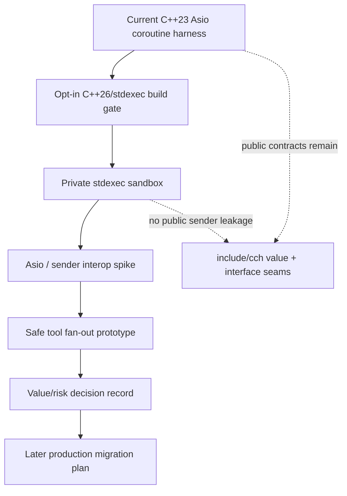
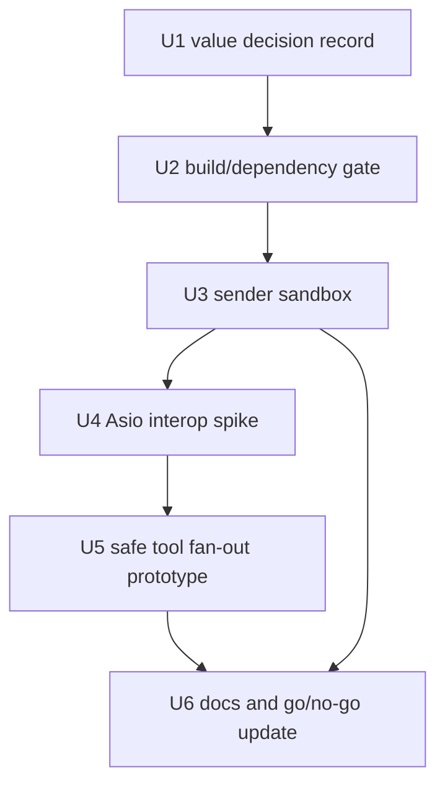

# refactor: Evaluate C++26 stdexec adoption

**Target repo:** `cpp-coding-harness`. Paths without a repo label are relative to this repository. Paths prefixed with `stdexec:` are relative to the user-provided `stdexec` reference checkout.

## Summary

Evaluate C++26 and `stdexec` as a staged architecture upgrade for the harness, proving where sender/receiver composition creates real value before exposing it in production-facing contracts. The plan keeps the current Boost.Asio coroutine stack intact while adding opt-in build gates, private experiments, and a value/risk decision record that can guide a later migration.

---

## Problem Frame

The harness is already intentionally modern C++: C++23, Boost.Asio `awaitable`, Boost.Beast streaming transport, Glaze serialization, `std::expected`, passive value contracts, move-only event sinks, and explicit capability seams. Prior architecture plans named C++26 `std::execution` as useful design pressure but deferred adoption because the core async graph was still stabilizing.

The user now wants to understand whether introducing C++26 and `stdexec` would be worth it. The main risk is adopting a powerful template-heavy experimental library before the project has a concrete payoff. The main opportunity is that a coding-agent harness naturally has async composition pressure: model streaming, tool calls, shell/file I/O, session persistence, cancellation, timeouts, future parallel tools, and structured background work.

---

## Requirements

- R1. Produce a concrete value assessment for C++26/`stdexec`, separating near-term wins from speculative future benefits.
- R2. Preserve the project’s anti-fragile architecture rules: passive value contracts, capability firewalls, move-only event channels, and localized generic machinery.
- R3. Do not require a repo-wide C++26 build before toolchain, dependency, and CI compatibility are proven.
- R4. Integrate `stdexec` only behind an opt-in experimental build gate until smoke coverage proves the local checkout is usable.
- R5. Keep `stdexec` templates, concepts, schedulers, and sender types out of public `include/cch/...` contracts during the evaluation phase.
- R6. Evaluate interop with the existing Boost.Asio coroutine spine rather than replacing Boost.Asio/Beast transport in the first step.
- R7. Evaluate at least three candidate value areas: deterministic safe tool fan-out, structured background work/cancellation, and testable async composition.
- R8. Preserve deterministic tool-result ordering and workspace safety while exploring parallelism.
- R9. Document go/no-go criteria, risks, and follow-up migration paths so the evaluation does not become an implicit rewrite.
- R10. Keep default validation free of live provider/API calls.

---

## Scope Boundaries

- No immediate full rewrite of `AsyncAgentLoop`, `StreamingChatClient`, `StreamTransport`, or `AsyncExecutionEnv` to sender-returning public APIs.
- No default switch of every target to C++26 until the opt-in build and dependency gate passes on the project’s supported compilers.
- No GPU or `nvexec` adoption; the harness value question is CPU/network/tool orchestration.
- No replacement of Boost.Beast HTTPS/SSE transport with a new networking stack in this plan.
- No production parallel execution of mutating file tools unless ordering and safety are proven by tests first.
- No live OpenAI/Kimi/provider validation as part of default tests.

### Deferred to Follow-Up Work

- Full sender-returning public capability APIs after the private experiments prove the migration boundary.
- Native `std::execution` from the standard library once project compilers and standard libraries ship enough C++26 surface to remove the reference implementation.
- A production scheduler policy for mixed read-only and mutating tools if the prototype shows meaningful value.
- Deeper cancellation propagation across provider requests, shell processes, and session writes after the first `stdexec` interop seam is understood.

---

## Value Analysis

| Value area | Why it matters for this harness | Near-term value | Adoption caveat |
| --- | --- | --- | --- |
| Structured async composition | Agent runs combine provider streams, tool execution, session persistence, and event sinks. | Sender pipelines can make “what work happens” independent from “where it runs.” | Existing Asio coroutines already work; value must be proven at seams, not by rewriting everything. |
| Deterministic safe parallelism | A model may emit multiple tool calls; today execution is source-order sequential. | `when_all` plus scheduler policy can fan out safe read-only work while preserving ordered result insertion. | Mutating file tools and shell commands must remain serialized unless explicitly classified safe. |
| Structured concurrency and cancellation | Background work needs join-on-shutdown semantics and timeout/cancel propagation. | `async_scope`, `task`, stop tokens, and `finally` give vocabulary for tracked work instead of ad hoc detached tasks. | Provider and process cancellation still need adapters from current Asio/process boundaries. |
| Better async tests | Current tests require `io_context` scaffolding for every awaitable. | `just`, `just_error`, `just_stopped`, and `sync_wait` can create smaller deterministic async composition tests. | Tests should not hide production Asio behavior; keep integration tests around the existing runtime. |
| Future standard alignment | C++26 `std::execution` is the standard direction for async composition. | Private experiments prepare the architecture for eventual standard library support. | `stdexec` is experimental and may change; public APIs should not expose it yet. |
| Scheduler vocabulary | The project currently has an implicit “one local io_context” runtime boundary. | Schedulers make CPU work, I/O work, and future background work explicit. | Scheduler selection must stay an implementation detail until there is a stable policy. |

---

## Context & Research

### Relevant Code and Patterns

- `CMakeLists.txt` currently sets `CMAKE_CXX_STANDARD 23`, builds `cpp_harness_lib`, and links Boost, OpenSSL, and Glaze.
- `CMakePresets.json` has `vcpkg`, `vcpkg-release`, and `system` presets; there is no experimental compiler-standard preset yet.
- `vcpkg.json` declares Glaze, Boost.Process, Boost.Beast, Boost.Asio, OpenSSL, CLI11, and Catch2.
- `include/cch/agent/AgentLoop.hpp`, `include/cch/ai/ChatClient.hpp`, `include/cch/ai/providers/StreamTransport.hpp`, and `include/cch/harness/ExecutionEnv.hpp` expose `boost::asio::awaitable<util::Expected<...>>` capability APIs.
- `src/agent/AgentLoop.cpp` streams one assistant response at a time, executes tool calls sequentially, and appends tool results in deterministic source order.
- `src/AsyncCliRuntime.cpp` owns the top-level `boost::asio::io_context` for each prompt and wires client, execution environment, tools, agent loop, events, and session persistence.
- `src/harness/AsyncLocalExecutionEnv.cpp` currently adapts synchronous local file/shell behavior into `boost::asio::awaitable` methods; this is an obvious place to evaluate whether sender composition adds real value or merely wraps sync work.
- `tests/agent/AsyncAgentLoopTest.cpp`, `tests/harness/AsyncLocalExecutionEnvTest.cpp`, and `tests/cli/CliSmokeTest.cpp` already provide fake-provider/tool/runtime coverage without live network calls.
- `tests/architecture/PublicHeaderBoundaryTest.cpp` and `tests/architecture/MoveOnlyCallbackTest.cpp` protect the public boundary and move-only callback intent that `stdexec` adoption must not erode.

### Institutional Learnings

- No `docs/solutions/` learnings exist in this repository at planning time.
- `docs/plans/2026-06-10-003-refactor-coroutine-glaze-agent-stack-plan.md` established the current C++23 Boost.Asio coroutine/Glaze/`std::expected` stack.
- `docs/plans/2026-06-10-004-refactor-anti-fragile-cpp-architecture-plan.md` explicitly treated C++26 `std::execution` as future design pressure, not an implementation dependency, and emphasized keeping public seams value/interface oriented.
- `docs/plans/2026-06-10-005-refactor-monadic-expected-plan.md` reinforced `std::expected` as the project’s error propagation contract and avoided exception-based control flow.

### External References

- `stdexec: README.md` describes `stdexec` as the C++26 `std::execution` reference implementation, header-only, with no external dependencies, and with composable algorithms such as `then`, `let_value`, `when_all`, `bulk`, `split`, `transfer`, and `upon_*`.
- `stdexec: README.md` lists structured concurrency primitives (`async_scope`, `task`, `finally`, `when_any`, `repeat_n`), pluggable schedulers, coroutine interop, and optional GPU schedulers.
- `stdexec: README.md` lists compiler support minimums: GCC 12, Clang 16, MSVC 14.43, Xcode 16, and `nvc++` 25.9 for GPU support; it requires C++20 or later.
- `stdexec: docs/source/index.rst` states the sender model is accepted for C++26 and motivates it as a unified async model with structured cancellation, coroutine integration, and customizable schedulers.
- `stdexec: docs/source/user/index.rst` defines schedulers, senders, sender algorithms, `when_all`, `starts_on`, `continues_on`, `let_value`, `sync_wait`, error/stopped channels, and coroutine integration.
- `stdexec: CMakeLists.txt` defines `STDEXEC::stdexec` as an interface target with `cxx_std_20`, GCC coroutine flags, and optional compiled scheduler targets; it also performs configure-time downloads for some metadata/helpers when used directly, which affects offline/reproducible integration choices.
- Local environment inspection found GCC 16.1.1, Clang 22.1.5, CMake 4.3.3, and Ninja available, which is favorable for an opt-in C++26/`stdexec` experiment.

---

## Key Technical Decisions

- **Stage adoption instead of rewriting the async spine:** The current Boost.Asio coroutine stack is working and well-tested. `stdexec` should first prove value in private experiments and narrow production seams before any public capability API changes.
- **Use C++26 as an experimental target, not an immediate global requirement:** `stdexec` itself only requires C++20+, while the repository currently targets C++23. Add a C++26-capable preset or option for experiments before raising the global standard.
- **Keep `stdexec` out of public contracts during evaluation:** Public headers should continue exposing passive values, `std::expected`, interfaces, and existing async seams. Sender types and concepts stay in `.cpp` files, private headers, or experimental targets.
- **Prefer pinned local integration over floating fetches:** The user supplied a local `stdexec` checkout. The plan should avoid unpinned `main` fetches and avoid absolute paths in committed configuration by using a cache variable or vendored location.
- **Treat `stdexec` CMake integration as a risk to validate:** The CMake target is useful because it carries required flags, but direct `add_subdirectory` may perform configure-time downloads. The integration unit must choose a reproducible shape before making the option default.
- **Bridge, don’t mix, error channels:** Existing subsystem boundaries return `util::Expected<T>`. Sender error/stopped channels can power private composition, but adapters must convert back to project errors at capability seams.
- **Parallelize only classifiable safe work:** `when_all` is valuable for independent work, but tool fan-out must respect mutation, shell side effects, and source-order result appending.
- **No `nvexec` in this evaluation:** GPU schedulers are interesting for compute-heavy workloads, not for the current agent harness value question.

---

## Open Questions

### Resolved During Planning

- **Should `stdexec` replace Boost.Asio immediately?** No. Research and local code show Boost.Asio is the established runtime and transport substrate; replacement would create migration risk before value is proven.
- **Should `stdexec` appear in public `include/cch/...` APIs?** No. Prior architecture constraints and template-heavy sender types make public leakage risky during evaluation.
- **Should C++26 become the global default right away?** No. Add an opt-in experimental build path first, because dependencies and CI compatibility need proof.
- **Where is the highest-value pilot?** Safe tool fan-out and structured background work are better pilots than provider transport replacement because they exercise composition without destabilizing SSE/TLS behavior.

### Deferred to Implementation

- **Exact CMake integration shape:** The implementer must verify whether direct `add_subdirectory`, manual include target, or a vendored wrapper best avoids configure-time network access while preserving required compile flags.
- **Exact Asio/sender adapter mechanics:** Whether the bridge uses `stdexec::task`, `exec::asio` helpers, a custom sender wrapper, or a one-way sender-to-awaitable adapter depends on compile-time behavior in the local toolchain.
- **Final tool safety classification model:** The prototype can start with obvious fake read-only vs mutating labels, but production classification requires a separate design if this becomes real behavior.
- **C++26 feature set beyond `stdexec`:** This plan focuses on `std::execution` direction; static reflection and other C++26 features should be considered only if they directly support the evaluation.

---

## High-Level Technical Design

> *This illustrates the intended approach and is directional guidance for review, not implementation specification. The implementing agent should treat it as context, not code to reproduce.*

The intended shape is a decision funnel. The project first proves the dependency/toolchain works, then validates minimal sender composition, then tests interop with the current runtime, then tries one harness-specific value case. Only after that should a follow-up plan decide whether to migrate production APIs.

---

## Implementation Units

### U1. Capture the C++26/stdexec value decision record

**Goal:** Create the durable analysis artifact that answers what C++26 and `stdexec` can bring to this project, before any code path depends on it.

**Requirements:** R1, R2, R7, R9.

**Dependencies:** None.

**Files:**
- Create: `docs/architecture/cpp26-stdexec-evaluation.md`
- Modify: `README.md`

**Approach:**
- Document the value table from this plan in repository-owned terms: structured async composition, safe parallel tool fan-out, structured concurrency/cancellation, async test ergonomics, future standard readiness, and scheduler vocabulary.
- Include a “not worth it yet” section for cases where current Asio coroutines are simpler: provider SSE transport, simple file operations, and public capability seams.
- Record the go/no-go criteria for enabling production migration later: opt-in build passes, no public header leakage, useful prototype coverage, and no regression in deterministic tool ordering.

**Patterns to follow:**
- `README.md` architecture/deferred sections.
- Prior plan framing in `docs/plans/2026-06-10-004-refactor-anti-fragile-cpp-architecture-plan.md`.

**Test scenarios:**
- Test expectation: none -- documentation-only decision record with no executable behavior.

**Verification:**
- A reader can understand what value `stdexec` may bring, what is explicitly not being migrated, and what evidence is required before production adoption.

---

### U2. Add an opt-in C++26/stdexec build gate

**Goal:** Prove the local toolchain and user-provided `stdexec` checkout can be consumed reproducibly without changing the default build.

**Requirements:** R3, R4, R5, R9, R10.

**Dependencies:** U1.

**Files:**
- Modify: `CMakeLists.txt`
- Modify: `CMakePresets.json`
- Modify: `tests/architecture/PublicHeaderBoundaryTest.cpp`
- Create: `tests/architecture/StdexecBuildGateTest.cpp`

**Approach:**
- Add an opt-in configuration path for `stdexec` experiments using a repo-portable cache variable or vendored location rather than committing a machine-specific path.
- Keep default `cpp_harness_lib` behavior unchanged when the option is disabled.
- Add a small gated smoke test target that includes `stdexec` and proves basic sender composition compiles and runs under the experimental path.
- Extend architecture coverage so public `include/cch/...` headers continue compiling without requiring `stdexec` include paths when the experiment is disabled.

**Execution note:** Start with the gated smoke test failing under the new option, then wire the minimum CMake needed for it to pass.

**Patterns to follow:**
- Existing `CCH_BUILD_TESTS` option pattern in `CMakeLists.txt`.
- Existing architecture boundary tests in `tests/architecture/`.
- `stdexec: README.md` CMake target guidance and `stdexec: CMakeLists.txt` target aliases.

**Test scenarios:**
- Happy path: experimental option enabled with a valid `stdexec` checkout -> the smoke test compiles and runs a trivial sender pipeline.
- Edge case: experimental option disabled -> default library and tests do not require `stdexec` headers or C++26 mode.
- Error path: experimental option enabled without a configured checkout -> configuration fails with an actionable message rather than silently fetching or using an absolute developer path.
- Integration: public header boundary test still compiles without `stdexec` includes leaking into contract headers.

**Verification:**
- Default builds remain unchanged; experimental builds prove `stdexec` can be consumed intentionally and reproducibly.

---

### U3. Build a private sender sandbox for harness-shaped values

**Goal:** Validate sender algorithms against project-shaped results without changing production agent, tool, or provider APIs.

**Requirements:** R1, R2, R5, R7, R9, R10.

**Dependencies:** U2.

**Files:**
- Create: `src/experimental/stdexec/StdexecSandbox.hpp`
- Create: `src/experimental/stdexec/StdexecSandbox.cpp`
- Create: `tests/experimental/StdexecSandboxTest.cpp`
- Modify: `CMakeLists.txt`

**Approach:**
- Keep the sandbox private to the experimental target; do not include it from public headers.
- Exercise sender composition with harness-like value/error shapes: successful values, `util::Error` failures, stopped/cancelled flows, and ordered aggregation.
- Convert sender completions back into `util::Expected<T>` at the sandbox boundary so the rest of the project’s error vocabulary remains intact.

**Execution note:** Treat this as a characterization spike: prove compile behavior and error-channel mapping before attempting any production integration.

**Patterns to follow:**
- `include/cch/util/Error.hpp` and `src/util/ExpectedMacros.hpp` error propagation conventions.
- `stdexec: docs/source/user/index.rst` examples for `just`, `just_error`, `just_stopped`, `then`, `upon_error`, `upon_stopped`, and `sync_wait`.

**Test scenarios:**
- Happy path: two successful harness-like values compose through a sender pipeline and return the expected aggregate value.
- Error path: a sender error maps to `util::Expected` failure with the original `util::Error` code and detail preserved.
- Edge case: stopped/cancelled completion maps to the project’s cancellation error vocabulary instead of hanging or throwing through the boundary.
- Integration: the sandbox target builds only when the experimental option is enabled and does not affect default test discovery when disabled.

**Verification:**
- The project has a minimal, private proof that `stdexec` can express harness-shaped async outcomes without leaking into public contracts.

---

### U4. Evaluate Boost.Asio coroutine interop

**Goal:** Determine the safe bridge between existing `boost::asio::awaitable` APIs and sender-based experiments.

**Requirements:** R2, R5, R6, R9, R10.

**Dependencies:** U3.

**Files:**
- Create: `src/experimental/stdexec/AsioInteropSpike.hpp`
- Create: `src/experimental/stdexec/AsioInteropSpike.cpp`
- Create: `tests/experimental/StdexecAsioInteropTest.cpp`
- Modify: `CMakeLists.txt`

**Approach:**
- Evaluate one-way interop first: sender composition around a small Asio coroutine or Asio-driven operation, with results converted back to `util::Expected`.
- Keep provider transport and real shell/file execution out of this spike; use fake or minimal deterministic awaitables so failures are attributable to the interop layer.
- Record which interop direction is safe enough for follow-up work: sender-to-awaitable, awaitable-to-sender, or no bridge beyond `sync_wait` at test boundaries.

**Patterns to follow:**
- Existing test helpers that run `boost::asio::awaitable` with `boost::asio::io_context` in `tests/agent/AsyncAgentLoopTest.cpp` and `tests/harness/AsyncLocalExecutionEnvTest.cpp`.
- `stdexec: examples/hello_coro.cpp` coroutine interop direction.
- `stdexec: include/exec/asio/` helpers as research inputs, not public API precedent.

**Test scenarios:**
- Happy path: a deterministic Asio awaitable participates in the chosen interop shape and returns the expected value.
- Error path: an Asio-side `util::Expected` failure is preserved after crossing the interop boundary.
- Edge case: cancellation/stopped behavior does not resume destroyed coroutine state or hang the test.
- Integration: the interop spike can run under the same test binary model as existing Catch tests without requiring live I/O.

**Verification:**
- The evaluation document records a clear recommendation for whether and how production code should bridge Asio and senders later.

---

### U5. Prototype deterministic safe tool fan-out

**Goal:** Test the most harness-specific `stdexec` value case: running classifiably safe independent tool work concurrently while preserving ordered tool-result insertion.

**Requirements:** R1, R2, R5, R7, R8, R9, R10.

**Dependencies:** U4.

**Files:**
- Create: `src/experimental/stdexec/ToolFanoutPrototype.hpp`
- Create: `src/experimental/stdexec/ToolFanoutPrototype.cpp`
- Create: `tests/experimental/StdexecToolFanoutPrototypeTest.cpp`
- Modify: `CMakeLists.txt`
- Modify: `docs/architecture/cpp26-stdexec-evaluation.md`

**Approach:**
- Use fake tool invocations and fake tool executors; do not change `AsyncAgentLoop` production behavior in this unit.
- Classify prototype invocations into safe fan-out vs serialized execution using explicit test-only metadata.
- Use sender composition to execute safe branches concurrently and gather results back into the original model-emitted order.
- Document whether the prototype demonstrates enough value to justify a future production tool scheduling policy.

**Execution note:** Characterization-first; write ordering and safety tests before introducing any concurrency in the prototype.

**Patterns to follow:**
- Current sequential tool-call handling in `src/agent/AgentLoop.cpp`.
- Existing fake tool patterns in `tests/agent/AsyncAgentLoopTest.cpp`.
- `stdexec: docs/source/user/index.rst` guidance for `when_all`, `starts_on`, and scheduler-dependent parallelism.

**Test scenarios:**
- Happy path: two fake read-only tool invocations complete through the prototype and return results in the original call order, even if completion order differs.
- Edge case: an empty invocation list returns an empty ordered result without scheduling work.
- Error path: one failed safe branch produces a deterministic failure result without losing other completed branch information required by the prototype contract.
- Integration: a mixed list with safe and unsafe prototype invocations keeps unsafe work serialized and ordered relative to the final result list.
- Safety: mutating or shell-like fake invocations are never run through the concurrent branch unless the test metadata explicitly classifies them safe.

**Verification:**
- The prototype gives a concrete answer to whether sender-based parallel composition creates enough harness value to consider production migration.

---

### U6. Update docs with go/no-go and migration recommendation

**Goal:** Close the evaluation loop with an explicit recommendation rather than leaving experimental code as an ambiguous half-migration.

**Requirements:** R1, R2, R7, R9.

**Dependencies:** U3, U5.

**Files:**
- Modify: `docs/architecture/cpp26-stdexec-evaluation.md`
- Modify: `README.md`
- Modify: `docs/plans/2026-06-13-001-refactor-cpp26-stdexec-adoption-plan.md` only if the evaluation changes scope or follow-up sequencing.

**Approach:**
- Summarize measured outcomes from the build gate, sandbox, interop spike, and tool fan-out prototype.
- Decide one of three outcomes: stop after documentation, keep `stdexec` as opt-in experiment, or open a follow-up production migration plan.
- Update README deferred/architecture notes so future readers know whether C++26/`stdexec` remains a future idea or an active experimental track.

**Patterns to follow:**
- README “Deferred” section and prior plan summaries that distinguish active architecture from future extension points.

**Test scenarios:**
- Test expectation: none -- documentation and plan-maintenance unit with no new executable behavior beyond tests from U2-U5.

**Verification:**
- The repository no longer has an implicit `stdexec` question; it has a documented recommendation, evidence, and next step.

---

## System-Wide Impact

- **Build and dependency surface:** Adds an experimental dependency path and possibly a C++26 preset, but default builds must remain unchanged until the evaluation passes.
- **Public API boundary:** Public headers must not require `stdexec`, sender concepts, or experimental scheduler types during this plan.
- **Async architecture:** The evaluation may identify future changes to agent loop orchestration, but production `boost::asio::awaitable` APIs remain the active contract in this plan.
- **Tool execution semantics:** The prototype explores concurrent safe work, but production tool execution remains deterministic and sequential unless a follow-up migration explicitly changes it.
- **Error propagation:** Sender error and stopped channels must map back to `util::Expected`/`util::Error` at project boundaries.
- **Documentation:** README and architecture docs need to describe whether C++26/`stdexec` is merely researched, opt-in experimental, or recommended for future production migration.

---

## Dependencies / Prerequisites

- A valid local or vendored `stdexec` checkout corresponding to the user-provided reference repository.
- GCC/Clang/MSVC toolchains that satisfy `stdexec` compiler support; local GCC 16.1.1 and Clang 22.1.5 are favorable.
- CMake integration that avoids committing machine-specific absolute paths and avoids surprising configure-time network access in normal builds.
- Existing Boost.Asio/Beast/OpenSSL/Glaze/vcpkg paths continue to work because the first phase is additive and opt-in.

---

## Alternative Approaches Considered

- **Full immediate rewrite to sender-returning APIs:** Rejected for this plan. It would obscure the value question, destabilize provider/tool/session behavior, and violate the public-boundary caution from prior architecture plans.
- **Wait for standard-library `std::execution`:** Safe but too passive. The reference implementation can answer architecture questions now as long as public APIs stay insulated from churn.
- **Use only Boost.Asio features:** Reasonable if the project only needs networking coroutines, but it leaves tool fan-out, scheduler vocabulary, structured cancellation, and future C++26 alignment unexplored.
- **Vendor `stdexec` unconditionally:** Rejected until the build gate proves maintenance cost, configure behavior, and compile-time diagnostics are acceptable.
- **Use `nvexec`/GPU schedulers:** Rejected because the harness bottlenecks are orchestration, I/O, and tool safety rather than GPU compute.

---

## Success Metrics

- Default build/test behavior is unchanged when `stdexec` experiments are disabled.
- Experimental build path compiles a minimal sender smoke test with the configured `stdexec` checkout.
- Public header tests prove `stdexec` does not leak into contract headers.
- Sandbox tests prove `util::Expected` value, error, and cancellation semantics can cross the sender boundary deterministically.
- Interop tests produce a clear recommendation on Asio/sender bridging.
- Tool fan-out prototype demonstrates ordered results and safety classification, or documents why the value is insufficient.
- README and architecture docs contain a clear go/no-go recommendation.

---

## Risk Analysis & Mitigation

| Risk | Likelihood | Impact | Mitigation |
| --- | --- | --- | --- |
| `stdexec` API churn affects future code | Medium | Medium | Keep usage private and opt-in; document exact checkout/version evidence. |
| Template diagnostics slow implementation | High | Medium | Start with small smoke/sandbox targets; keep compiler diagnostic flags from the `stdexec` target when possible. |
| CMake integration performs network access | Medium | High | Validate direct target use in U2; prefer a reproducible wrapper or manual include target if needed. |
| Public headers leak sender/concept complexity | Medium | High | Extend architecture tests before adding experiments; keep experimental files under `src/experimental/`. |
| Parallel tool prototype violates file safety assumptions | Medium | High | Use fake tools first; only classify obvious safe work; preserve ordered result insertion. |
| Existing Asio coroutine code becomes harder to reason about | Medium | Medium | Treat interop as a spike; do not mix models in production code until the bridge is proven. |
| C++26 global switch breaks dependencies or developers | Low to Medium | High | Add opt-in preset/option first; keep default standard unchanged until evidence supports promotion. |
| Experimental code lingers without a decision | Medium | Medium | U6 requires a go/no-go recommendation and README update. |

---

## Documentation / Operational Notes

- Keep the evaluation document explicit about what is active production architecture versus opt-in experiment.
- If an experimental preset is added, document it as a local evaluation path, not as the default user build path.
- If `stdexec` remains opt-in after U6, README should name it under experimental/deferred architecture rather than implying users need it for normal harness use.
- If the evaluation recommends production migration, create a separate follow-up plan focused on one production seam at a time.

---

## Sources & References

- Target repo guidance: `AGENTS.md`
- Current build: `CMakeLists.txt`, `CMakePresets.json`, `vcpkg.json`
- Current async seams: `include/cch/agent/AgentLoop.hpp`, `include/cch/ai/ChatClient.hpp`, `include/cch/ai/providers/StreamTransport.hpp`, `include/cch/harness/ExecutionEnv.hpp`
- Current orchestration: `src/agent/AgentLoop.cpp`, `src/AsyncCliRuntime.cpp`, `src/harness/AsyncLocalExecutionEnv.cpp`
- Current tests: `tests/agent/AsyncAgentLoopTest.cpp`, `tests/harness/AsyncLocalExecutionEnvTest.cpp`, `tests/architecture/PublicHeaderBoundaryTest.cpp`, `tests/architecture/MoveOnlyCallbackTest.cpp`
- Prior plans: `docs/plans/2026-06-10-003-refactor-coroutine-glaze-agent-stack-plan.md`, `docs/plans/2026-06-10-004-refactor-anti-fragile-cpp-architecture-plan.md`, `docs/plans/2026-06-10-005-refactor-monadic-expected-plan.md`
- `stdexec` reference docs: `stdexec: README.md`, `stdexec: docs/source/index.rst`, `stdexec: docs/source/user/index.rst`, `stdexec: CMakeLists.txt`, `stdexec: examples/hello_coro.cpp`, `stdexec: examples/scope.cpp`
