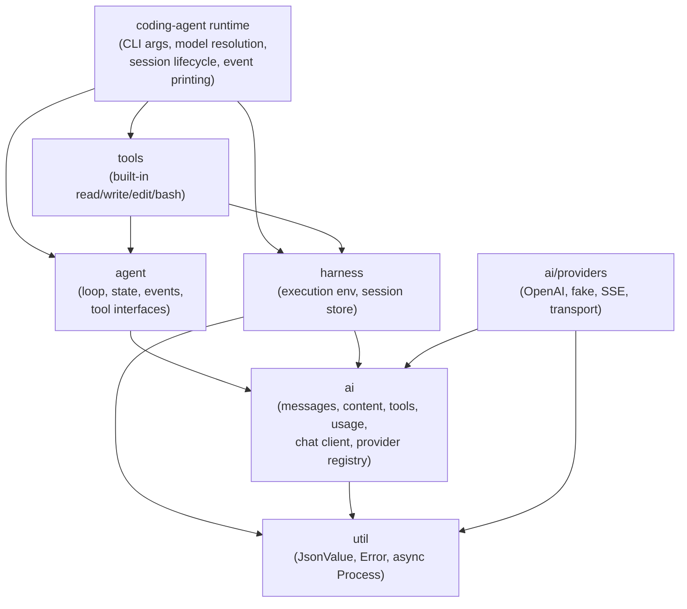

<!-- markdownlint-disable MD013 MD025 -->

# refactor: Pre-implementation cleanup for pi module parity

**Target repo:** `cpp-coding-harness`. Paths without a repo label are relative to this repository.
**Reference repo:** `pi`. Paths prefixed with `pi:` are relative to the sibling/reference pi checkout.
**Origin document:** `docs/plans/2026-06-16-001-refactor-pi-cpp-parity-todo.md`.

## Summary

This plan executes the structural cleanup that must land before the parity roadmap's T2–T9 slices. It splits the monolithic CMake target and CLI/runtime, introduces a provider/model registry, expands the agent event/state seams, makes shell execution truly asynchronous, and prepares the session entry model for pi's tree format. All changes preserve the existing passive-value, move-only-event, and Glaze-isolation architecture rules.

---

## Problem Frame

`docs/plans/2026-06-16-001-refactor-pi-cpp-parity-todo.md` maps a multi-slice migration from the current MVP harness to a C++ implementation of pi's package boundaries. Research before implementation showed that several current structures would force ad-hoc special cases in every later slice:

- A single `cpp_harness_lib` target makes dependency direction invisible and couples coding-agent runtime concerns to the AI contract.
- `src/main.cpp` hand-rolls argument parsing even though `vcpkg.json` already declares CLI11, and `src/AsyncCliRuntime.cpp` mixes fake-provider scripting, client construction, tool registration, session management, event printing, and REPL control in one file.
- The OpenAI-compatible provider is hard-coded into runtime; there is no registry seam for the fake provider, future Kimi-native path, or other providers.
- `AgentLifecycleEvent` only forwards text deltas, dropping thinking and tool-call stream events that pi's loop protocol requires.
- `LocalExecutionEnv::run_shell` blocks the `io_context` thread with synchronous polling and thread joins, preventing parallel tool execution and proper cancellation.
- The session entry model is linear v2-only and has no place for tree IDs or future entry kinds such as `model_change`, `thinking_level_change`, or `compaction`.

Without these seams, later parity work would repeatedly rewrite the same callers. This plan creates the boundaries first.

---

## Requirements

- R1. Public contracts remain aggregate-friendly value types with `std::variant`, `std::expected`, and `util::JsonValue`; no provider DTO or Glaze generic machinery leaks into `include/cch/...` domain headers.
- R2. Event sinks (`AgentEventSink`, `AssistantEventSink`) remain move-only callbacks; no copyable `std::function` is reintroduced.
- R3. Build targets reflect pi package dependency direction: `coding_agent/runtime` depends on `agent`, `harness`, and `tools`; `tools` depends on `agent` and `harness`; `agent` depends on `ai`; provider implementations stay under `ai`.
- R4. Provider construction is resolved through a registry by provider/model name, not hard-coded in runtime; the fake provider is a registered path.
- R5. CLI argument parsing uses CLI11 and preserves all current flags, validation, and help text.
- R6. Agent lifecycle events carry thinking/tool-call stream deltas and expose observable state without breaking existing event consumers.
- R7. Shell execution becomes non-blocking `boost::asio` async I/O while preserving timeout, output limits, exit-code semantics, and environment sanitization.
- R8. Runtime responsibilities are separated so that argument parsing, model resolution, tool registration, session lifecycle, event printing, and agent execution can be tested independently.
- R9. Session entries can represent pi's v3 tree kinds and IDs without breaking v2 resume or requiring unknown-entry failures.
- R10. README and AGENTS.md document the pi-package-to-C++-module map and the new pre-implementation seams.

---

## Scope Boundaries

- This plan does not add new LLM providers beyond making the existing fake provider registrable.
- It does not implement agent hooks (`beforeToolCall`, `afterToolCall`), context transforms, or parallel tool execution; it only creates the event/state seams that make those features possible.
- It does not implement full session tree navigation, compaction, or branching; it only extends the entry model so future slices can add those kinds safely.
- It does not implement JSON/RPC machine-readable modes, TUI, skills, extensions, or package installation.
- It does not change existing workspace containment, symlink escape checks, bash opt-in, secret redaction, or private session-file permissions.

### Deferred to Follow-Up Work

- Provider compatibility shims for reasoning/thinking formats, retries, session affinity, and tool-result naming: follow-up slice under T2 of the parity roadmap.
- Full agent hook and context-transform implementation: follow-up slice under T3.
- Parallel tool execution with read-only/mutating classification: follow-up slice under T3.
- Session tree context reconstruction, branch navigation, and compaction: follow-up slice under T4.
- JSON event stream and RPC mode: follow-up slice under T8.

---

## Context & Research

### Relevant Code and Patterns

- Current public contract surface: `include/cch/ai/`, `include/cch/agent/`, `include/cch/harness/`, `include/cch/tools/`, `include/cch/util/`.
- Current runtime wiring: `src/main.cpp`, `src/AsyncCliRuntime.cpp`, `src/AsyncCliRuntime.hpp`.
- Current agent loop: `src/agent/AgentLoop.cpp`, `include/cch/agent/AgentLoop.hpp`, `include/cch/agent/AgentEvent.hpp`, `include/cch/agent/AgentContext.hpp`.
- Current execution environment: `src/harness/LocalExecutionEnv.*`, `src/harness/AsyncLocalExecutionEnv.cpp`, `src/util/Process.hpp`.
- Current session store: `include/cch/harness/session/SessionEntry.hpp`, `src/harness/session/JsonlSessionStore.cpp`.
- Architecture boundary tests: `tests/architecture/ArchitectureSurfaceScanTest.cpp`, `tests/architecture/PublicHeaderBoundaryTest.cpp`, `tests/architecture/MoveOnlyCallbackTest.cpp`.
- pi reference contracts:
  - `pi:packages/ai/src/types.ts` — content, message, usage, stop-reason, tool, stream options.
  - `pi:packages/ai/src/api-registry.ts` and `pi:packages/ai/src/providers/register-builtins.ts` — provider registry seam.
  - `pi:packages/ai/src/utils/event-stream.ts` — assistant message event stream protocol.
  - `pi:packages/agent/src/types.ts` and `pi:packages/agent/src/agent-loop.ts` — agent state, hooks, events.
  - `pi:packages/agent/src/harness/types.ts` — execution environment file/shell capability contract.
  - `pi:packages/coding-agent/docs/session-format.md` — v3 session tree entries.
  - `pi:packages/coding-agent/src/cli/args.ts` — CLI argument schema.
  - `pi:packages/coding-agent/src/core/sdk.ts` and `pi:packages/coding-agent/src/core/agent-session-runtime.ts` — runtime/service split.

### Institutional Learnings

- The prior anti-fragile refactor deliberately removed `util::Result`, Boost.JSON domain contracts, legacy synchronous tools, and `src` leakage into public headers; architecture tests now guard those boundaries (`docs/plans/2026-06-10-004-refactor-anti-fragile-cpp-architecture-plan.md`).
- Provider-neutral value contracts and move-only event sinks were established in `docs/plans/2026-06-10-003-refactor-coroutine-glaze-agent-stack-plan.md`; this plan extends them rather than replacing them.
- The parity roadmap itself prescribes T0 inventory and T1 boundary work before T2–T9 code changes (`docs/plans/2026-06-16-001-refactor-pi-cpp-parity-todo.md`).

---

## Key Technical Decisions

- **Split CMake targets by package boundary.** Create package-like targets such as `cch_ai`, `cch_agent`, `cch_harness`, `cch_tools`, and `cch_coding_agent_runtime` (exact naming to be decided during implementation) instead of one `cpp_harness_lib`. This makes dependency violations a build failure and mirrors pi's package graph while keeping built-in tools as the bridge between agent contracts and harness capabilities.
- **Use CLI11 for argument parsing.** `vcpkg.json` already declares CLI11 but it is unused. Replacing the hand-rolled parser removes bespoke validation, provides `--help` formatting, and makes future settings/config-file support straightforward.
- **Make the fake provider a registered provider path.** Move `ScriptedStreamingFakeClient` out of `src/AsyncCliRuntime.cpp` into `src/ai/providers/` and register it through the new registry. Runtime resolves the provider by name rather than branching on `config.fake`.
- **Make `ProcessRunner` async at the interface boundary.** Convert `ProcessRunner::run` to an awaitable method and implement it with `boost::asio` + `boost::process` async pipes. This removes the current blocking poll loop and is a prerequisite for parallel tool execution.
- **Extend `AgentLifecycleEvent` incrementally.** Add thinking/tool-call stream events to the agent event protocol and introduce an `AgentState` value type without removing the existing events that the CLI printer consumes.
- **Extend `SessionEntry` for tree entries without dropping v2.** Add entry kinds, parent/leaf IDs, and a payload variant so the JSONL store can read and safely ignore future v3 entries while still writing v2 messages until a later slice switches the write format.

---

## Open Questions

### Resolved During Planning

- Whether to split CMake targets now: **yes**, per user confirmation.
- Whether to adopt CLI11: **yes**, per user confirmation.
- Whether the fake provider becomes a registered path: **yes**, per user confirmation.
- Whether shell execution becomes true async I/O: **yes**, per user confirmation.

### Deferred to Implementation

- Exact target names and whether to keep a merged `cpp_harness_lib` alias for the executable and tests during the transition.
- Exact provider registry naming details after inspecting `pi:packages/ai/src/api-registry.ts` and `pi:packages/ai/src/models.ts` in detail; U4 fixes the initial keying and factory-context policy before the public header is created.
- Exact CLI11 option declarations and how to map them to the existing `AsyncCliRuntimeConfig` struct.
- Whether `AgentState` lives in `AgentContext.hpp` or gets its own header, and which fields are observable.
- Exact async process implementation strategy on Windows versus POSIX; implementation must preserve current behavior on the primary Linux dev target and at minimum not break the Windows build.

---

## Output Structure

No new top-level directories are required. Expected file changes:

```text
CMakeLists.txt
README.md
AGENTS.md
docs/plans/2026-06-16-001-refactor-pi-cpp-parity-todo.md
docs/plans/2026-06-16-003-refactor-pi-cpp-contract-inventory.md   # created by U1
include/cch/agent/AgentContext.hpp
include/cch/agent/AgentEvent.hpp
include/cch/ai/ProviderRegistry.hpp                                # created by U4
src/util/Process.hpp
src/main.cpp
src/AsyncCliRuntime.cpp
src/AsyncCliRuntime.hpp
src/ai/ProviderRegistry.cpp                                        # created by U4
src/ai/providers/FakeChatClient.cpp                                # created by U4
src/ai/providers/FakeChatClient.hpp                                # created by U4
src/harness/AsyncLocalExecutionEnv.cpp
src/harness/LocalExecutionEnv.cpp
src/harness/LocalExecutionEnv.hpp
src/util/Process.cpp                                               # created by U6
src/coding_agent/runtime/...                                       # created by U7 (exact files TBD)
tests/architecture/CMakeDependencyTest.cpp                         # created by U2
tests/ai/ProviderRegistryTest.cpp                                  # created by U4
tests/agent/AsyncAgentLoopTest.cpp
tests/cli/CliSmokeTest.cpp
tests/harness/AsyncLocalExecutionEnvTest.cpp
tests/harness/session/JsonlSessionStoreTest.cpp
```

---

## High-Level Technical Design

> *This illustrates the intended approach and is directional guidance for review, not implementation specification. The implementing agent should treat it as context, not code to reproduce.*

After the cleanup, the dependency graph should look like:



Runtime builds a provider from the registry by name/model, injects it into the agent loop, and subscribes to lifecycle events. The agent loop forwards provider stream events (text, thinking, tool-call deltas) into agent lifecycle events and maintains observable state. Tool execution reaches the async execution environment, which uses async process I/O for shell commands.

---

## Implementation Units

### U1. Build T0 reference contract inventory

**Goal:** Produce a durable matrix that maps pi public types, events, commands, and session entries to existing or missing C++ contracts, so every later slice can cite a reference.

**Requirements:** None directly; supports U9/R10 through inventory documentation.

**Dependencies:** None.

**Files:**

- Create: `docs/plans/2026-06-16-003-refactor-pi-cpp-contract-inventory.md`.
- Modify: `docs/plans/2026-06-16-001-refactor-pi-cpp-parity-todo.md`.

**Approach:**

- Read `pi:packages/ai/src/types.ts`, `pi:packages/ai/src/stream.ts`, `pi:packages/ai/src/api-registry.ts`, `pi:packages/ai/src/models.ts`, `pi:packages/agent/src/types.ts`, `pi:packages/agent/src/harness/types.ts`, `pi:packages/coding-agent/docs/session-format.md`, `pi:packages/coding-agent/src/cli/args.ts`, `pi:packages/coding-agent/src/core/sdk.ts`.
- For each public pi type/event/command, note the existing C++ equivalent or mark it missing.
- Classify each item as MVP parity, near-term parity, or intentionally deferred.
- Update the parity TODO's T0 checklist to point to the new inventory.

**Patterns to follow:**

- Keep the inventory in markdown table form like the existing Module Parity Map in the parity TODO.
- Use `pi:` prefixes for all reference paths.

**Test scenarios:**

- Test expectation: none — this is documentation and classification work.

**Verification:**

- The inventory document exists and covers ai, agent, harness, coding-agent runtime, and session entry contracts.
- The parity TODO's T0 checklist links to it and is marked complete.

---

### U2. Split CMake targets and add dependency-direction architecture tests

**Goal:** Replace the single `cpp_harness_lib` target with package-like targets that enforce the pi dependency graph.

**Requirements:** R1, R3.

**Dependencies:** U1.

**Files:**

- Modify: `CMakeLists.txt`.
- Create: `tests/architecture/CMakeDependencyTest.cpp`.

**Approach:**

- Introduce library targets aligned with the package map (e.g., `cch_util`, `cch_ai`, `cch_agent`, `cch_harness`, `cch_tools`, `cch_coding_agent_runtime`).
- Keep `include/cch/<package>` as the public include path for each target and `src/<package>` as private.
- Preserve the existing executable and test executable targets; they link the new libraries.
- Add architecture tests that inspect `CMakeLists.txt`, target link dependencies, and source/include relationships to verify:
  - `agent` does not link `harness`, `tools`, or `coding_agent_runtime` unless a later pi-contract decision explicitly expands agent-core ownership.
  - `ai` does not link `agent`, `harness`, `tools`, or `coding_agent_runtime`.
  - `tools` may depend on `agent` and `harness` but not on CLI/runtime code.
  - provider implementation sources are compiled under `ai`.
  - forbidden package-layer includes are caught either by narrowed target include directories or by a source-scan/include-graph assertion.

**Patterns to follow:**

- Mirror the dependency-direction assertions in `tests/architecture/ArchitectureSurfaceScanTest.cpp`.
- Keep compile flags (`-Wall -Wextra -Wpedantic`) on every target.

**Test scenarios:**

- Happy path: project configures and builds with the new targets.
- Error path: if a target links against a higher-layer target, the architecture test fails.
- Integration: the test executable still links all needed libraries and passes existing suites.

**Verification:**

- `cmake --build build` succeeds.
- `./build/cpp_harness_tests "[architecture]"` passes, including the new dependency-direction test.

---

### U3. Migrate CLI argument parsing to CLI11

**Goal:** Replace the bespoke parser in `src/main.cpp` with CLI11 while preserving current behavior and help text.

**Requirements:** R5.

**Dependencies:** U2 (target split makes CLI11 linkage explicit).

**Files:**

- Modify: `src/main.cpp`, `CMakeLists.txt`.
- Test: `tests/cli/CliSmokeTest.cpp`.

**Approach:**

- Map each existing flag (`--fake`, `--repl`, `--workspace`, `--session`, `--resume`, `--max-turns`, `--enable-bash`, `--model`, `--base-url`, `--api-key-env`) to a CLI11 option.
- Reproduce current validation: `--session` and `--resume` are mutually exclusive; `--max-turns` must be positive; non-fake mode requires the configured API-key environment variable; prompt is required unless `--repl` or `--help`.
- Preserve the existing help text semantics; CLI11 will provide formatting.
- Keep `AsyncCliRuntimeConfig` as the value object passed to `run_async_cli`.

**Patterns to follow:**

- Use CLI11's `App`, `add_option`, `add_flag`, `exclusive`, and `parse` API.
- Keep error messages user-facing and consistent with current output.

**Test scenarios:**

- Happy path: `./build/cpp_harness --fake --session /tmp/t.jsonl "hello"` succeeds.
- Edge case: `--help` prints usage and exits 0.
- Error path: unknown flag exits non-zero with a helpful message.
- Error path: missing prompt without `--repl` exits non-zero.
- Error path: `--session` and `--resume` together exit non-zero.
- Integration: existing CLI smoke tests (`tests/cli/CliSmokeTest.cpp`) still pass.

**Verification:**

- `./build/cpp_harness_tests "[cli]"` passes.
- Manual spot-check of `--help`, `--fake`, and `--repl` behavior matches current output.

---

### U4. Introduce provider/model registry with fake provider registration

**Goal:** Decouple runtime from provider construction by introducing a registry, make the fake provider a first-class registered path, and lock the initial provider/model keying policy before the public registry header is created.

**Requirements:** R1, R4.

**Dependencies:** U2.

**Files:**

- Create: `include/cch/ai/ProviderRegistry.hpp`, `src/ai/ProviderRegistry.cpp`, `src/ai/providers/FakeChatClient.hpp`, `src/ai/providers/FakeChatClient.cpp`, `tests/ai/ProviderRegistryTest.cpp`.
- Modify: `src/AsyncCliRuntime.cpp`, `src/AsyncCliRuntime.hpp`.

**Approach:**

- Define the first registry seam as a concrete `ProviderRegistry` value/class in `src/ai/`; introduce a virtual interface only if a second current implementation or non-concrete test seam requires it.
- Key the initial registry by provider name (`"fake"`, `"openai-compatible"`) and pass model/API details through a provider-neutral factory context struct rather than making model names part of the key. Revisit this only if U1's pi inventory proves the pi contract requires different semantics.
- Define duplicate-registration and unknown-provider behavior explicitly before creating the public header.
- Register the OpenAI-compatible provider builder and the fake provider builder at startup.
- Move `ScriptedStreamingFakeClient` from `src/AsyncCliRuntime.cpp` to `src/ai/providers/FakeChatClient.*` and register it.
- Keep the fake provider boundary provider-shaped: it emits normal stream/tool-call events only. Tool execution remains in the agent/runtime path; `src/ai/providers` must not depend on runtime or tool implementation code.
- Runtime selects the provider by name from the registry using configuration (`fake ? "fake" : "openai-compatible"`, or future model resolution).

**Patterns to follow:**

- Keep registry DTOs out of public headers; the public surface is a narrow factory/context contract.
- Preserve the existing `StreamingChatClient` and `OpenAIStreamConfig` contracts.
- Register providers in a deterministic order; duplicate registration is an error.
- Add an architecture guard that prevents `src/ai/providers` from including or linking runtime and built-in tool implementation code.

**Test scenarios:**

- Happy path: registry returns a fake client for `"fake"` and an OpenAI-compatible client for `"openai-compatible"`.
- Error path: requesting an unknown provider returns an expected error.
- Edge case: duplicate registration is rejected per explicit policy.
- Architecture: `src/ai/providers` has no dependency on runtime or built-in tool implementation code.
- Integration: CLI `--fake` still exercises the normal provider → agent loop → tool execution path.

**Verification:**

- `./build/cpp_harness_tests "[ai][provider]"` passes.
- `./build/cpp_harness --fake --session /tmp/fake.jsonl "read README.md"` still produces the scripted read flow.

---

### U5. Expand agent lifecycle events and observable state seam

**Goal:** Forward thinking/tool-call stream events through the agent event protocol and expose a minimal observable agent state value.

**Requirements:** R2, R6.

**Dependencies:** U4 (registry forwards stream events).

**Files:**

- Modify: `include/cch/agent/AgentEvent.hpp`, `include/cch/agent/AgentContext.hpp`, `src/agent/AgentLoop.cpp`, `tests/agent/AsyncAgentLoopTest.cpp`.

**Approach:**

- Add agent lifecycle events for thinking and tool-call stream phases, mirroring pi's `message_update` semantics.
- Treat thinking deltas and streamed tool-call arguments as sensitive-by-default event payloads. The CLI printer, session writer, and future machine-readable consumers must suppress them or run them through the existing redaction path unless a later explicit opt-in output mode is added.
- Update `AgentLoop` to handle `ai::ThinkingDeltaEvent`, `ai::ToolCallStartEvent`, `ai::ToolCallDeltaEvent`, and `ai::ToolCallEndEvent` from the provider stream.
- Introduce an `AgentState` value struct in `AgentContext.hpp` with fields such as active tool names, messages, streaming message, pending tool-call IDs, model, and thinking level. Keep it passive and copyable.
- Do not implement hooks, context transforms, or parallel execution yet; only create the seam.

**Patterns to follow:**

- Keep `AgentLifecycleEvent` a `std::variant` of passive structs.
- Keep `AgentEventSink` move-only.
- Follow the naming conventions in `pi:packages/agent/src/types.ts` where they translate cleanly to C++.

**Test scenarios:**

- Happy path: a fake client emitting a thinking delta produces a corresponding agent lifecycle event.
- Happy path: a fake client emitting a tool-call start/delta/end produces corresponding lifecycle events.
- Happy path: `AgentState` reflects the current messages and pending tool calls after a tool-call start.
- Security path: secret-like values in thinking deltas and streamed tool-call arguments are suppressed or redacted before CLI/session output.
- Edge case: unknown stream event types are ignored by the agent loop.
- Error path: a failed `emit` call is propagated as the loop's expected error.

**Verification:**

- `./build/cpp_harness_tests "[agent][async]"` passes with new tests.
- Existing CLI event-line output remains unchanged for text/tool flows.

---

### U6. Refactor shell execution to true async I/O

**Goal:** Replace the synchronous `ProcessRunner` with an async awaitable interface so shell commands do not block the `io_context` thread.

**Requirements:** R7.

**Dependencies:** U2 (target split isolates `util`).

**Files:**

- Modify: `src/util/Process.hpp`, `src/harness/AsyncLocalExecutionEnv.cpp`, `src/harness/LocalExecutionEnv.*`, `tests/harness/AsyncLocalExecutionEnvTest.cpp`.
- Create: `src/util/Process.cpp`.

**Approach:**

- Change `ProcessRunner::run` to return `boost::asio::awaitable<util::Expected<ProcessResult>>`.
- Implement async stdout/stderr reading with `boost::asio` stream buffers or `boost::process` async pipes.
- Use `boost::asio::steady_timer` for timeout and cancellation instead of polling with `std::this_thread::sleep_for`.
- Define the execution-env split before implementation: `AsyncLocalExecutionEnv` owns/co_awaits the async process runner directly, while `LocalExecutionEnv` is either removed from async paths or retained only as a blocking compatibility adapter with a private executor. Async tool execution must not delegate through a blocking synchronous wrapper.
- Preserve output byte/line limits and the `"[output truncated]"` suffix.
- Preserve environment sanitization (strip API-key/token/secret/password/OpenAI-looking variables).
- On timeout, terminate the full process tree rather than only the direct child: use POSIX process groups on Linux/macOS and either Windows Job Objects or an explicitly documented unsupported limitation for Windows.
- Update `LocalExecutionEnv::run_shell` and `AsyncLocalExecutionEnv::run_shell` according to the split above.

**Patterns to follow:**

- Keep `ProcessRequest` and `ProcessResult` as passive value structs.
- Use `boost::asio::co_spawn` and cancellation slots consistently with the rest of the codebase.
- Avoid blocking `std::thread` joins inside awaitable paths.

**Test scenarios:**

- Happy path: `run_shell` returns expected output and exit code without blocking the `io_context`.
- Edge case: timeout terminates the process tree and sets `timed_out`.
- Edge case: a shell command that spawns a long-lived child does not leave that descendant running after timeout.
- Edge case: output exceeding byte/line limits is truncated.
- Error path: bash disabled returns a workspace/process error.
- Integration: multiple concurrent shell reads can interleave when launched from separate coroutines.

**Verification:**

- `./build/cpp_harness_tests "[harness]"` passes.
- `./build/cpp_harness_tests "[tools][async]"` passes (bash tool uses the same env).
- Manual: `./build/cpp_harness --fake --enable-bash --session /tmp/bash.jsonl "bash echo hello"` works.

---

### U7. Split runtime into coding-agent-like responsibilities

**Goal:** Decompose `src/AsyncCliRuntime.cpp` and `src/main.cpp` into separate services so that argument parsing, model resolution, tool registration, session lifecycle, event printing, and agent execution are independently testable.

**Requirements:** R8.

**Dependencies:** U3 (CLI11 args), U4 (provider registry), U6 (async execution env).

**Files:**

- Candidate creates: `src/coding_agent/runtime/RuntimeConfig.hpp`, `src/coding_agent/runtime/RuntimeServices.hpp`, `src/coding_agent/runtime/SessionLifecycle.hpp`, `src/coding_agent/runtime/EventPrinter.hpp`, `src/coding_agent/runtime/AgentDriver.cpp` (exact file set may evolve during implementation; create only modules that have a current CLI/test consumer in this slice).
- Modify: `src/AsyncCliRuntime.cpp`, `src/AsyncCliRuntime.hpp`, `src/main.cpp`, `tests/cli/CliSmokeTest.cpp`.

**Approach:**

- Extract only the smallest runtime seams needed by current CLI behavior and tests; do not create a service solely because future RPC/TUI surfaces may consume it.
- Move argument-parsing result (`AsyncCliRuntimeConfig`) definition to a runtime config header if more than one current compilation unit consumes it.
- Introduce a `RuntimeServices` value/factory only if it removes duplicated current setup of provider registry, execution environment, and tool registry for a workspace.
- Introduce `SessionLifecycle` to handle resume vs. new-session creation and appending messages if those responsibilities can be tested independently of CLI parsing.
- Introduce `EventPrinter` to encapsulate the current `print_async_event` logic and the stdout/stderr lines.
- Introduce `AgentDriver` only when it reduces `run_async_cli` to orchestration without hiding meaningful control flow.
- Keep `run_async_cli` as the thin entry point that assembles the pieces that survive the current-consumer test.

**Patterns to follow:**

- Use passive value structs and narrow interfaces; avoid singletons or global state.
- Keep the CLI executable's `main.cpp` limited to parsing and calling `run_async_cli`.
- Preserve the existing semantic event-line output exactly.

**Test scenarios:**

- Happy path: `RuntimeServices` can be constructed with a workspace and returns a configured agent loop.
- Happy path: `SessionLifecycle` creates a new session file when given `--session` and resumes when given `--resume`.
- Happy path: `EventPrinter` converts each `AgentLifecycleEvent` to the expected text line.
- Error path: workspace mismatch on resume is caught before the agent loop starts.
- Integration: end-to-end CLI smoke tests still pass.

**Verification:**

- `./build/cpp_harness_tests "[cli]"` passes.
- `./build/cpp_harness --fake --repl --session /tmp/repl.jsonl` behaves as before.

---

### U8. Prepare session entry tree structure

**Goal:** Extend the session entry model so it can parse and preserve pi-style tree entries and IDs while remaining backward-compatible with v2 resume. This unit is parse-only for non-v2 tree behavior; it does not claim full v3 resume compatibility until tree reconstruction lands.

**Requirements:** R1, R9.

**Dependencies:** U2.

**Files:**

- Modify: `include/cch/harness/session/SessionEntry.hpp`, `src/harness/session/JsonlSessionStore.cpp`, `tests/harness/session/JsonlSessionStoreTest.cpp`.

**Approach:**

- Extend `SessionEntryKind` with `ModelChange`, `ThinkingLevelChange`, `ActiveToolsChange`, `Custom`, `CustomMessage`, `Label`, `Compaction`, `BranchSummary`, and `Leaf`.
- Add `parent_id` and `leaf_id` fields to `SessionEntry`.
- Replace the default-constructed `ai::MessageVariant` in non-message entries with a `std::optional<ai::MessageVariant>` or a dedicated payload variant.
- Update `JsonlSessionStore::load` to parse new entry kinds and add them to `entries` while keeping `messages` populated only from `Message` entries.
- Keep `append` writing v2 `message` entries for now; add a separate internal path for writing tree entries once future slices need it.
- Treat nontrivial tree sessions as parse-only during resume: either fail closed with an explanatory error when branch/leaf/model/compaction entries would affect reconstructed context, or add minimal metadata-preservation tests that prove resume cannot silently use the wrong conversation state.

**Patterns to follow:**

- Keep `SessionEntry` an aggregate-friendly struct.
- Preserve the existing `LoadedSession` shape so callers do not break.
- Follow pi's v3 entry type names from `pi:packages/coding-agent/docs/session-format.md`.

**Test scenarios:**

- Happy path: a legacy v2 session loads exactly as before.
- Happy path: a v3 session with a `model_change` entry parses successfully and the entry appears in `entries`.
- Edge case: unknown future entry types are ignored and do not break v2 resume.
- Edge case: entries with `parent_id`/`leaf_id` preserve those IDs in the loaded `entries` model.
- Safety path: a nontrivial tree session that would require branch/leaf/model/compaction reconstruction either fails closed during resume or preserves enough metadata to avoid silently resuming the wrong context.
- Error path: malformed tree entries are reported as parse errors, not crashes.

**Verification:**

- `./build/cpp_harness_tests "[harness][session]"` passes.
- `./build/cpp_harness --fake --resume /tmp/v2-session.jsonl ...` still works for existing v2 sessions.

---

### U9. Update documentation

**Goal:** Keep README, AGENTS.md, and the parity TODO aligned with the new module boundaries and pre-implementation seams.

**Requirements:** R10.

**Dependencies:** U1, U2, U7.

**Files:**

- Modify: `README.md`, `AGENTS.md`, `docs/plans/2026-06-16-001-refactor-pi-cpp-parity-todo.md`.

**Approach:**

- In README, update the Architecture boundaries section to list the new package-like targets and the pi-package mapping.
- In AGENTS.md, add routing guidance for the new `src/coding_agent/runtime/` area and the provider registry.
- In the parity TODO, mark T0, T1, and the relevant portions of T3/T4/T5 as in-progress or complete, and add pointers to this plan and the contract inventory.

**Patterns to follow:**

- Use repo-relative paths.
- Do not claim support for features still deferred (TUI, extensions, OAuth, etc.).

**Test scenarios:**

- Test expectation: none — documentation-only change.

**Verification:**

- README accurately describes the current module map after U2 and U7.
- AGENTS.md routes agent-loop, provider-registry, and runtime-split changes to the correct files.
- The parity TODO's status checkboxes reflect completed/started pre-implementation work.

---

## System-Wide Impact

- **Interaction graph:** The CLI executable, tests, and future RPC/TUI surfaces all consume the new runtime services. Provider registration moves from runtime startup to a shared registry. Agent event consumers (CLI printer, future JSON mode, future extensions) receive additional event types.
- **Error propagation:** Async process errors and provider registry lookup errors propagate as `std::expected` failures through the same paths as today. CLI11 validation errors replace bespoke parser errors.
- **State lifecycle risks:** Session files remain append-only. v2 message entries continue to be written until a future slice explicitly switches the write format; non-v2 tree entries are parsed and preserved as entries, but resume treats nontrivial tree sessions as parse-only/fail-closed until tree reconstruction lands.
- **API surface parity:** The public `include/cch/...` surface gains the provider registry and expanded agent events/state; no existing public types are removed.
- **Integration coverage:** Cross-layer scenarios include CLI → registry → agent loop → async execution env → session store, and resume of v2 sessions through the new entry model.
- **Unchanged invariants:** Public headers remain free of `src` paths, Glaze generics, and Boost.JSON. Move-only event sinks are preserved. Workspace containment, secret redaction, bash opt-in, and private session permissions are not weakened.

---

## Risks & Dependencies

| Risk | Mitigation |
|------|------------|
| CMake target split breaks the test executable or downstream consumers | Keep a transitional alias or explicit link list; run full `ctest` after the split. |
| CLI11 option semantics diverge subtly from hand-rolled parser | Add characterization tests for current CLI behavior before the migration, then verify them after. |
| Async process I/O behaves differently on Windows or older Boost versions | Gate platform-specific paths behind compile-time checks; keep Linux as primary target; add CI build for the supported matrix. |
| Expanding `AgentLifecycleEvent` breaks existing event consumers | Add new alternatives only; keep existing alternatives and their field names unchanged. |
| Fake provider moved to `src/ai/providers` loses access to runtime-only behavior | Keep the fake provider provider-shaped: it emits stream/tool-call events only, and real tool execution remains in the agent/runtime path; add an architecture guard against provider → runtime/tools dependencies. |
| Session entry model changes break resume of existing v2 sessions or silently mis-resume nontrivial tree sessions | Keep `messages` populated from `Message` entries only, preserve the legacy v2 load path, and fail closed or prove metadata preservation for tree sessions that require reconstruction. |

---

## Documentation / Operational Notes

- Update README Build section if target names change.
- Update README Architecture boundaries section with the new package map.
- Update AGENTS.md routing table to include `src/coding_agent/runtime/` and `include/cch/ai/ProviderRegistry.hpp`.
- Update the parity TODO to mark T0/T1 and relevant T3/T4/T5 items as addressed by this plan.

---

## Sources & References

- **Origin document:** `docs/plans/2026-06-16-001-refactor-pi-cpp-parity-todo.md`
- Related code:
  - `CMakeLists.txt`
  - `src/main.cpp`, `src/AsyncCliRuntime.cpp`, `src/AsyncCliRuntime.hpp`
  - `src/agent/AgentLoop.cpp`, `include/cch/agent/AgentLoop.hpp`, `include/cch/agent/AgentEvent.hpp`, `include/cch/agent/AgentContext.hpp`
  - `src/harness/LocalExecutionEnv.*`, `src/harness/AsyncLocalExecutionEnv.cpp`, `include/cch/harness/ExecutionEnv.hpp`, `src/util/Process.hpp`
  - `include/cch/harness/session/SessionEntry.hpp`, `src/harness/session/JsonlSessionStore.cpp`
  - `tests/architecture/ArchitectureSurfaceScanTest.cpp`, `tests/architecture/PublicHeaderBoundaryTest.cpp`, `tests/architecture/MoveOnlyCallbackTest.cpp`
- pi reference contracts:
  - `pi:packages/ai/src/types.ts`
  - `pi:packages/ai/src/api-registry.ts`
  - `pi:packages/ai/src/providers/register-builtins.ts`
  - `pi:packages/ai/src/utils/event-stream.ts`
  - `pi:packages/agent/src/types.ts`
  - `pi:packages/agent/src/agent-loop.ts`
  - `pi:packages/agent/src/harness/types.ts`
  - `pi:packages/coding-agent/docs/session-format.md`
  - `pi:packages/coding-agent/src/cli/args.ts`
  - `pi:packages/coding-agent/src/core/sdk.ts`
  - `pi:packages/coding-agent/src/core/agent-session-runtime.ts`
