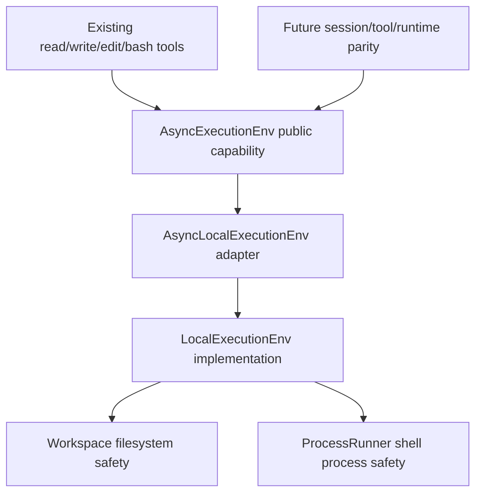
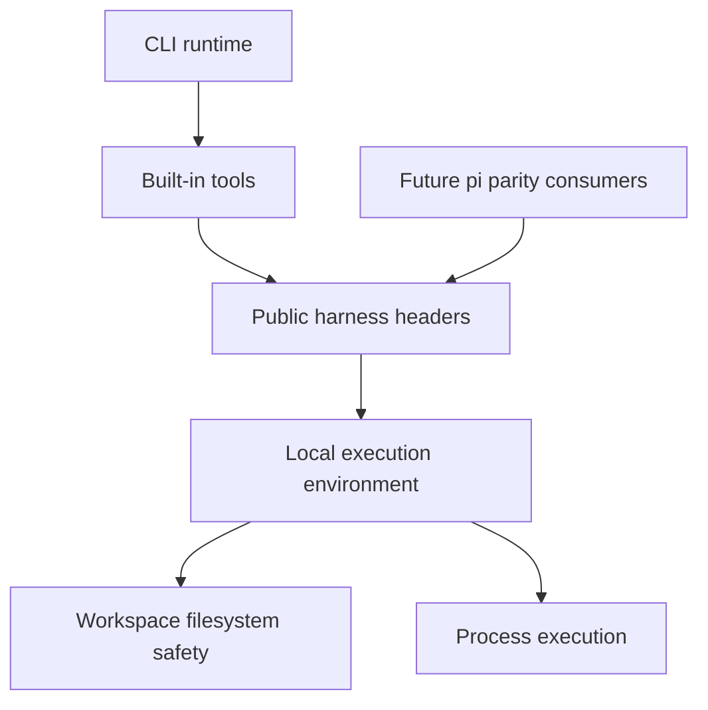

# refactor: Add execution environment capability parity

## Summary

Expand the C++ harness execution environment from the current tool-shaped read/write/edit/bash methods into a pi-shaped FileSystem/Shell capability seam. The plan keeps existing tool behavior stable while adding passive C++ values, richer filesystem operations, split shell stdout/stderr execution results, and tests that preserve the repository's stronger workspace containment and redaction posture.

---

## Problem Frame

The parity roadmap identifies T4 as the next major slice after AI and agent loop parity: richer execution environment and session tree support. The current `AsyncExecutionEnv` is intentionally narrow and tool-oriented, which blocks later pi parity work that expects a general filesystem and shell capability contract.

---

## Requirements

- R1. Introduce C++ execution-environment contracts that map to pi's `FileSystem`, `Shell`, `ExecutionEnvExecOptions`, `FileInfo`, and stable file/execution failure concepts without leaking implementation details.
- R2. Implement filesystem capability methods for path addressing, text/binary reads, writes/appends, metadata, directory listing, canonicalization, existence checks, directory creation/removal, and temporary file/directory creation.
- R3. Implement shell execution parity with cwd override, sanitized environment overrides, timeout handling, separate stdout/stderr capture, and optional chunk callbacks while preserving bash opt-in.
- R4. Preserve stronger C++ safety invariants: workspace containment for workspace-scoped operations, symlink escape protection, atomic writes where currently used, output limiting, and secret environment filtering.
- R5. Keep existing `read_file`, `write_file`, `edit_file`, and `bash` tools behavior-compatible for CLI users and tests.
- R6. Update roadmap/docs only where the implemented subset, public boundary, or parity status changes.

---

## Scope Boundaries

- This plan does not migrate JSONL sessions to pi's tree-entry format; session tree work remains a follow-up T4 slice.
- This plan does not expose new model-visible tools for the newly added filesystem operations; it expands the harness capability seam first.
- This plan does not add project trust, resource loading, skills, prompt templates, or extensions.
- This plan does not make the workspace guard a sandbox; README wording should continue to state that limitation.
- This plan does not weaken current CLI flags or tool schemas to match pi if pi's default is less restrictive.

### Deferred to Follow-Up Work

- Session tree write/context reconstruction parity: separate T4 implementation plan after this capability seam is stable.
- Tool schema reconciliation for pi read/write/edit/bash behavior: T5 plan after the expanded environment can support it.
- JSON/RPC mode surfaces that consume the richer execution environment: T8 plan after runtime contract decisions.

---

## Context & Research

### Relevant Code and Patterns

- `include/cch/harness/ExecutionEnv.hpp` currently exposes `AsyncExecutionEnv` with workspace, bash-enabled state, text file read/write/edit, and shell execution methods returning `util::Expected` values.
- `include/cch/harness/LocalExecutionEnv.hpp`, `src/harness/AsyncLocalExecutionEnv.cpp`, and `src/harness/LocalExecutionEnv.cpp` separate async public capability from local implementation and already route shell execution through `util::ProcessRunner`.
- `src/tools/PathGuard.hpp` is the existing containment and symlink-safety boundary for workspace file operations; POSIX paths use `openat`/`O_NOFOLLOW` patterns and atomic writes.
- `src/util/Process.hpp` and `src/util/Process.cpp` already provide async process execution, output caps, timeouts, process-group termination, and injected runners for tests.
- `src/tools/AsyncToolFactories.cpp` should remain a compatibility consumer of the environment rather than the owner of filesystem/shell semantics.
- `tests/harness/AsyncLocalExecutionEnvTest.cpp`, `tests/tools/PathGuardTest.cpp`, and `tests/tools/AsyncToolsTest.cpp` already cover file safety, async shell behavior, environment sanitization, timeout behavior, and tool compatibility.
- `tests/architecture/*` guard public include boundaries, forbidden dependency directions, and move-only callback expectations.

### Institutional Learnings

- No `docs/solutions/` directory exists in this repository, so there are no prior solution notes to carry forward.

### External References

- Local reference contract: `pi:packages/agent/src/harness/types.ts` defines `FileSystem`, `Shell`, `ExecutionEnvExecOptions`, `FileInfo`, `FileErrorCode`, and `ExecutionErrorCode`.
- Local reference implementation: `pi:packages/agent/src/harness/env/nodejs.ts` demonstrates path addressing, lstat-based metadata, text-line reads, binary reads, temp file/dir creation, shell stdout/stderr callbacks, timeout errors, and cleanup as a no-throw best-effort method.
- Roadmap source: `docs/plans/2026-06-16-001-refactor-pi-cpp-parity-todo.md` places execution environment parity before session tree and runtime/tool parity follow-ups.
- Contract inventory: `docs/plans/2026-06-16-003-refactor-pi-cpp-contract-inventory.md` classifies current filesystem capability parity as partial/deferred and shell capability as a prepared near-term seam.

---

## Key Technical Decisions

- Add pi-shaped capability methods without removing the current tool-shaped methods: this keeps existing tool factories and CLI smoke behavior stable while giving future T4/T5/T8 work a richer seam to consume.
- Avoid turning `AsyncExecutionEnv` into an all-or-nothing mock burden: keep existing tool-shaped methods pure, and give newly added pi-shaped filesystem/shell methods default `not_supported` implementations so focused test fakes can override only the surface they exercise.
- Represent pi contracts as passive C++ values and `std::expected` results: add typed file/execution error families for new pi-shaped methods, and keep the existing `util::Error` mapping at compatibility wrappers and tool boundaries.
- Keep workspace-scoped operations stricter than pi's generic Node implementation: addressed-path methods should be workspace-scoped in the C++ local environment, `canonicalPath` should reject resolved targets outside the workspace, and absolute paths should remain rejected for mutating/read operations.
- Move the workspace path-safety helper out of the tools package before expanding it: the current `src/tools/PathGuard.hpp` responsibility belongs under the harness implementation layer once `LocalExecutionEnv` depends on it for general filesystem parity.
- Use lstat-equivalent metadata for `fileInfo` and `listDir`: symlink entries are reported as symlinks without following targets, while read/write/remove/cwd operations reject symlink escape paths.
- Use workspace-contained temporary files and directories: this intentionally differs from pi's OS-temp default to preserve the C++ harness containment model; cleanup is best-effort and limited to artifacts created by the environment.
- Evolve `ProcessRunner` to carry split streams and callbacks: shell parity requires stdout/stderr separation and streaming hooks, with per-stream truncation owned by the process layer and the bash tool concatenating streams only for compatibility output.
- Strip explicit env overrides whose names match secret patterns or configured secret names: non-secret overrides may shadow sanitized base variables, but secret-like keys are not passed to child processes.
- Treat cleanup methods as no-op best-effort for now unless temp artifacts were created: document that implementations with owned resources should release them there, but the method must not become a hidden sandbox or lifecycle guarantee.

---

## Open Questions

### Resolved During Planning

- Which TODO item should be planned first from the roadmap: T4 execution environment capability parity was selected because T0-T3 are complete and this seam underpins later session/tool/runtime parity.
- Whether session tree migration should be included: it is deferred to keep this plan bounded and to avoid mixing filesystem/shell contract work with resume/context reconstruction semantics.
- Whether to follow pi's less restrictive absolute-path behavior exactly: the plan keeps the C++ workspace containment model stronger and documents parity as C++-idiomatic rather than a mechanical TypeScript copy.

### Deferred to Implementation

- Exact public method names: choose names that fit existing `Async*` conventions while clearly mapping back to pi's contract names.
- Whether binary writes need a dedicated byte container type beyond `std::string`: decide while touching the public contract, keeping aggregate-friendly values and test clarity as the constraint.
- Non-POSIX no-follow guarantees: POSIX should preserve `openat`/`O_NOFOLLOW`-style protection; Windows/reparse-point behavior may need documented best-effort limits or explicit fail-closed behavior where equivalent primitives are unavailable.
- Abort/cancellation support: pi has `AbortSignal`, but this slice should explicitly omit or defer cancellation unless an existing C++ caller needs it.
- Shell command secrecy: `bash -lc` command strings and command output are not redacted by this plan; callers must not place secrets in command text, and sandbox/output-redaction work remains deferred.

---

## High-Level Technical Design

> *This illustrates the intended approach and is directional guidance for review, not implementation specification. The implementing agent should treat it as context, not code to reproduce.*

The expanded public seam should be broad enough for future pi parity consumers, but the current model-visible tools should continue calling the existing compatibility methods or thin wrappers over the new primitives. Filesystem safety should move under the harness implementation layer; shell process behavior remains rooted in `ProcessRunner`.

---

## Implementation Units

### U1. Add pi-shaped public execution capability values

**Goal:** Define the passive value contracts needed for filesystem and shell parity before changing local behavior.

**Requirements:** R1, R3, R4

**Dependencies:** None

**Files:**

- Modify: `include/cch/harness/ExecutionEnv.hpp`
- Modify: `include/cch/util/Error.hpp`
- Test: `tests/harness/AsyncLocalExecutionEnvTest.cpp`
- Test: `tests/architecture/PublicHeaderBoundaryTest.cpp`
- Test: `tests/architecture/ArchitectureSurfaceScanTest.cpp`

**Approach:**

- Add public value types such as file kind, file info, file/execution error codes, filesystem results, shell exec options, split shell exec results, and cleanup outcomes.
- Prefer aggregate-friendly `struct` and `enum class` contracts; avoid provider-specific DTOs, Glaze types, implementation helper includes, and inheritance-heavy error classes.
- Add typed file/execution error families for the new pi-shaped methods, with compatibility methods mapping failures back to `util::Error` for existing callers.
- Add the pi-shaped capability surface while retaining current `read_file`, `write_file`, `edit_file`, and `run_shell` methods for compatibility; give new pi-shaped methods default `not_supported` implementations to avoid forcing every focused fake to stub every filesystem method.
- Document cleanup on the public contract as best-effort and non-throwing; the local environment should only have meaningful cleanup when it creates temp artifacts.

**Execution note:** Start with compile/contract tests for representative value construction and public header inclusion before filling in local behavior.

**Patterns to follow:**

- Passive values in `include/cch/ai/Content.hpp`, `include/cch/ai/Message.hpp`, and `include/cch/util/Error.hpp`.
- Existing public/private boundary checks in `tests/architecture/PublicHeaderBoundaryTest.cpp`.

**Test scenarios:**

- Happy path: public headers compile when a translation unit constructs each new public type by name with sample field values and aggregate initialization, without including `src` headers.
- Happy path: a focused fake can override only the existing tool-shaped methods without implementing every new pi-shaped filesystem method when defaults or subinterfaces are intended to provide that relief.
- Happy path: a complete fake can override the full pi-shaped capability surface using `boost::asio::awaitable<std::expected<...>>`-style signatures.
- Edge case: public contracts do not require Glaze DTOs, Boost.JSON, private `src` headers, or copy-only callback types.
- Error path: every file/execution error enumerator used by the new capability methods has explicit stringification or assertion coverage, rather than silently falling back to `unknown`.
- Integration: existing test fakes such as the bash-capturing environment still compile after the interface expansion.

**Verification:**

- The public harness contract exposes a pi-mappable capability surface without breaking existing tool consumers or architecture tests.

---

### U2. Extend workspace filesystem operations through PathGuard

**Goal:** Implement the new filesystem capability methods with central containment and symlink-safety behavior.

**Requirements:** R2, R4

**Dependencies:** U1

**Files:**

- Move/modify: `src/tools/PathGuard.hpp` -> `src/harness/WorkspaceFileSystem.hpp` or equivalent harness-private path-safety helper
- Move/modify: `src/tools/AtomicWrite.hpp` -> `src/harness/AtomicWrite.hpp` or equivalent harness-private atomic write helper
- Move/modify: `src/tools/OutputLimiter.hpp` -> `src/util/OutputLimiter.hpp` or equivalent shared private output-limit helper
- Modify: `src/harness/LocalExecutionEnv.hpp`
- Modify: `src/harness/LocalExecutionEnv.cpp`
- Modify: `src/harness/AsyncLocalExecutionEnv.cpp`
- Modify: `CMakeLists.txt`
- Move/test: `tests/tools/PathGuardTest.cpp` -> `tests/harness/WorkspaceFileSystemTest.cpp` or equivalent
- Test: `tests/harness/AsyncLocalExecutionEnvTest.cpp`

**Approach:**

- Move the path-safety helper and its atomic-write dependency into the harness implementation layer before broadening them; move generic output limiting out of tools so harness no longer includes tools internals.
- Add workspace-filesystem operations for addressed paths, metadata, directory listing, canonical path, existence checks, directory creation/removal, text lines, binary reads, append, and workspace-contained temp paths.
- Preserve `read_file` truncation semantics by implementing it as a compatibility behavior rather than changing model-visible output in this unit.
- Keep symlink behavior explicit: metadata/listing use lstat-equivalent no-follow semantics; reads/writes/removes/cwd traversal reject symlink escape paths; recursive remove must not follow symlinks to external targets.
- Keep `absolutePath`/addressed path behavior restrictive: paths that would leave the workspace return a containment error rather than an external absolute path.
- Keep `canonicalPath` explicit but contained: it may resolve symlinks, but an outside-workspace resolved target should return an error to avoid leaking host topology through the C++ harness.
- Create temp files/directories inside the workspace under an implementation-owned temp area, track only those artifacts for cleanup, and make cleanup idempotent.
- Treat non-POSIX no-follow gaps as a first-class implementation note: either implement fail-closed behavior for unsafe operations or document best-effort limitations with tests that pin the chosen behavior.

**Execution note:** Add characterization tests around existing read/write/edit behavior before refactoring those methods to share new primitives.

**Patterns to follow:**

- Existing `PathGuard::read_existing_file` and `PathGuard::write_file` behavior for no-follow and atomic write behavior, after moving the helper under harness ownership.
- Existing `AsyncLocalExecutionEnv` delegation pattern from async wrapper to local implementation.

**Test scenarios:**

- Happy path: listing a directory with a regular file, empty subdirectory, and symlink returns direct child metadata with names, addressed paths, kinds, sizes, and modification times using no-follow metadata.
- Happy path: `fileInfo` on a symlink to an outside or missing target reports the symlink entry itself without following the target.
- Happy path: listing an empty directory returns an empty list; listing a regular file returns a not-directory-style error; listing a missing path returns a not-found-style error.
- Happy path: reading text lines with a maximum line count stops after the requested number of lines; max greater than file length returns all lines; empty files return an empty list.
- Happy path: binary read/write and append preserve embedded null bytes and high-bit bytes with exact length and byte-at-position equality.
- Happy path: creating a nested directory recursively and then removing it recursively succeeds inside the workspace.
- Happy path: `createTempDir` and `createTempFile` create workspace-contained artifacts with requested prefix/suffix, and cleanup removes tracked artifacts; repeated cleanup is a no-op.
- Edge case: `exists` returns false for a missing path but returns an error for a path whose parent escapes, contains an escaping symlink, or otherwise violates workspace rules.
- Edge case: broken and valid symlink entries have documented `exists` behavior, with tests pinning the chosen no-follow semantics.
- Edge case: `absolutePath("..")` or equivalent addressed-path escape returns a containment error.
- Edge case: canonical path resolves an existing symlink target only through the explicit canonicalization method and rejects resolved targets outside the workspace.
- Error path: absolute paths and `..` escapes remain rejected for workspace-scoped operations.
- Error path: reading text lines through a parent symlink to outside the workspace returns a containment error.
- Error path: recursive remove of a directory containing a symlink to an outside directory does not delete the outside target.
- Error path: removing the workspace root itself is rejected.
- Integration: current `read_file`, `write_file`, and `edit_file` still pass their existing tests after sharing the expanded filesystem implementation.

**Verification:**

- Filesystem capability tests demonstrate pi-shaped behavior while preserving stronger workspace containment and existing tool-facing semantics.

---

### U3. Add shell exec parity on top of ProcessRunner

**Goal:** Expand shell execution from a combined-output bash helper into a pi-mappable shell capability with split streams, options, and callback-aware failure behavior.

**Requirements:** R3, R4

**Dependencies:** U1

**Files:**

- Modify: `src/util/Process.hpp`
- Modify: `src/util/Process.cpp`
- Modify: `src/harness/LocalExecutionEnv.hpp`
- Modify: `src/harness/LocalExecutionEnv.cpp`
- Modify: `src/harness/AsyncLocalExecutionEnv.cpp`
- Test: `tests/harness/AsyncLocalExecutionEnvTest.cpp`

**Approach:**

- Extend process requests/results with separate stdout and stderr fields while retaining the existing combined `output` field as a compatibility alias for this slice.
- Add shell exec options for cwd override, environment overrides, timeout, and optional stdout/stderr chunk callbacks; explicitly defer abort/cancellation unless a current C++ caller needs it.
- Validate cwd overrides through the same workspace containment and symlink-safety layer used by filesystem operations before spawning a process, not by lexical checks alone.
- Build child environments from the sanitized base environment, apply non-secret explicit overrides with last-write-wins semantics, and strip override keys that match implicit or configured secret-name patterns.
- Expand secret-name heuristics to cover common key/credential/private-key/auth/JWT/certificate/passphrase patterns, while documenting that heuristic filtering and shell output are not a complete redaction boundary.
- Wrap callbacks in exception handling so callback failures become execution errors and trigger safe process-group termination rather than unwinding past `ChildGuard` cleanup.
- Let the process layer own per-stream truncation and markers; avoid double truncation in `LocalExecutionEnv::shell_result_from_process` once split streams exist, and build the compatibility `output` field by deterministic stdout/stderr concatenation.
- Translate timeout, unavailable shell, spawn failure, callback failure, and unknown process errors into stable typed execution failures or result flags consistent with the chosen public contract.

**Patterns to follow:**

- Current `LocalExecutionEnv::make_shell_request` for bash opt-in and sanitized environment construction.
- Current `DefaultProcessRunner::run` for async pipe draining, output caps, and process-group termination.

**Test scenarios:**

- Happy path: executing a command that writes to stdout and stderr returns separate streams and a zero exit code.
- Happy path: stdout-only and stderr-only commands return the used stream content and an empty unused stream.
- Happy path: cwd override runs the command from a workspace subdirectory and rejects a cwd that escapes, does not exist, or traverses a symlink out of the workspace before spawning.
- Happy path: environment override makes a non-secret variable visible to the child process while sanitized secret defaults remain absent.
- Edge case: empty env override behaves like no override; empty-string override values are preserved; non-secret overrides shadow sanitized base values.
- Edge case: explicit overrides for secret-like keys such as `OPENAI_API_KEY`, configured secret names, access keys, private keys, auth tokens, JWT secrets, and certificates are stripped from the child environment.
- Edge case: a large stdout-only or stderr-only stream is capped and marked consistently without waiting for line breaks.
- Edge case: simultaneous large stdout and stderr streams are capped independently with per-stream truncation markers, and the bash compatibility output concatenates them deterministically.
- Error path: shell execution remains unavailable when bash is not explicitly enabled.
- Error path: nonzero process exit codes are preserved distinctly from timeout, spawn failure, and signal/termination cases.
- Error path: timeout terminates the process group and reports timeout without blocking the caller's I/O context.
- Error path: a throwing stdout or stderr callback is caught, reported as a callback execution failure, and terminates the child safely.
- Integration: concurrent shell executions still complete concurrently through the async process runner, including runs with different env overrides that must not cross-contaminate.

**Verification:**

- Shell capability tests prove split stream parity, cwd/env option handling, output limiting, timeout behavior, and bash opt-in safety.

---

### U4. Preserve existing tool contracts on the expanded environment

**Goal:** Keep model-visible built-in tools stable while migrating their internals to the richer environment seam where useful.

**Requirements:** R4, R5

**Dependencies:** U1, U2, U3

**Files:**

- Modify: `src/tools/AsyncToolFactories.cpp`
- Test: `tests/tools/AsyncToolsTest.cpp`
- Test: `tests/cli/CliSmokeTest.cpp`

**Approach:**

- Keep current tool names, JSON schema shapes, required arguments, timeout clamping, output strings, and error-result behavior unless a test explicitly justifies a compatibility-preserving internal change.
- Let the bash tool continue rendering the existing combined `exit_code=...` output, using the new split shell result only as an implementation detail.
- Keep file tools' current truncation and edit ambiguity behavior as the model-visible contract for this slice.
- Avoid exposing the newly added filesystem operations as tools in this plan; that belongs to T5 tool parity.

**Patterns to follow:**

- Existing argument parsing and error-result helpers in `src/tools/AsyncToolFactories.cpp`.
- Existing CLI semantic event assertions in `tests/cli/CliSmokeTest.cpp`.

**Test scenarios:**

- Happy path: `read_file` with offset/limit returns the same text as before after the environment refactor.
- Happy path: `read_file` with `limit=0` returns all remaining lines from the offset.
- Happy path: `write_file` reports the same byte-count output as before.
- Happy path: `bash` still reports combined output with `exit_code=` and marks nonzero exits/timeouts as tool errors.
- Edge case: `read_file` with offset normalization and offset past the file end preserves existing behavior as pinned by characterization tests.
- Edge case: oversized bash timeout is still clamped to the existing maximum.
- Error path: timed-out bash tool output includes the timeout marker/flag in the existing CLI-visible format after split-stream internals land.
- Error path: ambiguous edit replacement still returns an error result and leaves the file unchanged.
- Error path: missing or malformed tool arguments still produce stable invalid-argument error content.
- Integration: CLI fake-provider smoke tests still print the same semantic event sequence for read/write/bash scenarios.

**Verification:**

- Existing built-in tool tests and CLI smoke tests pass without requiring prompt-visible schema changes.

---

### U5. Update parity documentation and guardrails

**Goal:** Record the completed T4 capability slice without overstating later session/tool/runtime parity.

**Requirements:** R6

**Dependencies:** U1, U2, U3, U4

**Files:**

- Modify: `README.md`
- Modify: `docs/plans/2026-06-16-001-refactor-pi-cpp-parity-todo.md`
- Modify: `docs/plans/2026-06-16-003-refactor-pi-cpp-contract-inventory.md`
- Modify: `CMakeLists.txt`
- Test: `tests/architecture/CMakeDependencyTest.cpp`
- Test: `tests/architecture/PublicHeaderBoundaryTest.cpp`
- Test: `tests/architecture/ArchitectureSurfaceScanTest.cpp`

**Approach:**

- Update the architecture/module map only to describe the new execution environment capability seam and the still-deferred session tree work.
- Check off or narrow the relevant T4 roadmap item only after tests prove the new FileSystem/Shell subset.
- Keep the roadmap as a roadmap, not a changelog; link to this implementation plan if detailed traceability is needed.
- Ensure any moved/new source files are added to `CMakeLists.txt` under the existing package-style targets without reversing dependency direction.
- Add or preserve architecture checks that `cch_harness` does not depend on `cch_tools` or `cch_agent`; moving path safety under harness should remove the existing reverse include pressure rather than codify it.
- Rely on dynamic public-header scans for new public headers, and extend them if new harness headers would otherwise evade checks for private includes, Glaze/Boost.JSON leakage, or legacy result types.

**Patterns to follow:**

- README's current architecture-boundary and deferred-feature wording.
- Roadmap conventions in `docs/plans/2026-06-16-001-refactor-pi-cpp-parity-todo.md`.

**Test scenarios:**

- Integration: package-style CMake dependency tests still show harness/util/tools dependencies flowing in the intended direction, including no harness dependency on tools after the path-safety helper move.
- Integration: any new or moved `.cpp` files under harness/util are registered in the corresponding CMake target so they are compiled by default.
- Integration: new public headers under `include/cch/` are covered by the same scans as existing headers: no `src` includes, no Glaze/Boost.JSON domain leakage, no `util::Result`, and no provider DTO dependencies.
- Test expectation: none for prose-only documentation edits beyond the architecture/build graph checks above.

**Verification:**

- Documentation accurately says execution environment parity is expanded while session tree, resources, TUI, JSON/RPC, and sandboxing remain deferred.

---

## System-Wide Impact

- **Interaction graph:** Public harness contracts feed both current tools and future session/runtime/tool parity consumers; local implementation fans out to harness-owned workspace filesystem safety and process execution layers.
- **Error propagation:** New filesystem/process failures should use typed pi-mappable error families, with compatibility wrappers and tool factories converting them into existing model-visible `util::Error`-backed error results only at boundaries.
- **State lifecycle risks:** Temp artifacts, recursive removal, process groups, and callbacks introduce cleanup/failure-order risks; cleanup should be best-effort and operation results should not throw across capability boundaries.
- **API surface parity:** The expanded environment surface becomes shared by tools, runtime, and future resources, so additions should be coherent but should not force focused fakes or future alternate environments to implement unrelated methods unnecessarily.
- **Security boundary:** Workspace containment, secret env filtering, and output caps are defense-in-depth measures, not sandboxing or output redaction guarantees; command text and command output can still leak secrets if callers provide them.
- **Integration coverage:** Tool and CLI tests are required because public capability parity alone will not prove existing model-visible behavior stayed stable.
- **Unchanged invariants:** Public headers stay under `include`, implementation helpers stay under `src`, bash remains opt-in, workspace guard remains a safety boundary but not a sandbox, and no provider/Glaze DTOs enter harness contracts.

---

## Risks & Dependencies

| Risk | Mitigation |
|------|------------|
| Expanding filesystem APIs accidentally weakens symlink or workspace escape protections. | Route operations through a harness-owned workspace filesystem helper, add symlink/escape tests for list/read/write/remove/canonicalize/cwd, and keep stronger C++ semantics where pi is less restrictive. |
| Moving path safety exposes an existing package-boundary mismatch. | Move the helper out of `src/tools/` before expanding it and add architecture checks so harness no longer depends on tools internals. |
| New public methods break every fake environment implementation in tests. | Add U1 contract changes first, provide focused-fake relief through default `not_supported` methods on new pi-shaped operations, update complete fakes deliberately, and keep compatibility wrappers for existing tools. |
| Typed file/execution errors diverge from existing `util::Error` flows. | Use typed pi-mappable errors for new capability methods and explicit compatibility mapping at existing tool-shaped methods. |
| Shell env overrides could reintroduce secret leakage. | Build from sanitized environment, strip explicit secret override names, expand heuristic patterns, and test absent secret keys with injected process runner requests. |
| Output truncation becomes inconsistent after split streams. | Make `ProcessRunner` own per-stream caps and markers, remove double-truncation risk in env compatibility rendering, and test simultaneous stdout/stderr truncation. |
| Split stdout/stderr changes bash tool output. | Keep combined output rendering in `AsyncToolFactories.cpp` as a compatibility layer and assert existing output shape. |
| Temporary files/directories create cleanup ambiguity. | Use workspace-contained tracked temp artifacts, make cleanup idempotent, and document the deliberate deviation from pi's OS-temp default. |
| Cross-platform filesystem semantics diverge on POSIX vs non-POSIX. | Keep platform-specific safety code localized in the harness workspace filesystem helper, test semantic outcomes rather than errno text, and document unsupported or degraded no-follow behavior explicitly if needed. |
| Shell execution can still leak secrets through command text or output. | Document that env filtering is not a sandbox or output redactor, and leave deeper sandbox/output-redaction work deferred. |

---

## Documentation / Operational Notes

- README should mention the richer harness execution environment only after implementation lands; it should not imply new model-visible tools, resource loading, or sandboxing.
- The parity roadmap should mark only the execution environment capability portion as complete or narrowed; session tree and branch/context reconstruction remain active follow-up work.
- No live provider/API validation is required for this slice; validation should be local C++ tests and CLI fake-provider smoke coverage.

---

## Sources & References

- Origin roadmap: `docs/plans/2026-06-16-001-refactor-pi-cpp-parity-todo.md`
- Contract inventory: `docs/plans/2026-06-16-003-refactor-pi-cpp-contract-inventory.md`
- C++ public harness contract: `include/cch/harness/ExecutionEnv.hpp`
- C++ local environment: `include/cch/harness/LocalExecutionEnv.hpp`, `src/harness/LocalExecutionEnv.cpp`, `src/harness/AsyncLocalExecutionEnv.cpp`
- C++ path/process helpers: `src/tools/PathGuard.hpp` and `src/tools/AtomicWrite.hpp` (to move under harness ownership), `src/tools/OutputLimiter.hpp` (to move under shared private utility ownership), `src/util/Process.hpp`, `src/util/Process.cpp`
- C++ tools/tests: `src/tools/AsyncToolFactories.cpp`, `tests/harness/AsyncLocalExecutionEnvTest.cpp`, `tests/tools/PathGuardTest.cpp` (to move or replace under harness tests), `tests/tools/AsyncToolsTest.cpp`, `tests/cli/CliSmokeTest.cpp`
- pi reference contract: `pi:packages/agent/src/harness/types.ts`
- pi reference local implementation: `pi:packages/agent/src/harness/env/nodejs.ts`
