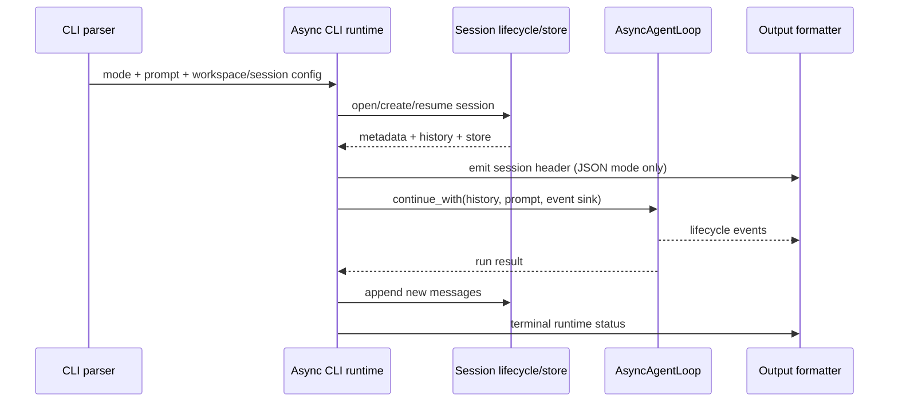
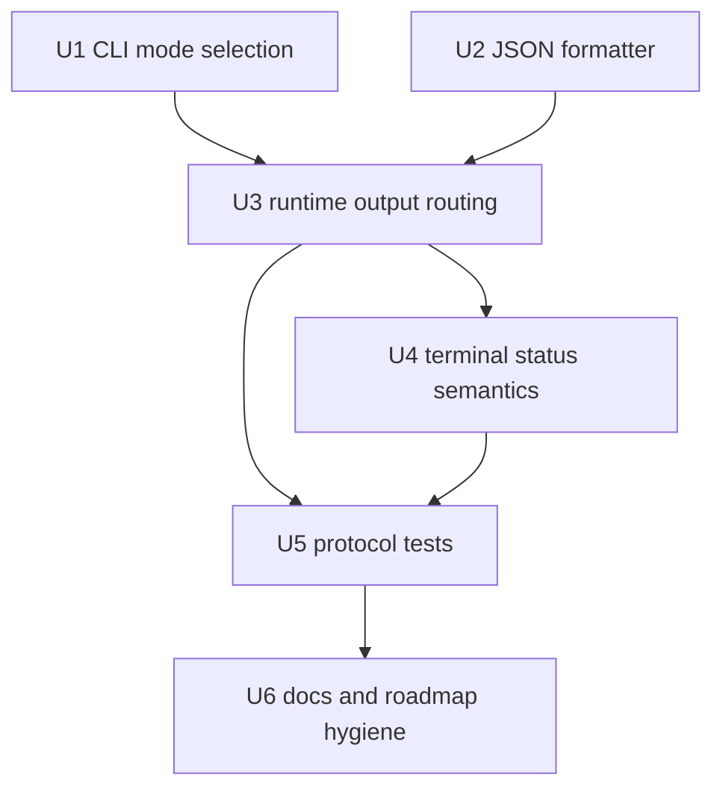
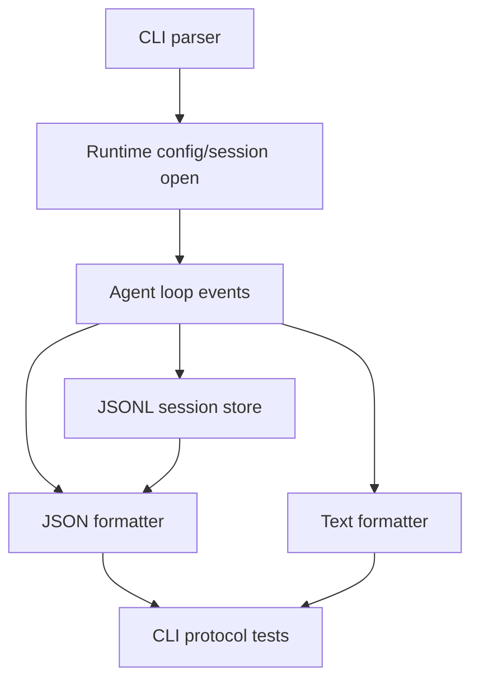

# feat: Add JSON event stream mode

## Summary

Add the first T8 machine-readable surface by introducing a pi-aligned JSON event stream mode for one-shot runs. The plan keeps the existing text CLI unchanged, emits JSONL-only stdout in JSON mode, and deliberately defers the larger RPC command loop and C++ SDK surface until the runtime/session/resource seams are ready.

---

## Problem Frame

The current harness has a stable human-oriented semantic line printer, but machine consumers still have to scrape text output and cannot reliably distinguish assistant deltas, tool execution, max-turn termination, and runtime errors. pi defines JSON mode as the first headless integration surface, so the C++ harness needs a portable JSONL contract before investing in RPC, SDK, or TUI surfaces.

---

## Requirements

- **R1.** Add a CLI mode selector with default text behavior preserved and a JSON mode that emits machine-readable JSON lines on stdout.
- **R2.** In JSON mode, stdout contains only LF-delimited JSON objects after mode/preflight parsing succeeds; final assistant text and REPL prompts must not corrupt JSONL.
- **R3.** Emit an initial session header JSON object after session open and before agent lifecycle events.
- **R4.** Map the stable subset of `AgentLifecycleEvent` into a named C++ JSON stream schema v1 that uses pi event names where they fit and documents payload deviations/omissions.
- **R5.** Provide deterministic correlation fields for machine consumers: turn number where available, tool call id/name where available, and a monotonic sequence number assigned by a stateful runtime formatter.
- **R6.** Preserve existing text mode output, exit codes, session persistence, workspace validation, provider preflight behavior, and CLI smoke behavior unless JSON mode explicitly changes presentation.
- **R7.** Represent terminal outcomes in JSON mode with a durable runtime terminal record that is emitted only after session append succeeds, or with a terminal error after a post-header failure.
- **R8.** Keep sensitive or unstable data out of the first JSON contract through explicit payload allow-lists: no raw streamed tool-call argument deltas, no raw thinking/reasoning text, no full unprojected assistant message DTOs, no provider DTO leakage, and no unstated raw tool-output exposure.
- **R9.** Explicitly defer RPC command processing and the embeddable C++ SDK to follow-up T8 plans with narrow, tested contracts.
- **R10.** Add tests that parse stdout and stderr separately, validate JSONL framing, and protect text-mode compatibility.
- **R11.** Apply bounded diagnostic and payload handling for JSON mode: stable error codes, no secret values or raw provider/tool payloads in error objects, valid JSON string escaping, and observable truncation/omission behavior for oversized or control-character-heavy content.

---

## Scope Boundaries

- No `--mode rpc` implementation in this plan; RPC command/response handling is a follow-up after JSON mode and a reusable session runner seam exist.
- No public C++ SDK header or ABI promise in this plan; SDK design remains source-level and experimental until agent/session/resource seams stabilize.
- No session tree navigation, branch reconstruction, compaction control, extension UI protocol, package/resource loading, prompt templates, or slash-command execution.
- No `--no-session` support; JSON mode uses the existing session lifecycle and session persistence rules.
- No change to the provider transport, model registry behavior, or active T5 tool/config semantics beyond formatting their existing events.
- No raw thinking or raw streamed tool-argument output in the stable JSON v1 contract; these may be added later behind explicit contract decisions.
- No full-message passthrough to stdout without a projection layer; complete assistant messages can contain tool-call arguments or future reasoning fields that bypass the v1 exclusions.
- No API key values, API-key environment names, provider base URLs, config file paths, session file paths, transport details, or provider DTO fields in JSON session headers or terminal error payloads.

### Deferred to Follow-Up Work

- **T8 RPC mode:** strict stdin/stdout JSONL command loop with request ids, structured responses, prompt acceptance semantics, state/messages commands, unsupported-command responses, and clean shutdown behavior.
- **T8 SDK surface:** narrow C++ source-level session/runtime API that lets a host application register tools, send prompts, receive events, and dispose cleanly without depending on CLI globals.
- **Extended pi events:** queue updates, compaction events, auto-retry events, extension errors, extension UI requests, bash RPC command messages, and branch/fork session events.
- **Runtime/session replacement:** new-session, switch-session, fork, clone, and tree navigation flows once T4 branch reconstruction exists.

---

## Context & Research

### Relevant Code and Patterns

- `src/main.cpp` owns CLI11 parsing, validation, default session path generation, workspace canonicalization, and mapping into `cli::AsyncCliRuntimeConfig`.
- `src/AsyncCliRuntime.hpp` defines the runtime input DTO passed from CLI parsing into the async runtime.
- `src/AsyncCliRuntime.cpp` currently owns config/provider resolution, session open, runtime service creation, event sink wiring, session append, final assistant text printing, and REPL loop.
- `src/coding_agent/runtime/EventPrinter.cpp` is the existing text presentation seam and prints selected `AgentLifecycleEvent` variants to an arbitrary `std::ostream`.
- `include/cch/agent/AgentEvent.hpp` already carries richer provider-neutral lifecycle events than text mode prints, including message lifecycle, thinking deltas, tool-call streaming, tool execution, and agent end.
- `include/cch/ai/glaze/AiJson.hpp` contains message/content JSON DTO conversion helpers. JSON event formatting should reuse these at the runtime serialization boundary rather than introducing provider DTOs into domain contracts.
- `include/cch/util/Json.hpp` provides `JsonValue` and Glaze-backed JSON serialization. This is the preferred dynamic JSON boundary for runtime event objects.
- `src/coding_agent/runtime/SessionLifecycle.*` owns create/resume behavior and stored session metadata extraction.
- `tests/cli/CliSmokeTest.cpp` currently captures stdout and stderr together via `2>&1`; JSON protocol tests need a separate-capture helper.
- `tests/architecture/*` protect package target direction, public header boundaries, no `src` public leakage, no Boost.JSON domain contracts, and move-only callbacks.

### Institutional Learnings

- `docs/plans/2026-06-16-001-refactor-pi-cpp-parity-todo.md` places T8 after the runtime/tool/config seams and before large TUI investment; JSON event stream mode is the first machine-readable surface.
- `docs/plans/2026-06-16-002-refactor-pre-implementation-cleanup-plan.md` established package targets, runtime services, provider registry, async shell execution, and event seams so future JSON/RPC/TUI consumers do not depend on CLI printing internals.
- `docs/plans/2026-06-18-001-feat-pi-ai-contract-parity-plan.md` aligned provider-neutral message/content/stream contracts and kept provider compatibility transforms under provider/serialization layers.
- `docs/plans/2026-06-19-005-feat-session-tree-write-support-plan.md` added v3 session tree write support while leaving context reconstruction and branch navigation deferred; JSON mode should not imply those flows are available.
- `docs/plans/2026-06-19-004-refactor-execution-env-capability-parity-plan.md` emphasizes that workspace containment is not a sandbox and that command/file outputs can still be sensitive.

### External References

- `pi:packages/coding-agent/docs/json.md` defines JSON mode as JSONL stdout with a session header followed by `AgentSessionEvent` objects.
- `pi:packages/coding-agent/docs/rpc.md` defines strict LF-delimited stdin/stdout JSONL commands, responses, and events; this plan uses it to shape deferral boundaries, not to implement RPC yet.
- `pi:packages/coding-agent/docs/sdk.md` distinguishes `AgentSession` from `AgentSessionRuntime`; this plan keeps SDK as follow-up because the C++ runtime replacement/resource seams are not complete.
- `pi:packages/coding-agent/src/modes/rpc/rpc-types.ts` shows the large RPC command matrix that should not be accidentally promised by a small JSON output slice.

---

## Key Technical Decisions

| Decision | Rationale |
| --- | --- |
| Implement JSON mode before RPC/SDK | JSON mode is the first pi machine-readable surface and can be delivered on the existing event sink without committing to stdin command concurrency, session replacement, resources, compaction, or extension UI. |
| Add a CLI mode selector with text as the default | Aligns with pi's `--mode json` shape while preserving current CLI behavior for existing users and tests. Unsupported RPC mode should be rejected before session creation, not after a session file is opened. |
| Define C++ JSON stream schema v1 as a pi-named subset | The stream uses pi event names where current C++ events map cleanly, but it is not full `AgentSessionEvent` compatibility. The schema should include a stream `schemaVersion` distinct from persisted session format version and document omitted pi payloads/events. |
| Reject JSON mode with REPL in the first slice | The current REPL prints prompts to stdout; allowing it would corrupt JSONL unless a separate JSON prompt protocol is designed. |
| Keep the JSON formatter internal to runtime | Avoids adding public SDK surface prematurely and keeps serialization machinery localized to the coding-agent runtime boundary. |
| Use a stateful formatter object, not a stateless print helper | JSON mode needs monotonic sequence assignment, header sequencing, unsupported-event policy, and terminal-status coordination. |
| Add a durable runtime terminal status after session append | The agent loop can end successfully before persistence completes; machine clients should not receive a durable success signal if session append fails. Successful loop `agent_end` should not be exposed as the final durable success record before append completes. |
| Treat session-header metadata as sensitive and source-bound | The header should include only an allow-listed subset that is authoritative at the point it is emitted. Provider/model fields must not be stale config defaults, and secret/config/base-url/session-file fields stay out. |
| Expose safe correlation fields, not unstable raw internals | `turn`, `seq`, `toolCallId`, and `toolName` support clients without freezing raw streamed arguments, provider DTOs, or T5 tool detail shapes. Tool result bodies require an explicit v1 exposure/truncation policy, not a vague “sanitized” label. |
| Keep pre-session failures stderr-only | JSON v1 is a post-session event protocol, not a complete CLI machine protocol. Some failures occur before a session header can exist; these return non-zero with bounded stderr diagnostics and no stdout. After the header, terminal runtime failures get JSON records. |
| Apply one diagnostic redaction boundary to stderr and JSON errors | Stable machine codes are safe to expose; human details should be bounded and must not include API key values, authorization headers, raw provider payloads, raw prompts, or full command/tool output. |

---

## Open Questions

### Resolved During Planning

- **Should T8 be one large JSON+RPC+SDK plan or a JSON-first plan?** JSON-first. RPC and SDK are named follow-ups because the current C++ runtime lacks stable command-loop, resource, branch, compaction, and replacement-runtime semantics.
- **Should JSON mode use pi event names or a C++-specific event vocabulary?** Use a C++ JSON stream schema v1 with pi-named events for the supported subset. This is not full pi `AgentSessionEvent` compatibility; omitted fields and event families are documented.
- **Should JSON mode preserve the final plain assistant text line?** No. Text mode keeps the final assistant line; JSON mode represents assistant text through event objects only.
- **Should JSON mode expose thinking and streamed tool-call argument deltas?** Not in stable v1. Omit or mark intentionally unsupported until an explicit security/stability decision is made.
- **Should successful completion be tied to agent-loop completion or session persistence?** The JSON terminal success should reflect runtime completion after session persistence; a persistence failure must produce a non-zero terminal status.
- **Should provider/model appear in the first JSON header?** No for v1 unless runtime ordering is changed before implementation to make those values authoritative. The v1 header is a protocol/session header, not a runtime capability handshake; effective provider/model can be added later through a distinct event or a documented header revision.
- **Should tool result bodies appear in v1 JSON?** Only through an explicit allow-listed summary/truncation policy. JSON stdout should be treated as at least as sensitive as the session transcript when content bodies are included.

### Deferred to Implementation

- Exact compact JSON field ordering is an implementation detail; tests should assert required fields and parseability rather than brittle key order.
- Exact wording of human-readable error messages is implementation-time; stable machine codes such as `max_turns_exceeded` should be asserted.
- Whether unsupported internal event variants are silently omitted or emitted as experimental diagnostics should be decided conservatively during formatter implementation; the stable v1 contract should omit them.
- The final helper names and file split can adjust during implementation as long as formatting stays inside `cch_coding_agent_runtime` and public domain contracts stay clean.

---

## JSON v1 Event Contract

This plan defines a C++ JSON stream schema v1, not full pi `AgentSessionEvent` compatibility. Event names are pi-named where that helps future parity, but required fields and omissions are pinned by the table below.

| Event/record | Required v1 fields | Explicit omissions / notes |
| --- | --- | --- |
| `session` header | `type`, stream `schemaVersion`, `seq`, session id, persisted session version, created timestamp, workspace/cwd display value if allowed | No provider base URL, API-key env/name/value, config path, session file path, transport details, provider DTOs, or non-authoritative provider/model claims. |
| `agent_start` | `type`, `schemaVersion`, `seq` | Do not emit `AgentStartEvent::prompt`; raw prompts may contain secrets/source. |
| `turn_start` / `turn_end` | `type`, `schemaVersion`, `seq`, `turn`; `turn_end` includes stop reason if available | No pi full `message`/`toolResults` payload in v1. |
| `message_start` / `message_update` / `message_end` | `type`, `schemaVersion`, `seq`, `turn`; text delta/update records include bounded escaped text payload and omission/truncation metadata when applicable | No raw thinking/reasoning text, raw tool-call argument JSON, or unprojected full message DTO passthrough. |
| `tool_execution_start` / `tool_execution_end` | `type`, `schemaVersion`, `seq`, `turn`, `toolCallId`, `toolName`; completion includes `isError` and content status metadata | Tool args, partial tool results, and raw result bodies omitted by default unless a bounded allow-listed preview is explicitly implemented. Omission/truncation reason must be machine-readable. |
| `runtime_terminal` | `type`, `schemaVersion`, `seq`, `success`, stable `code`, optional bounded message | Exactly one final runtime terminal record after stream phase. It alone determines durable outcome. Success is emitted only after session append succeeds; post-side-effect failures should warn clients that retry may repeat tool side effects. |

Unsupported pi event families in v1 include queue updates, compaction, auto-retry, extension errors/UI, branch/fork/session replacement, RPC command responses, and bash RPC execution messages. Unsupported C++ lifecycle variants such as queued-message events, thinking updates, and tool-call stream start/update/end must be either omitted or represented only by the table's safe projected records.

Future RPC/SDK compatibility constraint: records that represent agent/session lifecycle (`session`, turn/message/tool events, and `runtime_terminal`) should be reusable as RPC/SDK event payloads. CLI-process-only concerns such as process exit codes, stderr treatment, and one-shot startup failures are not part of that reusable event schema unless a later RPC/SDK plan promotes them explicitly.

---

## High-Level Technical Design

> *This illustrates the intended approach and is directional guidance for review, not implementation specification. The implementing agent should treat it as context, not code to reproduce.*

Text mode keeps using the current semantic line formatter and final assistant print. JSON mode uses a parallel stateful JSON formatter and suppresses human-only stdout. Runtime-level errors before session open remain stderr-only; after the session header, JSON mode emits terminal failure objects before returning non-zero.

The stream has three protocol phases:

| Phase | Stdout contract | Failure handling |
| --- | --- | --- |
| Pre-header | No JSON record guaranteed; stdout should remain empty on failures | Argument/preflight/session-open failures return non-zero with bounded stderr diagnostics |
| Streaming | Every stdout record is one compact JSON object with `schemaVersion`/`seq` policy established by the formatter | Formatter, runtime service, provider, and loop failures are recorded for terminal handling |
| Terminal | Last record is durable success after append or a terminal error after a post-header failure | No successful terminal record is emitted before session persistence succeeds |

---

## Implementation Units

### U1. Add CLI mode selection while preserving text mode

**Goal:** Introduce a mode selector that defaults to current text behavior and recognizes JSON mode without enabling RPC yet.

**Requirements:** R1, R2, R6, R9, R10

**Dependencies:** None

**Files:**
- Modify: `src/main.cpp`
- Modify: `src/AsyncCliRuntime.hpp`
- Modify: `tests/cli/CliSmokeTest.cpp`

**Approach:**
- Add a small runtime mode value that can represent text and JSON; do not implement RPC in this slice.
- Parse a pi-shaped mode option with text as the default. Either accept only text/json values or reject `rpc` explicitly as unsupported; in both cases, invalid/unsupported modes must fail before session creation.
- Add the mode to the CLI-local config and `AsyncCliRuntimeConfig`, then validate unsupported combinations in the same pre-runtime phase as missing prompt and session/resume conflicts.
- Reject JSON mode combined with REPL before model request because the current REPL writes interactive prompts to stdout.
- Preserve all existing validation order and error behavior for text mode, including removed `--async` rejection.
- Pass the selected mode through `AsyncCliRuntimeConfig` without exposing CLI11 types outside `src/main.cpp`.

**Patterns to follow:**
- Existing CLI11 parsing and normalized parse-error handling in `src/main.cpp`.
- Existing `AsyncCliRuntimeConfig` aggregate-style DTO in `src/AsyncCliRuntime.hpp`.

**Test scenarios:**
- **Happy path:** Running without a mode flag still produces the current text semantic lines and final assistant text.
- **Happy path:** Help output advertises the new mode selector and still does not mention removed compatibility flags.
- **Error path:** Unknown mode value fails before model request with a clear validation error.
- **Error path:** JSON mode with REPL fails before model request and does not print partial JSON or REPL prompts.
- **Error path:** RPC mode, if accepted by the parser, returns an explicit unsupported error and does not imply a working RPC command loop.

**Verification:**
- Existing CLI smoke tests pass unchanged or with only additive assertions for the new mode help text.
- `AsyncCliRuntimeConfig` remains a passive value DTO.

---

### U2. Add an internal JSON event formatter

**Goal:** Create a runtime-local stateful formatter that converts the supported `AgentLifecycleEvent` subset into compact JSONL objects for C++ JSON stream schema v1, using pi event names where they fit and deterministic correlation metadata.

**Requirements:** R3, R4, R5, R8, R10, R11

**Dependencies:** None

**Files:**
- Create: `src/coding_agent/runtime/JsonEventPrinter.hpp`
- Create: `src/coding_agent/runtime/JsonEventPrinter.cpp`
- Create: `tests/coding_agent/runtime/JsonEventPrinterTest.cpp`
- Modify: `CMakeLists.txt` (add the formatter source and, if runtime-private headers are included by tests, add `src` as a private include directory for the test target)
- Test: `tests/cli/CliSmokeTest.cpp`

**Approach:**
- Keep the formatter under `src/coding_agent/runtime/` so no public API or SDK promise is introduced.
- Make the formatter a small stateful object that owns the next `seq`, emits the session header through the same sequence policy, and returns formatter/write failures to the runtime instead of only writing to stderr.
- Emit a compact JSON object per supported event with at least `type`, `schemaVersion`, and monotonic `seq`; include `turn` on turn/message/tool events when available.
- Map supported lifecycle events to pi-style names: `agent_start`, `turn_start`, `message_start`, `message_update`, `message_end`, `tool_execution_start`, `tool_execution_end`, and `turn_end` according to the JSON v1 event contract table.
- Emit a distinct durable `runtime_terminal` record for runtime success/failure after append succeeds or a post-header failure is known. Loop-level successful `agent_end` is omitted or clearly lifecycle-only; it is never the durable completion signal.
- For assistant text deltas, emit `message_update` with a projected assistant-message event payload for text deltas. Do not serialize complete assistant message DTOs to stdout unless a projection layer strips unsupported thinking/reasoning and tool-call argument fields.
- For tool events, include stable correlation and status fields. Include result bodies only through an explicit v1 allow-list/truncation policy; otherwise emit a summary that makes omission observable.
- Use `util::JsonValue` and existing JSON helpers at the serialization boundary. Reuse AI message DTO helpers only behind the projection layer; do not introduce provider DTO dependencies.
- Make unsupported event variants intentional: choose and test v1 behavior for queued-message events, thinking updates, tool-call stream start/update/end, partial tool execution updates, full `agent_end` message lists, and pi `turn_end` message/toolResults payloads.

**Patterns to follow:**
- `src/coding_agent/runtime/EventPrinter.cpp` for a narrow presentation seam over `AgentLifecycleEvent`.
- `include/cch/util/Json.hpp` for JSON serialization.
- `include/cch/ai/glaze/AiJson.hpp` for existing message/content JSON DTO conversions when message payloads are needed.

**Test scenarios:**
- **Happy path:** Session header formats as one parseable JSON object with stream `schemaVersion`, deterministic initial `seq`, session id, and only allow-listed metadata.
- **Happy path:** `TurnStartEvent` formats as one parseable JSON object with `type: "turn_start"`, `turn`, and `seq`.
- **Happy path:** Assistant text update formats as `message_update` with an escaped text delta and does not split embedded newlines, quotes, carriage returns, or control characters into multiple JSONL records.
- **Happy path:** Tool execution start/end events include matching `toolCallId`, `toolName`, `turn`, and `isError` on completion.
- **Edge case:** Max-turn termination formats with stable machine code `max_turns_exceeded` rather than relying only on prose.
- **Edge case:** Assistant messages containing thinking/reasoning or tool-call arguments do not expose those raw fields through `message_end` or fallback serialization.
- **Edge case:** Queued-message, thinking update, and tool-call stream variants are omitted or handled according to the explicit v1 policy, with tests documenting the choice.
- **Edge case:** Prompt, provider/tool diagnostics, and tool-result body cases prove the structural allow-list: disallowed raw payloads are omitted, and any allow-listed previews are escaped/truncated with machine-readable omission/truncation metadata.
- **Error path:** Formatter serialization/write failure is surfaced as an event-printer/runtime error, not swallowed silently.

**Verification:**
- Every emitted JSON line parses independently.
- No Glaze generic/provider DTO types leak into public domain-facing headers.
- `CMakeLists.txt` includes the new runtime source without changing package dependency direction.

---

### U3. Route runtime output through text or JSON sinks

**Goal:** Wire JSON mode into `run_async_cli()` so event streaming, session headers, terminal output, and final assistant text obey the selected output contract.

**Requirements:** R2, R3, R4, R5, R6, R8, R11

**Dependencies:** U1, U2

**Files:**
- Modify: `src/AsyncCliRuntime.cpp`
- Modify: `src/coding_agent/runtime/EventPrinter.cpp` only if shared helpers are extracted
- Modify: `src/coding_agent/runtime/EventPrinter.hpp` only if the text formatter interface needs a small adjustment
- Test: `tests/cli/CliSmokeTest.cpp`

**Approach:**
- After session open, emit the JSON session header before agent lifecycle events when mode is JSON.
- Build the header from metadata that is authoritative at that moment. If provider/model resolution still happens after session open, either omit those fields from the first header or label them as stored/session metadata; do not claim final resolved provider/model unless the runtime ordering is changed to make that true.
- Keep the existing text formatter and final assistant print for text mode.
- In JSON mode, suppress the plain final assistant text line and represent assistant output exclusively through JSON events.
- Preserve event ordering through a single output sink, but add a way for posted formatter/write failures to be captured and checked after the print queue drains. JSON mode must not proceed to terminal success after an output failure.
- Ensure all JSON-mode human diagnostics after the session header either stay on stderr or become explicit JSON warning/error events; do not write non-JSON text to stdout.
- Include only allow-listed session metadata in the header. Treat absolute workspace paths, provider/model labels, and session ids as potentially sensitive; exclude session file path, config path, API-key env names/values, base URL, and provider transport details.

**Patterns to follow:**
- Existing `boost::asio::post(print_io, ...)` event sink path in `src/AsyncCliRuntime.cpp`.
- `SessionLifecycle::open_session` as the source of session metadata and loaded history.

**Test scenarios:**
- **Happy path:** JSON fake one-shot writes a session header as the first stdout record, followed by lifecycle records, and exits 0.
- **Happy path:** Text fake one-shot still contains `[model-request]`, `[assistant]`, `[completed]`, and the final assistant text line.
- **Edge case:** Assistant text containing newline or quotes appears escaped within a single JSON record.
- **Edge case:** Config-load warnings, if any, do not appear on JSON stdout as raw text.
- **Edge case:** Resume/session metadata with unusual characters still produces valid JSON and does not inject extra records.
- **Error path:** A formatter/write exception posted through the output sink returns a non-zero run result and reports a clear error without deadlocking the print thread.
- **Error path:** Runtime-service creation failure after a header emits a terminal JSON error and returns non-zero.

**Verification:**
- JSON mode stdout is parseable as JSONL from first to last line for successful runs.
- Text mode output remains backward-compatible.
- Session files are still created/appended exactly as before.

---

### U4. Add JSON terminal status and error semantics

**Goal:** Ensure JSON clients can distinguish accepted runs, provider/runtime failures, max-turn exhaustion, and session persistence failures without seeing misleading success events.

**Requirements:** R6, R7, R10, R11

**Dependencies:** U3

**Files:**
- Modify: `src/AsyncCliRuntime.cpp`
- Modify: `src/coding_agent/runtime/JsonEventPrinter.cpp`
- Test: `tests/cli/CliSmokeTest.cpp`
- Test: `tests/harness/session/JsonlSessionStoreTest.cpp` only if a session-append failure fixture is needed outside CLI tests

**Approach:**
- Treat the loop's `AgentEndEvent` as agent lifecycle state, not necessarily durable runtime success.
- After appending new messages, emit a runtime terminal status in JSON mode that confirms durable completion and is the last stdout record on success.
- Suppress or clearly distinguish successful loop-level `AgentEndEvent` so clients do not treat it as durable completion before append succeeds.
- If the agent loop fails, preserve the existing exit-code behavior and emit a terminal JSON error after the session header when possible. Avoid duplicate/conflicting terminal records for max-turn or provider failures.
- If session append fails after an apparent successful model run, emit a terminal JSON error and return non-zero rather than a success status. If this is hard to cover through the CLI, add a narrow internal persistence seam or lower-level runtime test rather than relying on non-portable filesystem failure tricks.
- Define stable machine codes for known terminal cases: at minimum `max_turns_exceeded`, `provider_error`, `runtime_service_failed`, `session_persist_failed`, `formatter_failed`, and `runtime_error`.
- Leave parse/preflight/session-open failures stderr-only because they can occur before a session header exists.
- Base JSON terminal success on the run result plus append success, not on assuming `history.back()` is an assistant message.

**Patterns to follow:**
- Current max-turn handling in `src/AsyncCliRuntime.cpp`, which maps `max turns exceeded` to exit 1 and text `max_turns_exceeded`.
- Existing error values built with `util::Error` and propagated through `util::Expected`.

**Test scenarios:**
- **Happy path:** Successful JSON run ends with one durable completion status after session append, and that record is the last stdout record.
- **Error path:** Max-turn JSON run returns non-zero and includes one terminal code `max_turns_exceeded` without a competing success terminal record.
- **Error path:** Runtime-service creation failure after session header produces terminal code `runtime_service_failed` and non-zero exit.
- **Error path:** Provider/runtime failure after session header produces a terminal JSON error and non-zero exit.
- **Error path:** Session append failure produces terminal code `session_persist_failed` and does not produce a durable success status.
- **Error path:** Missing API key in JSON mode produces no non-JSON stdout contamination and exits before model request.
- **Error path:** Secret-shaped substrings in diagnostic details are omitted/redacted from JSON error payloads and bounded in stderr diagnostics.

**Verification:**
- Machine consumers can branch on terminal status/code without scraping stderr or prose.
- Existing text-mode stderr and exit-code behavior remains unchanged.

---

### U5. Add protocol-level CLI tests with separated stdout/stderr

**Goal:** Protect the JSONL contract with tests that parse stdout independently from stderr and cover success, tools, max turns, preflight failures, and compatibility with text mode.

**Requirements:** R2, R5, R6, R7, R10, R11

**Dependencies:** U3, U4

**Files:**
- Modify: `tests/cli/CliSmokeTest.cpp`
- Modify: `tests/support/TempWorkspace.hpp` only if helper support is needed
- Optionally create: `tests/support/CommandCapture.hpp`

**Approach:**
- Add a reusable test helper that runs the harness while capturing stdout and stderr separately, replacing or supplementing the current `2>&1` helper for JSON protocol tests. Keep the legacy merged-output helper only for text-mode compatibility checks.
- Parse each stdout line as JSON using the project JSON helper or a test-local parser and assert required fields by value.
- Cover both no-tool and fake-tool flows so event correlation is exercised.
- Assert that preflight failures produce no partial non-JSON stdout.
- Cover at least one failure in each protocol phase: pre-header, streaming/post-header, and terminal/persistence.
- Avoid brittle assertions on full object key order or exact human error prose.
- Add a focused formatter unit test file so schema mapping and unsupported-event policy are not tested only through CLI smoke runs.

**Patterns to follow:**
- Current CLI smoke tests in `tests/cli/CliSmokeTest.cpp` for invoking `CCH_BINARY` with a temporary workspace/session.
- Session tests' pattern of parsing serialized JSON fields instead of line-order-sensitive string matching where possible.

**Test scenarios:**
- **Happy path:** JSON fake one-shot produces only JSON objects on stdout; first object is a session header; terminal object indicates success.
- **Happy path:** JSON fake read/tool flow emits correlated tool execution start/end records with stable ids and turn values.
- **Error path:** JSON max-turn flow includes model/tool events before a terminal `max_turns_exceeded` object and returns non-zero.
- **Error path:** JSON missing prompt, invalid workspace, existing session path, session/resume conflict, unsupported RPC mode, and missing API key do not emit malformed stdout or create sessions when rejected before runtime.
- **Error path:** Runtime-service failure after header and session append failure exercise terminal error branches through implementable seams or lower-level runtime tests.
- **Security:** Prompt, header, error, message, and tool-output cases prove the structural v1 policy: raw provider/tool payloads do not leak through headers/errors, disallowed content bodies are omitted, and any allow-listed previews are escaped/truncated with metadata.
- **Compatibility:** Text mode tests still pass and are not forced to parse JSON; text mode still emits the final assistant line while JSON mode never emits it as raw text.
- **Framing:** Embedded newlines, carriage returns, quotes, and other control characters in assistant/tool content are escaped inside JSON strings and do not create extra records.

**Verification:**
- The CLI protocol tests fail if any non-JSON line is written to JSON-mode stdout after session open.
- The formatter tests document which event variants are supported in JSON v1 and which are intentionally deferred.
- Architecture tests are part of the validation slice when `CMakeLists.txt` or any public header changes; session tests are included when header/append behavior changes.

---

### U6. Update README and roadmap status for the JSON slice

**Goal:** Document the new machine-readable mode accurately and update roadmap hygiene without claiming RPC/SDK support.

**Requirements:** R6, R8, R9, R10, R11

**Dependencies:** U5

**Files:**
- Modify: `README.md`
- Modify: `docs/plans/2026-06-16-001-refactor-pi-cpp-parity-todo.md`
- Modify: `docs/plans/2026-06-20-002-feat-json-event-stream-mode-plan.md` after implementation only if scope or decisions change

**Approach:**
- Add a README example showing JSON mode with `jq`-style consumption and noting stdout JSONL purity.
- State that JSON mode is experimental machine-readable output, not a complete RPC or SDK surface.
- Preserve safety notes: sessions/output can contain source text, command output, workspace paths, and provider/model metadata; workspace guard is not a sandbox.
- Update the T8 roadmap item for JSON event stream mode when implementation completes; leave RPC/SDK unchecked and explicitly deferred.
- Avoid updating AGENTS.md unless the implementation changes routing guidance or public module responsibilities.

**Patterns to follow:**
- README's current CLI states, deferred features, and pi parity roadmap sections.
- Roadmap progress style in `docs/plans/2026-06-16-001-refactor-pi-cpp-parity-todo.md`.

**Test scenarios:**
- **Test expectation: none -- documentation-only changes should be reviewed against implemented behavior and CLI help tests rather than adding doc-specific unit tests.**

**Verification:**
- README never claims RPC mode, SDK embedding, branch navigation, compaction, extensions, or TUI support.
- Roadmap state matches the implemented subset after the slice lands.

---

## System-Wide Impact

- **Interaction graph:** CLI parsing gains mode selection; async runtime chooses a presentation sink; agent event emission remains provider-neutral; session persistence remains owned by the runtime; tests gain a separate stdout/stderr capture path.
- **Error propagation:** Pre-session failures remain stderr/non-zero. Post-header JSON-mode failures should emit terminal JSON error objects and return non-zero. Formatter failures propagate through the existing event sink failure path.
- **State lifecycle risks:** Agent-loop success and durable session persistence are separate phases. JSON terminal success must not be emitted until new messages are appended.
- **API surface parity:** The JSON event names intentionally mirror pi where current C++ events map cleanly; queue, compaction, retry, extension, branch, and RPC-only events remain absent rather than stubbed.
- **Integration coverage:** Unit-level formatter tests are not enough; CLI tests must validate actual stdout/stderr framing, event ordering, exit codes, and session file creation.
- **Unchanged invariants:** Existing text mode, fake/real provider creation, tool registry, execution environment containment, session append format, public agent event structs, and move-only event sink semantics stay unchanged.

---

## Alternative Approaches Considered

- **Implement all of T8 in one pass:** Rejected because pi RPC and SDK cover a much larger command/state/runtime replacement surface than the C++ harness can honestly support before branch/resource/compaction seams stabilize.
- **Emit a small C++-specific vocabulary such as `model_request` and `assistant_delta`:** Rejected because pi-named events reduce future RPC/TUI impedance and align better with the parity roadmap when paired with an explicit C++ schema v1 compatibility matrix.
- **Replace text mode with JSON as the primary output:** Rejected because existing CLI users and tests depend on human semantic lines; JSON should be additive.
- **Expose every `AgentLifecycleEvent` variant immediately:** Rejected because thinking and streamed tool-call argument deltas can be sensitive and unstable; stable v1 should start with a smaller documented subset.
- **Make preflight failures JSON whenever `--mode json` appears:** Deferred because some failures occur during argument parsing or before a session header can exist. A stricter all-errors JSON contract can be revisited with a dedicated CLI front-end refactor.

---

## Risk Analysis & Mitigation

| Risk | Likelihood | Impact | Mitigation |
| --- | --- | --- | --- |
| JSON stdout is accidentally contaminated by final assistant text, warnings, or REPL prompts | Medium | High | Suppress human-only stdout in JSON mode, reject JSON+REPL, and add separated stdout/stderr tests. |
| The first JSON schema freezes unstable event details | Medium | High | Use a documented C++ schema v1 pi-named subset, include correlation fields, and defer raw thinking/tool-argument/details payloads. |
| Clients see successful completion before session persistence fails | Medium | Medium | Add a durable runtime terminal status after append and treat persistence failure as a terminal JSON error. |
| Tool/message payloads expose secrets or large local data through stdout | Medium | High | Define structural payload allow-lists, projection, escaping, truncation/omission metadata, and tests that prove disallowed raw payloads are not emitted through headers/errors or unsupported body fields. |
| Session header leaks sensitive local configuration or stale provider/model state | Medium | Medium | Use a minimal allow-list; distinguish stored metadata from effective runtime values; exclude config paths, session paths, base URLs, API-key env names/values, and provider transport details. |
| Formatter failures are swallowed by the print thread | Medium | Medium | Add output-sink failure capture and check it before terminal success. |
| T5 config/tool changes race with JSON event payload design | Medium | Medium | Avoid freezing tool detail internals; expose stable correlation and result summary fields only. |
| Public headers start leaking serialization/provider details | Low | High | Keep JSON formatter internal to runtime and run architecture tests if any public boundary changes. |
| README overstates machine-readable support | Medium | Medium | Document JSON mode only; leave RPC and SDK explicitly deferred. |

---

## Phased Delivery

### Phase 1: CLI and formatter foundation

- Add mode selection and internal JSON formatter.
- Keep text mode compatibility tests green.

### Phase 2: Runtime integration and terminal semantics

- Emit session header and lifecycle events in JSON mode.
- Suppress final assistant text on JSON stdout.
- Add durable terminal status after session append.

### Phase 3: Protocol tests and documentation

- Add separated stdout/stderr CLI tests.
- Cover success, tool, max-turn, and preflight cases.
- Update README and T8 roadmap state after implementation.

---

## Documentation / Operational Notes

- README should show JSON mode as an experimental JSONL output mode, useful for custom UIs and automation that only need post-session event streams.
- JSON mode should document that stdout is reserved for JSONL after the session header and that v1 is not a complete machine-readable startup-error protocol; stderr remains the place for pre-session human diagnostics and warnings.
- JSON mode is not a sandbox boundary and does not guarantee redaction of source text, command output, workspace paths, tool results, or provider/model metadata unless the v1 payload policy explicitly omits or redacts a field.
- JSON stdout should be treated as sensitive output comparable to the session transcript when assistant/tool content bodies are included.
- Stderr is human diagnostics, not a stable machine protocol; diagnostics should still avoid API key values, authorization headers, raw provider payloads, raw prompts, and full command/tool output.
- RPC and SDK should remain listed as deferred surfaces until their own plans define command/state ownership, cancellation, resource loading, and session replacement semantics.

---

## Sources & References

- Roadmap: `docs/plans/2026-06-16-001-refactor-pi-cpp-parity-todo.md`
- Active adjacent plan: `docs/plans/2026-06-20-001-feat-t5-tool-config-parity-plan.md`
- Runtime/event code: `src/AsyncCliRuntime.cpp`, `src/AsyncCliRuntime.hpp`, `src/main.cpp`, `src/coding_agent/runtime/EventPrinter.cpp`, `include/cch/agent/AgentEvent.hpp`
- Session code: `src/coding_agent/runtime/SessionLifecycle.cpp`, `include/cch/harness/session/JsonlSessionStore.hpp`, `include/cch/harness/session/SessionEntry.hpp`
- JSON helpers: `include/cch/util/Json.hpp`, `include/cch/ai/glaze/AiJson.hpp`
- CLI tests: `tests/cli/CliSmokeTest.cpp`
- pi JSON docs: `pi:packages/coding-agent/docs/json.md`
- pi RPC docs: `pi:packages/coding-agent/docs/rpc.md`, `pi:packages/coding-agent/src/modes/rpc/rpc-types.ts`
- pi SDK docs: `pi:packages/coding-agent/docs/sdk.md`
