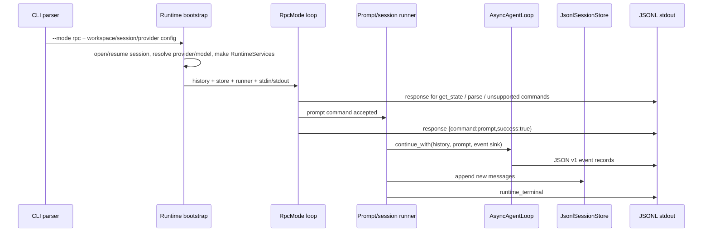
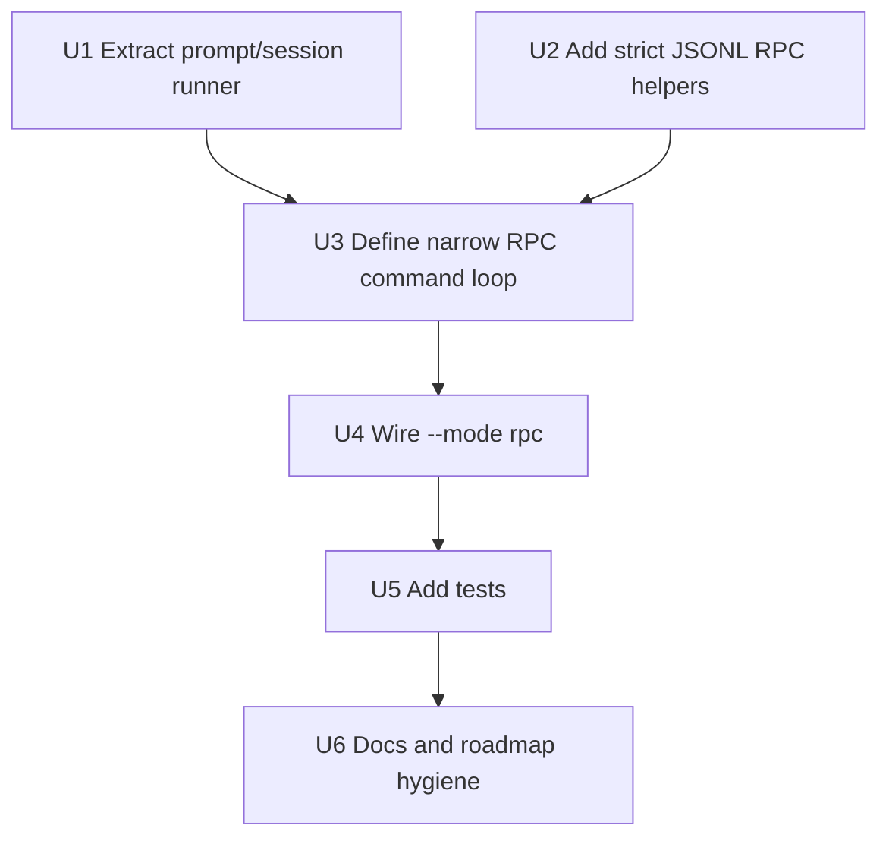

# feat: Add narrow JSONL RPC mode

## Summary

Implement the next open T8 TODO: a narrow, stdin/stdout JSONL RPC mode that can drive existing sessions without TUI assumptions. The plan starts by extracting a reusable prompt/session runner from CLI printing, then adds a conservative `--mode rpc` protocol over strict JSONL. It deliberately does not attempt full pi RPC parity, SDK surface, session tree operations, extension UI, compaction, resources, or active T5 tool/config changes.

> **Historical plan:** This document records the original narrow RPC-v1 implementation and is no longer the current protocol authority. Issue 12 already replaced the shared C++ schema-v1 event serialization with direct AgentSession event records. RPC response ordering, preflight acknowledgement, and removal of its remaining terminal records are governed by `.scratch/pi-agent-session-event-prompt-parity/issues/14-align-rpc-preflight-and-events.md`.

---

## Problem Frame

`--mode json` is complete and provides a one-shot machine-readable event stream, but it is still a CLI prompt mode: the prompt is supplied as argv, the process exits after one run, and clients cannot issue JSONL commands over stdin. The T8 roadmap now has one appropriate open follow-up: RPC mode, explicitly gated on separating runtime services from CLI printing.

Current C++ runtime already has useful prerequisites: `RuntimeServices.*` assembles provider/tool/execution capabilities, `SessionLifecycle.*` opens/resumes JSONL sessions, and `JsonEventPrinter.*` emits a safe C++ JSON stream schema v1. However, `src/AsyncCliRuntime.cpp` still owns session opening, config/model resolution, `AsyncAgentLoop` construction, event-sink routing, persistence, terminal output, and REPL/prompt looping in one function. RPC should not be implemented by adding stdin parsing into that CLI-printing function.

---

## Chosen TODO Object

From `docs/plans/2026-06-16-001-refactor-pi-cpp-parity-todo.md`:

- **T8. SDK, RPC, and Machine-Readable Modes**
  - `[x]` Add JSON event stream mode as the first machine-readable surface.
  - `[ ]` **Add RPC mode only after runtime services are separated from CLI printing.**
  - `[ ]` Add embeddable SDK surface after agent/session/resource seams are stable.

This is the next appropriate planning target because:

- T8 JSON event stream mode is already completed in `docs/plans/2026-06-20-002-feat-json-event-stream-mode-plan.md`.
- T5 tool/config parity already has an active separate plan in `docs/plans/2026-06-20-001-feat-t5-tool-config-parity-plan.md`; this plan must not absorb its tool schema, bash timeout, or model/config expansion work.
- RPC can be scoped to a small protocol and a reusable runtime runner, while the SDK remains premature until session/resource seams are more stable.

---

## Requirements

- **R1.** Add `--mode rpc` as a real mode that reads strict LF-delimited JSON commands from stdin and writes only compact JSON objects to stdout for responses and agent events after startup succeeds.
- **R2.** Preserve default text mode and existing `--mode json` behavior, including JSON mode's session header and durable `runtime_terminal` records.
- **R3.** Extract a reusable prompt/session runner so agent execution, event emission, history updates, and session append can be used without depending on CLI text printing or REPL prompts.
- **R4.** Keep RPC v1 narrow: support only commands that the current C++ session/runtime can implement honestly without TUI/resource/tree assumptions.
- **R5.** Use pi-shaped response records: `{"type":"response","command":"...","success":true|false,...}` with optional request `id` echoed when present.
- **R6.** For `prompt`, emit the success response after command preflight/acceptance and before the prompt run's agent events. Post-acceptance failures are reported through event/terminal records, not a second response for the same id.
- **R7.** Reuse the safe C++ JSON event schema v1 for prompt lifecycle events; do not expose raw prompts, raw thinking, raw streamed tool-call arguments, provider DTOs, base URLs, API-key env names, or unbounded tool output as part of RPC v1.
- **R8.** Validate unsupported command families explicitly with `success:false` responses rather than silently ignoring or partially pretending to support pi features.
- **R9.** Implement strict JSONL framing: split input only on LF, accept optional trailing CR, process a final unterminated record at EOF, and never use readers with broader Unicode line-breaking semantics.
- **R10.** Keep startup/pre-session failures stderr-only with non-zero exit, as today; once the RPC loop is active, command parse/validation errors are recoverable JSON responses on stdout, while fatal accepted-prompt persistence/output failures emit a terminal event if possible and end the RPC process non-zero.
- **R11.** Maintain session persistence semantics: no successful prompt terminal record before append succeeds, and in-memory history is committed only after the new session entries append successfully; resume/workspace mismatch behavior stays unchanged.
- **R12.** Add CLI and runtime tests that capture stdout/stderr separately and parse every stdout line as JSON for RPC-mode success/error paths.

---

## Scope Boundaries

- No full pi RPC command matrix. v1 supports only a deliberately small command set listed below.
- No concurrent prompt handling, steering, follow-up queueing, or abort. Commands are processed sequentially while the current prompt completes.
- No extension UI sub-protocol, resources, skills, slash-command expansion, prompt templates, compaction, auto-retry, session switching, fork/clone/tree navigation, export, or bash-as-RPC-command support.
- No `--no-session`; RPC uses the existing JSONL session lifecycle and persistence rules.
- No public C++ SDK header, ABI promise, or host-application API.
- No changes to T5 tool schema/runtime behavior, provider registry expansion, OAuth, dynamic API key resolution, model catalogs, or additional providers.
- No raw full-message passthrough in `get_messages` until message exposure policy is explicitly designed; session files may contain sensitive content and stdout is also sensitive.
- No attempt to make the C++ JSON event schema fully pi `AgentSessionEvent` compatible in this slice. It remains the documented C++ schema v1 subset.

### Supported RPC v1 Commands

| Command | Request | Response / behavior |
| --- | --- | --- |
| `prompt` | `{"id":"p1","type":"prompt","message":"hello"}` | Validate `message` is a string, emit `response` success, run one prompt through the extracted runner, stream JSON event records, then emit `runtime_terminal`. |
| `get_state` | `{"id":"s1","type":"get_state"}` | Return `{provider, model, sessionId, workspace, messageCount}` from resolved runtime/session state. Do not include base URL, API-key env, config path, or session file path in v1. |
| `get_last_assistant_text` | `{"id":"l1","type":"get_last_assistant_text"}` | Return `{ "text": string|null }` using persisted/committed in-memory history. |
| `shutdown` | `{"id":"q1","type":"shutdown"}` | Return success and exit cleanly after flushing stdout. This C++-specific narrow command avoids relying on EOF for tests/clients. |

### Explicitly Unsupported in RPC v1

`steer`, `follow_up`, `abort`, `new_session`, `switch_session`, `fork`, `clone`, `get_messages`, `set_model`, `cycle_model`, `get_available_models`, thinking-level commands, queue-mode commands, compaction/retry commands, RPC bash commands, export/session-stats/commands/resource commands, and `extension_ui_response` should return `success:false` with a bounded explanatory error unless a later plan adds real support.

---

## Context & Research

### Technology & Infrastructure

- C++23 project built with CMake package-style targets in `CMakeLists.txt`.
- Dependencies in `vcpkg.json`: Glaze, Boost.Process/Beast/Asio/Filesystem, OpenSSL, CLI11, Catch2.
- `cch_coding_agent_runtime` currently contains CLI/runtime orchestration and runtime support files: `src/AsyncCliRuntime.cpp`, `src/coding_agent/runtime/EventPrinter.*`, `JsonEventPrinter.*`, `RuntimeServices.*`, and `SessionLifecycle.*`.
- Public contracts live under `include/cch`; `src` remains private to targets/tests.
- No deployment/IaC model is present. This is a local CLI binary with optional OpenAI-compatible network access.
- API styles in use: OpenAI Chat Completions-compatible HTTP/SSE provider boundary; JSONL session files; JSONL stdout event stream for `--mode json`.
- Data/session layer: append-only JSONL sessions via `include/cch/harness/session/` and `src/harness/session/JsonlSessionStore.cpp`; no database server.
- Module organization: package targets for `util`, `ai`, `agent`, `harness`, `tools`, and `coding_agent_runtime`; runtime internals are under `src/coding_agent/runtime/`.

### Architecture & Structure

- `README.md` states the non-negotiable architecture rules: passive value-state contracts, capability seams across physical boundaries, move-only event sinks, and local serialization/reflection machinery.
- `AGENTS.md` repeats the same architecture constraints and prohibits reintroducing legacy sync tools, `util::Result`, Boost.JSON domain contracts, `src` as public include surface, or compatibility-empty flags.
- `README.md` documents `--mode json` as the first machine-readable surface and says RPC mode is not implemented yet.
- `src/main.cpp` owns CLI11 parsing and validation, including current explicit rejection of `--mode rpc` before session creation.
- `src/AsyncCliRuntime.hpp` exposes a passive `AsyncCliRuntimeConfig` DTO and `OutputMode { Text, Json }`.
- `src/AsyncCliRuntime.cpp` is the main extraction target: it mixes session open, config/model resolution, runtime services, event printing, agent loop, session append, final assistant text, and REPL.
- `src/coding_agent/runtime/RuntimeServices.*` is already a CLI-independent service factory for provider client, execution env, and tool registry.
- `src/coding_agent/runtime/SessionLifecycle.*` is already a CLI-independent session open/resume seam.
- `src/coding_agent/runtime/JsonEventPrinter.*` writes compact JSON records with `schemaVersion` and `seq`, omits sensitive event variants, and emits terminal records.
- `tests/cli/CliSmokeTest.cpp` already has split stdout/stderr capture helpers and JSON parse helpers used by JSON mode tests.
- `tests/coding_agent/runtime/JsonEventPrinterTest.cpp` protects JSON event redaction/omission semantics.

### Implementation Patterns

- Prefer aggregate-friendly DTO structs and `util::Expected<T>` / `util::ExpectedVoid` for fallible boundaries.
- Use `util::JsonValue`, `util::read_json`, and `util::write_json` at dynamic JSON boundaries; keep Glaze DTOs and visitors inside serialization/implementation layers.
- Keep output formatting behind runtime-local classes that accept `std::ostream&`; avoid direct `std::cout` in reusable runtime services.
- Event sinks should remain move-only compatible and return `util::ExpectedVoid` so formatting/backpressure errors can abort cleanly.
- Tests parse JSON lines into `JsonValue` and assert fields rather than relying on object key ordering.
- CLI smoke tests use the deterministic fake provider and temporary workspace/session files; real provider validation is manual and opt-in only.
- The project treats workspace containment as a safety guard, not a sandbox; RPC docs must not imply stronger isolation.

### External pi Reference Patterns

- `pi:packages/coding-agent/docs/rpc.md` defines RPC as JSON commands on stdin, JSON responses/events on stdout, optional request `id` correlation, strict LF framing, and parse errors as `response` records with `command:"parse"`.
- `pi:packages/coding-agent/src/modes/rpc/jsonl.ts` intentionally avoids Node `readline` because Unicode separators are valid inside JSON strings; the C++ implementation should mirror the strict LF framing principle.
- `pi:packages/coding-agent/src/modes/rpc/rpc-mode.ts` separates RPC command handling from the session runtime host and subscribes to session events rather than printing TUI output.
- `pi:packages/coding-agent/src/modes/rpc/rpc-types.ts` shows the full command matrix; most of it depends on capabilities the C++ harness has not implemented yet and must stay out of v1.

---

## Key Technical Decisions

| Decision | Rationale |
| --- | --- |
| Plan RPC now, but start with runner extraction | The roadmap gate says RPC only after runtime services are separated from CLI printing. `RuntimeServices` and `SessionLifecycle` exist, but prompt execution still lives in `AsyncCliRuntime.cpp`, so extraction is the first implementation unit. |
| Support a narrow command set | Honest support for `prompt`, `get_state`, `get_last_assistant_text`, and `shutdown` satisfies stdin/stdout session driving without overpromising pi's resource/tree/extension features. |
| Reuse C++ JSON event schema v1 | `--mode json` already established redaction, seq, terminal, and omission policy. RPC should reuse it for prompt lifecycle events rather than inventing a second event payload in the same release. |
| Do not emit a JSON-mode session header automatically in RPC | pi RPC stdout is command responses and events. Clients can use `get_state` for session metadata. Avoid an unsolicited startup record in v1 unless a future handshake plan adds one. |
| Response before prompt events | Mirrors pi's prompt acceptance semantics. Once accepted, later failures are reported as event/terminal records, not by mutating the original response. |
| Stage prompt history until persistence succeeds | A long-lived RPC process must not expose assistant messages through `get_last_assistant_text` or later prompts if those messages failed to append to the session. The runner should build `new_history`, append entries, then commit/swap history only after successful persistence. |
| Fatal accepted-prompt failures end the RPC process | Parse, validation, and unsupported-command failures are recoverable. After a prompt is accepted, persistence/output failures can leave protocol/session state uncertain, so emit a terminal failure when possible, flush, and exit non-zero rather than continuing with ambiguous state. |
| Sequential command loop only | The current C++ runner has no cancellation/backpressure/session-subscription model. Sequential processing is testable and avoids false support for steering, follow-up, or abort. |
| EOF is a clean shutdown boundary | Process a final unterminated JSON record, then exit 0 on EOF if no fatal runtime failure occurred. No synthetic shutdown response is emitted for EOF. |
| Process-global event sequence | `seq` is process-global for JSON event/terminal records across prompts; response records are correlated by `id` and do not need `seq`. |
| Keep startup errors stderr-only | Existing CLI behavior and JSON-mode plan treat pre-header/pre-session failures as process diagnostics. RPC command errors become JSON only after the loop is active. |
| Use strict LF JSONL helper | A small runtime-local helper can centralize CR stripping, parse-error responses, final-line handling, and compact serialization. |
| Keep config/model behavior unchanged | T5 has active config/model work. RPC should consume whatever `AsyncCliRuntime` currently resolves without widening provider/config scope. |

---

## Open Questions

### Resolved During Planning

- **Should this be full pi RPC parity?** No. Full parity requires resources, extension UI, session switching/tree navigation, compaction, retry, slash commands, prompt templates, and richer session APIs that are out of scope.
- **Should RPC use the JSON event stream formatter?** Yes for prompt lifecycle events. The existing formatter is the safest available projection and already avoids prompt/thinking/tool-argument leakage.
- **Should `get_messages` be in v1?** No. Full message responses need an explicit exposure/redaction policy and pi message-shape compatibility work.
- **Should `--mode rpc` accept a positional prompt?** No. RPC commands come from stdin; positional prompts in RPC mode should fail during CLI validation to avoid mixing one-shot and command-loop semantics.
- **Should `--mode rpc` work with `--repl`?** No. REPL prompts are human text UI and would corrupt JSONL stdout.
- **Should accepted prompt failures continue the loop?** No for persistence/output failures. Recoverable command errors continue; fatal post-acceptance failures emit a terminal failure when possible, flush, and exit non-zero.
- **Should EOF be supported without `shutdown`?** Yes. EOF after a final processed record exits cleanly when no fatal runtime failure occurred.
- **What is the v1 `get_state` payload?** `{provider, model, sessionId, workspace, messageCount}` with no base URL, API-key env, config path, or session file path.
- **What is the C++ v1 explicit-exit command called?** `shutdown`.

### Deferred to Implementation

- Exact response error wording, as long as machine fields (`type`, `command`, `success`, optional `id`) are stable and details are bounded.
- Whether the extracted runner object is named `AgentSessionRunner`, `PromptSessionRunner`, or similar.

---

## High-Level Technical Design

Important separation: bootstrap may still live in `AsyncCliRuntime.cpp` initially, but prompt execution and event output should move behind runtime-local seams that take streams/callbacks. The RPC loop should not call `coding_agent::runtime::print_agent_event` or write human semantic lines.

---

## Implementation Units

### U1. Extract prompt/session runner from CLI printing

**Goal:** Move the reusable run-one-prompt path out of `src/AsyncCliRuntime.cpp` so text, JSON one-shot, and RPC can share session/history/persistence semantics without sharing CLI output code.

**Requirements:** R2, R3, R6, R7, R11

**Dependencies:** None

**Files:**
- Add: `src/coding_agent/runtime/AgentSessionRunner.hpp`
- Add: `src/coding_agent/runtime/AgentSessionRunner.cpp`
- Modify: `src/AsyncCliRuntime.cpp`
- Modify: `CMakeLists.txt`
- Add/modify tests under `tests/coding_agent/runtime/` if unit coverage is practical

**Approach:**
- Introduce a runtime-local passive config/result surface, for example:
  - `AgentSessionRunnerConfig { int max_turns; std::string model; }`
  - `PromptRunRequest { std::vector<ai::Message>& history; JsonlSessionStore& store; std::string prompt; event sink; terminal sink/policy; }`
  - `PromptRunResult { bool success; std::string code; std::string message; }`
- Move the `AsyncAgentLoop::continue_with`, previous-history-size tracking, append loop, max-turn mapping, and terminal success/failure decision into this runner.
- Let callers provide event sinks and terminal emitters; the runner should not know about `std::cout`, text semantic lines, or CLI REPL prompts.
- Preserve current ordering with a stronger long-lived-process guard: stream agent events, build staged `new_history`, append new messages, commit/swap in-memory history only after append succeeds, then emit durable success terminal.
- On append or terminal-output failure after prompt acceptance, emit a bounded terminal failure when possible, flush, and return a fatal result so RPC exits non-zero instead of continuing with ambiguous in-memory/session state.
- Keep text final assistant printing in `AsyncCliRuntime.cpp`, because it is presentation-specific.
- Keep JSON terminal behavior compatible with existing `--mode json` tests.

**Test scenarios:**
- Existing `[cli]` and `[coding-agent][json-events]` tests pass unchanged.
- A runner-level fake-client test verifies append-before-success-terminal ordering.
- An append-failure runner test verifies no success terminal is emitted and staged assistant text is not committed to in-memory history.
- A max-turn runner test maps max turns to the existing stable code.

**Verification:**
- `src/AsyncCliRuntime.cpp` no longer owns the full prompt execution algorithm; it composes services, runner, and output mode.
- No public header under `include/cch` is added for this internal runner.

### U2. Add strict JSONL RPC helpers

**Goal:** Provide small runtime-local helpers for compact response serialization and strict LF input framing.

**Requirements:** R1, R5, R8, R9, R10, R12

**Dependencies:** None

**Files:**
- Add: `src/coding_agent/runtime/RpcJsonl.hpp`
- Add: `src/coding_agent/runtime/RpcJsonl.cpp`
- Add: `tests/coding_agent/runtime/RpcJsonlTest.cpp`
- Modify: `CMakeLists.txt`

**Approach:**
- Serialize outbound records with `util::write_json(util::JsonValue{object})` plus one `\n`.
- Implement input reading with `std::getline(input, line)`, strip one trailing `\r`, and process the final unterminated line naturally.
- Parse commands with `util::read_json<util::JsonValue>` or an equivalent runtime-local parser; reject non-object records with a parse/validation response.
- Treat blank lines as invalid records with a bounded failure response rather than silently skipping them, so clients notice framing bugs.
- Centralize response construction helpers:
  - success with optional `data`
  - failure with bounded `error`
  - optional `id` echo only when the incoming id is a string
  - malformed JSON uses `command:"parse"`
  - parsed-but-invalid objects use `command:"invalid"` unless a string `type` can be safely reported as the command.
- Pin validation policy: non-string `type`, missing `type`, non-string `id`, missing/non-string `prompt.message`, and empty `prompt.message` all produce `success:false` responses; the last is intentionally rejected for v1 to avoid ambiguous no-op prompts.
- Do not expose raw exception details that could include provider payloads, command output, prompts, or secrets.

**Test scenarios:**
- Serializes one compact JSON object per LF-terminated line.
- Accepts CRLF input by stripping trailing CR.
- Does not split on U+2028/U+2029 inside JSON strings.
- Produces parse response for malformed JSON and continues to later valid commands.
- Rejects array/string/null records as invalid commands.
- Rejects missing/non-string `type`, non-string `id`, blank lines, and invalid `prompt.message` with stable response shapes.

**Verification:**
- Helpers live under `src/coding_agent/runtime/`, not public include.
- No Node/readline-like broad newline behavior is introduced.

### U3. Define narrow RPC command loop

**Goal:** Implement a sequential command loop that can drive existing sessions through JSONL stdin/stdout.

**Requirements:** R1, R4, R5, R6, R7, R8, R10, R11

**Dependencies:** U1, U2

**Files:**
- Add: `src/coding_agent/runtime/RpcMode.hpp`
- Add: `src/coding_agent/runtime/RpcMode.cpp`
- Add: `tests/coding_agent/runtime/RpcModeTest.cpp` or cover via CLI smoke where simpler
- Modify: `CMakeLists.txt`

**Approach:**
- Define a runtime-local `RpcModeConfig` with references/handles to:
  - `std::istream& input`
  - `std::ostream& output`
  - current history vector
  - session store
  - resolved provider/model display values
  - prompt runner
  - JSON event printer or an event writer factory
- Process commands sequentially:
  - `prompt`: validate `message`, write success response, run prompt through U1 with a `JsonEventPrinter`-backed sink, flush stdout after terminal record.
  - `get_state`: return a safe state object with `provider`, `model`, `sessionId`, `workspace`, and `messageCount`; omit base URL, API-key env, config path, and session file path.
  - `get_last_assistant_text`: return the text of the last committed assistant message or null.
  - `shutdown`: write success response and exit the loop cleanly.
  - unsupported known/unknown commands: write `success:false` response with bounded error.
- For command exceptions, return a single `success:false` response where safe; if a prompt has already been accepted, use the runner's terminal failure path and terminate on fatal persistence/output failures.
- Maintain a single `JsonEventPrinter` sequence for the RPC process so clients can globally order event/terminal records after startup; responses are correlated by `id` and do not need `seq`.
- Process EOF as a clean shutdown after the final unterminated record is handled; do not emit a synthetic response for EOF.
- Do not print session headers automatically; clients can call `get_state`.

**Test scenarios:**
- `get_state` returns a response with echoed id and safe data fields.
- `prompt` first emits response success, then JSON lifecycle events, then `runtime_terminal` success.
- `get_last_assistant_text` after a prompt returns the fake assistant text.
- malformed JSON emits `command:"parse"` failure and the loop continues.
- unsupported command with id returns `success:false` and does not create agent events.
- `shutdown` exits cleanly after flushing.
- EOF after `get_state` exits cleanly without requiring `shutdown`.
- Two sequential prompts produce monotonically increasing process-global event `seq` values.
- Invalid prompt messages (missing, non-string, empty) return `success:false` and produce no agent events.

**Verification:**
- All stdout lines in valid RPC tests parse as JSON objects.
- No human semantic lines (`[model-request]`, `[assistant]`, REPL `> ` prompt) appear in RPC stdout.

### U4. Wire `--mode rpc` through CLI/runtime bootstrap

**Goal:** Replace the current explicit `--mode rpc is not supported yet` rejection with a real RPC mode while preserving text and JSON validation behavior.

**Requirements:** R1, R2, R10, R12

**Dependencies:** U1, U3

**Files:**
- Modify: `src/main.cpp`
- Modify: `src/AsyncCliRuntime.hpp`
- Modify: `src/AsyncCliRuntime.cpp`
- Modify: `tests/cli/CliSmokeTest.cpp`
- Modify: `README.md` only if implementation behavior lands in the same change

**Approach:**
- Add `OutputMode::Rpc` to `AsyncCliRuntime.hpp`.
- Parse `--mode rpc` in `src/main.cpp` and pass it through instead of rejecting it.
- In RPC mode validation:
  - reject `--repl`
  - reject positional prompt text
  - do not require a prompt
  - keep `--session`/`--resume`, `--workspace`, provider/model/base-url/api-key-env, `--fake`, and `--enable-bash` behavior as currently configured.
- In `run_async_cli`, bootstrap session/config/services once, then dispatch to RPC loop when `OutputMode::Rpc` is selected.
- Do not print a JSON mode session header for RPC.
- Keep pre-session failures on stderr and non-zero; valid command-level errors are JSON stdout responses.

**Test scenarios:**
- `cpp_harness --fake --mode rpc --session ...` accepts stdin commands without requiring a positional prompt.
- `--mode rpc hello` fails before session creation with empty stdout and clear stderr.
- `--mode rpc --repl` fails before session creation with empty stdout.
- `--mode rpc --resume <session>` can answer `get_state` and `get_last_assistant_text` from resumed committed history.
- RPC workspace mismatch on resume fails before loop activation with empty stdout and a bounded stderr diagnostic.
- `--mode json` and default text smoke tests continue passing.
- CLI help advertises `text`, `json`, and `rpc` accurately without reviving `--async`.

**Verification:**
- No behavior change for `--mode text` or `--mode json` except internal refactoring.
- Existing unsupported-mode tests are updated from rejection of `rpc` to rejection of invalid values only.

### U5. Add end-to-end RPC tests

**Goal:** Protect the protocol contract with deterministic fake-provider subprocess tests.

**Requirements:** R1, R5, R6, R8, R9, R10, R11, R12

**Dependencies:** U4

**Files:**
- Modify: `tests/cli/CliSmokeTest.cpp`
- Add test helper(s) only if needed under `tests/cli/` or local anonymous namespace

**Approach:**
- Reuse `run_command_split` and temporary workspace/session helpers.
- For stdin, pipe `printf`/here-doc JSONL into the binary in the test command or add a test helper that writes an input file and redirects it into the process.
- Parse stdout into JSON lines; assert no stderr for valid flows.
- Assert session file creation and append for prompt command.
- Assert every RPC stdout line has `type` and either response fields or event fields.

**Test scenarios:**
- **Happy path:** `get_state`, `prompt`, `get_last_assistant_text`, `shutdown` in one stdin stream.
- **Happy path:** `get_state` followed by EOF exits cleanly without `shutdown`.
- **Happy path:** two prompts in one process emit event/terminal `seq` values that increase monotonically.
- **Resume path:** resume an existing session and verify state/history queries use committed transcript state.
- **Error path:** malformed JSON followed by `get_state` shows parse failure and continued processing.
- **Error path:** unsupported command returns `success:false` with echoed id.
- **Error path:** parsed invalid records (missing/non-string `type`, non-string `id`, blank line, invalid `prompt.message`) return stable failure responses.
- **Validation path:** RPC mode rejects positional prompts, REPL, and resume workspace mismatch before creating/activating the loop.
- **Framing path:** CRLF input and an embedded U+2028 in prompt text do not split records incorrectly.
- **Regression path:** text and JSON mode smoke tests still pass.

**Verification:**
- `./build/cpp_harness_tests "[cli]"`
- `./build/cpp_harness_tests "[coding-agent]"` or targeted runtime tags added for RPC helpers
- `./build/cpp_harness_tests "[architecture]"` if new files/headers affect target structure or public/private include assumptions

### U6. Docs and roadmap hygiene

**Goal:** Keep repository documentation aligned after implementation.

**Requirements:** R1, R2, R4, R8, R10

**Dependencies:** U5

**Files:**
- Modify: `README.md`
- Modify: `docs/plans/2026-06-16-001-refactor-pi-cpp-parity-todo.md`
- Modify: this plan file status when completed

**Approach:**
- Update README CLI examples and CLI states to describe narrow RPC mode, supported commands, unsupported full pi features, safety limitations, and JSONL stdout/stderr behavior.
- In the T8 roadmap, keep JSON mode completed, mark RPC completed only after tests pass, and note that SDK remains deferred.
- If implementation intentionally differs from this plan, update the plan's decisions/open questions before marking completed.

**Verification:**
- README does not claim full pi RPC parity, `--no-session`, TUI, extension UI, SDK, or sandbox guarantees.
- Roadmap links to this implementation plan.

---

## Acceptance Criteria

- `--mode rpc` reads JSONL commands from stdin and writes JSONL responses/events to stdout with no human text on stdout after startup.
- Supported v1 commands: `prompt`, `get_state`, `get_last_assistant_text`, and `shutdown`.
- Unsupported and invalid commands return structured failure responses without starting agent work.
- Prompt command uses existing session lifecycle, fake/real provider selection, tool registry, event schema v1, staged history commit, and durable session append semantics.
- `--mode text` and `--mode json` behavior remains compatible with existing tests.
- Tests cover valid prompt flow, state query, parse error, unsupported command, shutdown, prompt/repl validation, and stdout/stderr separation.
- Architecture tests still pass when public/private target boundaries are affected.

---

## System-Wide Impact

- **Interaction graph:** `src/main.cpp` mode validation routes to `src/AsyncCliRuntime.cpp`, which should bootstrap runtime services once and hand prompt execution to runtime-local runner/RPC seams. Text and JSON output modes stay as existing clients of the same runner.
- **Error propagation:** Startup failures remain process diagnostics on stderr. Recoverable command failures are RPC responses. Fatal post-acceptance prompt failures use the JSON terminal path, flush if possible, and stop the process rather than continuing with uncertain state.
- **State lifecycle risks:** Long-lived RPC makes history/session consistency more important than one-shot CLI. The staged-history rule prevents state queries and later prompts from observing unpersisted assistant messages.
- **API surface parity:** `--mode rpc` becomes a user-facing CLI contract, but it is a C++ v1 subset, not full pi `RpcCommand` parity.
- **Integration coverage:** Subprocess CLI tests must validate stdout/stderr separation, JSONL framing, request/response ordering, session append, resume behavior, and no human text leakage.
- **Unchanged invariants:** Public `include/cch` contracts should not change for this slice; runtime helpers stay under `src/coding_agent/runtime/`. Workspace containment remains a guard, not a sandbox.

---

## Risks & Dependencies

| Risk | Mitigation |
| --- | --- |
| RPC accidentally freezes too much of pi's full command matrix | Scope v1 to four supported commands; all other commands return structured unsupported responses until separate plans add real capabilities. |
| Long-lived process exposes unpersisted state after append failure | Stage history and commit only after session append succeeds; terminate on fatal post-acceptance persistence/output failures. |
| Human text or diagnostics corrupt stdout JSONL | Keep pre-session failures on stderr; reuse JSON event writer; test every stdout line as JSON in RPC mode. |
| Sensitive configuration/session details leak through `get_state` | Pin the v1 data keys and negative assertions: no base URL, API-key env, config path, or session file path. |
| Refactor breaks text or JSON mode | Extract runner behind existing behavior and keep text/JSON smoke tests as regression coverage. |

---

## Residual Risks and Follow-Up Work

- Sequential RPC cannot accept `abort`, `steer`, or `follow_up` while a prompt is running. Adding that requires a session subscription/concurrency/backpressure design.
- Reusing the C++ JSON v1 event schema means RPC events are not full pi `AgentSessionEvent` parity yet.
- `get_messages` remains deferred because full message stdout exposure needs redaction/schema decisions.
- Session switching, fork/clone, compaction, resources, extension UI, and SDK remain future T4/T6/T8 work.
- RPC stdout is sensitive: assistant text, tool results if later exposed, workspace-derived facts, and session metadata can leak. README must preserve the existing safety warning that this harness is not a sandbox.

---

## Sources & References

- Roadmap: `docs/plans/2026-06-16-001-refactor-pi-cpp-parity-todo.md`
- Contract inventory: `docs/plans/2026-06-16-003-refactor-pi-cpp-contract-inventory.md`
- Preceding JSON mode plan: `docs/plans/2026-06-20-002-feat-json-event-stream-mode-plan.md`
- Active T5 tool/config plan: `docs/plans/2026-06-20-001-feat-t5-tool-config-parity-plan.md`
- Related code: `src/main.cpp`, `src/AsyncCliRuntime.cpp`, `src/coding_agent/runtime/JsonEventPrinter.cpp`, `src/coding_agent/runtime/RuntimeServices.cpp`, `src/coding_agent/runtime/SessionLifecycle.cpp`, `tests/cli/CliSmokeTest.cpp`
- pi reference: `pi:packages/coding-agent/docs/rpc.md`, `pi:packages/coding-agent/docs/json.md`, `pi:packages/coding-agent/src/modes/rpc/rpc-types.ts`, `pi:packages/coding-agent/src/modes/rpc/rpc-mode.ts`, `pi:packages/coding-agent/src/core/agent-session-runtime.ts`, `pi:packages/coding-agent/src/core/sdk.ts`
