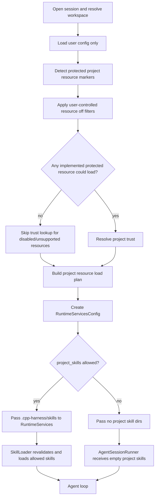

# feat: Add project trust and resource controls

## Summary

Add a project-trust and resource-policy layer before the harness loads project-local resources. The first implementation should protect project-local `.cpp-harness` resources, gate today's project skill loading, and establish passive C++ contracts that future extensions, prompt templates, packages, and project settings must use before any project-authored executable or behavior-changing resource can affect startup.

## Completion Status

Completed on 2026-06-20. The shipped slice adds passive project trust/resource contracts, marker detection, user trust store resolution, user config defaults, `--approve`/`--no-approve`/`--no-skills`, resource load plans, trust-gated project skill loading, stderr diagnostics, and docs. It also moves the static `<available_skills>` context block to `transform_context` so skills context does not force extra turns after assistant stop. Interactive trust prompts, persistent trust commands, project settings parsing, global/config-driven skill dirs, extension execution, and package installation remain deferred.

---

## Problem Frame

The harness now discovers project-local `.cpp-harness/skills/**/SKILL.md`, injects visible skills into model context, and expands `/skill:<name>` from loaded skill content. That means a repository can currently alter the agent's behavior at startup by adding skill files. Future T6 work will add prompt templates, packages, extensions, and project settings; those surfaces are higher-risk because they can eventually execute local code or change model/system behavior. Project trust must be introduced before those loaders exist so the next resource slices do not accidentally inherit an unconditional startup path.

---

## Assumptions

*This plan was authored from the roadmap and repository research without a separate product requirements document. The items below are planning assumptions to review before implementation proceeds.*

- This slice implements deterministic trust/resource policy only; it does not introduce an interactive prompt UI.
- User/global resources remain a separate trust boundary. This slice only gates project-local resources under the current workspace.
- Existing session history is not scrubbed on resume; trust controls new startup resource loading, not content already persisted in a session transcript.

---

## Requirements

- **R1.** Detect trust-requiring project resource markers without parsing protected project files. A bare `.cpp-harness` directory and `.cpp-harness/sessions` must not require trust.
- **R2.** Add passive value contracts for project trust decisions, trust resolution sources, resource kinds, resource enablement, resource diagnostics, and resource load plans.
- **R3.** Resolve project trust from same-run CLI override, user trust store, user config default, and no-UI fallback in a deterministic order; unknown/default `ask` without UI must be untrusted.
- **R4.** Store and read trust decisions from user-controlled state keyed by canonical project path, with nearest ancestor inheritance, child overrides, removal semantics, fail-closed diagnostics on malformed/unreadable stores, and hardened file/permission/symlink handling.
- **R5.** Add resource enable/disable controls where `off` always wins, `auto` loads only when trusted, and `on` does not bypass an explicitly untrusted project.
- **R6.** Gate current project skill loading through the resolved resource load plan; untrusted or disabled project skills must not be loaded, injected into `<available_skills>`, or invocable through `/skill:<name>`.
- **R7.** Keep JSON/RPC stdout protocol-clean; trust/resource diagnostics go to stderr until a machine-readable startup diagnostic protocol exists.
- **R8.** Document clearly that project trust is an input-loading guard, not a sandbox, and that package installation/extension execution remain deferred.
- **R9.** When resuming from a project-local session transcript while protected project resources are untrusted or skipped, warn that existing session history is explicit user-provided input and is not scrubbed by project trust.

---

## Scope Boundaries

- No extension execution, extension runtime, extension UI, or project-local package installation.
- No project `.cpp-harness/settings.json` parsing before trust resolution; project settings support remains deferred.
- No interactive trust prompt in this slice. Text/REPL may get a future prompt, but initial behavior is deterministic across modes.
- No global `~/.cpp-harness/skills` or config-driven skill directory loading; those need a separate user-resource filesystem/root policy.
- No session history rewriting or scrubbing when a user resumes a transcript that already contains prior skill content. This slice should warn on explicit project-local resume in an untrusted/skipped-resource run rather than pretending old transcript content is trust-filtered.
- No sandbox, permission system, prompt-injection defense, or restriction on built-in read/write/edit/bash tools beyond existing workspace/bash controls.

### Deferred to Follow-Up Work

- **Interactive trust prompt and persistent trust command:** Add UI/REPL flow for trust current folder, trust parent, do-not-trust, and session-only decisions.
- **Project settings loader:** Parse `.cpp-harness/settings.json` only after this trust gate exists.
- **Prompt template loading:** Route future project prompt templates through the same resource load plan.
- **Extension boundary and package installation:** Design and implement separately with explicit supply-chain controls.
- **Global/config-driven skill directories:** Add user-resource loading after filesystem roots and precedence are specified.
- **Machine-readable trust diagnostics:** Add JSON/RPC startup diagnostic events if/when the output protocol grows a diagnostics channel.

---

## Context & Research

### Relevant Code and Patterns

- `src/AsyncCliRuntime.cpp` currently builds `skill_dirs` unconditionally with `.cpp-harness/skills` before `make_runtime_services()`.
- `src/coding_agent/runtime/RuntimeServices.hpp` and `src/coding_agent/runtime/RuntimeServices.cpp` accept `skill_dirs`, construct `WorkspaceFileSystem`, call `loadSkills()`, and print `[skill:warn]` diagnostics to stderr.
- `include/cch/coding_agent/SkillLoader.hpp`, `src/coding_agent/SkillLoader.cpp`, and `tests/coding_agent/SkillLoaderTest.cpp` provide the policy-free skill loading seam that should remain focused on discovery/parsing once a directory is allowed.
- `include/cch/coding_agent/Config.hpp`, `src/coding_agent/ConfigLoader.cpp`, and `tests/coding_agent/ConfigLoaderTest.cpp` show the user config pattern: unknown keys are ignored, malformed JSON returns an error, and CLI values take precedence.
- `src/main.cpp` tracks CLI option presence with CLI11 `count()` for options that must distinguish omitted values from defaults.
- `src/harness/WorkspaceFileSystem.hpp` and `tests/harness/WorkspaceFileSystemTest.cpp` provide canonical path, symlink containment, and file-info behavior to mirror for marker detection.
- `tests/cli/CliSmokeTest.cpp` protects text/JSON/RPC output behavior and must prove trust diagnostics stay off stdout in machine-readable modes.

### Institutional Learnings

- `docs/plans/2026-06-20-006-feat-skill-file-discovery-plan.md` intentionally deferred global/config-driven skill dirs because they need a filesystem/root policy outside the workspace guard.
- `docs/plans/2026-06-20-007-feat-skill-model-visible-integration-plan.md` established that `disable-model-invocation` only hides a skill from model-visible listing; it remains explicitly invocable and must not be repurposed as a broader trust/resource gate.
- `docs/plans/2026-06-09-001-feat-cpp-coding-harness-plan.md` and README document the default-deny posture for bash: executable capability requires explicit opt-in and sanitized environment. Project executable resources should follow the same explicit-approval spirit.

### External References

- `pi:packages/coding-agent/src/core/trust-manager.ts` — canonical trust store, ancestor lookup, protected resource markers.
- `pi:packages/coding-agent/src/core/project-trust.ts` — trust resolution order, non-UI `ask` behavior, approve/no-approve overrides.
- `pi:packages/coding-agent/src/core/resource-loader.ts` — enabled resource filtering before load.
- `pi:packages/coding-agent/docs/security.md` — trust is an input-loading guard, not a sandbox.
- `pi:packages/coding-agent/docs/settings.md` and `pi:packages/coding-agent/docs/extensions.md` — future settings/extensions surfaces that must be trust-gated.

---

## Key Technical Decisions

- **Trust is resolved before protected project files are parsed:** Startup may check marker existence but must not read `SKILL.md`, prompt templates, project settings, extension code, or package manifests until the load plan allows the resource kind. This is the core security property of the slice.

- **Initial slice has no interactive prompt:** The current harness has no TUI trust prompt and JSON/RPC stdout must remain protocol-clean. `default_project_trust: "ask"` therefore behaves as untrusted unless a saved decision or CLI override exists. Interactive prompting is deferred.

- **Use pi-compatible trust override naming where the C++ CLI can support it safely:** Add same-run `--approve`/`-a` and `--no-approve` flags, storing them internally as an optional trust override. Do not add a `-na` short alias in this slice because the current CLI11 parser treats multi-character single-dash names as invalid; a pi-exact `-na` alias can be added later with an explicit argv-normalization design. Overrides do not persist decisions in this slice.

- **User config can set defaults, project config cannot self-authorize:** Add user-config fields for `default_project_trust` and project resource enablement. Do not read project `.cpp-harness/settings.json` before trust, and do not allow a repository-local file to mark itself trusted.

- **Trust store read failures fail closed, except explicit same-run approve:** If the trust store is malformed/unreadable and no CLI override exists, protected resources are skipped with a diagnostic. If the user supplied `--approve`, that explicit same-run choice may load resources but must not write persistent trust. If the user supplied `--no-approve`, resources remain skipped.

- **Resource policy is separate from skill metadata:** `disable-model-invocation` keeps its existing skill-formatting meaning. Project resource enablement is modeled outside `Skill` and decides whether the project skill directory is loaded at all.

- **`off` always wins:** A resource kind set to `off` must be skipped even if the project is trusted or `--approve` is supplied. This lets users disable a resource class without changing their trust decision.

- **Existing session history is not scrubbed:** Trust controls newly loaded project resources. If a resumed session already contains skill instructions or expanded skill content from a previous trusted run, this slice does not rewrite history.

---

## Open Questions

### Resolved During Planning

- **Should project settings participate in this slice?** No. Only marker detection includes `.cpp-harness/settings.json`; parsing project settings is deferred until after the trust gate exists.
- **Should non-interactive modes prompt?** No. JSON/RPC and one-shot startup never prompt in this slice; unknown/default `ask` resolves untrusted.
- **Should same-run `--approve` override a broken trust store?** Yes for this run only, with a warning and no persistent write; `--no-approve` still skips resources.
- **Should `.cpp-harness/sessions` require trust?** No. Session storage must not make every project trust-gated.
- **Should empty `.cpp-harness/skills` require trust?** Yes. The marker indicates project skill discovery would occur; scanning it remains trust-gated.

### Deferred to Implementation

- **Exact diagnostic wording:** Choose stable `[trust:warn]` / `[resource:info]` phrasing while writing CLI tests, avoiding absolute path assertions.
- **Trust store write mechanics:** Implement sorted JSON and safe writes following existing file-permission practices; exact lock/atomic strategy may adapt to available utility helpers.
- **Invalid config value handling:** Prefer fail-safe warnings for malformed trust/resource values, but keep compatibility with the current loader's tolerance for unrelated unknown keys.

---

## Output Structure

    include/cch/coding_agent/
      ProjectResources.hpp        # new passive trust/resource contracts
      ProjectTrust.hpp            # new trust store/resolution declarations
    src/coding_agent/
      ProjectResources.cpp        # new marker detection and load-plan builder
      ProjectTrust.cpp            # new trust store and resolver implementation
    tests/coding_agent/
      ProjectResourcesTest.cpp    # new marker/resource-policy tests
      ProjectTrustTest.cpp        # new trust store/resolution tests

---

## High-Level Technical Design

> *This illustrates the intended approach and is directional guidance for review, not implementation specification. The implementing agent should treat it as context, not code to reproduce.*

Trust resolution order:

| Step | Source | Result |
| --- | --- | --- |
| 1 | CLI `--approve` / `--no-approve` | Same-run trust override wins (`--approve` loads for this run, `--no-approve` skips) |
| 2 | No trust-requiring markers | Treat as trusted for loading because there is nothing protected to load |
| 3 | User trust store nearest path | Apply saved trusted/untrusted decision |
| 4 | User config `default_project_trust` | `always` trusts, `never` denies, `ask` falls through |
| 5 | No UI fallback | `ask` becomes untrusted |

Resource decision matrix for project skills:

| Trust decision | Enablement | Load `.cpp-harness/skills`? |
| --- | --- | --- |
| trusted | auto | yes |
| trusted | on | yes |
| trusted | off | no |
| untrusted | auto | no |
| untrusted | on | no |
| untrusted | off | no |

---

## Implementation Units

### U1. Passive trust/resource contracts and marker detection

**Goal:** Define the project trust/resource vocabulary and detect protected project resource markers without reading resource contents.

**Requirements:** R1, R2

**Dependencies:** None

**Files:**
- Create: `include/cch/coding_agent/ProjectResources.hpp`
- Create: `src/coding_agent/ProjectResources.cpp`
- Modify: `CMakeLists.txt`
- Test: `tests/coding_agent/ProjectResourcesTest.cpp`

**Approach:**
- Add aggregate-friendly enums/structs for `ProjectResourceKind`, `ResourceEnablement`, `DetectedProjectResource`, `ResourceLoadDecision`, `ProjectResourceLoadPlan`, and `ResourceDiagnostic`.
- Detect explicit marker paths under the workspace: `.cpp-harness/settings.json`, `.cpp-harness/skills`, `.cpp-harness/prompts`, `.cpp-harness/extensions`, `.cpp-harness/packages`, `.cpp-harness/SYSTEM.md`, `.cpp-harness/APPEND_SYSTEM.md`.
- Explicitly ignore bare `.cpp-harness` and `.cpp-harness/sessions`.
- Use the workspace filesystem/canonical path pattern so symlink escapes or permission failures become diagnostics and do not lead to loading.
- Keep detection shallow and metadata-only; do not parse skill bodies, project settings, package manifests, or extension code.

**Patterns to follow:**
- `src/coding_agent/SkillLoader.cpp` for diagnostics and filesystem traversal style, but keep marker detection much shallower than recursive skill loading.
- `src/harness/WorkspaceFileSystem.hpp` and `tests/harness/WorkspaceFileSystemTest.cpp` for path containment and symlink expectations.
- Passive value contracts in `include/cch/coding_agent/Skill.hpp`.

**Test scenarios:**
- Happy path: workspace with no `.cpp-harness` returns no detected protected resources.
- Happy path: bare `.cpp-harness` and `.cpp-harness/sessions` do not require trust.
- Happy path: `.cpp-harness/skills` is detected as `project_skills` without reading any `SKILL.md`.
- Happy path: `.cpp-harness/settings.json`, `prompts`, `extensions`, `packages`, `SYSTEM.md`, and `APPEND_SYSTEM.md` each map to the expected resource kind.
- Edge case: marker names are case-sensitive and near-matches are ignored.
- Error path: symlink marker escaping the workspace is reported as a diagnostic and not marked loadable.
- Error path: file-info/canonicalization failure for a marker fails closed for that marker and emits a diagnostic.

**Verification:**
- Detection can explain which protected resource markers exist without parsing their contents.
- New public headers compile from the include surface and expose only passive contracts.

---

### U2. Trust store and project trust resolver

**Goal:** Implement user-controlled trust decision storage and deterministic startup trust resolution.

**Requirements:** R3, R4

**Dependencies:** U1

**Files:**
- Create: `include/cch/coding_agent/ProjectTrust.hpp`
- Create: `src/coding_agent/ProjectTrust.cpp`
- Modify: `CMakeLists.txt`
- Test: `tests/coding_agent/ProjectTrustTest.cpp`

**Approach:**
- Add passive contracts for `ProjectTrustDecision`, `ProjectTrustSource`, `ProjectTrustStoreEntry`, `ProjectTrustUpdate`, `ProjectTrustResolution`, and `DefaultProjectTrust`.
- Store decisions in `~/.cpp-harness/trust.json` by canonical path, with nearest current-or-parent match.
- Support removal/null semantics in the store API so a child decision can be cleared and parent inheritance restored.
- Resolve trust in this order: CLI override, no protected resources, trust store, user config default, no-UI fallback.
- Fail closed on malformed/unreadable store unless a same-run CLI override explicitly decides trust.
- Writes should be sorted and avoid partial/truncated output: create the user config directory with private permissions where supported, reject or avoid following symlinked trust files, write a same-directory temporary file, set restrictive file permissions, then atomically rename into place. If a lock helper is not available, keep the write path small and document the single-process limitation rather than silently using unsafe writes.

**Execution note:** Implement store/resolver behavior test-first because trust precedence errors are easy to miss in manual smoke testing.

**Patterns to follow:**
- `src/coding_agent/ConfigLoader.cpp` for JSON reading style through `util::JsonValue`.
- `src/harness/session/JsonlSessionStore.cpp` for safe local persistence practices.
- `pi:packages/coding-agent/src/core/trust-manager.ts` and `pi:packages/coding-agent/src/core/project-trust.ts` for contract shape and precedence.

**Test scenarios:**
- Happy path: trusted and untrusted decisions round-trip through `trust.json`.
- Happy path: closest ancestor decision applies to a child workspace.
- Happy path: child decision overrides a parent decision.
- Edge case: removing a child decision exposes the parent decision again.
- Edge case: no protected markers resolves trusted with `no_project_resources` source and does not require a store entry.
- Edge case: default `always` trusts; default `never` denies; default `ask` with no UI denies.
- Edge case: CLI `--approve` and `--no-approve` equivalents override store/default decisions for the run.
- Error path: malformed trust store, invalid value, or unreadable store fails closed and returns a diagnostic.
- Error path: symlinked or permission-loose trust store path is rejected or treated as unsafe according to the implemented platform policy.
- Error path: malformed store plus explicit same-run `--approve` loads for the run but reports that persistent trust was unavailable.
- Error path: malformed store plus explicit same-run `--no-approve` skips resources and reports the store diagnostic.

**Verification:**
- Trust resolution source is observable in tests.
- No repository-local file can mark the project trusted.

---

### U3. Resource load-plan builder and diagnostics

**Goal:** Combine detected markers, trust resolution, and resource enablement into the plan consumed by runtime startup.

**Requirements:** R5, R6, R7

**Dependencies:** U1, U2

**Files:**
- Modify: `include/cch/coding_agent/ProjectResources.hpp`
- Modify: `src/coding_agent/ProjectResources.cpp`
- Test: `tests/coding_agent/ProjectResourcesTest.cpp`

**Approach:**
- Add a `ProjectResourcePolicy` value that carries per-kind enablement, initially supporting project skills and future kinds in passive form.
- Build `ProjectResourceLoadPlan` with one decision per detected kind: detected, allowed/skipped, skip reason, and diagnostics.
- Apply user-controlled `off` values before trust lookup so disabled resource kinds do not force a trust-store read or prompt path.
- Resolve trust only for detected resource kinds with implemented loaders that remain eligible after the `off` prefilter; in this slice that means project skills.
- Enforce trust before `auto`/`on` loading.
- Keep future resource kinds present in passive detection results, but do not invoke loaders or force trust resolution for loaders that do not exist yet.
- Provide helper queries for runtime, such as whether project skills are allowed and which diagnostics should print.

**Patterns to follow:**
- `RuntimeServices` skill diagnostics: diagnostics are value data first, stderr formatting stays near CLI/runtime boundaries.
- Pi resource loader enabled-resource filtering in `pi:packages/coding-agent/src/core/resource-loader.ts`.

**Test scenarios:**
- Happy path: trusted + skills `auto` allows project skill loading.
- Happy path: trusted + skills `off` skips project skills and records a disabled-resource reason.
- Happy path: untrusted + skills `auto` skips project skills and records an untrusted-project reason.
- Edge case: untrusted + skills `on` still skips because `on` is not a trust bypass.
- Edge case: no markers produces an empty/allowed plan with no skip diagnostics.
- Edge case: unsupported future resource markers are represented but not loaded and do not force trust resolution until a loader exists.
- Error path: marker detection diagnostics are carried into the load plan and do not become loader calls.

**Verification:**
- Runtime code can decide whether to include `.cpp-harness/skills` by reading the plan, not by re-checking hardcoded paths.

---

### U4. User config and CLI controls

**Goal:** Expose trust and resource policy through user-controlled config and same-run CLI flags without letting project files self-authorize.

**Requirements:** R3, R5, R7

**Dependencies:** U1, U2, U3

**Files:**
- Modify: `include/cch/coding_agent/Config.hpp`
- Modify: `src/coding_agent/ConfigLoader.cpp`
- Modify: `src/main.cpp`
- Modify: `src/AsyncCliRuntime.hpp`
- Modify: `src/AsyncCliRuntime.cpp`
- Test: `tests/coding_agent/ConfigLoaderTest.cpp`
- Test: `tests/cli/CliSmokeTest.cpp`

**Approach:**
- Extend `ConfigData` with user config values for `default_project_trust` (`ask`, `always`, `never`) and `project_resources.skills` (`auto`, `on`, `off`). `on` is accepted as "load when trusted" and must not bypass trust.
- Add CLI flags `--approve`/`-a`, `--no-approve`, and `--no-skills`. Defer `-na` alias support unless the CLI parser gets an explicit normalization layer.
- Track flag presence explicitly in `CliConfig` so omitted flags do not override user config.
- Reject mutually exclusive trust flags during parse.
- Feed trust override and resource enablement into runtime config after `open_session()` resolves the workspace and after user config loads.
- Print trust/resource diagnostics to stderr in all modes and keep JSON/RPC stdout unchanged.

**Patterns to follow:**
- CLI11 option parsing and conflict handling in `src/main.cpp` for `--session`/`--resume` and mode validation.
- Existing config precedence resolution in `src/AsyncCliRuntime.cpp`.
- `tests/coding_agent/ConfigLoaderTest.cpp` for parsing default values and unknown-key tolerance.

**Test scenarios:**
- Happy path: user config parses `default_project_trust: "always"`, `"never"`, and `"ask"`.
- Happy path: user config parses `project_resources.skills` as `auto`, `on`, and `off`, and leaves omitted values at `auto`.
- Happy path: `--approve` and `--no-approve` set the correct same-run trust override.
- Happy path: `--no-skills` disables project skills even when user config would allow them.
- Edge case: CLI trust override takes precedence over user config default.
- Edge case: `--approve` and `--no-approve` together produce a stable parse error.
- Error path: invalid trust/resource config values warn or error according to the implementation decision, choosing the safer effective value for the affected field.
- Integration: CLI smoke tests isolate `HOME`/user state so real developer trust/config files cannot affect expected default trust behavior.
- Integration: JSON and RPC mode invocations with trust/resource diagnostics still produce valid JSONL on stdout and diagnostics on stderr.

**Verification:**
- A user can run trusted project skills for one command with `--approve` and can suppress them with `--no-skills`.
- User config, not project config, controls default trust and resource enablement.

---

### U5. Runtime integration — gate project skill loading

**Goal:** Replace unconditional project skill loading with the trust/resource load plan while preserving existing trusted behavior.

**Requirements:** R1, R3, R5, R6, R7, R9

**Dependencies:** U1, U2, U3, U4

**Files:**
- Modify: `src/AsyncCliRuntime.cpp`
- Modify: `src/coding_agent/runtime/RuntimeServices.hpp`
- Modify: `src/coding_agent/runtime/RuntimeServices.cpp`
- Modify: `tests/coding_agent/SkillIntegrationTest.cpp`
- Modify: `tests/cli/CliSmokeTest.cpp`

**Approach:**
- After workspace/session resolution and user config loading, detect project resource markers and resolve trust.
- Build a project resource load plan.
- Construct `RuntimeServicesConfig::skill_dirs` from the plan; only include `.cpp-harness/skills` when `project_skills` is allowed.
- Revalidate the allowed skill directory immediately before traversal through the existing workspace filesystem/loader containment checks so a post-detection symlink swap cannot escape the workspace.
- Keep `loadSkills()` policy-free; it should only see directories that policy has already allowed, while still preserving its own path containment checks.
- Add resource/trust diagnostics near runtime startup formatting, not inside the skill loader.
- Ensure `AgentSessionRunner` receives no project skills when they were skipped, so `<available_skills>` injection and `/skill:<name>` expansion naturally omit them.
- If `--resume` points at a project-local session file while project resources are skipped/untrusted, print a stderr warning that prior transcript content is explicit user-provided input and is not scrubbed by project trust.

**Execution note:** Add integration tests before changing the unconditional `skill_dirs.push_back()` path so the trusted and untrusted startup behaviors are both characterized.

**Patterns to follow:**
- Current `src/AsyncCliRuntime.cpp` service assembly order.
- `tests/coding_agent/SkillIntegrationTest.cpp` for model-visible skills and `/skill:name` expansion checks.
- `tests/cli/CliSmokeTest.cpp` for end-to-end fake-provider behavior.

**Test scenarios:**
- Happy path: trusted project with valid skill loads and injects `<available_skills>` as before.
- Happy path: untrusted/default-ask project with `.cpp-harness/skills` starts successfully but has no loaded project skills.
- Happy path: `--approve` restores old skill-loading behavior for the run.
- Happy path: `--no-approve` skips project skills even if user config default is `always`.
- Happy path: `--no-skills` skips project skills even when trusted.
- Edge case: `/skill:<project-skill>` after skipped loading emits unknown-skill behavior and does not expand cached project content.
- Edge case: marker appears after detection but before runtime services; because `skill_dirs` comes from the load plan, the new directory is not loaded until a future run.
- Edge case: allowed skills directory is replaced with an escaping symlink between detection and loading; containment revalidation rejects it and no skills load.
- Edge case: `--resume .cpp-harness/sessions/...` in an untrusted/skipped-resource run emits the session-history warning but does not rewrite history.
- Error path: trust store failure without CLI override skips project skills and reports a diagnostic.

**Verification:**
- There is no remaining unconditional `.cpp-harness/skills` addition in runtime startup.
- Trusted runs preserve current skill behavior; untrusted/disabled runs do not load project skill files.

---

### U6. Documentation, roadmap, and security messaging

**Goal:** Update user-facing and agent-facing docs so the new trust/resource behavior is discoverable and not mistaken for sandboxing.

**Requirements:** R8

**Dependencies:** U5

**Files:**
- Modify: `README.md`
- Modify: `AGENTS.md`
- Modify: `docs/plans/2026-06-16-001-refactor-pi-cpp-parity-todo.md`
- Test expectation: none -- documentation-only unit; covered by markdown review and final diff inspection.

**Approach:**
- Document default project trust behavior, CLI overrides, and `--no-skills`.
- State that project trust controls startup resource loading only and does not sandbox tools, model output, prompt injection, or resumed history.
- Update the T6 roadmap item to reference this plan and clarify what remains deferred.
- Route future changes touching resources/trust to the new trust/resource files in `AGENTS.md`.

**Patterns to follow:**
- Current README `Skills`, `Sessions and safety`, and `Deferred` sections.
- Current AGENTS.md routing table style.

**Test scenarios:**
- Test expectation: none -- no code behavior changes in this unit.

**Verification:**
- README no longer says project skills are always loaded without trust context.
- Deferred sections still do not claim extensions/packages/project settings are implemented.

---

## System-Wide Impact

- **Interaction graph:** CLI parsing and user config feed trust/resource policy; `AsyncCliRuntime` resolves the workspace and builds the load plan; `RuntimeServices` only loads skill dirs allowed by the plan; `AgentSessionRunner` receives whatever skills were loaded.
- **Error propagation:** Trust/resource detection failures become diagnostics and fail closed for protected project resources. Provider/session setup failures remain normal runtime errors.
- **State lifecycle risks:** Trust store writes must not produce partial JSON or follow unsafe symlinks. CLI overrides are session-only and must not accidentally persist decisions. Resumed session history can contain prior project-authored content and is warned about, not scrubbed.
- **API surface parity:** Adds public coding-agent value contracts but keeps `SkillLoader` policy-free and keeps provider/agent/harness contracts unchanged.
- **Integration coverage:** CLI smoke tests must cover text, JSON, and RPC mode startup so diagnostics do not corrupt stdout.
- **Unchanged invariants:** Workspace guard remains not-a-sandbox; bash remains controlled by `--enable-bash`; `disable-model-invocation` keeps its existing skill-specific meaning.

---

## Risks & Dependencies

| Risk | Mitigation |
|------|------------|
| Existing project skills stop loading by default in unknown projects | Provide `--approve` for same-run trust, document `default_project_trust`, and test trusted behavior preserves current loading. |
| Trust may be misread as a security sandbox | Repeat in README and diagnostics that trust only gates startup resource loading and does not scrub resumed history. |
| Resource policy grows too broad and accidentally implements packages/extensions | Keep loaders for future kinds deferred; this slice only models them and gates current project skills. |
| Config values from project files could self-authorize resources | Only read user config before trust; project settings remain deferred and trust-gated. |
| Resumed sessions can contain older trusted skill content | Emit a warning for project-local resume in untrusted/skipped-resource runs and document this as an explicit boundary. |
| JSON/RPC output breakage from diagnostics | Keep diagnostics on stderr and add smoke tests that parse stdout as JSONL. |

---

## Documentation / Operational Notes

- This change is intentionally security-sensitive but not a sandboxing feature.
- Users running in repositories with `.cpp-harness/skills` and no saved/default trust should expect skills to be skipped unless they pass `--approve` or configure a trusted default.
- Package installation, extension execution, and project settings remain follow-up supply-chain work and should each get their own implementation plan.

---

## Sources & References

- Roadmap: `docs/plans/2026-06-16-001-refactor-pi-cpp-parity-todo.md`
- Skill discovery plan: `docs/plans/2026-06-20-006-feat-skill-file-discovery-plan.md`
- Skill integration plan: `docs/plans/2026-06-20-007-feat-skill-model-visible-integration-plan.md`
- Current skill contracts: `include/cch/coding_agent/Skill.hpp`, `include/cch/coding_agent/SkillLoader.hpp`
- Current runtime wiring: `src/AsyncCliRuntime.cpp`, `src/coding_agent/runtime/RuntimeServices.hpp`, `src/coding_agent/runtime/RuntimeServices.cpp`
- Current config loader: `include/cch/coding_agent/Config.hpp`, `src/coding_agent/ConfigLoader.cpp`
- Pi trust manager: `pi:packages/coding-agent/src/core/trust-manager.ts`
- Pi project trust resolver: `pi:packages/coding-agent/src/core/project-trust.ts`
- Pi resource loader: `pi:packages/coding-agent/src/core/resource-loader.ts`
- Pi security docs: `pi:packages/coding-agent/docs/security.md`
