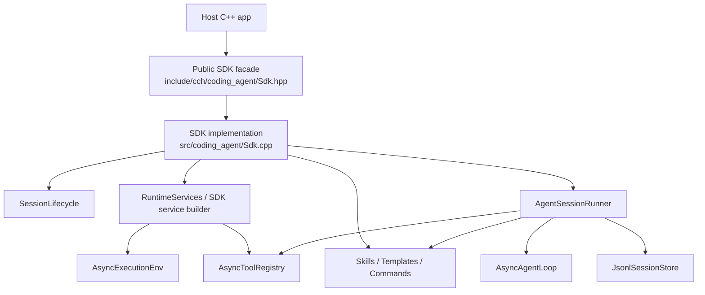
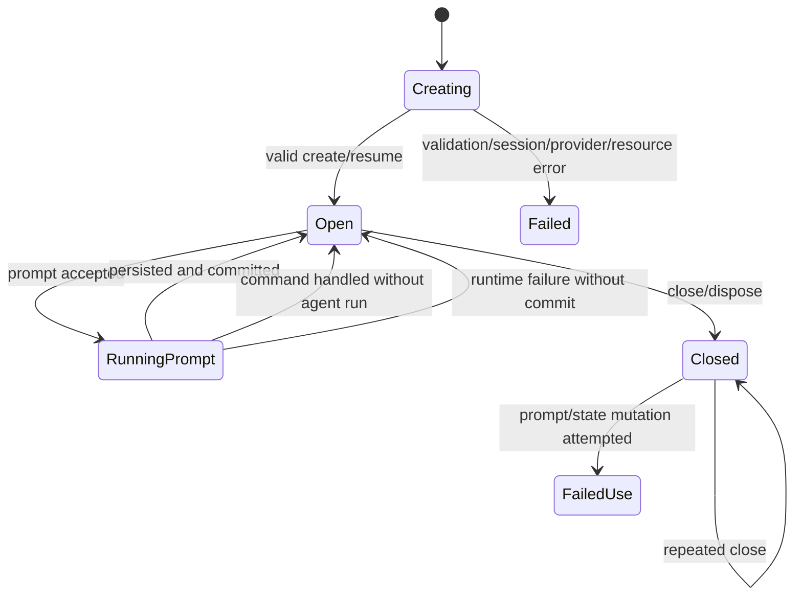
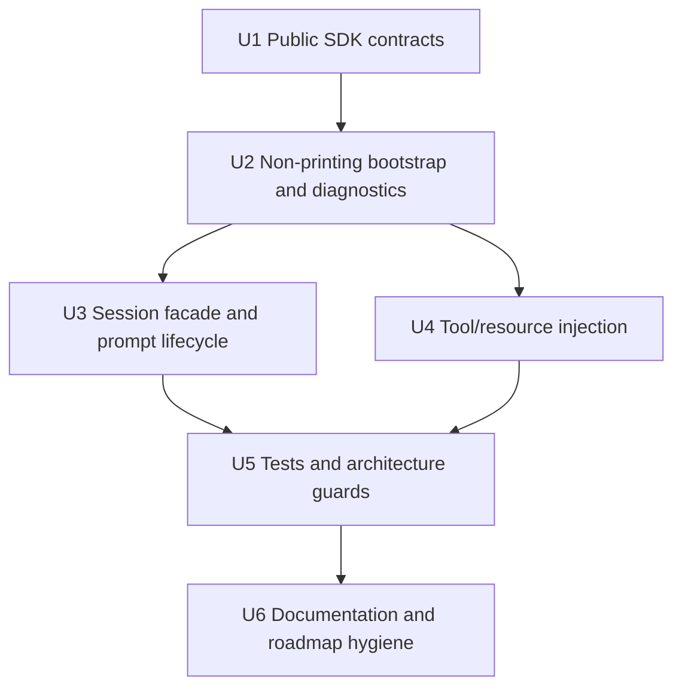
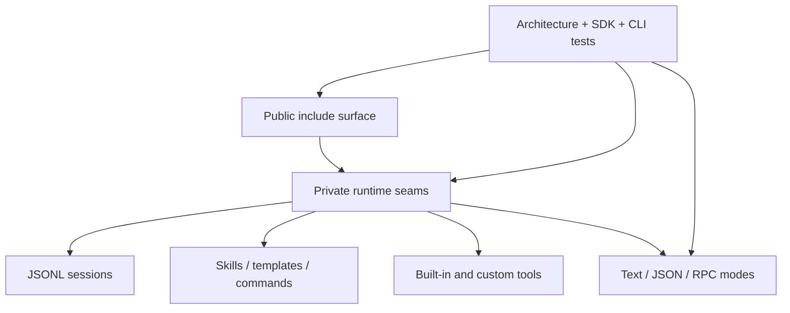

<!-- markdownlint-disable MD013 MD025 -->

# feat: Add embeddable SDK surface

## Summary

Add the remaining T8 machine-readable milestone: a source-level C++ SDK facade that lets host applications create an agent session, register tools/resources, send prompts, observe lifecycle events, inspect committed state, and close cleanly without shelling out to `cpp_harness` or depending on CLI/RPC globals.

The SDK v1 should wrap the existing agent/session/resource seams that JSON and RPC mode already stabilized, while explicitly deferring full pi SDK parity, ABI-stable binary distribution, dynamic TypeScript extensions, async cancellation/queueing, and full session-runtime replacement APIs.

---

## Problem Frame

The roadmap in `docs/plans/2026-06-16-001-refactor-pi-cpp-parity-todo.md` tracks T8 as three stages: JSON event stream, narrow JSONL RPC, and an embeddable SDK surface. JSON and RPC are now implemented, but same-process C++ embedders still have no public facade; they either use private runtime headers or treat the CLI as a subprocess protocol.

The current repository has the right prerequisites: session open/resume lives in `src/coding_agent/runtime/SessionLifecycle.*`, service construction in `src/coding_agent/runtime/RuntimeServices.*`, prompt execution/persistence in `src/coding_agent/runtime/AgentSessionRunner.*`, public agent events/tools under `include/cch/agent/`, public session contracts under `include/cch/harness/session/`, and public resources under `include/cch/coding_agent/`. The plan is to expose a narrow facade over those seams without promoting `src` implementation headers to public API.

---

## Requirements

- **R1. Public SDK entry point:** Add a public include-surface API under `include/cch/coding_agent/` that creates sessions without including or requiring private `src` runtime headers.
- **R2. C++-idiomatic session facade:** Provide a move-only `coding_agent::AgentSession` facade with explicit lifetime management and passive state/result values.
- **R3. Deterministic session target semantics:** SDK callers must choose a clear create/resume path; workspace, provider, and model fallback/override rules must be explicit and testable.
- **R4. Prompt execution:** Let hosts run one blocking prompt at a time while preserving `AgentSessionRunner`'s append-before-in-memory-commit rule.
- **R5. Event observation:** Let hosts subscribe with move-only `agent::AgentEventSink` listeners and receive public `agent::AgentLifecycleEvent` values, not JSON/RPC records.
- **R6. Tool registration:** Let hosts select built-in tools and register custom `agent::AsyncAgentTool` instances with deterministic duplicate-name behavior.
- **R7. Resource registration:** Let hosts provide skills, prompt templates, and slash-command handlers programmatically without relying on project-local discovery.
- **R8. Optional project resource loading:** If SDK callers opt into project resource discovery, trust/resource/load diagnostics must be returned as values and SDK paths must stay silent on stdout/stderr.
- **R9. Capability injection:** Allow host-provided chat clients and execution environments; provider/env construction remains a convenience path, not a required global.
- **R10. No CLI/RPC globals:** SDK creation and prompt execution must not read RPC stdin, write human semantic lines, write JSONL event records to stdout, or depend on `src/main.cpp` parsing.
- **R11. No serialization leakage:** Public SDK contracts use C++ domain values and `util::Expected`; Glaze DTOs, provider wire DTOs, `JsonEventPrinter`, and `RpcJsonl` remain private implementation details.
- **R12. Stable failure behavior:** Startup, validation, session, duplicate-registration, and provider/env failures return structured errors; accepted prompt failures preserve stable runner codes such as `max_turns_exceeded`, `session_persist_failed`, and `runtime_error`.
- **R13. Clean shutdown:** Provide an idempotent close/dispose path; prompts after close and reentrant prompts return validation errors instead of entering ambiguous state.
- **R14. Testable library surface:** Add direct in-process SDK tests with fake clients/tools/resources, plus architecture tests that protect the public/private boundary.

---

## Scope Boundaries

### In Scope for SDK v1

- Source-level C++23 API for applications that link the harness libraries.
- One active session per SDK session object.
- Blocking `prompt()`-style operation over the existing prompt/session runner.
- Public event subscriptions using `agent::AgentLifecycleEvent` and move-only sinks.
- Host-provided fake/real `ai::StreamingChatClient` and optional SDK convenience provider construction.
- Host-provided or SDK-created `harness::AsyncExecutionEnv`.
- Built-in tool selection for current C++ tool names: `read`, `write`, `edit_file`, and `bash`; SDK defaults are `read`, `write`, and `edit_file`, with `bash` opt-in.
- Custom tool registration through existing `agent::AsyncAgentTool` contracts.
- Programmatic skills, prompt templates, and slash-command handlers.
- Optional project-local skill/template discovery behind explicit trust/resource controls.
- Persistent JSONL sessions through `JsonlSessionStore` create/resume behavior for new sessions and linear resumptions.
- Host-visible diagnostics for resource/trust/model fallback decisions.

### Deferred to Follow-Up Work

- ABI-stable binary distribution, plugin ABI, or package-manager integration.
- Full pi `AgentSessionRuntime` replacement APIs (`newSession`, `switchSession`, `fork`, `clone`, import/export) as public SDK operations.
- Public branch/tree navigation, compaction resume, and parent-aware tree append behavior; v1 should reject unsupported non-linear session topologies instead of flattening them silently.
- In-memory sessions; add a session-store abstraction before exposing that mode.
- Concurrent prompts, cancellation, `abort`, `steer`, `followUp`, queueing, preflight callbacks, or async host-executor integration.
- Dynamic TypeScript/JavaScript extensions, extension UI, hot reload, MCP, and package installation.
- TUI run modes, themes, keybindings, or widgets.
- OAuth/subscription providers, model catalogs, model cycling, and dynamic API-key callbacks.
- JSON/RPC wire DTO exposure or a full pi RPC command matrix.
- Sandbox/container guarantees beyond the existing workspace guard.

---

## Context & Research

### Relevant Code and Patterns

- `src/coding_agent/runtime/AgentSessionRunner.*` owns prompt processing, skill injection, `AsyncAgentLoop::continue_with`, staged session persistence, and terminal result codes. The SDK should wrap this behavior rather than reimplement agent-loop orchestration.
- `src/coding_agent/runtime/SessionLifecycle.*` owns create/resume session behavior, workspace mismatch handling, persisted history, and stored provider/model metadata.
- `src/coding_agent/runtime/RuntimeServices.*` builds the default provider client, local execution environment, built-in tool registry, and resource load results; it currently has diagnostic-printing paths that SDK creation must avoid.
- `include/cch/agent/AgentEvent.hpp` exposes `AgentLifecycleEvent` and `AgentEventSink` using `std::move_only_function`.
- `include/cch/agent/AgentTool.hpp` and `include/cch/agent/ToolRegistry.hpp` expose custom tool contracts and registry behavior.
- `include/cch/harness/ExecutionEnv.hpp` exposes the execution capability seam; `include/cch/harness/session/` exposes JSONL session metadata, entries, store, and tree/context reconstruction contracts.
- `include/cch/coding_agent/Skill*.hpp`, `PromptProcessing.hpp`, and `PromptTemplateLoader.hpp` expose resource and prompt-processing values already suitable for SDK-host injection.
- `tests/architecture/*` already guard public headers, no private `src` includes, CMake dependency direction, no Glaze leakage in domain headers, no Boost.JSON domain contracts, and move-only callback support.
- `tests/cli/CliSmokeTest.cpp` protects subprocess modes; SDK tests should be direct library tests instead of shelling out to `cpp_harness`.

### Institutional Learnings

- `docs/plans/2026-06-16-003-refactor-pi-cpp-contract-inventory.md` identifies pi `CreateAgentSessionOptions`, `CreateAgentSessionResult`, and `createAgentSession` as missing/deferred C++ contracts and requires each parity slice to map pi contracts to passive values, capability interfaces, or implementation details before coding.
- `docs/plans/2026-06-20-003-feat-t8-jsonl-rpc-mode-plan.md` established `AgentSessionRunner`, `RuntimeServices`, and `SessionLifecycle` as reusable seams and highlighted append-before-commit behavior as important for long-lived machine-readable integrations.
- `docs/plans/2026-06-20-002-feat-json-event-stream-mode-plan.md` established an explicit allow-list posture for machine-readable output; SDK should expose public events as C++ values and make any richer/sensitive exposure an explicit API decision.
- `docs/plans/2026-06-10-004-refactor-anti-fragile-cpp-architecture-plan.md` reinforces passive contracts, capability seams, move-only events, and no serialization/runtime implementation leakage in public headers.
- No `docs/solutions/` directory exists in this repository, so there are no separate solution notes to carry forward.

### pi SDK Reference

- `pi:packages/coding-agent/docs/sdk.md` frames `createAgentSession()` as the single-session factory and `AgentSession` as the object for prompting, subscriptions, state access, model control, compaction, abort, and cleanup.
- `pi:packages/coding-agent/src/core/sdk.ts` composes resource loading, settings/session managers, model registry, built-in/custom tools, extension runner, and `AgentSession`; the C++ SDK should copy the contract shape, not the TypeScript implementation or dynamic extension system.
- pi's SDK is broader than the current C++ readiness: OAuth/auth storage, model catalogs, extension runtime, the full pi `ResourceLoader`/settings subsystem, session replacement runtime, TUI run modes, compaction, and prompt queueing stay deferred for C++ SDK v1. The narrow C++ skill/template discovery already implemented in this repository remains available only through explicit SDK opt-in.

### External References

- No web/framework research was needed. The relevant external contract is the sibling/reference pi checkout cited above.

---

## Key Technical Decisions

| Decision | Rationale |
| --- | --- |
| Expose a new public facade, not private runtime headers | `src/coding_agent/runtime/*` is useful implementation plumbing but must remain private. A facade lets SDK contracts stabilize independently. |
| Use `create_agent_session()` returning `util::Expected<CreateAgentSessionResult>` | pi returns a result object with session plus diagnostics/fallback information. C++ needs the same diagnostic capacity without exceptions or stderr. |
| Name the public session `coding_agent::AgentSession` | This mirrors pi's `AgentSession` while remaining distinct from internal `runtime::AgentSessionRunner`. The namespace keeps the mapping clear. |
| Require explicit create/resume target in v1 | Avoid hidden CLI globals or accidental default path generation. Exactly one create path or resume path should be supplied until a session-manager abstraction exists. |
| Support only linear continuation in SDK v1 | Current `JsonlSessionStore::append()` does not preserve parent/leaf topology for branched or compacted sessions. The SDK should detect unsupported non-linear sessions and return a clear error rather than flattening the active tree silently. |
| Use safe built-in tool defaults | SDK defaults should register `read`, `write`, and `edit_file`; `bash` requires explicit opt-in to preserve the existing safety posture. |
| Treat project resource discovery as opt-in | Embedders should not load workspace resources or print diagnostics unless they explicitly choose that trust surface. |
| Default to no CLI built-in slash commands | Current built-ins (`/session`, `/quit`, `/new`, `/resume`) are CLI-shaped. Hosts can register SDK-safe commands explicitly. |
| Preserve move-only event sinks and fail-fast fanout | The agent core already uses move-only sinks. Listener failures should surface as prompt failures rather than being swallowed silently. |
| Detect duplicates before moving values into registries | Existing tool/command registry behavior is not uniformly duplicate-rejecting. SDK assembly should fail duplicate tool and command names during creation, and should surface duplicate skill/template names through deterministic diagnostics. |
| Keep v1 blocking and single-prompt | Current prompt execution owns an internal blocking run loop. Async/cancellable host-executor support requires a separate design. |
| Document non-atomic persistence limits | `JsonlSessionStore` appends entries one at a time. SDK state should not commit on append failure, but partial JSONL writes can still exist and need recovery guidance. |
| Keep public SDK events as C++ values | Reusing `AgentLifecycleEvent` avoids introducing another JSON projection and prevents wire DTO leakage. |

### Create/resume resolution matrix

| Scenario | SDK v1 behavior |
| --- | --- |
| New session with create path, workspace, host client, and explicit provider/model metadata | Create the session header with supplied metadata and use the host client for requests. |
| New session with create path and no host client | Require provider/model/base-url/API-key-env configuration sufficient to construct the default client; fail creation on missing auth/config. |
| New session without provider/model but with host client | Allow only if the SDK supplies documented sentinel metadata such as `sdk-host/host-client`, and return a diagnostic that metadata is host-provided rather than provider-resolved. |
| Resume with stored provider/model and no explicit override | Restore stored provider/model metadata for state and future default-client construction. |
| Resume with explicit provider/model override | Allow only with a diagnostic that the resumed session metadata context differs from the new runtime client. |
| Resume with missing provider/model metadata and no host client | Fail creation; the SDK cannot honestly construct a default provider. |
| Resume with missing workspace metadata and no explicit workspace | Fail creation; v1 should not fall back to process cwd. |
| Resume with branch/leaf/compaction topology that cannot be appended linearly | Fail with `unsupported_session_topology` (or equivalent) until parent-aware append support is planned. |

---

## Open Questions

### Resolved During Planning

- **Should SDK v1 promise full pi SDK parity?** No. It should mirror the core factory/session shape and explicitly defer broader pi runtime replacement, extension, queueing, compaction, and model-management APIs.
- **Should the public facade expose `src/coding_agent/runtime` headers directly?** No. Public headers must remain under `include/cch` and use pimpl/source-local adapters for runtime seams.
- **Should the SDK read CLI args or rely on process-level defaults?** No. v1 options should be explicit; provider/env construction helpers may read environment variables only through existing provider config semantics.
- **Should both `session_path` and `resume_path` be accepted?** No. SDK creation should reject both-set and neither-set states unless a future session manager adds default path generation.
- **Should project skills/templates load by default?** No. Hosts opt in and receive trust/resource/load diagnostics as values.
- **Should SDK events reuse JSON mode records?** No. SDK exposes `agent::AgentLifecycleEvent`; JSON projections remain for CLI/RPC modes.
- **Should built-in commands be registered automatically?** No. Current built-ins are CLI-oriented; SDK callers should opt into command registries they control.
- **What are the SDK default built-in tools?** `read`, `write`, and `edit_file`; `bash` is available only through explicit opt-in.
- **Should SDK v1 continue branched or compacted sessions?** No. It should detect unsupported non-linear topologies and return a clear error until parent-aware append/session-runtime behavior is planned.
- **How should duplicate command names behave?** They should fail SDK creation with a structured validation error, matching duplicate tool behavior.

### Deferred to Implementation

- Exact class/member names for option sub-structs, as long as the facade keeps the factory/session/result shape and public-private boundary.
- Exact diagnostic aggregation shape, as long as trust/resource/load/model fallback diagnostics are host-visible and testable.
- Whether SDK-owned execution environments call `cleanup()` during `close()` synchronously or best-effort; host-provided/shared environments should not be cleaned up unless explicitly requested.
- Exact recovery guidance when session append partially succeeds before an append failure.
- Whether raw advanced `AsyncAgentOptions` can be exposed behind an expert option after v1 tests prove it does not imply unsupported queueing/cancellation behavior.

---

## High-Level Technical Design

> *This illustrates the intended approach and is directional guidance for review, not implementation specification. The implementing agent should treat it as context, not code to reproduce.*

### SDK surface shape

| Surface | SDK v1 responsibility | Explicit v1 exclusions |
| --- | --- | --- |
| Factory | Validate options, create/resume JSONL session, assemble client/env/tools/resources, return session plus diagnostics | Session-manager default paths, import/export, fork/clone/switch |
| Session | Blocking prompt, event subscriptions, committed state access, last assistant text, idempotent close | Concurrent prompt, abort, steer/follow-up, compaction |
| Capabilities | Host-supplied client/env/tools first; default provider/env helpers when requested | OAuth, model catalogs, dynamic key callbacks |
| Resources | Host skills/templates/commands; optional project resource discovery with diagnostics | Dynamic TS extensions, package installation, TUI resources |
| Events | Public `AgentLifecycleEvent` fanout through move-only sinks | JSON/RPC event records, raw provider DTOs |

### Component relationship

### Session lifecycle

---

## Implementation Units

### U1. Public SDK contracts

**Goal:** Add the public SDK facade shape under `include/cch` without exposing private runtime headers or serialization machinery.

**Requirements:** R1, R2, R3, R5, R9, R10, R11, R12

**Dependencies:** None

**Files:**
- Create: `include/cch/coding_agent/Sdk.hpp`
- Modify: `CMakeLists.txt`
- Test: `tests/architecture/PublicHeaderBoundaryTest.cpp`
- Test: `tests/architecture/ArchitectureSurfaceScanTest.cpp`

**Approach:**
- Define passive option/result groups for session target, provider config, capability overrides, built-in tool selection, resources, diagnostics, prompt options, and prompt results.
- Define `CreateAgentSessionResult` with a move-only `AgentSession` plus diagnostic collections, not a bare session return.
- Make the session and subscription handles move-only; use pimpl so public headers do not include runtime implementation details.
- Use `util::Expected`/`util::ExpectedVoid` for fallible factory, prompt, subscription, and close operations.
- Keep the header free of Glaze DTOs, provider wire DTOs, JSON/RPC helpers, CLI parser types, and private runtime includes.
- Document the surface as source-level API for C++23 embedding, not an ABI-stable plugin or binary SDK.

**Patterns to follow:**
- `include/cch/agent/AgentEvent.hpp` for move-only event sink vocabulary.
- `include/cch/agent/AgentTool.hpp` and `include/cch/agent/ToolRegistry.hpp` for custom tool contracts.
- `include/cch/harness/session/SessionEntry.hpp` for passive session metadata/state values.
- `tests/architecture/PublicHeaderBoundaryTest.cpp` and `tests/architecture/ArchitectureSurfaceScanTest.cpp` for public header constraints.

**Test scenarios:**
- Happy path: a translation unit including only `include/cch/coding_agent/Sdk.hpp` and other public headers can declare SDK options and move an `AgentSession` handle.
- Edge case: static assertions prove session/subscription/options with owned capabilities are move-only and not copy-only wrappers around copyable callbacks.
- Error path: architecture scan fails if the SDK header includes `src/`, Glaze provider DTOs, `JsonEventPrinter`, `RpcJsonl`, or CLI parser types.
- Integration: CMake exposes the SDK header through the existing public include surface without adding a forbidden dependency direction.

**Verification:**
- Public SDK contracts compile from `include/cch` only.
- Architecture tests protect the no-`src`, no-Glaze-domain, and move-only callback rules.

### U2. Non-printing SDK bootstrap and diagnostics

**Goal:** Implement SDK session creation by reusing session/runtime seams while returning diagnostics as values and avoiding CLI stdout/stderr behavior.

**Requirements:** R1, R3, R8, R9, R10, R11, R12, R14

**Dependencies:** U1

**Files:**
- Create: `src/coding_agent/Sdk.cpp`
- Modify: `CMakeLists.txt`
- Modify: `src/coding_agent/runtime/RuntimeServices.hpp`
- Modify: `src/coding_agent/runtime/RuntimeServices.cpp`
- Modify: `src/coding_agent/PromptProcessing.cpp`
- Test: `tests/coding_agent/SdkSessionTest.cpp`

**Approach:**
- Implement `create_agent_session()` as a pure library entry point that returns `util::Expected<CreateAgentSessionResult>`.
- Validate session target rules before opening files: exactly one create path or resume path; workspace is required for new sessions; resume without explicit workspace may use session metadata, but resume with explicit mismatch fails.
- Reuse `runtime::open_session()` for basic create/resume behavior and stored provider/model restoration, but add SDK validation around unsupported tree topologies before prompt continuation.
- Use the create/resume resolution matrix above for provider/model/workspace metadata; allow explicit resume overrides only with a diagnostic so hosts know the resumed session changed runtime context.
- Build a default provider client only when no host client is supplied; otherwise use the host-supplied capability and treat provider/model fields as metadata/config context.
- Build a local execution environment only when no host env is supplied; track whether the SDK owns that env for close/cleanup behavior.
- Add or reuse non-printing service/resource loading paths: skill/template/trust diagnostics become result values, not stderr lines.
- Add a non-printing prompt/resource path for SDK so unknown `/skill:name` or loader warnings do not leak to stderr.

**Patterns to follow:**
- `src/coding_agent/runtime/SessionLifecycle.*` for workspace/session validation semantics.
- `src/coding_agent/runtime/RuntimeServices.*` for provider/env/tool/resource assembly.
- `include/cch/coding_agent/ProjectResources.hpp` and `ProjectTrust.hpp` for trust/resource load planning.
- `src/coding_agent/SkillLoader.cpp` and `src/coding_agent/PromptTemplateLoader.cpp` for diagnostics-as-values patterns.

**Test scenarios:**
- Happy path: creating a new SDK session with a host fake client and temp workspace succeeds without spawning `cpp_harness`.
- Happy path: resuming an existing linear session with omitted provider/model restores metadata-derived provider/model in returned state.
- Edge case: both create path and resume path set returns a validation error before file creation.
- Edge case: neither create path nor resume path set returns a validation error instead of inventing a CLI-like default.
- Error path: explicit resume workspace mismatch returns the existing session error and leaves stdout/stderr untouched.
- Error path: resume with missing provider/model metadata and no host client returns a bounded validation error.
- Error path: unsupported branch/leaf/compaction topology returns `unsupported_session_topology` (or equivalent) instead of flattening the session.
- Error path: missing provider API key fails session creation when no host client is supplied, with a bounded `util::Error`.
- Integration: opting into project resource loading returns trust/load diagnostics and does not print warnings.

**Verification:**
- SDK creation has no dependency on `src/main.cpp`, RPC stdin, JSON output streams, or human semantic line printing.
- Resource diagnostics are observable through `CreateAgentSessionResult`.

### U3. Session facade, prompt lifecycle, and event fanout

**Goal:** Provide the SDK object that owns committed history, session store, runner, subscribers, prompt execution, state access, and close semantics.

**Requirements:** R2, R4, R5, R10, R11, R12, R13, R14

**Dependencies:** U1, U2

**Files:**
- Modify: `src/coding_agent/Sdk.cpp`
- Modify: `src/coding_agent/runtime/AgentSessionRunner.hpp`
- Modify: `src/coding_agent/runtime/AgentSessionRunner.cpp`
- Test: `tests/coding_agent/SdkSessionTest.cpp`

**Approach:**
- Keep `AgentSession::Impl` private and source-local; it owns the runner, store, committed history, resources, subscribers, capabilities, and state flags.
- Model session state explicitly: open, running prompt, closed. Reject reentrant prompt calls and prompt-after-close with stable validation errors.
- Implement subscription as RAII: subscriber callbacks are called in registration order, unsubscribe is no-op after close, and unsubscribe-during-callback uses a snapshot so fanout is deterministic.
- Combine persistent subscribers with any per-prompt sink into one move-only sink passed to `AgentSessionRunner::run_prompt()`.
- Use fail-fast listener behavior: if a listener or per-prompt sink returns an error, the prompt result fails and committed in-memory history is not updated.
- Preserve existing runner result codes and assistant-text extraction from committed history only after persistence succeeds.
- Document that tool side effects and partial JSONL appends cannot be rolled back if failure occurs after external actions.
- Make `close()` idempotent, clear subscribers/resources, and clean up only SDK-owned execution environments unless an explicit option says otherwise.

**Patterns to follow:**
- `src/coding_agent/runtime/AgentSessionRunner.*` for prompt/result/session append behavior.
- `include/cch/agent/AgentEvent.hpp` for event variant and sink types.
- `tests/agent/AsyncAgentLoopTest.cpp` for lifecycle event expectations.
- `tests/harness/session/JsonlSessionStoreTest.cpp` for persistence behavior.

**Test scenarios:**
- Happy path: a fake-client prompt emits lifecycle events to a subscriber and returns successful `PromptResult` with committed assistant text.
- Happy path: `message_count()` and `last_assistant_text()` reflect only committed history after a successful session append.
- Edge case: a command-handled prompt returns a command result without starting an agent run and without changing last assistant text.
- Edge case: concurrent or reentrant prompt attempt returns `session_busy` (or equivalent) and does not start a second run.
- Error path: subscriber failure causes prompt failure, no in-memory commit, and a clear event-sink error result.
- Error path: append failure returns `session_persist_failed`, does not emit a success state to SDK callers, and documents partial file-write risk.
- Error path: prompt after close returns a validation error; repeated close succeeds or no-ops deterministically.
- Integration: SDK prompt path does not write human semantic lines or JSONL event records to stdout.

**Verification:**
- SDK session state transitions match the documented lifecycle.
- Prompt/state accessors never expose uncommitted assistant messages.

### U4. Tool and resource injection

**Goal:** Make SDK embedding useful without dynamic extensions by allowing host-owned tools, resources, and command handlers to participate in prompts deterministically.

**Requirements:** R6, R7, R8, R9, R11, R12, R14

**Dependencies:** U1, U2

**Files:**
- Modify: `src/coding_agent/Sdk.cpp`
- Modify: `src/coding_agent/runtime/RuntimeServices.hpp`
- Modify: `src/coding_agent/runtime/RuntimeServices.cpp`
- Modify: `include/cch/agent/ToolRegistry.hpp` only if a public duplicate-check helper is needed
- Test: `tests/coding_agent/SdkSessionTest.cpp`
- Test: `tests/tools/AsyncToolsTest.cpp` only if built-in selection behavior changes

**Approach:**
- Assemble built-in tools from explicit SDK tool options; by default register `read`, `write`, and `edit_file`.
- Treat `bash` as opt-in, preserving the existing execution-env safety posture.
- Detect duplicate tool names before registering; duplicate built-in/custom or custom/custom names fail creation deterministically.
- Accept host-provided resources first, then optional project-discovered resources; host-provided skills/templates win over discovered duplicates, and skipped duplicates are returned as diagnostics.
- Default to an empty command registry. Hosts can pass SDK-safe commands explicitly; CLI built-ins are not automatically registered.
- Detect duplicate command names before building the registry; duplicate command names fail SDK creation with a structured validation error.
- Keep dynamic pi extension support out of scope; compile-time host tools/resources/hooks are the SDK v1 extension mechanism.

**Patterns to follow:**
- `src/tools/AsyncToolFactories.cpp` for current built-in names and bash opt-in behavior.
- `include/cch/agent/ToolRegistry.hpp` for registry API behavior.
- `src/coding_agent/PromptProcessing.cpp` for command registry and `/skill:name` prompt processing.
- `tests/coding_agent/SkillIntegrationTest.cpp` and `tests/coding_agent/PromptTemplateLoaderTest.cpp` for skill/template expectations.

**Test scenarios:**
- Happy path: a host custom tool is registered, called by a fake client, emits tool start/end events, and feeds a tool-result message into the next fake assistant turn.
- Happy path: host-provided prompt template expands before the model request.
- Happy path: host-provided skill is injected into provider context without mutating committed conversation history.
- Edge case: host-provided skill/template name wins over project-discovered duplicate and records a diagnostic for the skipped duplicate.
- Edge case: SDK default command registry does not consume CLI-only commands unless the host explicitly registers commands.
- Edge case: SDK default built-in tool set contains `read`, `write`, and `edit_file`, while `bash` is absent until explicitly enabled.
- Error path: duplicate tool name returns a creation error before any prompt starts.
- Error path: duplicate command name returns a creation error before any prompt starts.
- Integration: project resources skipped by trust policy are absent from the model context and present in diagnostics.

**Verification:**
- Host code can extend the agent through C++ tool/resource contracts without dynamic extension loading.
- Duplicate/precedence behavior is deterministic and tested.

### U5. Tests and architecture guards

**Goal:** Protect the SDK as a direct library surface and ensure existing CLI/RPC behavior still composes with shared runtime seams.

**Requirements:** R1-R14

**Dependencies:** U3, U4

**Files:**
- Create: `tests/coding_agent/SdkSessionTest.cpp`
- Modify: `tests/architecture/PublicHeaderBoundaryTest.cpp`
- Modify: `tests/architecture/ArchitectureSurfaceScanTest.cpp`
- Modify: `tests/architecture/CMakeDependencyTest.cpp`
- Modify: `tests/cli/CliSmokeTest.cpp` only if shared runtime changes affect smoke expectations
- Modify: `CMakeLists.txt`

**Approach:**
- Use in-process fake clients and temporary workspaces; SDK tests should not execute `cpp_harness`.
- Add one broad happy-path SDK test and focused validation/error tests for session target rules, resource diagnostics, event fanout, duplicate registration, close, and prompt persistence behavior.
- Extend architecture tests so SDK public headers cannot include private runtime files or serialization/wire-mode helpers.
- Keep CLI smoke tests as regression coverage for text, JSON, and RPC modes after runtime/service code is shared with SDK.
- Keep real-provider validation manual/opt-in.

**Patterns to follow:**
- `tests/support/TempWorkspace.hpp` for temporary workspace/session files.
- `tests/ai/providers/OpenAIChatClientTest.cpp` and `src/ai/providers/FakeChatClient.*` for fake provider/client style.
- `tests/cli/CliSmokeTest.cpp` for regression boundaries, but not as SDK's primary proof.
- `tests/architecture/CMakeDependencyTest.cpp` for target dependency direction.

**Test scenarios:**
- Happy path: direct SDK create/prompt/close completes with a fake client and no subprocess invocation.
- Happy path: SDK custom tool and programmatic resource tests cover tool, skill, template, and command registration.
- Edge case: `EventSubscription` move/unsubscribe behavior is deterministic before and after session close.
- Edge case: CR/LF, empty prompt, unknown slash command, and `/skill:unknown` behavior are stable and silent on stdout/stderr.
- Error path: all validation failures return structured errors with bounded messages.
- Error path: architecture tests fail on public `src` include leakage, Glaze DTO exposure, JSON/RPC helper exposure, or invalid CMake dependency direction.
- Regression: existing text, JSON, and RPC CLI smoke scenarios keep their current stdout/stderr contracts.

**Verification:**
- SDK tests prove direct in-process embedding.
- Architecture and CLI regression tests cover public-surface and existing-mode safety.

### U6. Documentation and roadmap hygiene

**Goal:** Keep user-facing docs and the parity roadmap aligned after implementation.

**Requirements:** R1, R3, R6, R7, R8, R10, R13

**Dependencies:** U5

**Files:**
- Modify: `README.md`
- Modify: `docs/plans/2026-06-16-001-refactor-pi-cpp-parity-todo.md`
- Modify: `docs/plans/2026-06-21-001-feat-t8-embeddable-sdk-surface-plan.md` when completed

**Approach:**
- Add a README SDK section that distinguishes same-process C++ SDK integration from language-agnostic/process-isolated RPC integration.
- Document supported SDK v1 behavior: explicit create/resume target, blocking prompt, event subscriptions, built-in/custom tools, programmatic resources, optional project-resource loading, diagnostics, and close.
- Document unsupported behavior clearly: ABI stability, dynamic extensions, TUI, session replacement runtime, in-memory sessions, concurrent prompt/abort/queueing, OAuth/model catalogs, package installation, and sandbox guarantees.
- Update the roadmap T8 SDK item only after tests pass and docs match actual implementation.
- If implementation choices differ from this plan, update Key Technical Decisions and Open Questions before marking the plan completed.

**Patterns to follow:**
- README's current JSON/RPC examples and safety warnings.
- T8 roadmap update style in `docs/plans/2026-06-16-001-refactor-pi-cpp-parity-todo.md`.
- Per-slice Definition of Done in the roadmap.

**Test scenarios:**
- Test expectation: none -- documentation-only unit; correctness is covered by review against implemented behavior and roadmap consistency.

**Verification:**
- README does not claim full pi SDK parity or sandbox guarantees.
- Roadmap links to this plan and accurately marks SDK completion only after implementation validation.

---

## System-Wide Impact

- **Public API surface:** `include/cch/coding_agent/Sdk.hpp` becomes a user-facing contract. It must stay passive/capability-oriented and avoid implementation-header leakage.
- **Runtime seams:** SDK implementation will share `SessionLifecycle`, `RuntimeServices`, and `AgentSessionRunner` with CLI/RPC paths; changes must preserve text/JSON/RPC behavior.
- **Error propagation:** Creation/validation errors return `util::Expected` failures; prompt failures return stable prompt result codes; event listener failures fail the prompt rather than disappearing.
- **State lifecycle risks:** SDK sessions are long-lived, so committed history must remain durable-state-aligned. In-memory state must not expose unpersisted assistant messages, while partial JSONL append risk is explicitly documented.
- **Resource/trust surface:** SDK opt-in project resource loading must preserve existing trust controls and stop printing diagnostics directly.
- **Tool side effects:** Prompt failure can happen after custom/built-in tools produce external side effects; the SDK should document no rollback guarantee.
- **API surface parity:** SDK v1 maps to pi's `createAgentSession`/`AgentSession` shape but intentionally omits broader `AgentSessionRuntime` replacement operations.
- **Unchanged invariants:** Workspace containment remains a guard, not a sandbox; provider DTOs stay private; JSON/RPC wire records remain CLI/RPC-specific; move-only callbacks remain supported.

---

## Alternative Approaches Considered

| Approach | Why not chosen for v1 |
| --- | --- |
| Promote `src/coding_agent/runtime` headers as public SDK | Fastest mechanically, but violates the public/private boundary and freezes implementation plumbing as API. |
| Make SDK a thin wrapper around `--mode rpc` subprocess | Language-agnostic RPC already exists; the SDK should provide same-process type-safe C++ integration without stdout/stderr protocols. |
| Implement full pi SDK/runtime parity now | Too broad for this slice; it would pull in extensions, compaction, session replacement, model catalogs, OAuth, and TUI run modes before C++ contracts are ready. |
| Start with ABI-stable C API | Useful for future distribution, but it would force ABI design before the C++ source-level contract is validated. |
| Add in-memory sessions as part of SDK v1 | Valuable for embedders/tests, but current persistence is tied to `JsonlSessionStore`; an in-memory mode deserves a separate session-store abstraction. |

---

## Risks & Dependencies

| Risk | Likelihood | Impact | Mitigation |
| --- | --- | --- | --- |
| Public SDK accidentally exposes private runtime or serialization details | Medium | High | Use pimpl, public-header architecture tests, and no `src`/Glaze/JSON/RPC includes in `Sdk.hpp`. |
| SDK scope balloons into full pi runtime parity | Medium | High | Keep v1 requirements narrow; document deferred APIs and fail unsupported states explicitly. |
| SDK creation prints diagnostics and breaks embedders | Medium | Medium | Add non-printing service/resource paths and tests that capture stdout/stderr around SDK flows. |
| Event listener failure leaves users unsure whether state committed | Medium | Medium | Define fail-fast fanout, commit only after runner success, and document non-rollback of external side effects. |
| Duplicate tool/resource names behave inconsistently | Medium | Medium | Validate duplicates before registry insertion; test tool, command, skill, and template merge policies. |
| Partial JSONL append creates file/history divergence | Low | High | Preserve no in-memory commit on failure, document recovery/resume behavior, and defer transactional store design. |
| Blocking prompt API conflicts with host async expectations | Medium | Medium | Document SDK-owned blocking run loop constraints; defer host-executor async API. |
| Refactoring shared runtime seams regresses text/JSON/RPC modes | Medium | High | Keep CLI smoke tests in the verification slice and avoid changing public CLI behavior. |

---

## Documentation / Operational Notes

- SDK docs must state that this is an experimental source-level API for C++ embedders, not a production-stable ABI.
- SDK examples should prefer host-supplied fake/client examples for tests and a separate real-provider example for manual use.
- README should preserve the existing safety warning: workspace guard and JSONL redaction are not a sandbox or provider-boundary secret guarantee.
- No release packaging or installation workflow is part of this plan.

---

## Sources & References

- Roadmap: `docs/plans/2026-06-16-001-refactor-pi-cpp-parity-todo.md`
- Contract inventory: `docs/plans/2026-06-16-003-refactor-pi-cpp-contract-inventory.md`
- JSON mode plan: `docs/plans/2026-06-20-002-feat-json-event-stream-mode-plan.md`
- RPC mode plan: `docs/plans/2026-06-20-003-feat-t8-jsonl-rpc-mode-plan.md`
- Architecture reference: `docs/plans/2026-06-10-004-refactor-anti-fragile-cpp-architecture-plan.md`
- Related code: `src/coding_agent/runtime/AgentSessionRunner.hpp`, `src/coding_agent/runtime/AgentSessionRunner.cpp`, `src/coding_agent/runtime/RuntimeServices.hpp`, `src/coding_agent/runtime/RuntimeServices.cpp`, `src/coding_agent/runtime/SessionLifecycle.hpp`, `src/coding_agent/runtime/SessionLifecycle.cpp`
- Related public contracts: `include/cch/agent/AgentEvent.hpp`, `include/cch/agent/AgentTool.hpp`, `include/cch/agent/ToolRegistry.hpp`, `include/cch/harness/ExecutionEnv.hpp`, `include/cch/harness/session/JsonlSessionStore.hpp`, `include/cch/coding_agent/PromptProcessing.hpp`, `include/cch/coding_agent/Skill.hpp`, `include/cch/coding_agent/PromptTemplateLoader.hpp`
- Related tests: `tests/architecture/PublicHeaderBoundaryTest.cpp`, `tests/architecture/ArchitectureSurfaceScanTest.cpp`, `tests/architecture/CMakeDependencyTest.cpp`, `tests/coding_agent/SkillIntegrationTest.cpp`, `tests/cli/CliSmokeTest.cpp`
- pi reference: `pi:packages/coding-agent/docs/sdk.md`, `pi:packages/coding-agent/src/core/sdk.ts`
